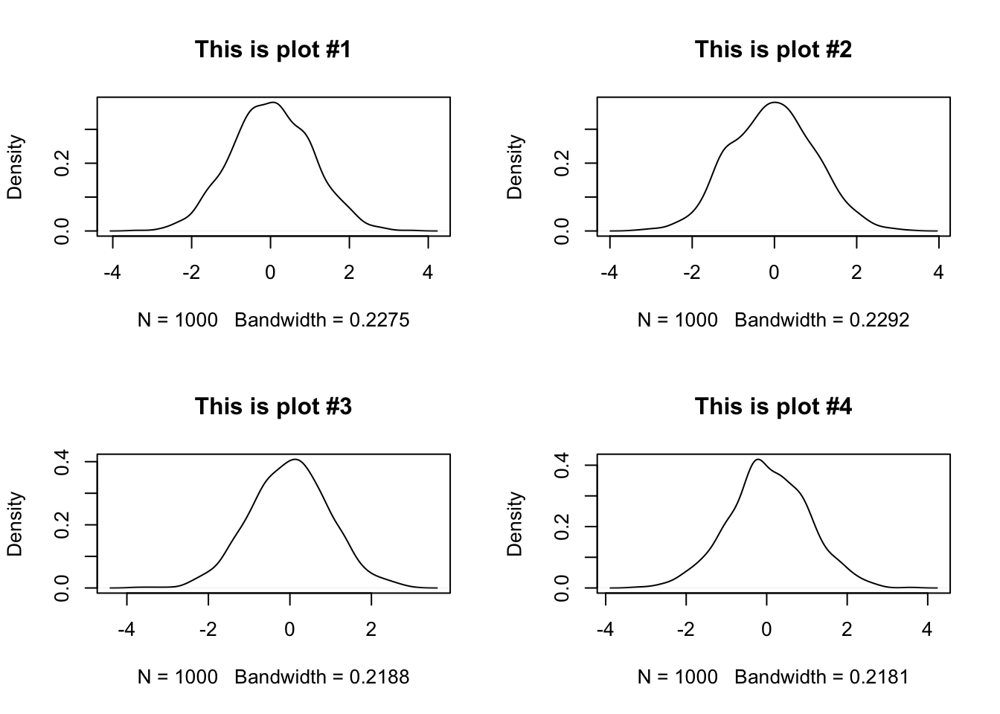

# Day 1 - Welcome to FST 5984 (2022)


------------------------------------------------------------------------

Welcome to your first day in **FST 5984: Data Analytics for Food and Ag Science**! In this class, we're going to use R and RStudio to learn about "coding for research", a concept that I have taken from the [Software Carpentries organization](https://software-carpentry.org/lessons/). The basic goal of this course is to teach you concepts of coding and programming for dealing with data in a research context.

This is different from being a programmer who codes software for a living, making apps, etc. I will be calling that "coding for production". In this course we are interested in developing our ability to do basic coding, and to "learn to learn" around coding, programming, and data science. As the expert instructor teaching this course, I can confidently say that I don't know everything there is to know about data analysis and science, and I am certainly not the best, fastest, or most efficient programmer (and I have no idea how to make an app)! But I do know the basics of how coding works--the "control loops", functions, data types--and I am able to use these basic building blocks to find resources to help me accomplish the tasks I need to do for research: for example, in the last year I taught myself to use the machine-learning toolkit `keras` (in R, as it happens) to do some text analysis. My main goal for the class is that you develop the basic skills and confidence to do the same things, with your own research needs.

In this class we are going to be learning to code in R, using the RStudio interface/IDE! There are a couple reasons for this. First, of programming languages, R and RStudio are built for data analysis, and so are often presented to students at University as an alternative to programs like Minitab, SAS, SPSS, or JMP, which are only "free" to students because of expensive deals at the University level, which are passed back on to students as part of student fees. Second, unlike those tools, R is open source, and is *constantly* being updated with new functionality. It is almost impossible to find a type of data analysis that isn't supported in R. Third, unlike most other programming languages, R is built for research programming (data analysis), rather than for production programming. The only other alternative that is as widely supported in the research community is Python, but--honesty time here--I have never learned Python very well, and so we are learning R. And, in addition, Python doesn't have as good an IDE as RStudio.

RStudio is an "**I**nteractive **D**evelopment **E**nvironment" (IDE) for working with R. Without going into a lot of detail, that means that R lives on its own on your computer in a separate directory, and RStudio provides a bunch of better functionality for things like writing multiple files at once, making editing easier, autofilling code, and displaying plots. You can learn more about [RStudio here](https://www.rstudio.com/products/rstudio/). With that out of the way, I am going to be sloppy in terminology and say/type "R" a lot of the times I mean "RStudio". I will be very clear if the distinction actually matters. RStudio is going to make your life way easier, and when you try to learn Python you are going to be sad :(

### Syllabus Review

We are going to spend some time reviewing the class syllabus in Word (\*gasp\*).  I want to make sure I answer everyone's questions and concerns.  We will also check out Canvas, make sure it all makes sense, and be ready to launch ourselves into the glorious future of the semester.

### Getting set up for class

In this class, we are going to be doing a lot of "live coding" ([see below](#coding)).  Our weeks will follow a predictable rhythm:

* On **Tuesdays**, I will give a somewhat lecture-y live coding talk in which we will work through the week's material.  I say "lecture-y" because I will be talking a lot, but in general I don't think I'm going to use slides.  Instead, I will be switching between the rendered version of that week's lecture notes (in HTML from R Markdown--don't worry, we'll learn about these things) and R itself.  I will write out code as we go and show you how it executes.  I'll make mistakes, get frustrated, have to troubleshoot--this is all part of coding.  To prepare for Tuesday classes, you should:
    * Do the assigned reading/watching/exercises for that week.
    * Bring your laptop to class, with the assigned (empty) Markdown file for the week.
    * Be prepared to "code along"--in order to learn and practice, you will be participating in class by writing in the code chunks (again, don't worry about it yet) into the R Markdown file.  
    * Be logged into the class Zoom room, which is the hack-y way we will set up screen sharing in this old classroom.
* On **Thursdays**, we will split the class into two parts.  The main purpose of Thursdays is for *you* to work on livecoding.  This will be the opportunity for you to practice what we did on Tuesday (and in previous weeks).  In order to make this work, here's what I am expecting you to do:
    * Spend at least 1 hour trying to complete the weekly homework assignment between Tuesday and Thursday (this will generally be a coding assignment).  It's ok if you can't finish it, run into errors, or get stuck.  This is what class is for.
    * Bring your assignment draft to class, and be prepared to ask questions.  This is where you can get unstuck, and get suggestions from me and from your classmates on what to do.
    * Several times over the semester, you will be expected to be the "lead" presenter of the homework, in which you will walk through everything you've done.  On other days, you can be a problem solver or just ask specific questions.
    * We can and will also go over how to fill out code chunks from the lecture, etc.  This is, however, secondary.
    * Finally, we will sometimes (knowing me, unfortunately, *often*) have some leftover material from Tuesday that we will cover as time allows.
 
In order to make sure you can participate in class, your attendance expectation includes the following:

* Bring your laptop to class with enough battery to use it for the entire period.
* Download the week's R Markdown file.
* (On Thursdays) bring in your draft assignment.
* Follow any other specific instructions for the week.

***

## Coding {#coding}

With that introduction out of the way, let's do some coding. This course is going to include a lot of "live coding". That means that someone (me, but shortly you!) will be sharing their screen and typing and executing commands in R. This is because coding is like any other skill we develop--the only way to improve is to try something, see why it didn't work, and try again! Live coding helps us see that **everyone**, me included, messes up, has to look for help, etc. An error message is just the first step to getting your code to work!

What is coding, though? This document is an ["R Markdown" document](https://rmarkdown.rstudio.com/index.html). That means it contains mixes of formatted text/multimedia and code. They look nicer than plain code. RStudio tells them apart because (among several things) RMarkdown files have a *file extension* of `.Rmd`, while normal scripts are plain text (`.txt`) or, by default, `.R`.

Code in RMarkdown files lives in "chunks" that are delineated with triple backticks ` ``` ` on both ends. Without going into the mechanics, this tells the program (RStudio) that whatever's in there isn't just more text, but instead is code that can be *run*.

Let's take a look.


```r
print("Hello World")
```

```
## [1] "Hello World"
```

It's traditional in programming to have your first program say "hello world". So we did that.

We can also use these chunks to do some more useful stuff. R can be a calculator:


```r
2 + 5
```

```
## [1] 7
```

```r
1300 * pi / 17^2
```

```
## [1] 14.13173
```

We can ask R to do lots of neat stuff, like generate random numbers for us. For example, here are 100 random numbers from a normal distribution with mean of 0 and standard deviation of 1.


```r
rnorm(n = 100, mean = 0, sd = 1)
```

```
##   [1] -1.761780319 -0.681750091  0.762135860 -0.214678376  0.197915588
##   [6] -2.401008767  0.672906896  0.763147146 -0.784395570 -0.069337230
##  [11]  0.084526134 -0.292296332 -0.591333549 -0.346760322  0.625200234
##  [16]  1.411541288  0.142021285 -2.310034030 -1.779557880  0.765733422
##  [21]  0.062111706 -0.052930205  1.032625776  0.747742999 -0.474850488
##  [26] -0.971620389  0.562238198 -0.115158029 -1.967510601 -1.432932288
##  [31] -1.273305139 -0.766522367  0.957400762 -0.035590029 -0.145786185
##  [36] -0.132020726  2.179055935  2.758456663 -0.058830257  0.275607518
##  [41] -0.648279937 -1.168288645 -0.140959767 -0.079353871  0.378419628
##  [46]  0.206257596  0.305596402 -0.765439289 -0.856407702 -0.941693752
##  [51]  0.322516139  1.514481470 -0.939505666  0.463374186 -0.186672737
##  [56] -0.714183828  0.748597254  0.922064099  0.283246156 -0.894152581
##  [61]  1.337553728  1.014859963 -0.158705399  0.662716886  0.292812277
##  [66]  0.107738564 -0.694200746  0.247679681  0.908810461 -1.200043864
##  [71]  1.201568020 -0.371604194 -0.381742329  0.062100097  0.002091879
##  [76] -0.750331179  0.820512565 -0.458896905 -0.641440737 -0.239433472
##  [81]  1.333599981 -1.528886752  0.365379001  0.422699824  0.296308512
##  [86] -0.210287176 -0.987922811  0.366880810  0.939715708 -0.654223832
##  [91] -1.471393036 -0.562857460 -0.660834493 -0.408187430 -0.592126567
##  [96] -0.048803639 -0.327292168 -0.823493905 -0.327677001  0.754476796
```

And, of course, we can look at **structured data**...


```r
mtcars
```

```
##                      mpg cyl  disp  hp drat    wt  qsec vs am gear carb
## Mazda RX4           21.0   6 160.0 110 3.90 2.620 16.46  0  1    4    4
## Mazda RX4 Wag       21.0   6 160.0 110 3.90 2.875 17.02  0  1    4    4
## Datsun 710          22.8   4 108.0  93 3.85 2.320 18.61  1  1    4    1
## Hornet 4 Drive      21.4   6 258.0 110 3.08 3.215 19.44  1  0    3    1
## Hornet Sportabout   18.7   8 360.0 175 3.15 3.440 17.02  0  0    3    2
## Valiant             18.1   6 225.0 105 2.76 3.460 20.22  1  0    3    1
## Duster 360          14.3   8 360.0 245 3.21 3.570 15.84  0  0    3    4
## Merc 240D           24.4   4 146.7  62 3.69 3.190 20.00  1  0    4    2
## Merc 230            22.8   4 140.8  95 3.92 3.150 22.90  1  0    4    2
## Merc 280            19.2   6 167.6 123 3.92 3.440 18.30  1  0    4    4
## Merc 280C           17.8   6 167.6 123 3.92 3.440 18.90  1  0    4    4
## Merc 450SE          16.4   8 275.8 180 3.07 4.070 17.40  0  0    3    3
## Merc 450SL          17.3   8 275.8 180 3.07 3.730 17.60  0  0    3    3
## Merc 450SLC         15.2   8 275.8 180 3.07 3.780 18.00  0  0    3    3
## Cadillac Fleetwood  10.4   8 472.0 205 2.93 5.250 17.98  0  0    3    4
## Lincoln Continental 10.4   8 460.0 215 3.00 5.424 17.82  0  0    3    4
## Chrysler Imperial   14.7   8 440.0 230 3.23 5.345 17.42  0  0    3    4
## Fiat 128            32.4   4  78.7  66 4.08 2.200 19.47  1  1    4    1
## Honda Civic         30.4   4  75.7  52 4.93 1.615 18.52  1  1    4    2
## Toyota Corolla      33.9   4  71.1  65 4.22 1.835 19.90  1  1    4    1
## Toyota Corona       21.5   4 120.1  97 3.70 2.465 20.01  1  0    3    1
## Dodge Challenger    15.5   8 318.0 150 2.76 3.520 16.87  0  0    3    2
## AMC Javelin         15.2   8 304.0 150 3.15 3.435 17.30  0  0    3    2
## Camaro Z28          13.3   8 350.0 245 3.73 3.840 15.41  0  0    3    4
## Pontiac Firebird    19.2   8 400.0 175 3.08 3.845 17.05  0  0    3    2
## Fiat X1-9           27.3   4  79.0  66 4.08 1.935 18.90  1  1    4    1
## Porsche 914-2       26.0   4 120.3  91 4.43 2.140 16.70  0  1    5    2
## Lotus Europa        30.4   4  95.1 113 3.77 1.513 16.90  1  1    5    2
## Ford Pantera L      15.8   8 351.0 264 4.22 3.170 14.50  0  1    5    4
## Ferrari Dino        19.7   6 145.0 175 3.62 2.770 15.50  0  1    5    6
## Maserati Bora       15.0   8 301.0 335 3.54 3.570 14.60  0  1    5    8
## Volvo 142E          21.4   4 121.0 109 4.11 2.780 18.60  1  1    4    2
```

And even visualize that structured data (and I promise we can make it prettier than *this*).


```r
plot(x = mtcars$wt, y = mtcars$mpg, xlab = "car weight", ylab = "car MPG")
```


Where R starts to distinguish itself from a simple calculator or even a sophisticated program like SPSS or SAS or JMP is that it lets us programmatically create and store variables, which will let us build up workflows that are reproducible, portable, etc. The first step of that is the first thing you should really commit to memory: **how to store objects in R**.

This set of characters is the **assignment operator**: `<-`. It works like this:


```r
x <- 100
hi <- "hello world"
data_set <- rnorm(n = 100, mean = 0, sd = 1)
```

... but that didn't do anything! Where's the output? Well, we can do two things. First, look at the "Environment" tab in your RStudio after you run the above code chunk. You'll notice that there are 3 new things there: `x`, `hi`, and `data_set`. In general I am going to call those **objects**--they are stored variables, which R now knows about by name. How did it learn about them? You guessed it: the assignment operator: `<-`.

To be explicit: `x <- 100` can be read in English as "x gets 100" (what a lot of programmers like to say) or, in a clearer but longer way, "assign 100 to a variable called x".

NB: R also allows you to use `=` as an assignment operator. **DO NOT DO THIS!**. There are two good reasons.

1.  It is ambiguous, because it is not directional (how are you sure what is getting assigned where?)
2.  This makes your code super confusing because `=` is the *only* assignment operator for *arguments* in functions (as in `print(quote = FALSE)` see below for more on this)
3.  Anyone who has used R for a while who sees you do this will roll their eyes and kind of make fun of you a little bit

NB2: Because it is directional, it is actually possible to use `->` as an assignment operator as well. What do you think it does? Check and find out.

And of course we can use R code for doing statistics (if we run out of more exciting things to do).


```r
summary(
  lm(mpg ~ wt, data = mtcars)
  )
```

```
## 
## Call:
## lm(formula = mpg ~ wt, data = mtcars)
## 
## Residuals:
##     Min      1Q  Median      3Q     Max 
## -4.5432 -2.3647 -0.1252  1.4096  6.8727 
## 
## Coefficients:
##             Estimate Std. Error t value Pr(>|t|)    
## (Intercept)  37.2851     1.8776  19.858  < 2e-16 ***
## wt           -5.3445     0.5591  -9.559 1.29e-10 ***
## ---
## Signif. codes:  0 '***' 0.001 '**' 0.01 '*' 0.05 '.' 0.1 ' ' 1
## 
## Residual standard error: 3.046 on 30 degrees of freedom
## Multiple R-squared:  0.7528,	Adjusted R-squared:  0.7446 
## F-statistic: 91.38 on 1 and 30 DF,  p-value: 1.294e-10
```

So that's great. I think you've probably learned all this already in a course on statistics. Why are we here? Well... how would you run ANOVA on this dataset? Or, even more importantly (who cares about these cars?), *how would you get your own data into R?* How would you simulate data? How would you make a pretty plot? These are the kinds of things we're going to learn in this course.

## How to make errors and annoy computers

------------------------------------------------------------------------

*We could actually call any course on coding for research by the above title...*

Let's back it up and look at what we did above. What's with the different colored text, and the parentheses, and the quotation marks? It does seem kind of perverse that, in order to get

> hello world

We are instead typing almost twice as much: `print("hello world")`. What's going on?


```r
Hello World # Let's make an error
```

```
## Error: <text>:1:7: unexpected symbol
## 1: Hello World
##           ^
```

The **programming tradeoff** is that your computer is much faster than you at doing tedious calculations (see the above 100 random numbers, for example), but much worse than you at interpreting unstructured commands and suggestions. So coding is really a *structured language* that tells the computer exactly what you want it to do.

The first tip to reading code is that, in R, code is **"from the inside out"**. And parentheses "()" tell us what is inside and what is outside. So first we have `"hello world"` and it is inside `print()`. But we just saw that typing "hello world" into R gives us an error, right?


```r
"hello world"
```

```
## [1] "hello world"
```

Actually, no! We just didn't tell R that "hello world" was nonsense text (to R, at least), by enclosing it in quotations. Technically, this tells R that it is a **string** variable---a collection of non-numeric characters (non 0-9) characters. But we don't need to quote the calculations (using numbers and symbols)...


```r
1 + 1 # this works just fine
```

```
## [1] 2
```

or even named objects like "pi" (the mathematical constant) or the dataset ("mtcars) like those we did previously. Why is this?


```r
pi # this is also fine
```

```
## [1] 3.141593
```

To answer this question, let's talk about what the various things you can type into R are.

## Inputs and data types in R

------------------------------------------------------------------------

### Whitespace

First things first. R as a programming language is very generous about whitespace use. "Whitespace" means any characters like spaces, tabs, returns/newlines, etc. These are actually different, although we don't think about them very much, and for almost everything you do in R you don't need to think about this distinction. In some languages (like Python or C++) you have to be careful about whitespace.

In R, *most of the time* you can use whitespace to make your code readable and it will not change anything. **The main use for whitespace in R is to delineate objects, operations, and functions**. This means that spaces tell R that you are done telling it about one thing and are ready to tell it about another. For example, if we write `pi + 2` then R sees 3 things it needs to know about - the object called "`pi`" (which is a system-level constant), the `+` operator, and a numeric constant: `2`. If you then hit `enter`, R will take these 3 things and interpret them: it knows that `+` takes the object immediately to the left and to the right and performs addition.

In general R will try to interpret what you give it, adding spaces implicitly when it can figure out how. So, for example, the following will all do the same thing:


```r
100 + 1
```

```
## [1] 101
```

```r
100+ 1
```

```
## [1] 101
```

```r
100+1
```

```
## [1] 101
```

```r
 100+         1
```

```
## [1] 101
```

```r
100 + 
  1
```

```
## [1] 101
```

The last one is particularly pathological--try not to do this!

But what R really cares about is that **groups of characters** that represent operations, characters, and variables not be interrupted by spaces. When it encounters special characters like `+` or `(` it doesn't need spaces around them--it infers them. This is also why you can't create objects with those characters in them:


```r
bad(_name <- 2
```

```
## Error: <text>:1:6: unexpected symbol
## 1: bad(_name
##          ^
```

(Technically you can do this using some workarounds, but I don't recommend it right now. Ask me if you want to know.)

This is also *one of* the reasons why typing something like `hello world` will cause an error. First off, we haven't created objects called `hello` or `world`. But even if we did, we would get an error:


```r
hello <- "hello"
world <- "world"
hello
world
hello world
```

```
## Error: <text>:5:7: unexpected symbol
## 4: world
## 5: hello world
##          ^
```

When you give R a variable with no other instructions, it will try to help you by calling `print()` on it. But if you give it two, separated by a space, it has no idea what to do. So it throws an error. But what kinds of things are data, anyway?

### Data types

In the programming tradeoff is that, as part of the bargain of being extremely exact with our instructions, we agree to not only tell computers exactly what to do step by step, but also to define what everything they encounter is. This includes data types. This isn't a computer science class, so I am going to be defining these types of data on a functional basis, rather than a scientific or technically correct one. That is, these are my personal definitions of what these data types are and how I encounter them.

You can ask about what kind of data an object is by using the `class()` function on the object.

In my experience, these are listed in increasing order of complexity.

#### Logical

The most basic type of variable is a binary, yes/no, TRUE/FALSE variable. In R, these are called "logical variables", although I think in other languages they might be called "boolean" variables. These can take only two values, which are both reserved words (cannot be changed, have default values) in R: `TRUE` and `FALSE`. These are used frequently when we want to define experimental levels or indicate group membership:


```r
yes <- TRUE
no <- FALSE
yes
```

```
## [1] TRUE
```

```r
no
```

```
## [1] FALSE
```

```r
class(yes)
```

```
## [1] "logical"
```

These variables are also connected tightly to "control flow" statements like `if`, `for`, `while`, and to statements of logical equivalency that are known as "boolean logic". We will go over these in a later class, but an example is the following.


```r
# is a random variable larger than 0?
x <- rnorm(n = 1, mean = 0, sd = 1) 
x > 0
```

```
## [1] FALSE
```

```r
# if that random variable is larger than 0, print something to tell us
if(x > 0) print("Well, there was a 50% chance!")
```

As a note, R will helpfully transform logical variables into FALSE = 0 and TRUE = 1 if you try to do algebra with them. So for example:


```r
sum(FALSE, FALSE, TRUE, TRUE, TRUE)
```

```
## [1] 3
```

0 and 1 are **integers**.

#### Integer

Integers, as you may remember from math class, are positive or negative whole numbers, and include 0 (they'd have to, but let's not get into set theory.) These are the next step up in complexity. Integers are dealt with differently by computers than "double" or "floating point" numbers. But in general we don't use them much, except to pass to and from other languages (C++ and Fortran, according to the help page for `integer()`) that need integers.

R indicates that numbers are integers by writing them as `<whole number>L`. So, for example, `3L` is the same thing as 3. This can be confusing, but you should never have to do this explicitly. That's because, for our purposes, we will always be dealing with **numeric** variables.

*Hey, psst*, there's no code chunk here, so... remember what I said about that help file? Try typing `?integer` into the console and see what happens. We'll talk about it below, but `?` followed *immediately* by the term you want help on will get you that help.

#### Numeric

We care especially about numbers, because most of our data analysis in food and ag sciences will be on numeric data. For computers, real numbers (numbers that can be represented with decimal precision) are called `numeric` or `double`. The second term (`double`) refers to the level of precision the computer actually offers, but this is beyond our scope (and my understanding!)--suffice it to say that, for our purposes, we will not be running into what are called "numerical overflow/underflow" errors.


```r
a_integer <- 3L
a_double <- 3
class(a_integer)
```

```
## [1] "integer"
```

```r
class(a_double)
```

```
## [1] "numeric"
```

```r
# Do these two things equal each other?
a_double == a_integer
```

```
## [1] TRUE
```

```r
# Is the square root of the (integer) 3 an integer?
class(sqrt(a_integer))
```

```
## [1] "numeric"
```

#### Character

Ok, but we have seen already us using things that definitely aren't numbers. For these, R defines the `chatacter` data type (which I also often call `string` data, which is a term used by some other programming languages). In R, `character` data is quoted and not interpreted--it does not have mathematical or functional/object properties. It is the most general data type.


```r
a_integer <- 3L
a_character <- "3"
a_string <- "hello_world"
hello_world <- function() print("hello world")
a_string
```

```
## [1] "hello_world"
```

```r
hello_world()
```

```
## [1] "hello world"
```

```r
print(hello_world)
```

```
## function() print("hello world")
```


```r
# Does R know that the character "3" represents the integer 3?  Sort of, but not enough to do math.
a_integer + a_character
```

```
## Error in a_integer + a_character: non-numeric argument to binary operator
```


```r
hello_ world # hmm, what went wrong here?
```

```
## Error: <text>:1:8: unexpected symbol
## 1: hello_ world
##            ^
```

These can get kind of tricky, because R is interpreted as a language, and the interpreter tries to be smart. So if you ask R whether `3L == "3"`, it will tell you `TRUE`. This is because R uses "conversion", and automatically runs conversion functions to try to compare different data types.


```r
as.character(3L)
```

```
## [1] "3"
```

```r
as.character(3L) == "3"
```

```
## [1] TRUE
```

```r
3L == "3"
```

```
## [1] TRUE
```

We'll talk more about `as_*()` functions to convert between data types in future classes.

#### And bears, oh my!

Yeah, this is where we'd talk about `vector`, `matrix` or more complex objects. We will get to these. But the general thing I want to emphasize is that these objects are *collections* of the simple objects we're discussing here. In R, it's turtles all the way down--complex things in R are built out of simple things in R. That doesn't mean they're *easy*--but it does mean that if we can get an idea of how simple things work, we can start to pick apart the complex things.

To start with, we'll talk about just one type of complex object: **`vector`**.

Vectors are ordered lists of **one type** of data. In R, they are defined using the `c()` function:


```r
c(1, 2, 3, 4, 5)
```

```
## [1] 1 2 3 4 5
```

Vectors have a couple of properties. 

1. All objects in a vector are of the same type. See what happens if you try to make a vector like `c("red", 1, TRUE)`. What is R doing in the background? 
    1. The vector has the same type as the objects in it. So a vector of numeric objects **is** a numeric vector. 
    2. Actually, single objects in R are **technically** one item vectors: `1L == c(1L)` 2. Vectors in general behave the way you would expect from **linear algebra**. Don't remember linear algebra? That's ok, but it's still true. 
3. Vectors are *ordered*. This is important, because it will allow us, in a later class, to access items in the vector.


```r
a_vector <- c("this", "is", "a", "character", "vector")
a_vector
```

```
## [1] "this"      "is"        "a"         "character" "vector"
```

```r
a_vector[3] # What's the third word in this sentence?
```

```
## [1] "a"
```

### Ok, but what kind of object *is* `print()` then?

Short answer is that `print()` and anything else that is of the form `<text>()` is a *function*. We will be discussing functions more in later classes, because they are a big part of programming, but we can best understand them right now as bit of pre-written code that take input and spit out results.

The term "function" comes from

As we will learn, R functions are (mostly) written in R. So you can write new functions, like so (note the use of the `function()` function!):


```r
hello_world <- function(){
    print("hello world")
}
hello_world()
```

```
## [1] "hello world"
```

But another great side-effect of this is that you can look into how R functions *you didn't write* work because they are written in R syntax. This is because if you ask R about the *object* rather than run the function, R will spit back the code that defines the function.

...what?

Well, what that means is that if you type `hello_world()` R will run the function called "hello_world". But, if you type `hello_world` **without the `()`**, R will spit back the R code that defines the function (because that is what's assigned to that object above, where we started by writing `hello_world <-`):


```r
hello_world
```

```
## function(){
##     print("hello world")
## }
```

And functions can be awesome, and complicated. Here is one that will randomly draw 1000 observations from the normal distribution and then plot a density curve in order to give you a nice density curve (something that can be a pain to draw by yourself).


```r
make_a_nice_bell_curve <- function(plotnum = NULL){
  if(!is.null(plotnum)){
    plotname <- paste0("This is plot #", plotnum)
  }else{
    plotname <- "A nice plot"
  }
  
  samples <- rnorm(1000, 0, 1)
  plot(density(samples), main = plotname)
}

op <- par(mfrow = c(2, 2))
for(i in 1:4) make_a_nice_bell_curve(plotnum = i)
```



```r
par(op)
```

But we could just copy and paste the code above 3 times, or even just hit cmd + enter with those two commands highlighted. Why make a function? Well, we will learn a lot more about functions in the coming weeks, but here are some great reasons to get you started:

1.  It's much easier to use functions in control logic (like the `for` loop above)
2.  You're less likely to make a mistake when you use a function, which is prewritten, than if you are in copying/pasting/editing mode
3.  Your code is much easier to reuse if you make functions
4.  There is a lot of R functionality (`apply()`, `map()`) that works with functions, not copy/paste

## Metacognition: Learning to Learn in R

------------------------------------------------------------------------

Above, I mentioned "help files". How do we get help when we (inevitably) run into problems in R? There are a couple steps we will do a lot in this class:

1.  Look up the help file for whatever you're doing. Do this by using the syntax `?<search item>` (for example `?c` gets help on the vector command) as a shortcut on the console.

2.  Search the help files for a term you think is related. Can't remember the command for making a sequence of integers? Go to the "Help" pane in RStudio and search in the search box for "sequence". See if some of the top results get you what you need.

3.  The internet. Seriously. I am not kidding even a little bit. R has one of the most active and (surprisingly) helpful user communities I've ever encountered. Try going to google and searching for "How do I make a sequence of numbers in R?" You will find quite a bit of useful help. I find the following sites particularly helpful:

    1.  [Stack Overflow](https://stackoverflow.com/questions/tagged/r)
    2.  [Cross Validated/Stack Exchange](https://stats.stackexchange.com/questions/tagged/r)
    3.  Seriously, [Google will get you most of the way to helpful answers](https://is.gd/80V5zF) for many basic R questions.

We will come back to this, but I want to emphasize that **looking up help is normal**. I do it all the time. Learning to ask questions in helpful ways, how to quickly parse the information you find, and how to slightly alter the answers to suit your particular situation are a key skill from this class I want you to take away.
