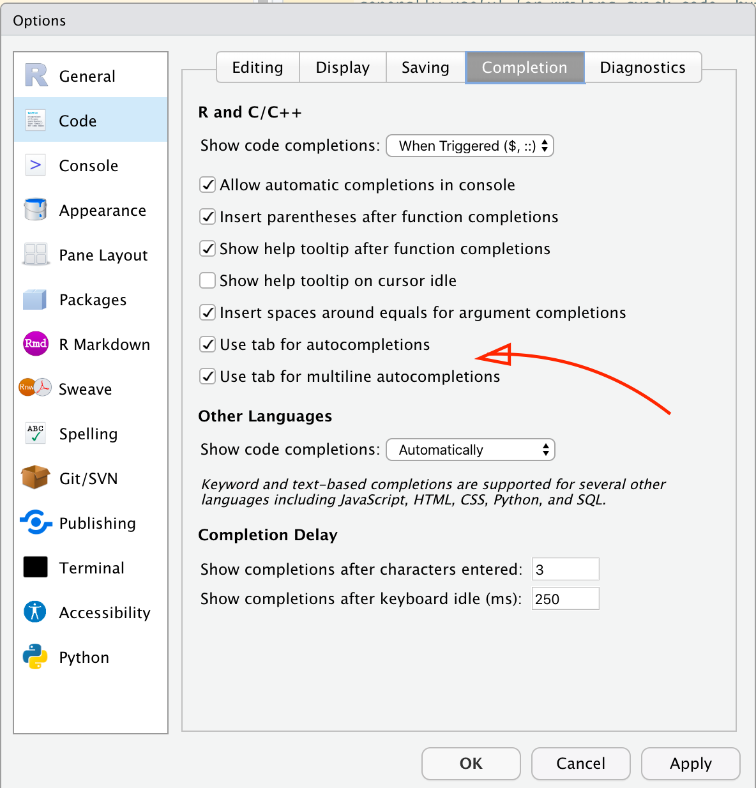
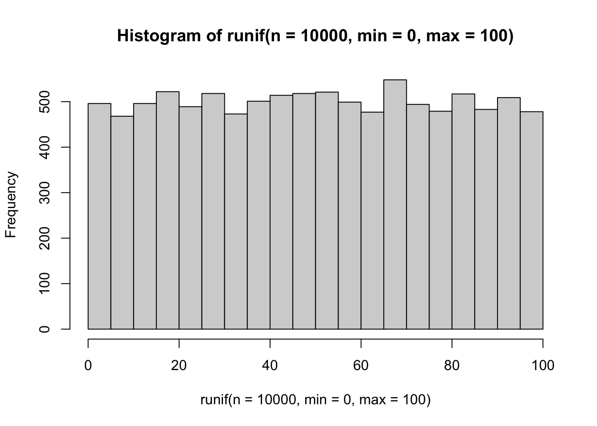
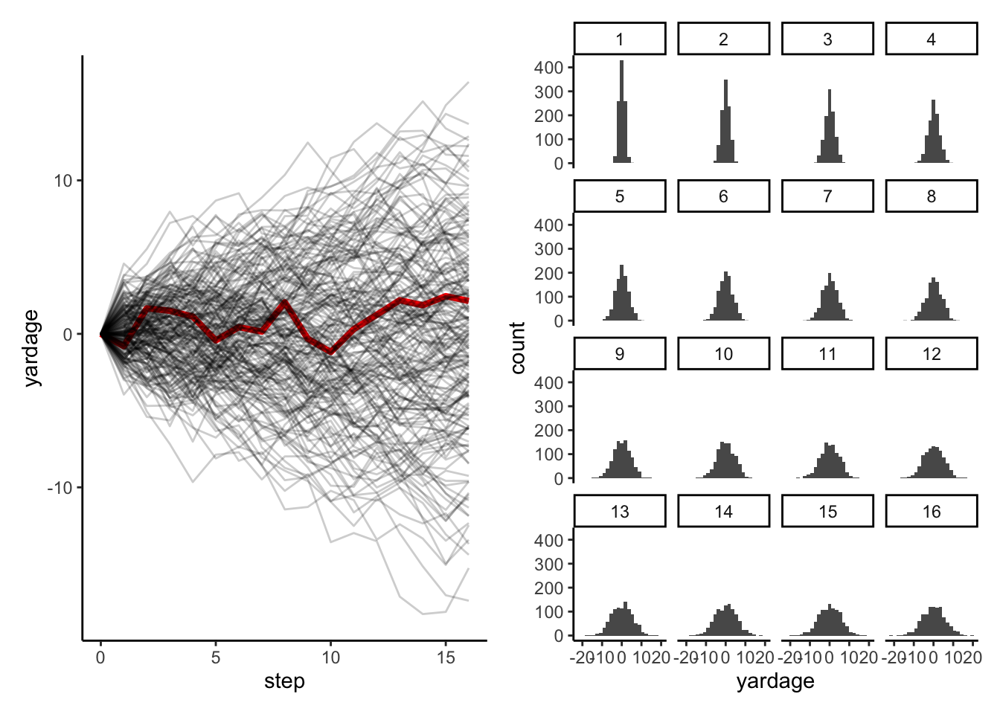

# Control flow and functions


------------------------------------------------------------------------

The real power of a coding approach to data analysis, like that we're learning with R, lies in the flexibility and customization that coding offers. Unlike a menu-based ("point-and-click") approach, in R (or in Python if you want to learn another language), you can:

-   Write custom analysis functions that act exactly like you want
-   Run simulations based on your data
-   Write scripts to do tedious repetitions, like reading data files from a directory and running a set of analyses

I like to call this a **programmatic** approach to data analysis, as in: you are writing a **program** that will execute itself and do the things you want it to do. This is the real power of a data-science / coding / R approach to our analyses. By taking this programmatic viewpoint, we will be able to move away from having to memorize menu commands and make repetitive selections.

The downside, of course, is that we have to learn how R (and, more broadly, computers) think. This is what we've been learning. We've learned about:

-   Data types
-   Storing variables
-   Writing code and `#comments`
-   Functional syntax

We've learned, in particular, that computers will do things that are really hard for us, but that we have to learn to put things into the exact terms that they will understand. I think the first couple weeks of using R feel extremely difficult, and the payoff seems far away. So the goal of class today is to motivate this a bit more. We will be discussing **simulation and sampling** in particular to talk about simple data-generation tasks that are very difficult to do in Excel or JMP. But these tools in particular are even more powerful when we can integrate them into programmatic approaches, so today we're going to spend the bulk of our time talking about **logic** and about **functions**. These are the building blocks of the programmatic approach, and once you start to learn a bit more about them, the way that R works will become increasingly clear.  Then, we will look at some of the cool, simple simulations we can build with these tools.

.](https://imgs.xkcd.com/comics/good_code.png)

## Functions

------------------------------------------------------------------------

The first piece of the puzzle that will help us make R useful for research is formalizing the idea of a **function**.  We've been using functions since the very first day of class: everything from `install.packages()` to `print()` to `c()` is a function in R.  But just because we've been using these doesn't given us any actual idea of what a function _is_.

It turns out that R has a very pragmatic definition of functions and that, in fact, we can even write our own very easily, which will be a difficult but key step in making our coding effective for our specialized research needs.

### Introduction - quasi-mathematical definition

We all learned about functions (I think probably in precalculus?) with the idea of $f(x)$.  The "$f$" literally is shorthand _for_ "function".  In a mathematical sense, functions take input(s)--like $x$--and map them to an output--often called $y$ in our basic math classes--by applying some transformation that is defined _in_ $f$.

#/media/File:Function_machine2.svg).](Images/Week 3/Function_machine2.svg.png)

While in math we spent a lot of time learning about how functions should operate (for example, each x should only map to one y, although the reverse does not need to be true, e.g. $f(x) = x^2$), in coding we can consider functions more as "black box machines": we do not need to know exactly how they work internally--most of the time--as long as we understand what inputs ($x$s) they need, and what outputs ($y$s) they give us.

### Everything we've been using in R is a function

One of the nice things about R is that (most of) it is written _in R_.  That means that most of the R functions are written with R syntax, and we can learn to understand what they're doing.  The very basic functions are not (they are written in a crazy mix of C++ and old languages like Fortran, I believe), but for the most part we can look at how functions work by just printing them out.

Let's look at the function for calculating the standard deviation of a set of numbers, `sd()`.


```r
sd(c(0, 1, 2, 3, 4, 5)) # this will give the standard deviation of these 6 numbers
```

```
## [1] 1.870829
```

```r
sd # Note that by not including the '()' I am asking for the OBJECT 'sd', not the function sd()
```

```
## function (x, na.rm = FALSE) 
## sqrt(var(if (is.vector(x) || is.factor(x)) x else as.double(x), 
##     na.rm = na.rm))
## <bytecode: 0x7ff0de456a28>
## <environment: namespace:stats>
```

While that's not pretty, we can actually learn a lot from it--but don't worry, I'm going to spare you for now.  The main point here is that you can see some elements you're probably starting to recognize: other R functions, `if()` and `else` statements... this is something we can examine.

To return to our quasimathematical definition, we _also_ can see that `sd()` takes some inputs and gives us some outputs.


```r
sd(1)
```

```
## [1] NA
```

```r
sd(c(1, 2))
```

```
## [1] 0.7071068
```

```r
sd(c("dog", "cat"))
```

```
## Warning in var(if (is.vector(x) || is.factor(x)) x else as.double(x), na.rm =
## na.rm): NAs introduced by coercion
```

```
## [1] NA
```

```r
sd(c(1, 2, 3, NA))
```

```
## [1] NA
```

```r
sd(c(1, 2, 3, NA), na.rm = TRUE)
```

```
## [1] 1
```

It seems like `sd()` doesn't like single numbers ("scalars", recall), because `sd(1)` returns `NA`.  We can learn why this is by thinking about the definition of standard deviation.  More predictably, it also doesn't like character vectors.  It also doesn't know how to deal with the special value `NA`, but we can provide it with an **argument** `na.rm = TRUE` that tells it to **r**e**m**ove `NA`s in order to do it's calculations.

So it seems like `sd()`, as a function, _takes_ (as $x$) a vector numbers of length > 1, and returns a numeric vector of length = 1.

### Back to `?`: Reading the function structure

This was a lot of work to do to dissect a function so simple you can run it on a scientific calculator.  A much better option is to use our old friend `?` to investigate how functions work--in particular, their **arguments** and the **values** they return.


```r
?sd # run this yourself
```

You'll notice that the typical help page has sections like "Usage", "Arguments", and "Details".  Let's examine these:

* Usage - this section gives an example of the function with its **arguments**.  It also displays the **default values** for the arguments.
* Arguments - this gives details on **how** the arguments the function accepts work.  In the case of `sd()`, there are two arguments.  `x` is the data you want the standard deviation of, and `na.rm` asks whether it should remove `NA` values.  Note that the **default** for `na.rm = FALSE`.  This means you don't have to set it explicitly (the function already has a value for it), but if you don't set it _explicitly_ you will be accepting that default option.
* Details - this section gives notes about the function and how it works.  In the case of some functions, "Details" also explains what **values** the function returns.

Some optional elements on these pages which are helpful if they are present are:

* Values - this explicitly tells you what you can expect the function to return.  If `sd()` had this, it would note that it returns a numeric vector of length 1 with the calculated standard deviation.
* Examples - these are executable R code that give examples of how the function works.  These can be very helpful for you to copy and paste and run yourself to get an idea of what is happening in more complex functions.

### Function arguments

The topic of function arguments deserves its own section because of how R tries to be helpful.  Let's look at a function that takes a few arguments that we've already seen: `rnorm()`.  Try running `?rnorm` to get an idea of how it works.  Note that the help page brings up a set of related functions as well.

`rnorm()` has 3 arguments - `n`, the number of samples you want, `mean`, the mean of the normal distribution you're sampling from, and `sd`, the standard deviation of the normal distribution you're sampling from.  You'll also notice that both `mean` and `sd` have default values, so if you don't specify them it will give you a draw from a normal distribution with `mean = 0` and `sd = 1`.  So we can run it as follows:


```r
set.seed(123) # for reproducibility
rnorm(n = 5, mean = 5, sd = 3)
```

```
## [1] 3.318573 4.309468 9.676125 5.211525 5.387863
```

```r
set.seed(123) # let's do that again
rnorm(5, 5, 3)
```

```
## [1] 3.318573 4.309468 9.676125 5.211525 5.387863
```

What just happened?  How does R know that the first `5` in `rnorm(5, 5, 3)` is the number of samples, and the second is the mean?  R uses something called "positional argument matching", in which it will take arguments to a function and just match them up **in the order the function is written**.  This is generally useful for writing quick code, but I encourage you to get in the habit of explicitly naming arguments.  This both makes your code clearer to yourself and to others, but avoids bad errors when you forget to specify an argument that has a default, for example:


```r
rnorm(5, 3) # What do you think is happening here?  Is this good code?
```

```
## [1] 4.715065 3.460916 1.734939 2.313147 2.554338
```

**NB:** RStudio makes it easy to both get help and to write good code using the ["code autocomplete"](https://support.rstudio.com/hc/en-us/articles/205273297-Code-Completion-in-the-RStudio-IDE) function.  Let's all make sure we've already got this turned on:


Now, when you start typing a function, you can

1. Hit tab to complete the function name
2. Once you've opened the parentheses for the function, hit tab to see the arguments from the help file.  Hit tab a second time to autofill the argument with an `=` to help you type!

### Writing your own functions

Largely, R packages are assemblies of useful functions.  But sometimes you will need to write your own.  Hadley @wickham2017 [writes that functions should be used whenever you find yourself frequently cutting and pasting code](https://r4ds.had.co.nz/functions.html), as well as to make your code more readable by giving clear, evocative names to the things you're actually doing.  This can go right along with our pseudocoding tricks--you make your functions read more like English and it becomes much clearer what you're doing.

Funny enough, in R you write a function using the--wait for it--`function()` function.  Now that's recursion!  Specifically, you choose a name for your function, and then create a new object of _class_ function by assigning it to your new object name using `<-`.  So the whole process looks like this:


```r
make_it_awesome <- function(a_thing) paste(a_thing, "is awesome!")
make_it_awesome("ice cream")
```

```
## [1] "ice cream is awesome!"
```

```r
make_it_awesome(3)
```

```
## [1] "3 is awesome!"
```

```r
make_it_awesome(c("dog", "cat")) # hmm
```

```
## [1] "dog is awesome!" "cat is awesome!"
```

Just like `for()` and `if()` statements, `function()` statements that are more than 1 line need to be enclosed in `{}` braces in order to tell R that the whole function needs to have all of those lines.  In fact, you can do this with even 1-line functions:


```r
make_it_awesome <- function(a_thing){
  paste(a_thing, "is awesome!")
}
make_it_awesome("FST 5984")
```

```
## [1] "FST 5984 is awesome!"
```

To be more explicit, a function needs to have 3 elements:

1. A name
2. The `function(<argument 1>, <argument 2>, ...)` structure
3. One or more lines that execute the function inside the `{}`

Let's recall that, to normalize a set of observations, we first find the mean and sd of that set, then subtract the mean and divide by the sd for each number.  This would be tedious and error prone if we did it one at a time (and maybe impossible if our set was large).  Let's do this with some values from the `mtcars` dataset for fun:


```r
mtcars$wt # this is the weight of each car in 1000s of lbs.  What does "$" do?
```

```
##  [1] 2.620 2.875 2.320 3.215 3.440 3.460 3.570 3.190 3.150 3.440 3.440 4.070
## [13] 3.730 3.780 5.250 5.424 5.345 2.200 1.615 1.835 2.465 3.520 3.435 3.840
## [25] 3.845 1.935 2.140 1.513 3.170 2.770 3.570 2.780
```

```r
mean(mtcars$wt)
```

```
## [1] 3.21725
```

```r
sd(mtcars$wt)
```

```
## [1] 0.9784574
```

```r
# Now for the first car:
(mtcars$wt[1] - mean(mtcars$wt)) / sd(mtcars$wt)
```

```
## [1] -0.6103996
```

We could write a `for()` loop to step through every row and do this, but that seems like a lot of work.  What if we write a function that takes any numeric vector and normalizes it?


```r
make_it_normalized <- function(our_data){
  
  our_mean <- mean(our_data) 
  our_sd <- sd(our_data)
  (our_data - our_mean) / our_sd # remember that R will do vector math with scalars, so this "recycles" the scalars to the length of our_data
  
}
make_it_normalized(mtcars$wt) # well that's pretty cool
```

```
##  [1] -0.610399567 -0.349785269 -0.917004624 -0.002299538  0.227654255
##  [6]  0.248094592  0.360516446 -0.027849959 -0.068730634  0.227654255
## [11]  0.227654255  0.871524874  0.524039143  0.575139986  2.077504765
## [16]  2.255335698  2.174596366 -1.039646647 -1.637526508 -1.412682800
## [21] -0.768812180  0.309415603  0.222544170  0.636460997  0.641571082
## [26] -1.310481114 -1.100967659 -1.741772228 -0.048290296 -0.457097039
## [31]  0.360516446 -0.446876870
```

What's even cooler is that this function can now be used anywhere else we want.  Another famous dataset is the `iris` dataset, which observes several physical characteristics on a set of Iris flowers:


```r
str(iris)
```

```
## 'data.frame':	150 obs. of  5 variables:
##  $ Sepal.Length: num  5.1 4.9 4.7 4.6 5 5.4 4.6 5 4.4 4.9 ...
##  $ Sepal.Width : num  3.5 3 3.2 3.1 3.6 3.9 3.4 3.4 2.9 3.1 ...
##  $ Petal.Length: num  1.4 1.4 1.3 1.5 1.4 1.7 1.4 1.5 1.4 1.5 ...
##  $ Petal.Width : num  0.2 0.2 0.2 0.2 0.2 0.4 0.3 0.2 0.2 0.1 ...
##  $ Species     : Factor w/ 3 levels "setosa","versicolor",..: 1 1 1 1 1 1 1 1 1 1 ...
```

```r
make_it_normalized(iris$Sepal.Width) # let's normalize those petal widths!
```

```
##   [1]  1.01560199 -0.13153881  0.32731751  0.09788935  1.24503015  1.93331463
##   [7]  0.78617383  0.78617383 -0.36096697  0.09788935  1.47445831  0.78617383
##  [13] -0.13153881 -0.13153881  2.16274279  3.08045544  1.93331463  1.01560199
##  [19]  1.70388647  1.70388647  0.78617383  1.47445831  1.24503015  0.55674567
##  [25]  0.78617383 -0.13153881  0.78617383  1.01560199  0.78617383  0.32731751
##  [31]  0.09788935  0.78617383  2.39217095  2.62159911  0.09788935  0.32731751
##  [37]  1.01560199  1.24503015 -0.13153881  0.78617383  1.01560199 -1.73753594
##  [43]  0.32731751  1.01560199  1.70388647 -0.13153881  1.70388647  0.32731751
##  [49]  1.47445831  0.55674567  0.32731751  0.32731751  0.09788935 -1.73753594
##  [55] -0.59039513 -0.59039513  0.55674567 -1.50810778 -0.36096697 -0.81982329
##  [61] -2.42582042 -0.13153881 -1.96696410 -0.36096697 -0.36096697  0.09788935
##  [67] -0.13153881 -0.81982329 -1.96696410 -1.27867961  0.32731751 -0.59039513
##  [73] -1.27867961 -0.59039513 -0.36096697 -0.13153881 -0.59039513 -0.13153881
##  [79] -0.36096697 -1.04925145 -1.50810778 -1.50810778 -0.81982329 -0.81982329
##  [85] -0.13153881  0.78617383  0.09788935 -1.73753594 -0.13153881 -1.27867961
##  [91] -1.04925145 -0.13153881 -1.04925145 -1.73753594 -0.81982329 -0.13153881
##  [97] -0.36096697 -0.36096697 -1.27867961 -0.59039513  0.55674567 -0.81982329
## [103] -0.13153881 -0.36096697 -0.13153881 -0.13153881 -1.27867961 -0.36096697
## [109] -1.27867961  1.24503015  0.32731751 -0.81982329 -0.13153881 -1.27867961
## [115] -0.59039513  0.32731751 -0.13153881  1.70388647 -1.04925145 -1.96696410
## [121]  0.32731751 -0.59039513 -0.59039513 -0.81982329  0.55674567  0.32731751
## [127] -0.59039513 -0.13153881 -0.59039513 -0.13153881 -0.59039513  1.70388647
## [133] -0.59039513 -0.59039513 -1.04925145 -0.13153881  0.78617383  0.09788935
## [139] -0.13153881  0.09788935  0.09788935  0.09788935 -0.81982329  0.32731751
## [145]  0.55674567 -0.13153881 -1.27867961 -0.13153881  0.78617383 -0.13153881
```

Even more importantly, our function is just a bit of script we wrote--we can always go back and see what's in it, or even edit if we need to:


```r
make_it_normalized(c(iris$Sepal.Length, NA)) # oops, if our data has an NA this doesn't work so well, does it?
```

```
##   [1] NA NA NA NA NA NA NA NA NA NA NA NA NA NA NA NA NA NA NA NA NA NA NA NA NA
##  [26] NA NA NA NA NA NA NA NA NA NA NA NA NA NA NA NA NA NA NA NA NA NA NA NA NA
##  [51] NA NA NA NA NA NA NA NA NA NA NA NA NA NA NA NA NA NA NA NA NA NA NA NA NA
##  [76] NA NA NA NA NA NA NA NA NA NA NA NA NA NA NA NA NA NA NA NA NA NA NA NA NA
## [101] NA NA NA NA NA NA NA NA NA NA NA NA NA NA NA NA NA NA NA NA NA NA NA NA NA
## [126] NA NA NA NA NA NA NA NA NA NA NA NA NA NA NA NA NA NA NA NA NA NA NA NA NA
## [151] NA
```

```r
make_it_normalized
```

```
## function(our_data){
##   
##   our_mean <- mean(our_data) 
##   our_sd <- sd(our_data)
##   (our_data - our_mean) / our_sd # remember that R will do vector math with scalars, so this "recycles" the scalars to the length of our_data
##   
## }
## <bytecode: 0x7ff0dc8d1360>
```

```r
make_it_normalized <- function(our_data){
  
  our_mean <- mean(our_data, na.rm = TRUE) # why do I set na.rm?
  our_sd <- sd(our_data, na.rm = TRUE) # why do I set na.rm?
  (our_data - our_mean) / our_sd # remember that R will do vector math with scalars, so this "recycles" the scalars to the length of our_data
  
}
make_it_normalized(c(iris$Sepal.Length, NA)) # there we go
```

```
##   [1] -0.89767388 -1.13920048 -1.38072709 -1.50149039 -1.01843718 -0.53538397
##   [7] -1.50149039 -1.01843718 -1.74301699 -1.13920048 -0.53538397 -1.25996379
##  [13] -1.25996379 -1.86378030 -0.05233076 -0.17309407 -0.53538397 -0.89767388
##  [19] -0.17309407 -0.89767388 -0.53538397 -0.89767388 -1.50149039 -0.89767388
##  [25] -1.25996379 -1.01843718 -1.01843718 -0.77691058 -0.77691058 -1.38072709
##  [31] -1.25996379 -0.53538397 -0.77691058 -0.41462067 -1.13920048 -1.01843718
##  [37] -0.41462067 -1.13920048 -1.74301699 -0.89767388 -1.01843718 -1.62225369
##  [43] -1.74301699 -1.01843718 -0.89767388 -1.25996379 -0.89767388 -1.50149039
##  [49] -0.65614727 -1.01843718  1.39682886  0.67224905  1.27606556 -0.41462067
##  [55]  0.79301235 -0.17309407  0.55148575 -1.13920048  0.91377565 -0.77691058
##  [61] -1.01843718  0.06843254  0.18919584  0.30995914 -0.29385737  1.03453895
##  [67] -0.29385737 -0.05233076  0.43072244 -0.29385737  0.06843254  0.30995914
##  [73]  0.55148575  0.30995914  0.67224905  0.91377565  1.15530226  1.03453895
##  [79]  0.18919584 -0.17309407 -0.41462067 -0.41462067 -0.05233076  0.18919584
##  [85] -0.53538397  0.18919584  1.03453895  0.55148575 -0.29385737 -0.41462067
##  [91] -0.41462067  0.30995914 -0.05233076 -1.01843718 -0.29385737 -0.17309407
##  [97] -0.17309407  0.43072244 -0.89767388 -0.17309407  0.55148575 -0.05233076
## [103]  1.51759216  0.55148575  0.79301235  2.12140867 -1.13920048  1.75911877
## [109]  1.03453895  1.63835547  0.79301235  0.67224905  1.15530226 -0.17309407
## [115] -0.05233076  0.67224905  0.79301235  2.24217198  2.24217198  0.18919584
## [121]  1.27606556 -0.29385737  2.24217198  0.55148575  1.03453895  1.63835547
## [127]  0.43072244  0.30995914  0.67224905  1.63835547  1.87988207  2.48369858
## [133]  0.67224905  0.55148575  0.30995914  2.24217198  0.55148575  0.67224905
## [139]  0.18919584  1.27606556  1.03453895  1.27606556 -0.05233076  1.15530226
## [145]  1.03453895  1.03453895  0.55148575  0.79301235  0.43072244  0.06843254
## [151]          NA
```

## Control structure - making your code hustle and flow

------------------------------------------------------------------------

In order to make use of R's powerful tools for simulating data (and, later, analyzing it), we need to be able to give R instructions that take advantage ofthe fact that it can quickly and tirelessly do repetitive tasks.  The idea of ["**control flow**"](https://en.wikipedia.org/wiki/Control_flow) is a computer-science concept that, broadly, comprises the idea of anticipating all the things you want your program to do, and writing explicitly how to handle them.  This is because, if you'll recall, *the computer is very good at tedious, difficult tasks, but also requires completely precise instructions*.

Control flow can be visualized as the kind of decision chart that you're very familiar with:


### Write-what-you-want: Pseudo Code

Before we start getting into the technical details of how to build these control flows and tell your R program what to do, I want to give you 3 tools for thinking about programs that I've gathered from various colleagues over the years, and together help to build a non-mystical, non-technical approach to building your programs:

1. The very first thing you need to do when you sit down to write any program (or do anything, really), is **define your goal**.  Literally.  At the top of your R Markdown, R Script, text file, Word Document, Whiteboard, Joplin notebook, whatever, write the following phrase: "This program needs to do _____."  Then fill in the blank.  Once you've defined what you are trying to do, figuring out _how_ to do it is a much simpler task.
2. When you run into technically difficult problems ("I need R to draw a random number from 1 to 1000 and then access a matrix at that index for the p-value."), put them into plain language, like you're explaining what you're trying to do to your friend who knows nothing about your project or programming: "Ok, first I need to draw a number from a hat, then tell the program that that number is the row I need, and then select the column which the p-value is stored in, which is the 5th column."  This is often called ["rubber duck debugging"](https://rubberduckdebugging.com/)--keep a rubbber duck on your desk and explain to it.
3. Finally, use [**pseudocode**](https://en.wikipedia.org/wiki/Pseudocode)--a lot.  Pseudocode really combines the first two steps here.  You write, in plain but structured (bulleted or indented) language the steps you need your program to do.  Any step that is complex probably needs to be broken down into substeps.  Look at the pseudocode--if you know how to do each step in actual code (in R), then you can do it!  Otherwise, keep breaking down the steps, using `?`, searching Stack Exchange, etc, until you can put together each step.  Then write the code!  For reference, here is the pseudocode for the random number example from above.  **Let's actually write this into real code.**

```
create:
    data frame called "results"
repeat 100 times:
    roll a 6-sided die:
        if it's 1-2 write "dog" into the results data frame
        if it's 3-6 write "cat" into the data frame
print:
    how many times "cat" is in results
```


```r
# Create a data frame called "results"
results <- data.frame(animal = character(100))

# Roll a six-sided die 100 times, and if result is in 1-2, write "dog", otherwise write "cat"
for(i in 1:100) results$animal[i] <- ifelse(sample(1:6, 1) < 3, "dog", "cat")

# Count how many times "cat" appears
length(results[results$animal == "cat", ])
```

```
## [1] 65
```

With that in mind, let's formally learn about **control flow**!

### Logical conditions

We learned last week about the `logical` data type: `TRUE` and `FALSE` are the only contents of this kind of data, and they are reserved words in R (i.e., you can't write somethig like `TRUE <- "cat"`).  The reason for this is these are used for boolean programming logic--control flow.  Typically, these types of data aren't something we store directly (we'd be more likely to store binary data as `0/1` instead)--rather, they are outcomes of **logical conditions** or tests that we ask about our data.  

The most common of these that you will be using all the time are **binary comparison** operators, which ask about the relationship between two variables:

* `x < y`, `x > y` - is `x` less (greater) than `y`?
* `x <= y`, `x >= y` - is `x` less (greater) than *or equal* to `y`?
* `x == y` - does `x` equal `y`.  **NB:** note the _double_ `=` here.  Writing `x = y` as a logical test is a common novice R mistake.
* `x != y` - does `x` _not_ equal `y`?

Given the following value assignments, which of the logical statements above will return `TRUE`?


```r
x <- 1
y <- 10
```

A very useful binary operator that isn't a "classic" one is `%in%`.  This awkward-looking command asks whether the left-hand side is in the right hand side:


```r
"cats" %in% c("cats", "dogs", "giraffes") # is "cats" in this set of words?
```

```
## [1] TRUE
```

```r
1 %in% 2:100 # is 1 in the sequence from 2 to 100?
```

```
## [1] FALSE
```

A second category of important logical conditions are the `is.*()` functions, where `*` stands in for a data type, for example `is.character()`.  These return `TRUE` when the `class()` of the variable is evaluated to match the `*` in the name.

What?  That statement was simpler than it sounded:


```r
is.character("dog")
```

```
## [1] TRUE
```

```r
is.numeric("dog")
```

```
## [1] FALSE
```

There are two specific `is.*()` functions that are especially useful ask about two, special, reserved value/vector types in R: `NULL` and `NA`/`Inf`/`NaN`.  `NULL` is a value that means the absence of a vector.  The other 3 arise from division errors, from import errors/missing data, and from other processing errors.  The key problem with all of these special values is that **the above binary comparison operators (like `==`) do _not_ work with these**.  


```r
empty_value <- NULL
wrong_value <- NA
empty_value == NULL # this is wrong, and returns a 0-length logical vector
```

```
## logical(0)
```

```r
is.null(empty_value) # this works
```

```
## [1] TRUE
```

```r
wrong_value == NA # this is wrong, and will return NA (not TRUE)
```

```
## [1] NA
```

```r
is.na(wrong_value) # this works
```

```
## [1] TRUE
```

### Conditional statements

Conditional statements are, essentially, choices that R has to make.  They evaluate a logical condition, like those above (and often more complicated ones) and then execute some arbitrary blocks of code based on the logical condition.  An alternative way to think about these are as _branching paths_--R looks at the branch in the path, chooses the first one that meets the stated condition, and then goes that way.

We encounter these all the time in decision trees.

](https://imgs.xkcd.com/comics/flow_charts.png)

### IF statements

All functional programming language statements have some equivalent of R's `if(<conditional statement>)`.  Very simply, the conditional statement is evaluated, and **if** it is true, whatever comes after the `if()` is executed--otherwise R will just skip over it without trying to run it.


```r
if(TRUE) print("this will always print") # why will this always print?
```

```
## [1] "this will always print"
```

With `if()` statements, as well as with the others we'll go over below, we're going to introduce **"curly braces"**: `{}`.  We introduce these to allow our `if()` statements to control whether _multiple_ lines get executed.  Note that above we had a single `print()` follow the `if()`.  What happens if we write:


```r
if(FALSE) print("this will never print")
print("because the if() is always FALSE")
```

```
## [1] "because the if() is always FALSE"
```

Oops, we didn't want either of those to print.  How do we control _both_ with the `if()`?  We enclose everything with **curly braces**:


```r
if(FALSE){
  print("this will never print")
  print("because the if() is always FALSE")
}
```

Now this works right.  Notice that RStudio will helpfully indent the lines in the curly braces.  This is a programming convention that shows you the order of precendence of the control flow--I personally think of this as all of the `print()` functions being **under** the `if()`.

We can string together multiple `if()` statements:


```r
# Shall we play a game?

my_die_roll <- sample(1:6, 1) # roll a die for me
your_die_roll <- sample(1:6, 1) # and one for you
if(my_die_roll > your_die_roll) print("I win")
if(your_die_roll > my_die_roll) print("You win")
```

```
## [1] "You win"
```

```r
if(my_die_roll == your_die_roll) print("A tie!")
```

Note that if two sequential `if()` statements are _both_ true, they will both be evaluated.  In general, your `if()` statements need to be _disjoint_: only one should be able to be true (at a given level in your decision tree).


```r
if(my_die_roll > 0) print("Nice try")
```

```
## [1] "Nice try"
```

```r
if(your_die_roll > 0) print("You too")
```

```
## [1] "You too"
```

#### ELSE statement

The `else` statement has to follow an `if()` statement.  Notice that I don't put any parentheses after the `else`, because it is not evaluating a condition.  Instead, `else` executes the statement(s) after it if the preceding `if()` is `FALSE`:


```r
if(sample(c(0, 1), 1) == 1) print("heads") else print("tails") # another game of coin flips
```

```
## [1] "tails"
```

An oddity with R `else` statements is that they must be on the same line as the end of the `if()` statement.  This is somewhat in contradiction to the rest of R syntax, which makes it hard to remember.  If you get errors using `else`, try

1. Checking your line spacing
2. Using `{}` to surround both your `if()` and `else` blocks

#### Other conditionals

R provides a number of more complicated conditionals to make large sets of IF-ELSE statements easier to write and read.  The most common is `ifelse()`, which let's you combine the two statements in one:


```r
ifelse(sample(c(0, 1), 1) == 1, "heads", "tails") # this is a silly way to use this!
```

```
## [1] "tails"
```

More complicated are the base R `switch()` and the `dplyr::case_when()` functions, which evalaute a set of IF statements and automatically have a final ELSE statement.  I will not give examples here, but they are worth examining when you start running into a lot of branching `if()` statements in your code.

### Loops

While conditional statements (`if()`) create forking paths in our code, **loops** execute some section of code repeatedly, often for a set number of times or until some condition is met.  This is where R's ability to do something an arbitrary number of times, very quickly, without making mistakes or getting bored is employed.  We actually saw some `for()` loops in the example of random walks on the football field already, when we wanted to simulate 1000 different people making 16 different paths.

We will often use loops to **iterate** through some data structure.  For example, we might want to run some kind of analysis once for every row of a dataframe.  The relevant pseudocode which might help make this clearer might look something like this:

```
Goal: Get the average of a set of 6 instrumental measurements of total sugars in a data frame of 1000 observations (1000 x 6 dataframe)

for every row in dataframe:
    get the 6 observations
    average the 6 observations
    store the average in a new vector
end
```

In fact, the `for... end` structure is very similar to how R writes the main type of loop you'll encounter and use.

#### FOR loops

The structure of a `for()` loop looks kind of like an `if()` statement, but within the parentheses is a **sequence** instead of a conditional statement.  We've already learned about sequences today.  The syntax looks like `for(counter in sequence)`, where `counter` is a variable that the `for()` loop _increments_ on each iteration of the loop.  The simplest example might be:


```r
for(i in 1:10) print(i) # why does this look different than print(1:10)?
```

```
## [1] 1
## [1] 2
## [1] 3
## [1] 4
## [1] 5
## [1] 6
## [1] 7
## [1] 8
## [1] 9
## [1] 10
```

This prototypical example has several key elements that are important:

1. The _counter_ variable is defined in the `for()` statement, _not_ with a `<-` assignment as per normal
2. Statements _within_ the for loop have access to the _counter_ variable
3. Just like an `if()`, a single command can follow a `for()`, but otherwise we'll need to enclose multiple statements with `{}`

Let's look at a slightly more complicated `for()` statement to get a better intuition of what's happening.  Here, we'll create a 100 x 10 matrix of random (normal) data, and use a `for()` loop to get the average of each row.


```r
some_data <- matrix(rnorm(1000, mean = 0, sd = 1), nrow = 100, ncol = 10)
for(i in 1:100){
  row_mean <- mean(some_data[i, ])
}
row_mean
```

```
## [1] -0.04234701
```

Huh?  Shouldn't we have 100 means, 1 for each row?  

Well, we did calculate those means, but _we are writing a new value_ to `row_mean` each time our loop executes.  If we want to store them, we will have to create some place for them to go.


```r
some_data <- matrix(rnorm(1000, mean = 0, sd = 1), nrow = 100, ncol = 10)
row_mean_storage <- numeric(100) # create a 100-space long numeric vector to hold our means
for(i in 1:100){
  row_mean_storage[i] <- mean(some_data[i, ]) # put the i-th mean into the i-th slot in row_mean_storage
}
str(row_mean_storage) # I don't want to print all 100 values, so let's look at the structure of the new vector to see if this worked
```

```
##  num [1:100] 0.0505 0.4107 0.3348 0.3465 -0.154 ...
```

```r
hist(row_mean_storage)
```


This illustrates two more important aspects of `for()` loops:

1. The "current" state of the loop is not saved in between loops unless you tell R to do so explicitly
2. The commands _under_ the `for()` loop can access and modify variables outside the loop, but the reverse is not true (because of point 1, above)

In actual R syntax, we need to recall what we've learned about `for()` loops to make sure they run correctly.  Here is a nested for loop that makes this explicit.


```r
# We're going to use brackets to be really clear about what the SCOPE of each for() loop is

for(number in 1:3){ # we can call our indicator variable (like 'i') anything -- using descriptive names is clearer
  for(letter in c("a", "b", "c", "d")){ # recall that 'letters' is a built in vector of a-z
    combination <- paste(number, letter, sep = " and ") # paste() is a utility function that PASTES a series of strings together
    print(combination)
  }
}
```

```
## [1] "1 and a"
## [1] "1 and b"
## [1] "1 and c"
## [1] "1 and d"
## [1] "2 and a"
## [1] "2 and b"
## [1] "2 and c"
## [1] "2 and d"
## [1] "3 and a"
## [1] "3 and b"
## [1] "3 and c"
## [1] "3 and d"
```

```r
print(combination)
```

```
## [1] "3 and d"
```

There are two things to note here:

1. Each internal loop needs to fully complete before the external loop goes again - we have `"1 and a"`, `"1 and b"`, etc.
2. At the end of the entire loop, recall that our stored variable, because it was all the way inside the loop, is just the very last value: `"3 and d"`

##### Thinking about `for` loops in context

`for()` loops can be used inside each other, and are often used to "walk through" a data frame.  Here's a real type of example: say you have a matrix in which each row is a sample of a different cider, and each column is a cider-chemistry quality parameter (TA, RS, etc).  You may reasonably want to know, for each variable, which samples are above the average reading, and which are below.  While there are a number of more efficient ways to do this, you can use a set of `for()` loops to do this. In pseudocode:

```
Goal: create an indicator matrix that, for every reading in your data, tells you whether that reading is higher than the column average

create indicator_matrix that is the same shape and has the same row and column names as your data
for column in columns of your data
    store column average in col_average
    for row in rows of your data
        store your_data[row, column] > col_average in indicator_matrix[row, column]
    end for
end for
```

#### WHILE loops

Other programming languages prioritize a different type of loop that can also be used in R: the `while()` loop.  The way one uses a `while()` loop is by writing `while(<conditional statement>)`.  In this way, these are sort of like a looping `if()` statement: they will keep executing the code they enclose until the conditional statement becomes `FALSE`.


```r
# Create a die and set it to 3

die <- 3

# Roll the die until you get a 1
while(die > 1) {
  die <- sample(x = 1:6, size = 1)
  if(die > 1) 
    print(paste0("You rolled a ", die, ", so you win!"))
  else
    print("You rolled a 1, so you lose!")
}
```

```
## [1] "You rolled a 3, so you win!"
## [1] "You rolled a 1, so you lose!"
```

I said that these kinds of loops are less common in R, and there is a good historical reason for that.  R, while a complete programming language in a technical sense, is really built for data analysis.  `for()` loops work with a known precondition: we set up a number of iterations (often based on the shape of our data) and set them running.  `while()` loops tend to be more useful when we know less about our data--which is more the case when we're looking for user input, or accepting data of an unknown type/shape/quantity.  So `for()` loops, which are a little easier to think about and have a functionality that is closer to data analysis are preferred.

#### Future programming: `apply()` and `map()` families

When reading Stack Exchange or Stack Overflow, you will see a lot of discussion of functions like `apply()` and `map()`.  The term **"vectorized"** is often applied to these.  The short summary of this idea is that, unlike loops, these functions take R vectors (remember that all R objects are vectors at heart) and apply functions to them in a very efficient way.  These functions (and, really, programming paradigms) are more efficient and faster than `for()` and `while()` loops.  This is true.  It is also much harder to understand them off the bat, and for your needs isn't really necessary.  We will be returning to some of these functions in the following weeks, but right now I am 100% certain that loops and conditionals are enough to keep you properly occupied `for a while` (ha!).  

As my mentor told me once: for research, _first_ write the code so it works, _then_ make it efficient... and often you can skip the second part, if you're never going to run the code again!

## Simulating and sampling data in R

------------------------------------------------------------------------

Woof, even writing these notes I feel like we've gotten through a lot today.  But we're not quite done, because I want to spend a bit of time to start putting these tools.

Like many of my terms in the notes for this class, the terms "**simulation**" and "**sampling**" are used in extremely inexact ways that might horrify a statistician or computer scientist. But I think that the way I am using them will reflect how you'll encounter them in the wild. So, to give some broad and inaccurate definitions (that nevertheless correspond to my internal conceptions):

> "Simulation" - creating data points (these could be single values or whole "cases" of data) that have random properties distributed according to the parameters you specify.
>
> -   For example, you might want to simulate 500 values drawn from the Normal distribution (the classic bell curve).
> -   To simulate, you must know something about the "population" of values you are trying to simulate--this prior knowledge is often the barrier we as scientists face in constructing simulations.

> "Sampling" - to draw a subset of observations from an existing dataset, usually at random
>
> -   Sampling can be an alternative to simulation if we *assume that the population resembles our existing dataset*--this is called **bootstrapping**
> -   Sampling solves the problem for the scientist of *making decisions* about the prior properties of the population

### Why simulation is important

Simulation can sound like something exotic that is done in a fancy science-fiction-esque lab by people with intense computer skills. This can make it seem unapproachable or unrealistic for the average scientist, and it discourages us from making it part of our analytical practice. But the real truth is that the field of statistics and probability developed in the absence of computational power that enables simulation. It is an oversimplication (that I will make) to say that statistical theory was developed to fill this absence, but it is helpful to think this way.

Here is an illustration: in your basic stats class you probably learned about the *binomial distribution*, which describes the probability of a set number `k` of "successes" in `N` trials when the probability of a success is binary, with success probability `p` and failure probability `1 - p`. Oof, that's a long way to say "the probability of getting `k` heads when you flip a coin `N` times," but here we are.

But the reason we need the binomial distribution in the first place is because, when it was developed by Jacob Bernoulli in the 17th century, **no-one wanted to flip thousands of coins to see what happened**. So traditional statistics developed a rich toolbox to allow for the estimation and interpretation of the probabilities associated with common types of events.

](Images/Week%203/Jakob_Bernoulli.jpg)

#### A quick diversion: data science vs traditional statistics

Let's take a minute to pause and remember the point of this class: to teach you to code and manage data with R in service of research. According to Andrew Gelman, a well-known statistician, statistics is probably a subfield of data science, which adds to statistical analysis a broader concern with, on the one hand, data management and cleaning (we'll see this shortly) and, on the other, a focus on computational, algorithmic, or programmatic thinking for problem solving [@shah2020]. So, according to this definition [which seems to echo the thinking of other prominent writers @bruce2017; @wickham2017], what we are largely focusing on in this class is data science.

I will go one further and particularly point out the textbook by @bruce2017, in which the authors emphasize the idea of **exploratory data analysis** as being key to data science. I think I endorse this idea--much of the traditional statistics that you might learn, say in STAT 5615, emphasizes the inferential aspect of statistics: being able to say the all important "significantly different at an $\alpha < 0.05$ level" statement. As we'll discuss throughout the second and third parts of the class, there are a bunch of problems with this approach, but I think that one that isn't talked about as much is the lack of emphasis on **exploration** of data. This is for two reasons (as I see them):

1.  We don't teach good methods for really understanding the data we have, which leads to us blindly running statistical "tests" and claiming we understand the data
2.  Scientists are going to explore the data anyway, but do so unsystematically--this leads to all kinds of bad outcomes like "p-hacking". So we need to teach safe data exploration!

Anyhow, this is a somewhat roundabout way of saying that "traditional statistics" as it's taught--usually a progression from probability to parameter definition to binomial testing to z- and t-tests to ANOVA/regression--does a disservice to scientists, who increasingly work with data. We should start with tools that let us manipulate and explore data and build models from those (which, again, we will discuss in the latter parts of this course), rather than learning models first and then trying to understand how they fit to data.

One more attempt to rephrase these thoughts in order to make sure that I've clarified them: too many times I and my students have had the experience of understanding the traditional, statistical model/approach when it is taught in the classroom, and then being completely unable to flexibly and rigorously apply the model to **our** data. If we start from a place of data exploration and take a programmatic approach, we can instead understand how to go from our data to a model of our data without feeling so lost.

### Predictable sequences

PHEW. That was a lot of feelings. Let's talk about numbers, instead!

We started this section by talking about tools for generating data, randomly or nonrandomly. R has lots of utilities to help you do this built in, and more you can install from packages. We're going to learn a few of the basics today, and we'll get to more in the coming weeks.

The first set of tools we're going to learn are tools for generating predictable sequences or sets of numbers. We're going to learn about:

-   The `:` operator
-   The `rep()` function
-   The `seq()` function

#### The `:` operator

The first and in many ways friendliest operator for getting a sequence of numbers in R is super simple: `:`. Specifically, `<from>:<to>` will generate a `vector` of integers between `from` and `to`, inclusive.


```r
1:17 # print the numbers 1 to 17
```

```
##  [1]  1  2  3  4  5  6  7  8  9 10 11 12 13 14 15 16 17
```

This is extremely useful shorthand, but isn't super flexible. It's great for **indexing** from sets:


```r
letters # "letters" is a built in vector in R of the English alphabet
```

```
##  [1] "a" "b" "c" "d" "e" "f" "g" "h" "i" "j" "k" "l" "m" "n" "o" "p" "q" "r" "s"
## [20] "t" "u" "v" "w" "x" "y" "z"
```

```r
letters[5:12] # get the 5-12 letters of the alphabet
```

```
## [1] "e" "f" "g" "h" "i" "j" "k" "l"
```

We can use negative numbers at the start or stop, but the behavior is slightly unpredictable, so be careful to test what you're doing before you include it as part of a larger function or analysis.


```r
-1:-10 # gives the negative numbers from -1 to -10
```

```
##  [1]  -1  -2  -3  -4  -5  -6  -7  -8  -9 -10
```

```r
-1:10 # gives all numbers between -1 and 10
```

```
##  [1] -1  0  1  2  3  4  5  6  7  8  9 10
```

```r
1:-10 # counts DOWN from 1 to -10
```

```
##  [1]   1   0  -1  -2  -3  -4  -5  -6  -7  -8  -9 -10
```

The `:` always counts by 1, but it will count non-integer numbers if you want it to (not recommended).


```r
1.2:5 # Count from 1.2 to 5 (note, DOES NOT include 5 b/c that is < 1 from 4.2)
```

```
## [1] 1.2 2.2 3.2 4.2
```

```r
1:4.5 # Count from 1 to 4, will not include 4.5 b/c it is < 1 from 4
```

```
## [1] 1 2 3 4
```

We can't skip numbers or make sequences that are at an interval different from 1 between sequential numbers.

#### The `seq()` function

So if you want to do any of the above, the `seq()` (for "**sequence**") function is your friend. This function will still take a start and end point, but by setting **arguments** in the function you can have much better flexibility with what you get.


```r
help("seq") # Run this command yourself to see the display
```

The help file for `seq()` tells us that there are several arguments we will need to set:

-   `from =`, the number we want to start with
-   `to =`, the number we want to end on
-   `by =`, the increment we want each step to take

So we might want to go from 0 to 10 by increments of 0.2:


```r
seq(from = 0, to = 10, by = 0.2)
```

```
##  [1]  0.0  0.2  0.4  0.6  0.8  1.0  1.2  1.4  1.6  1.8  2.0  2.2  2.4  2.6  2.8
## [16]  3.0  3.2  3.4  3.6  3.8  4.0  4.2  4.4  4.6  4.8  5.0  5.2  5.4  5.6  5.8
## [31]  6.0  6.2  6.4  6.6  6.8  7.0  7.2  7.4  7.6  7.8  8.0  8.2  8.4  8.6  8.8
## [46]  9.0  9.2  9.4  9.6  9.8 10.0
```

Alternatively, we can set `length.out =` to the number of steps we want to take (rather than the increment). So say we want to go from 0 to 10 in 25 steps:


```r
seq(from = 0, to = 10, length.out = 25)
```

```
##  [1]  0.0000000  0.4166667  0.8333333  1.2500000  1.6666667  2.0833333
##  [7]  2.5000000  2.9166667  3.3333333  3.7500000  4.1666667  4.5833333
## [13]  5.0000000  5.4166667  5.8333333  6.2500000  6.6666667  7.0833333
## [19]  7.5000000  7.9166667  8.3333333  8.7500000  9.1666667  9.5833333
## [25] 10.0000000
```

#### The `rep()` function

Many times we actually want to generate multiples of the same value. This is where the `rep()` (for **repeat**) function comes in:


```r
rep(x = "cool", times = 10) # get a vector of 10 "cool"s
```

```
##  [1] "cool" "cool" "cool" "cool" "cool" "cool" "cool" "cool" "cool" "cool"
```

```r
rep(x = c(1, 3, 5), times = 2) # repeat the vector (1, 3, 5) twice
```

```
## [1] 1 3 5 1 3 5
```

```r
rep(x = c(1, 3, 5), each = 2) # now, repeat EACH ELEMENT of (1, 3, 5) twice
```

```
## [1] 1 1 3 3 5 5
```

What happens if we run `rep(c(1, 3, 5), each = 2, times = 2)`? Does it matter if instead we write it with the order of "each" and "times" reversed?

OK, this is fun and all, but what's the point? We frequently want to be able to use these kinds of sequences as ways to index data frames, or to create a new variable (like, for example, say we have 10 "treatment" and 10 "control" samples - how would you make a vector that has 10 "treatment" followed by 10 "control"?)

### "Random" numbers

Above we've learned how to generate defined sequences of variables. But many times we want to generate *random* variables. For example, we might want to write a program that looked something like this (this is pseudocode and will not execute):

```
create:
    data frame called "results"
repeat 100 times:
roll a 6-sided die:
    if it's 1-2 write "dog" into the results data frame
    if it's 3-6 write "cat" into the data frame
print:
    how many times "cat" is in results
```

This is a trivial example, but I want to look carefully at the line `roll a 6-sided die`. Does a computer actually do that? Of course not. Instead, we would use some code combined with the software's built in "Random Number Generator" (**RNG**) to generate a number in `c(1, 2, 3, 4, 5, 6)`. The ability to do this is key to both the statistical analysis we're going to do later and the idea of "simulating" data, which we'll discuss below.

#### Pseudorandomness and `set.seed()`

Most computer systems, including R, don't actually generate truly random numbers: they make **pseudorandom** numbers by using algorithms that provide sequences of numbers that have many of the qualities of statistical randomness (beyond the scope of this class), but that are not truly nonrandom. Information about R's RNG can be found by using `?RNG`. It turns out there are a lot of options here beyond the scope of this class (and beyond my knowledge!), but more info on the "Mersenne Twister", which is the default generator in R, [can be found in Wikipedia](https://en.wikipedia.org/wiki/Mersenne_Twister). Cool fact: Mersenne Primes, which these are based on, are of the form $2^{N}-1$, where $N$ is *also* a prime number.

The main point to know about pseudorandom number generators is that, because they are in fact deterministic in terms of sequence generation, the user of a pseudo-RNG can make reproducible results *by starting the sequence at the same place*. In many R scripts, you will see something like `set.seed(<number>)`. What this does is set the "seed" generator for the pseudo-RNG to `<number>`. That means that results should be exactly reproducible (to the limits of computational precision) if they are started with the same seed. So, to run reproducible code, we'll set a seed here:


```r
set.seed(1234) # this will not return anything
```

This is especially useful when we are sampling from an existing distribution and want to be able to share our results with collaborators or in the future.

#### Random, uniform numbers

We are not going to be dealing with formal probability distributions much in this class. Just to get it out of the way, a probability distribution $p(x)$ has the following properties:

1.  $\forall x, p(x) ≥ 0$
2.  $\int{p(x)dx} = 1$

While I personally don't find calculus *too* icky, I am not a mathematician and I don't think naturally in a lot of these terms. So all these are telling us is that

1.  The probability of any event $x$ is either 0 or positive--no such thing as negative probability
2.  The total probability of *anything* happening is 1--something's gotta happen

With that out of the way, we can talk about the **uniform probability distribution**, which is a formal version of our intuition of a "random number". The uniform distribution between A and B is just a way of saying that any outcome (number) between A and B is equally probable. So, if we have a uniform distribution between 0 and 1, it means any number in the $[0, 1]$ interval is equally likely.

This is a long way to go to introduce the function in R for generating such numbers: `runif()`. This function has 3 arguments

-   `n =` is the number of random numbers we want to generate
-   `min =` is A in our example - the lower bound
-   `max =` is B in our example - the upper bound


```r
runif(n = 1, min = 0, max = 1) # generate a single random number between 0 and 1
```

```
## [1] 0.1137034
```

```r
runif(n = 10, min = 0, max = 100) # generate 10 random numbers between 0 and 100
```

```
##  [1] 62.2299405 60.9274733 62.3379442 86.0915384 64.0310605  0.9495756
##  [7] 23.2550506 66.6083758 51.4251141 69.3591292
```

Intuitively, we know that if we generate a lot of numbers from the uniform distribution they shouldn't cluster together: they should be random. Let's check this by plotting a histogram of 1e4 (10,000) random numbers between 0 and 100.


```r
hist(runif(n = 1e4, min = 0, max = 100))
```



Looks pretty ok! There isn't any pattern in our histogram's "bins", which indicates that each one is as likely to be drawn as any other.

If we actually want to look at the "distribution" the standard visualization is the "density" curve, which gives the amount of probability at each point.


```r
curve(dunif(x, min = 0, max = 100), from = -10, to = 110)
```


...that's just a mesa! Which is good news, of course. Every point in $[0, 100]$ has equal probability density, and everything else has 0. We're good.

So we can use `runif()` to generate draws of random numbers in an interval when we don't have any reason to think any one number is more likely than another. This describes a lot of situations we tend to describe--for example, the outcome of a dice roll, coin flip, etc. But this isn't always the most realistic description.

#### The normal distribution

The **normal distribution** is the other famous distribution we all know: it is a bell-shaped curve, which, in its standard form, is centered at 0. It has two "parameters": **mean** and **standard deviation**. It is also super ugly in its canonical form--a combinaton of an exponential and a quadratic function. I am not going to type it out, because you've seen it and not memorized it, just like me. Instead, let's talk about why we care about it--and why it's even called the "normal" distribution. It looks like this:


```r
curve(dnorm(x, mean = 0, sd = 1), from = -3, to = 3)
```


First off, the key properties of the normal distribution are that:

-   It is centered at the mean
-   It is symmetrical
-   Most of the probability density is near the mean
-   More formally, \~2/3 of the probability density is within ±1 standard deviation of the mean

But let's try to be a little less formal and more useful: the normal distribution describes a situation in which we expect most of our observations to be near to the average, and the probability of seeing an observation very far from the mean is quite small. So when we expect our observations to tightly cluster around some average, the normal distribution will describe this situation well.

We can generate observations from the normal distribution using the `rnorm()` function. Notice the similarity in name? R has a bunch of **r**andom number generators that all start with "r", followed by an indicator of the distribution they are sampling from (e.g., `rt()`, `rbinom()`, `rf()`). `rnorm()` takes the following arguments:

-   `n =` just like `runif()`, the number of numbers you want
-   `mean =` the mean you expect to see most of your numbers near
-   `sd =` the standard deviation of how far on average you want your numbers to go

Let's try it out with 1e4 observations again from a normal with mean = 20 and sd = 35:


```r
hist(rnorm(n = 1e4, mean = 20, sd = 35))
```


That looks about right--our bins aren't suspicious. We have a bell shape. And you'll notice most of the observations cluster around the mean value we specified, with spread decreasing rapidly as we move more than 35 units from the center in either direction.

We can look at some of the variations in normal distributions to see how changing these parameters might work:


```r
curve(dnorm(x, mean = 0, sd = 1), from = -5, to = 5, col = "blue", lwd = 2) # the "standard" normal
curve(dnorm(x, mean = 0, sd = 2), from = -5, to = 5, col = "red", lty = 2, add = TRUE) # a much more "diffuse" (higher sd) normal
curve(dnorm(x, mean = 3, sd = 1), from = -5, to = 5, col = "orange", lty = 3, add = TRUE) # a standard normal with mean shifted
curve(dnorm(x, mean = -1.2, sd = 0.90), from = -5, to = 5, col = "purple", lty = 4, add = TRUE) # a normal shifted and with less spread (lower sd)
```


It's called the "normal" distribution because there are many ways that these distributions crop up in "nature". According to statistician Richard @mcelreath2020, the normal distribution occurs whenever the underlying process that is generating the data add up random fluctuations will end up in a normal distribution, because the positive and negative large distributions will tend to cancel each other out in the long run, ending up with the familiar, bell-shaped curve clustered around the mean.

Here's the example from @mcelreath2020: **imagine your 1000 acquaintances all line up on a football field on the halfway line, and, 16 times each, flip a coin and take 1 step forward if it's heads and 1 step backwards if it's tails.**  You'll end up with a normal distribution of people around the halfway line, with a spread of about ±5 yards.  But why do I bring up this (undoubtedly interesting) example?  Because it's actually really easy to _simulate_ this example in R:


```r
steps <- matrix(0, nrow = 1000, ncol = 16) # we make a nice matrix to store our results
colnames(steps) <- paste0("step_", 1:16) # each row is a person, each column is their step position
for(i in 1:1000){ # for each person, do the following steps
  for(j in 1:16){ # for each step, flip a coin
    steps[i, j] <- sample(c(-1, 1), 1) %>% rnorm(n = 1, mean = ., sd = 1) # if the result is heads, step forward (+1) or backward (-1) with gaussian step size
  }
} 

# Now we have a matrix that shows what happens at each step.  We WANT a matrix
# that shows WHERE each person is at each step.  To do this we will use the
# cumsum() function, which stands for "cumulative sum", meaning that at each
# step it will add all previous steps

positions <- matrix(0, nrow = 1000, ncol = 16)
colnames(positions) <- paste0("yards_", 1:16)

for(i in 1:1000)
  positions[i, ] <- cumsum(steps[i, ]) # for each person, set their yardage to the sum of their steps on all previous steps

steps[1, ] # here are the steps that person 1 makes
```

```
##     step_1     step_2     step_3     step_4     step_5     step_6     step_7 
## -0.8024172  2.4660827 -0.1602998 -0.3775922 -1.5542999  0.8668254 -0.2922849 
##     step_8     step_9    step_10    step_11    step_12    step_13    step_14 
##  1.9071436 -2.3753898 -0.8606970  1.4902076  0.9353355  0.9484532 -0.3266756 
##    step_15    step_16 
##  0.5931884 -0.3117176
```

```r
positions[1, ] # and here is where they are in terms of yardage
```

```
##    yards_1    yards_2    yards_3    yards_4    yards_5    yards_6    yards_7 
## -0.8024172  1.6636655  1.5033657  1.1257735 -0.4285264  0.4382990  0.1460141 
##    yards_8    yards_9   yards_10   yards_11   yards_12   yards_13   yards_14 
##  2.0531577 -0.3222321 -1.1829290  0.3072786  1.2426140  2.1910672  1.8643916 
##   yards_15   yards_16 
##  2.4575800  2.1458625
```

So we'd ideally like to see WHERE those people are.  We're going to use a set of packages called `tidyverse` and the `patchwork` package to easily plot this.


```r
library(tidyverse)
library(patchwork)

step_plot <- positions %>% 
  as_tibble() %>%
  slice_head(n = 200) %>%
  mutate(person = row_number(), yards_0 = 0) %>%
  pivot_longer(names_to = "step",
               values_to = "yardage",
               -person) %>%
  mutate(step = str_remove(step, "yards_") %>% as.numeric()) %>%
  ggplot(aes(x = step,
             y = yardage,
             group = person)) +
  geom_line(data = . %>% filter(person == 1), 
            aes(x = step, y = yardage), 
            color = "red", 
            inherit.aes = FALSE,
            size = 1.5) +
  geom_line(alpha = 0.2) +
  theme_classic()

step_hist <- positions %>% 
  as_tibble() %>%
  mutate(person = row_number()) %>%
  pivot_longer(names_to = "step",
               values_to = "yardage",
               -person) %>%
  mutate(step = str_remove(step, "yards_") %>% as.numeric()) %>%
  ggplot(aes(x = yardage)) + 
  geom_histogram(bins = 24) + 
  facet_wrap(~step, nrow = 4) + 
  theme_classic()

step_plot + step_hist
```



This doesn't mean, McElreath goes on, that normal distributions are "true" or "inevitable". Rather, he writes that assuming our data is normal (and either generating data through `rnorm()` or using simple models that use the normal distribution as our "null" knowledge) represents a "particular state of ignorance" [@mcelreath2020,75]: we are saying we don't know anything except that we think our data has a particular mean ("center") and standard deviation ("tendency to vary from the mean")--we don't have any idea about *why* it's this way, only that probabilistic distributions tends to "regress" to this distribution, and so we're not comfortable giving any more info.

#### Summary

To quickly summarize, we can simulate using `runif()` when we want numbers drawn without any bias: only from a given range. When we think that our data has a tendency to cluster around a center, we can use `rnorm()` to simulate random numbers.

### Sampling from existing data

But what if we already have data? We then may want to draw random samples from that data for a couple of reasons:

-   Our dataset is large and we want to get a representative subsample
-   We want to use our data for simulations

R has a very simple, very powerful function for that: `sample()`.

The `sample()` function is at the heart of many simulations. We'll be getting to them in the later 2/3 of this class, so right now we'll just look at how it works. Try using `?sample` to get some details.


```r
sample(x = 1:6, size = 1) # here we simulate rolling a six-sided die 1 time
```

```
## [1] 3
```

```r
sample(x = 1:6, size = 1000, replace = TRUE) # and here we simulate rolling that same die 1000 times
```

```
##    [1] 5 5 4 2 1 6 6 1 1 1 5 4 5 6 4 4 3 2 4 2 5 4 1 2 2 1 3 5 6 2 4 1 3 2 4 2 2
##   [38] 3 5 5 2 5 6 3 5 2 1 1 5 5 3 1 3 3 2 3 5 5 6 5 2 3 5 5 1 1 2 2 1 4 5 4 4 1
##   [75] 3 2 4 3 1 6 5 5 1 6 6 2 4 5 6 5 1 6 4 4 4 4 2 5 2 5 6 2 4 1 4 4 6 3 1 1 5
##  [112] 4 5 4 4 2 4 5 6 3 6 4 3 4 6 4 1 2 4 6 2 5 4 6 2 5 5 4 1 1 6 1 6 1 6 5 3 3
##  [149] 4 4 2 3 6 1 2 5 6 1 5 6 4 4 5 2 2 5 1 6 6 3 2 4 3 6 1 1 5 4 5 5 4 5 2 4 3
##  [186] 1 5 5 1 2 1 4 4 1 6 2 1 6 3 6 2 1 2 1 3 5 6 3 5 3 1 2 5 4 3 5 6 1 1 6 6 4
##  [223] 5 2 3 6 1 5 4 5 3 6 4 3 2 4 3 1 1 4 3 2 1 5 6 3 2 4 3 4 5 5 5 1 4 1 1 1 5
##  [260] 1 3 5 1 3 2 3 5 2 1 5 1 3 3 6 4 3 3 2 5 6 6 4 2 1 3 2 2 5 2 1 4 3 6 3 6 2
##  [297] 5 5 5 3 4 6 2 5 5 2 6 1 5 1 6 2 2 1 1 1 2 3 6 1 1 2 2 2 6 6 3 5 2 2 6 3 4
##  [334] 6 1 2 3 5 1 4 1 5 5 3 2 2 2 5 6 1 6 1 2 6 3 6 2 2 4 1 2 1 1 3 3 4 5 1 5 1
##  [371] 5 4 5 4 3 4 4 6 2 5 3 1 2 4 2 3 2 6 2 6 3 4 3 6 3 4 2 4 3 3 1 5 5 2 1 1 3
##  [408] 3 4 1 3 3 3 2 1 4 6 6 1 4 5 6 5 3 5 5 3 1 5 4 3 3 6 3 6 6 4 1 5 3 4 4 1 1
##  [445] 1 2 2 6 6 1 6 5 6 3 4 2 1 3 2 3 5 3 4 1 4 5 6 5 2 4 5 3 6 2 4 1 1 2 3 4 5
##  [482] 4 5 5 4 2 1 5 3 1 3 5 3 4 6 1 4 6 3 1 3 1 4 5 2 5 1 2 3 4 1 6 5 3 2 6 3 5
##  [519] 5 3 2 4 4 3 5 1 1 6 2 5 2 4 6 6 1 1 3 1 3 1 5 6 3 3 1 1 6 4 1 3 3 1 2 2 6
##  [556] 6 2 3 4 1 1 1 3 1 6 6 1 5 5 1 1 2 3 1 2 1 3 6 5 2 6 1 6 5 3 5 2 5 5 2 2 1
##  [593] 2 2 3 4 4 4 6 6 5 5 5 2 4 6 6 1 6 4 1 6 3 2 4 3 1 6 5 3 3 4 3 6 5 6 6 1 3
##  [630] 4 5 5 3 2 3 3 1 3 3 1 5 6 2 2 3 4 1 6 6 5 3 1 2 2 4 5 5 3 1 1 1 2 5 3 3 5
##  [667] 6 5 1 6 6 6 2 4 3 1 5 4 2 6 1 4 3 3 3 1 3 6 4 4 2 1 4 3 6 2 3 3 1 2 6 2 2
##  [704] 6 5 4 6 1 3 2 6 4 5 4 3 3 6 6 6 5 2 5 2 1 2 5 6 2 1 1 4 2 1 1 3 1 2 4 3 6
##  [741] 5 3 5 1 2 1 1 6 5 4 1 5 1 5 3 6 5 5 2 6 2 5 1 3 4 5 3 6 4 6 2 5 3 4 2 3 3
##  [778] 6 6 3 2 5 3 2 2 2 5 4 5 6 2 4 5 4 4 5 2 4 1 5 2 3 6 2 5 1 1 5 4 4 2 1 5 3
##  [815] 3 6 2 4 4 1 6 1 3 2 1 2 3 1 3 4 6 1 4 2 4 6 6 1 2 3 4 2 2 1 1 2 5 2 6 4 4
##  [852] 3 4 1 2 5 3 5 5 2 3 1 1 1 1 4 4 2 6 6 2 3 5 6 2 6 6 3 3 4 5 1 5 6 3 3 4 5
##  [889] 5 2 6 6 4 2 4 3 5 1 6 5 3 2 5 3 2 2 4 6 2 1 1 2 1 6 4 5 6 5 4 2 2 6 5 1 5
##  [926] 2 6 6 4 1 1 6 5 6 4 6 4 3 3 2 3 6 5 1 2 4 6 3 2 4 5 5 5 6 4 2 6 2 2 2 5 5
##  [963] 5 4 3 5 6 5 5 3 1 6 1 2 2 3 1 2 6 1 3 3 5 4 5 5 6 2 5 2 1 4 3 4 5 6 2 2 1
## [1000] 3
```

What's happening here? Well, the `sample()` function has the following arguments:

-   `x =` this is the thing you want to sample from. Usually it's a vector of numbers.
-   `size =` how big a sample do you want?
-   `replace =` this is a TRUE/FALSE variable; if TRUE, then `x` is "refreshed" for every draw in `size`
-   `prob =` is a probability distribution with a probability for for each possible item in `x`

The first two arguments are simple: what are you sampling from, and how many things do you want in your sample? The second two are a little more complicated. We'll come back to each later in the class, but they are both worth giving a little more intuition to right now. The idea of **sampling without replacement** is like drawing numbers in Bingo. Once you draw a number in Bingo, it can't be called again. It is *not replaced*. This means that our probabilities change after each draw--if we are sampling with replacement from $\{1, 2, 3\}$ and we draw $3$ on the first time, we only have two options for the next draw: $\{1, 2\}$. So the *probability* of drawing 1 is different in that second draw! On the other hand, **sampling with replacement** means that we put the number back in the Bingo tumbler... if we draw $3$ on the first draw in our toy example, in the second draw we *still have the same probability of drawing 3 again*.

The idea of giving a probability distribution to your possible results is really just the same thing as **weighting** your results. Going back to our example of a die, if we think it's weighted to come up "6" 50% of the time, we can use this to set `prob = c(0.1, 0.1, 0.1, 0.1, 0.1, 0.5)`. Now our `sample()` function will have a 50% chance (probability) of rolling a 6, and we've told it the rest of the probability (the remaining 50%) is evenly distributed among the other 5 sides of the die.

Some comprehension questions:

-   Why do we use `replace = TRUE` in the 1000-roll die example above?
-   What would happen if we used `prob = c(0, 0, 0, 1, 0, 0)` in the 1000-roll die example above?

We can use sample to get us samples from data. Let's look at, for example, the `mtcars` dataset. Say we want to only have 10 cars to examine. We can do the following to pull a random sample:


```r
nrow(mtcars) # there are 32 rows (observations) in mtcars
```

```
## [1] 32
```

```r
our_sample_indices <- sample(x = 1:32, size = 10, replace = FALSE) # get 10 random numbers in [1:32]
mtcars[our_sample_indices, ] # use the indexing functions to get the rows that correspond to our random numbers
```

```
##                      mpg cyl  disp  hp drat    wt  qsec vs am gear carb
## Fiat 128            32.4   4  78.7  66 4.08 2.200 19.47  1  1    4    1
## Lincoln Continental 10.4   8 460.0 215 3.00 5.424 17.82  0  0    3    4
## Valiant             18.1   6 225.0 105 2.76 3.460 20.22  1  0    3    1
## Cadillac Fleetwood  10.4   8 472.0 205 2.93 5.250 17.98  0  0    3    4
## Merc 450SL          17.3   8 275.8 180 3.07 3.730 17.60  0  0    3    3
## Honda Civic         30.4   4  75.7  52 4.93 1.615 18.52  1  1    4    2
## Datsun 710          22.8   4 108.0  93 3.85 2.320 18.61  1  1    4    1
## Dodge Challenger    15.5   8 318.0 150 2.76 3.520 16.87  0  0    3    2
## Toyota Corona       21.5   4 120.1  97 3.70 2.465 20.01  1  0    3    1
## Ford Pantera L      15.8   8 351.0 264 4.22 3.170 14.50  0  1    5    4
```

### Summary - sampling and simulation

To sum up, we've gone over methods to produce both predictable sequences of data and to sample randomly, both from theoretical distributions (the normal and uniform distributions) and from data we already have. In later classes, we are going to combine these techniques with the control structure and function techniques from the rest of this week to let us sample and simulate real data, as well as to do statistical inference.


## References {.unnumbered}

-------
