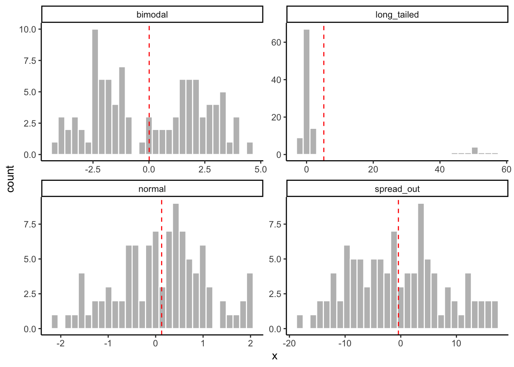
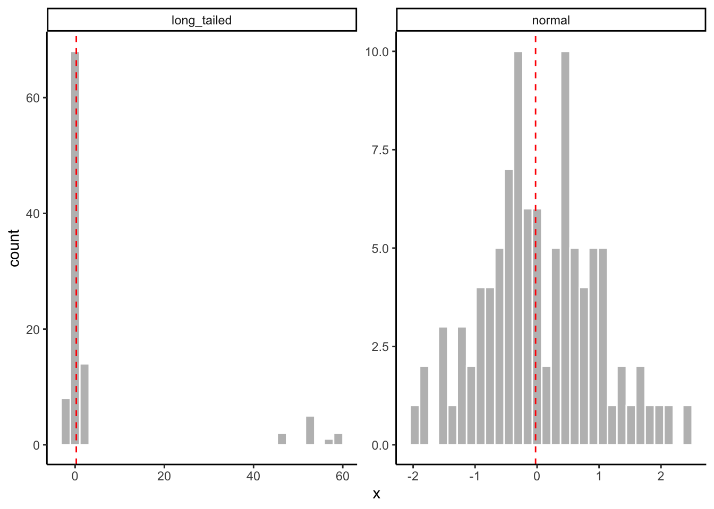

# Describing your data


Last week we devoted a lot of time to an introduction to **dataviz**, using the example of a dataset of amino-acid measurements from Sihui Ma's dissertation research [@ma2018a].  We mostly explored the *descriptive* and *exploratory* potentials of data visualization, rather than the *inferential* capabilities of this approach.  This week we will be doing something similar: we will be learning how to use R's tools for describing and summarizing data, as well as introducing our first review of statistical concepts.  However, we will be generally staying far away from the world of [*statistical inference*](https://en.wikipedia.org/wiki/Statistical_inference), even though that's the ultimate goal of much of science and of this class.  

Briefly, it is worth it to describe the key differences between the tasks of description and inference.  In **description**, we are interested in providing accurate summaries and insights that have to do *with our sample*.  We are not trying to make the step of generalizing to the population of similar samples (or indeed the broader world)--we are interested in giving insightful, concise insights into the mess of data we have in front of us.  In general, description doesn't require that we assume or theorize about generating mechanisms (actual or statistical) for our data.  In **inference**, we would like to be able to generalize from our sample to the broader world of other samples, or entire populations.  We may also be interested in _prediction_ of future outcomes.  Either of these tasks require us to make some hypotheses or assumptions about how our data were generated in order for us to predict future events.  This is generally much harder and less certain than the task of *describing* just the data we have.  We'll talk about how to approach inference (from an agnostic, critical perspective) starting after Spring Break.

 weather forecasts using different models.](https://imgs.xkcd.com/comics/five_day_forecast.png)

However, it is worth noting that the distinction between description and inference in scientific thinking and writing is often somewhat muddy.  Often, we apply statistics that are appropriate for description to our samples and then, without ill-intention, use what we know about our sample to generalize to a larger setting, which means we are performing inference.  This can cause all sorts of problems!  For an introduction to this problem, I recommend the chapter(s) on inference from *Statistical Rethinking* [@mcelreath2020].

## Datasets

Today we're going to be looking at a set of pilot data that Elizabeth Cole and Martha Calvert collected as part of a class project for FST 5014.  The abstract for the project follows:

> Hard cider is a fermented, alcoholic beverage often compared to wine and beer that is growing in popularity throughout the United States. However, the growing popularity of cider has been accompanied by inconsistent communication regarding consumers’ perception of dryness and sweetness in hard cider. To date, there is no conclusive methodology to measure cider dryness and sweetness in a way that is relevant and accurate for most ciders and cider-drinkers. At the same time, there is no industry standard for the serving temperature of hard cider, although temperature is known to impact the sensory experience and particularly the apparent dryness of other alcoholic beverages. Recently, the New York Cider Association developed the Merlyn Dryness Scale as a way to scale cider dryness using basic cider chemistry (pH, RS, TA, polyphenol content, malic acid, and CO2) , but this approach has not been validated in sensory experiments. Thus, the aim of this research is to validate the Merlyn Dryness Scale by comparing the chemical analyses of various cider samples to the sensory evaluations of those cider samples, and to assess the effect of serving temperature on cider dryness perception. Chemical analyses performed for the research include determining the pH, RS, TA, and total polyphenol content.

This dataset contains two different data tables.  The first--`cider_chem`--is a table of chemistry data for the ciders, as described above.


```r
knitr::kable(cider_chem)
```


|Cider  |   pH| TA (g/L)|  CO2| TRS (g/L)| MAL(g/L)| Polyphenols (ppm)| Merlyn Rating|
|:------|----:|--------:|----:|---------:|--------:|-----------------:|-------------:|
|Eden   | 3.69|     4.27| 4.54|     18.67|     3.62|            203.56|         4.374|
|Buskey | 3.94|     3.10| 4.53|     15.67|     2.05|            245.57|         5.055|
|1911   | 3.57|     4.97| 4.54|     21.00|     5.63|            256.86|         4.225|

The second--`cider_dryness`--is a (much larger) table of subjects' sensory judgments of the same ciders.


```r
slice_sample(cider_dryness, n = 10) %>% knitr::kable()
```


|Sample_Name    |Panelist_Code    |Panelist_Name    |Panelist_Display_Name |Panelist_Email         | Dryness| Liking|
|:--------------|:----------------|:----------------|:---------------------|:----------------------|-------:|------:|
|1911 Chilled   |lukes17_vtu      |Luke Shanholtz   |Luke                  |lukes17@vt.edu         |     3.5|      7|
|Eden Chilled   |blittleson_vtu   |Brenna Littleson |NA                    |blittleson@vt.edu      |     2.0|      2|
|Buskey Chilled |drsoffa20_vtu    |NA               |NA                    |drsoffa20@vt.edu       |     3.7|      8|
|Eden RT        |rebekahm20_vtu   |NA               |NA                    |rebekahm20@vt.edu      |     3.2|      4|
|1911 Chilled   |ejcole_vtu       |Elizabeth Cole   |Elizabeth             |ejcole@vt.edu          |     1.0|      5|
|Eden Chilled   |jkess_vtu        |Julia Kesselring |Julia                 |jkess@vt.edu           |     1.0|      1|
|Eden Chilled   |noahsmith319_vtu |Noah Smith       |Noah                  |noahsmith319@gmail.com |     4.3|      6|
|Eden RT        |vturesearch001   |NA               |NA                    |NA                     |     4.3|      4|
|Buskey Chilled |sophiedrew_vtu   |Sophie Drew      |Sophie                |sophiedrew@vt.edu      |     1.7|      7|
|Eden Chilled   |emilyey6_vtu     |Emily Yando      |Emily                 |emilyey6@vt.edu        |     2.6|      3|

## Review exercise: How did I import these datasets?


```r
# Use this R chunk to write code that reads the appropriate files into R.
```

We may also make recourse to the polyphenol data from last week to give us some data in a different format to play with.  As a reminder, those data describe amino-acid contents in different apple varieties, and look like:


```r
slice_sample(apples, n = 5) %>% knitr::kable()
```


|Variety        |Rep   |  His|   Asn|  Ser|  Gln|  Arg|  Gly|  Asp|  Glu|  Thr|  Ala| GABA|  Pro|  Cys|  Lys|  Tyr|  Met|  Val|  Ile|  Leu|   Phe|
|:--------------|:-----|----:|-----:|----:|----:|----:|----:|----:|----:|----:|----:|----:|----:|----:|----:|----:|----:|----:|----:|----:|-----:|
|Northern Spy   |Rep_1 | 0.51|  2.52| 0.17| 0.00| 0.23| 0.00| 1.60| 1.05| 0.35| 0.34| 0.00| 0.00| 0.35| 0.53| 1.24| 1.34| 1.52| 2.04| 1.25| 12.47|
|York           |Rep_2 | 0.00| 13.62| 0.64| 1.12| 0.42| 0.07| 3.32| 1.84| 0.25| 0.46| 0.17| 0.00| 0.28| 0.44| 0.73| 1.02| 1.32| 1.68| 1.07|  3.43|
|Winesap        |Rep_2 | 0.40|  4.97| 0.50| 1.13| 0.96| 0.00| 4.39| 2.74| 0.31| 0.74| 0.24| 0.28| 0.33| 0.59| 0.92| 1.20| 1.84| 1.95| 1.45|  4.34|
|Newtown Pippin |Rep_1 | 0.33| 26.13| 1.01| 1.36| 0.67| 0.13| 5.14| 3.23| 0.57| 1.03| 0.54| 0.28| 0.36| 0.60| 0.94| 1.38| 0.85| 2.12| 1.39|  4.50|
|Field Red      |Rep_3 | 0.32|  4.31| 0.30| 0.00| 0.48| 0.00| 1.98| 1.37| 0.21| 0.30| 0.15| 0.00| 0.36| 0.52| 1.11| 1.07| 1.73| 1.98| 1.78| 13.39|

## What kind of data do you have?

Before we get into new material, let's review some basic tools for understanding data.  We're going to start off with a quick review of material from Weeks 1 and 2 of this course, but then quickly get into new, useful concepts and functions for understanding your data.

### Basic attributes

There are some very basic questions we might have about our data that it's worth remember.  When we import data, we might ask:

* What kinds of variables are there in the data?   Are the data types those we expect?
* How many rows and columns are there in the data?  What *shape* is the data?
* If we are dealing with structured data (like data frames and tibbles), what are the names of the variables/columns and the rows?
* What does the data *look like*--that is, what does a representative set of rows contain?

#### Types of data and data structures

We learned about data types in lesson 1 and 2--you might recall a discussion of *integers*, *characters*, *numeric*, etc vectors, and of complex data structures like *matrices*, *lists*, and *data frames*.  In general, it's worth remembering that vectors and matrices can contain only one kind of data--that is, a matrix can have *numeric* data in all of its cells, or *character* data, but it cannot have some numeric and some character data.  


```r
matrix(letters[1:4], nrow = 2, ncol = 2)
```

```
##      [,1] [,2]
## [1,] "a"  "c" 
## [2,] "b"  "d"
```

```r
matrix(1:4, nrow = 2, ncol = 2)
```

```
##      [,1] [,2]
## [1,]    1    3
## [2,]    2    4
```

The **data types** of these comparatively simple data objects are going to always be the kind of thing they contain:


```r
typeof("a string")
```

```
## [1] "character"
```

```r
typeof(matrix(letters[1:4], nrow = 2))
```

```
## [1] "character"
```

Lists, on the other hand, can contain any number of different types of objects (including complex data structures):


```r
list(a_character = "hi!", a_number = 3.5, an_integer = 3L, a_logical = TRUE, a_matrix = matrix(1:4, nrow = 2))
```

```
## $a_character
## [1] "hi!"
## 
## $a_number
## [1] 3.5
## 
## $an_integer
## [1] 3
## 
## $a_logical
## [1] TRUE
## 
## $a_matrix
##      [,1] [,2]
## [1,]    1    3
## [2,]    2    4
```

Therefore, the type of a list is always just `list`:


```r
typeof(list(a = 1, b = TRUE))
```

```
## [1] "list"
```


Data frames (and tibbles) are special kinds of lists.


```r
example_tibble <- tibble(x = 1:2, y = c(TRUE, FALSE), z = list(list(a = 1), list(b = "jazz")))
example_tibble
```

```
## # A tibble: 2 × 3
##       x y     z               
##   <int> <lgl> <list>          
## 1     1 TRUE  <named list [1]>
## 2     2 FALSE <named list [1]>
```

```r
typeof(example_tibble)
```

```
## [1] "list"
```

The main things to remember about these structures are:

1. They are "rectangular" - e.g., they enable numerical indexing in the same way that we can with matrices (`[]`) or using the special data-frame access: `$`.


```r
example_tibble[1, ] # get the first row of our tibble
```

```
## # A tibble: 1 × 3
##       x y     z               
##   <int> <lgl> <list>          
## 1     1 TRUE  <named list [1]>
```

```r
example_tibble$x # get the first column of our example tibble
```

```
## [1] 1 2
```

2. That means that each column of a data frame must be the same length:


```r
example_tibble$new <- 1:5
```

```
## Error:
## ! Assigned data `1:5` must be compatible with existing data.
## ✖ Existing data has 2 rows.
## ✖ Assigned data has 5 rows.
## ℹ Only vectors of size 1 are recycled.
```

3. All data stored in each *column* must be of the same *type* (although as can be seen in our example, we can make a "list of lists" column).


```r
typeof(example_tibble$y)
```

```
## [1] "logical"
```

#### Sizes

Frequently, we will need to know something about the size of our data sets.  For example, we might need to know how many observations we have total in our data set, which may correspond to the number of rows (if our data is in "long" format), we might need to know the number of columns we have so that we can use indexing to access them properly (although using named accessing through `select()` will generally be more readable), or we might need to know numbers of rows or columns so that we can use `for` loops or other control-flow tools.

For vectors, the most useful function is `length()`.  This returns, as you might expect, the length of the vector in terms of how many things are in it:


```r
length(1:100)
```

```
## [1] 100
```

```r
length(letters)
```

```
## [1] 26
```

However, `length()` is less useful for complex data objects: for data frames, counterintuitively, R treats their length as the number of columns; for lists the length is the number of top-level entries.


```r
length(cider_chem)
```

```
## [1] 8
```

```r
length(cider_dryness)
```

```
## [1] 7
```

For matrices, data frames, etc, the `nrow()` and `ncol()` functions are more useful.  Respectively, they tell us the number of rows and columns in the object:


```r
ncol(cider_dryness)
```

```
## [1] 7
```

```r
nrow(cider_chem)
```

```
## [1] 3
```

For "rectangular" data structures, we can also ask about the dimensions all at once using the `dim()` function:


```r
dim(cider_chem)
```

```
## [1] 3 8
```

Less important, for our purposes, is the actual (memory) size of files: how many bytes they take up.  Unless you are working with big data (on the scale of at least hundreds of megabytes), R will happily deal with whatever size data you need.

#### Names

In most of the use cases we have for R, we will be working with data objects that have names.  When we print objects we can see that there are names assigned to different parts of the data:


```r
apples # what are the names here?
```

```
## # A tibble: 42 × 22
##    Variety     Rep     His   Asn   Ser   Gln   Arg   Gly   Asp   Glu   Thr   Ala
##    <chr>       <chr> <dbl> <dbl> <dbl> <dbl> <dbl> <dbl> <dbl> <dbl> <dbl> <dbl>
##  1 Arkansas B… Rep_1  0.62 10.4   0.68  1.6   0.36  0.09  2.92  2.37  0.2   0.72
##  2 Blacktwig   Rep_1  0.77  2.32  0.54  0     0.24  0     1.96  1.03  0.18  0.47
##  3 Empire      Rep_1  0.46 21.2   0.43  1.01  0.27  0.09  5.88  1.49  0.28  1.92
##  4 Enterprise  Rep_1  0.52 34.8   0.9   2.78  0.24  0.08  5.18  2.49  0.33  1.71
##  5 Field Red   Rep_1  0.85  4.02  0.29  0     0.41  0     1.87  1.29  0.19  0.33
##  6 Golden Del… Rep_1  0.56  1.01  0     0     0.34  0     1.76  0.98  0.32  0.26
##  7 Granny Smi… Rep_1  0.61  8.76  0.34  0     0.31  0.1   1.41  0.58  0.38  0.42
##  8 Newtown Pi… Rep_1  0.33 26.1   1.01  1.36  0.67  0.13  5.14  3.23  0.57  1.03
##  9 Northern S… Rep_1  0.51  2.52  0.17  0     0.23  0     1.6   1.05  0.35  0.34
## 10 Rome        Rep_1  0.36  1.57  0.2   0     0.43  0.08  1.23  0.91  0.34  0.23
## # … with 32 more rows, and 10 more variables: GABA <dbl>, Pro <dbl>, Cys <dbl>,
## #   Lys <dbl>, Tyr <dbl>, Met <dbl>, Val <dbl>, Ile <dbl>, Leu <dbl>, Phe <dbl>
## # ℹ Use `print(n = ...)` to see more rows, and `colnames()` to see all variable names
```

Simple objects can also have names:


```r
simple_names <- c(a = 1, b = 2, c = 10) # what type of object is this?
simple_names
```

```
##  a  b  c 
##  1  2 10
```

We can get the names of an object through `names()`:


```r
names(simple_names)
```

```
## [1] "a" "b" "c"
```

```r
names(apples)
```

```
##  [1] "Variety" "Rep"     "His"     "Asn"     "Ser"     "Gln"     "Arg"    
##  [8] "Gly"     "Asp"     "Glu"     "Thr"     "Ala"     "GABA"    "Pro"    
## [15] "Cys"     "Lys"     "Tyr"     "Met"     "Val"     "Ile"     "Leu"    
## [22] "Phe"
```

We can also *set* names in an object using the same function, combined with `<-`:


```r
names(simple_names) <- c("new 1", "new 2", "new 3")
simple_names
```

```
## new 1 new 2 new 3 
##     1     2    10
```

For complex objects, we have equivalents of `nrow()`/`ncol()`/`dim()`:


```r
colnames(cider_chem)
```

```
## [1] "Cider"             "pH"                "TA (g/L)"         
## [4] "CO2"               "TRS (g/L)"         "MAL(g/L)"         
## [7] "Polyphenols (ppm)" "Merlyn Rating"
```

```r
rownames(cider_chem) # note that tibbles do not support row names
```

```
## [1] "1" "2" "3"
```

```r
dimnames(cider_chem) 
```

```
## [[1]]
## [1] "1" "2" "3"
## 
## [[2]]
## [1] "Cider"             "pH"                "TA (g/L)"         
## [4] "CO2"               "TRS (g/L)"         "MAL(g/L)"         
## [7] "Polyphenols (ppm)" "Merlyn Rating"
```

All of these can be combined with `<-` to modify the existing assignments.

Data frames and matrices allow rownames, but these are discouraged in tibbles.  Wickham & Grolemund -@wickham2017 argue that row names are more confusing and less useful than a named column in a dataframe, but a number of non-`tidyverse` packages in R do rely on them.  Therefore, it is useful to know a little bit about them, even though I do agree that they are less useful than a named column.

For example, we might want to transform our `cider_chem` tibble into a data frame with row names corresponding to the sample names


```r
cider_chem_df <- as.data.frame(cider_chem)
rownames(cider_chem_df) <- cider_chem$Cider
cider_chem_df
```

```
##         Cider   pH TA (g/L)  CO2 TRS (g/L) MAL(g/L) Polyphenols (ppm)
## Eden     Eden 3.69     4.27 4.54     18.67     3.62            203.56
## Buskey Buskey 3.94     3.10 4.53     15.67     2.05            245.57
## 1911     1911 3.57     4.97 4.54     21.00     5.63            256.86
##        Merlyn Rating
## Eden           4.374
## Buskey         5.055
## 1911           4.225
```

Row names must be unique, which can be a problem for long data frames (as opposed to wide), because usually the observations in a long data frame are uniquely identified by a *combination* of columns, rather than a single one--this is one of the reasons that Wickham & Grolemund -@wickham2017 argue against their use.

Rather than the somewhat annoying set of code commands above, `tibble` does provide a nice one-step function appropriate for piping for transforming a tibble to a data frame with rownames: `column_to_rownames()`.  This also has the nice side effect of deleting the (now redundant) column from the new data frame


```r
cider_chem %>%
  column_to_rownames("Cider")
```

```
##          pH TA (g/L)  CO2 TRS (g/L) MAL(g/L) Polyphenols (ppm) Merlyn Rating
## Eden   3.69     4.27 4.54     18.67     3.62            203.56         4.374
## Buskey 3.94     3.10 4.53     15.67     2.05            245.57         5.055
## 1911   3.57     4.97 4.54     21.00     5.63            256.86         4.225
```

For matrices and higher-dimension data, it is more natural to use rownames.  These are set with the same commands.

## Examining big data frames

For the most part, we are going to be dealing with data frames that have more rows than we can easily inspect in the R Console, or even the viewer.  As you may have already found, we can open a simple "spreadsheet" view of dataframes by clicking on a dataset in the Environment pane--what this actually does is run `View(<data>)` in the Console.

Personally, I don't think this is the most effective way to inspect our data.  We've already discussed the use of `str()` as a more effective way to get a summary of the *structure* of a data frame:


```r
str(cider_dryness)
```

```
## spec_tbl_df [294 × 7] (S3: spec_tbl_df/tbl_df/tbl/data.frame)
##  $ Sample_Name          : chr [1:294] "1911 Chilled" "Buskey Chilled" "Eden Chilled" "1911 RT" ...
##  $ Panelist_Code        : chr [1:294] "ejcole_vtu" "ejcole_vtu" "ejcole_vtu" "ejcole_vtu" ...
##  $ Panelist_Name        : chr [1:294] "Elizabeth Cole" "Elizabeth Cole" "Elizabeth Cole" "Elizabeth Cole" ...
##  $ Panelist_Display_Name: chr [1:294] "Elizabeth" "Elizabeth" "Elizabeth" "Elizabeth" ...
##  $ Panelist_Email       : chr [1:294] "ejcole@vt.edu" "ejcole@vt.edu" "ejcole@vt.edu" "ejcole@vt.edu" ...
##  $ Dryness              : num [1:294] 1 2.4 NA NA NA 3 2.3 3.5 2.8 4.2 ...
##  $ Liking               : num [1:294] 5 5 NA NA NA 5 6 7 4 2 ...
##  - attr(*, "spec")=
##   .. cols(
##   ..   Sample_Name = col_character(),
##   ..   Panelist_Code = col_character(),
##   ..   Panelist_Name = col_character(),
##   ..   Panelist_Display_Name = col_character(),
##   ..   Panelist_Email = col_character(),
##   ..   Dryness = col_double(),
##   ..   Liking = col_double()
##   .. )
##  - attr(*, "problems")=<externalptr>
```

This tells us:

1. The type of object
2. The structure of the object in terms of list/column structure: what kinds of data is in the object?
3. "Metadata" about the object, which in R can be found in the **atrributes**.  FWIW, these are accessed via the `attributes()` function (which can be very useful but hard to read).  These can be set using the `attr()` function, but in general this is a level of detail you won't need to deal with until you get into very advanced applications.

### `dplyr::glimpse()`

The `dplyr` package offers a somewhat beefed up version of `str()` called `glimpse()`.  It gives us the same info about the size of the object and info about the types of the columns, but leaves out attributes and class information.  This can be more readable, but isn't necessarily that much better:


```r
glimpse(cider_dryness)
```

```
## Rows: 294
## Columns: 7
## $ Sample_Name           <chr> "1911 Chilled", "Buskey Chilled", "Eden Chilled"…
## $ Panelist_Code         <chr> "ejcole_vtu", "ejcole_vtu", "ejcole_vtu", "ejcol…
## $ Panelist_Name         <chr> "Elizabeth Cole", "Elizabeth Cole", "Elizabeth C…
## $ Panelist_Display_Name <chr> "Elizabeth", "Elizabeth", "Elizabeth", "Elizabet…
## $ Panelist_Email        <chr> "ejcole@vt.edu", "ejcole@vt.edu", "ejcole@vt.edu…
## $ Dryness               <dbl> 1.0, 2.4, NA, NA, NA, 3.0, 2.3, 3.5, 2.8, 4.2, 2…
## $ Liking                <dbl> 5, 5, NA, NA, NA, 5, 6, 7, 4, 2, 7, 5, 8, 6, 7, …
```

However, for various reasons we will need different ways to look at parts of our data.  One frequent situation I find myself in is the need to make sure that a calculated column (perhaps made via `mutate()`) is working properly.  To do so, we might want to not just look at the top of the data set (printed normally via when we put the name of a tibble into the Console), since that might be systematically different than later observations.

We can of course use indexing to access any part of the tibble, but this is going to get tedious fast:


```r
# Explain what calculation I am making here.
cider_dryness %>%
  group_by(Panelist_Name) %>% # this has introduced a subtle error, why?
  mutate(liking_by_subject = mean(Liking, na.rm = TRUE)) %>% # why does this show us the error?
  ungroup() %>%
  .[94:103,]
```

```
## # A tibble: 10 × 8
##    Sample_Name    Panelist_Code  Paneli…¹ Panel…² Panel…³ Dryness Liking likin…⁴
##    <chr>          <chr>          <chr>    <chr>   <chr>     <dbl>  <dbl>   <dbl>
##  1 1911 RT        blittleson_vtu Brenna … <NA>    blittl…     2.3      7    4.83
##  2 Buskey RT      blittleson_vtu Brenna … <NA>    blittl…     1.2      3    4.83
##  3 Eden RT        blittleson_vtu Brenna … <NA>    blittl…     3.3      6    4.83
##  4 1911 Chilled   taybenn_vtu    <NA>     <NA>    tayben…     2        6    5.40
##  5 Buskey Chilled taybenn_vtu    <NA>     <NA>    tayben…     1.5      4    5.40
##  6 Eden Chilled   taybenn_vtu    <NA>     <NA>    tayben…     2        7    5.40
##  7 1911 RT        taybenn_vtu    <NA>     <NA>    tayben…     4        8    5.40
##  8 Buskey RT      taybenn_vtu    <NA>     <NA>    tayben…     2.5      7    5.40
##  9 Eden RT        taybenn_vtu    <NA>     <NA>    tayben…     3        8    5.40
## 10 1911 Chilled   sophiedrew_vtu Sophie … Sophie  sophie…     3.5      6    5.33
## # … with abbreviated variable names ¹​Panelist_Name, ²​Panelist_Display_Name,
## #   ³​Panelist_Email, ⁴​liking_by_subject
```

As you might expect, we have some better tools to do this kind of quick access.

### `head()`/`tail()`

In base R, there are functions to access the first or last *N* rows.  The default is for `n = 6`.


```r
head(cider_dryness)
```

```
## # A tibble: 6 × 7
##   Sample_Name    Panelist_Code Panelist_Name  Panelist_…¹ Panel…² Dryness Liking
##   <chr>          <chr>         <chr>          <chr>       <chr>     <dbl>  <dbl>
## 1 1911 Chilled   ejcole_vtu    Elizabeth Cole Elizabeth   ejcole…     1        5
## 2 Buskey Chilled ejcole_vtu    Elizabeth Cole Elizabeth   ejcole…     2.4      5
## 3 Eden Chilled   ejcole_vtu    Elizabeth Cole Elizabeth   ejcole…    NA       NA
## 4 1911 RT        ejcole_vtu    Elizabeth Cole Elizabeth   ejcole…    NA       NA
## 5 Buskey RT      ejcole_vtu    Elizabeth Cole Elizabeth   ejcole…    NA       NA
## 6 Eden RT        ejcole_vtu    Elizabeth Cole Elizabeth   ejcole…     3        5
## # … with abbreviated variable names ¹​Panelist_Display_Name, ²​Panelist_Email
```

```r
tail(cider_dryness, n = 10)
```

```
## # A tibble: 10 × 7
##    Sample_Name    Panelist_Code        Panelist…¹ Panel…² Panel…³ Dryness Liking
##    <chr>          <chr>                <chr>      <chr>   <chr>     <dbl>  <dbl>
##  1 Eden Chilled   gail.billingsley_vtu Elizabeth… Elizab… gail.b…     4        2
##  2 1911 RT        gail.billingsley_vtu Elizabeth… Elizab… gail.b…     4.3      8
##  3 Buskey RT      gail.billingsley_vtu Elizabeth… Elizab… gail.b…     3.5      7
##  4 Eden RT        gail.billingsley_vtu Elizabeth… Elizab… gail.b…     1.7      6
##  5 1911 Chilled   kaylinf_vtu          Kaylin Fi… Kaylin  kaylin…     2.7      8
##  6 Buskey Chilled kaylinf_vtu          Kaylin Fi… Kaylin  kaylin…     3.5      4
##  7 Eden Chilled   kaylinf_vtu          Kaylin Fi… Kaylin  kaylin…     2.4      7
##  8 1911 RT        kaylinf_vtu          Kaylin Fi… Kaylin  kaylin…     4        8
##  9 Buskey RT      kaylinf_vtu          Kaylin Fi… Kaylin  kaylin…     3.5      6
## 10 Eden RT        kaylinf_vtu          Kaylin Fi… Kaylin  kaylin…     3.5      3
## # … with abbreviated variable names ¹​Panelist_Name, ²​Panelist_Display_Name,
## #   ³​Panelist_Email
```

These are useful (I find especially `tail()`) as a very quick quality check.

### `dplyr::slice_*()`

More powerful but slightly more complicated are the `slice_*()` functions from `dplyr` (part of the `tidyverse`).  These offer more powerful ways to get a subset of data, and can actually be used in a more powerful, functional workflow.

`slice_head()` and `slice_tail()` are equivalents to `head()` and `tail()`, but they also work with `group_by()`, so you can get the first/last *N* rows in each group.

A next step up in power are `slice_max()` and `slice_min()`, which give you the *N* rows with the highest/lowest value of a specified variable:


```r
cider_dryness %>%
  slice_max(n = 10, order_by = Dryness)
```

```
## # A tibble: 11 × 7
##    Sample_Name  Panelist_Code     Panelist_Name   Panel…¹ Panel…² Dryness Liking
##    <chr>        <chr>             <chr>           <chr>   <chr>     <dbl>  <dbl>
##  1 1911 RT      jkess_vtu         Julia Kesselri… Julia   jkess@…     5        7
##  2 1911 RT      lukes17_vtu       Luke Shanholtz  Luke    lukes1…     5        5
##  3 Buskey RT    rrboyer_vtu       Renee Boyer     Renee   rrboye…     4.9      4
##  4 Eden Chilled klbyrwa_vtu       <NA>            <NA>    klbyrw…     4.9      4
##  5 1911 RT      Rmawn_vtu         Rachel Mawn     Rachel  Rmawn@…     4.8      6
##  6 Eden RT      Rmawn_vtu         Rachel Mawn     Rachel  Rmawn@…     4.8      2
##  7 1911 Chilled emilyplunkett_vtu <NA>            <NA>    emilyp…     4.8      4
##  8 1911 RT      rrboyer_vtu       Renee Boyer     Renee   rrboye…     4.7      6
##  9 1911 RT      indiana22_vtu     <NA>            <NA>    indian…     4.7      7
## 10 1911 RT      ccamryn3_vtu      Camryn Grace C… Camryn  ccamry…     4.6      8
## 11 Eden Chilled vturesearch001    <NA>            <NA>    <NA>        4.6      2
## # … with abbreviated variable names ¹​Panelist_Display_Name, ²​Panelist_Email
```

Finally, `slice_sample()` gets a random set of rows from the dataset.  This is a great way to pull a representative sample from throughout the dataset:


```r
cider_dryness %>%
  slice_sample(n = 5)
```

```
## # A tibble: 5 × 7
##   Sample_Name    Panelist_Code    Panelist_Name Panelis…¹ Panel…² Dryness Liking
##   <chr>          <chr>            <chr>         <chr>     <chr>     <dbl>  <dbl>
## 1 Eden RT        klbyrwa_vtu      <NA>          <NA>      klbyrw…     3.3      7
## 2 Buskey Chilled peggylaynepe_vtu Peggy Layne   Peggy     peggyl…     2        7
## 3 1911 Chilled   noahsmith319_vtu Noah Smith    Noah      noahsm…     1.8      4
## 4 1911 Chilled   sok_vtu          Sean O'Keefe  Sean      sok@vt…     3.3      7
## 5 Eden Chilled   taybenn_vtu      <NA>          <NA>      tayben…     2        7
## # … with abbreviated variable names ¹​Panelist_Display_Name, ²​Panelist_Email
```

All of these also work with `group_by()`.

## Generating data summaries

So far, we've largely limited ourselves to just looking at data.  This is the equivalent to drawing simple histograms from last week (although we're not even counting data, yet)--we're not getting any useful summaries out of our data, just checking for quality and making sure we understand what we have.  The next step in descriptive data analysis and statistics is to extract numbers that summarize our data.

### `summary()`

The base R `summary()` function is a *generic* function in R--this means it will do different things depending on what kind of object we give it as its input.  For example, when we give it a dataframe, it will give us information about the average and range of each column when the data is numeric, and not a whole lot when it is character data.  It will also tell us a little bit about missing data (`NA`s).


```r
summary(cider_dryness)
```

```
##  Sample_Name        Panelist_Code      Panelist_Name      Panelist_Display_Name
##  Length:294         Length:294         Length:294         Length:294           
##  Class :character   Class :character   Class :character   Class :character     
##  Mode  :character   Mode  :character   Mode  :character   Mode  :character     
##                                                                                
##                                                                                
##                                                                                
##                                                                                
##  Panelist_Email        Dryness          Liking     
##  Length:294         Min.   :1.000   Min.   :1.000  
##  Class :character   1st Qu.:2.200   1st Qu.:4.000  
##  Mode  :character   Median :3.000   Median :6.000  
##                     Mean   :2.925   Mean   :5.306  
##                     3rd Qu.:3.500   3rd Qu.:7.000  
##                     Max.   :5.000   Max.   :8.000  
##                     NA's   :3       NA's   :3
```

However, if we give it a `model` object (like that produced from simple linear regression with `lm()`) we will get very different output:


```r
summary(lm(Liking ~ Sample_Name, data = cider_dryness))
```

```
## 
## Call:
## lm(formula = Liking ~ Sample_Name, data = cider_dryness)
## 
## Residuals:
##     Min      1Q  Median      3Q     Max 
## -5.0612 -1.5306  0.3878  1.4375  3.4694 
## 
## Coefficients:
##                           Estimate Std. Error t value Pr(>|t|)    
## (Intercept)                 6.0612     0.2725  22.244  < 2e-16 ***
## Sample_Name1911 RT          0.2304     0.3874   0.595 0.552371    
## Sample_NameBuskey Chilled  -0.4490     0.3853  -1.165 0.244944    
## Sample_NameBuskey RT       -1.4987     0.3874  -3.869 0.000135 ***
## Sample_NameEden Chilled    -1.2904     0.3874  -3.331 0.000978 ***
## Sample_NameEden RT         -1.5306     0.3853  -3.972 9.03e-05 ***
## ---
## Signif. codes:  0 '***' 0.001 '**' 0.01 '*' 0.05 '.' 0.1 ' ' 1
## 
## Residual standard error: 1.907 on 285 degrees of freedom
##   (3 observations deleted due to missingness)
## Multiple R-squared:  0.1256,	Adjusted R-squared:  0.1102 
## F-statistic: 8.187 on 5 and 285 DF,  p-value: 3.069e-07
```

So `summary()` is a useful but unpredictable first step for understanding data.

### `skimr::skim()`

A more powerful approach that requires installing a separate package is the `skim()` function, from `skimr`.  This is actually one of my favorite R tools, because it tells you so much so easily:


```r
skim(cider_dryness)
```


Table: (\#tab:unnamed-chunk-32)Data summary

|                         |              |
|:------------------------|:-------------|
|Name                     |cider_dryness |
|Number of rows           |294           |
|Number of columns        |7             |
|_______________________  |              |
|Column type frequency:   |              |
|character                |5             |
|numeric                  |2             |
|________________________ |              |
|Group variables          |None          |


**Variable type: character**

|skim_variable         | n_missing| complete_rate| min| max| empty| n_unique| whitespace|
|:---------------------|---------:|-------------:|---:|---:|-----:|--------:|----------:|
|Sample_Name           |         0|          1.00|   7|  14|     0|        6|          0|
|Panelist_Code         |         0|          1.00|   7|  20|     0|       49|          0|
|Panelist_Name         |        96|          0.67|   9|  21|     0|       33|          0|
|Panelist_Display_Name |       108|          0.63|   3|   9|     0|       29|          0|
|Panelist_Email        |        18|          0.94|  10|  26|     0|       46|          0|


**Variable type: numeric**

|skim_variable | n_missing| complete_rate| mean|   sd| p0| p25| p50| p75| p100|hist  |
|:-------------|---------:|-------------:|----:|----:|--:|---:|---:|---:|----:|:-----|
|Dryness       |         3|          0.99| 2.93| 0.93|  1| 2.2|   3| 3.5|    5|▅▇▇▇▂ |
|Liking        |         3|          0.99| 5.31| 2.02|  1| 4.0|   6| 7.0|    8|▂▂▆▅▇ |

In one command we get details about the size and shape of our data, as well as column summaries that are customaized for the different types of data (in this case, character and numeric).  But `skim()` is actually even more powerful: for example, it supports `group_by()` to give us group summaries for some grouping variable.


```r
# Let's do a by-cider summary
cider_dryness %>%
  group_by(Sample_Name) %>%
  skim()
```


Table: (\#tab:unnamed-chunk-33)Data summary

|                         |            |
|:------------------------|:-----------|
|Name                     |Piped data  |
|Number of rows           |294         |
|Number of columns        |7           |
|_______________________  |            |
|Column type frequency:   |            |
|character                |4           |
|numeric                  |2           |
|________________________ |            |
|Group variables          |Sample_Name |


**Variable type: character**

|skim_variable         |Sample_Name    | n_missing| complete_rate| min| max| empty| n_unique| whitespace|
|:---------------------|:--------------|---------:|-------------:|---:|---:|-----:|--------:|----------:|
|Panelist_Code         |1911 Chilled   |         0|          1.00|   7|  20|     0|       49|          0|
|Panelist_Code         |1911 RT        |         0|          1.00|   7|  20|     0|       49|          0|
|Panelist_Code         |Buskey Chilled |         0|          1.00|   7|  20|     0|       49|          0|
|Panelist_Code         |Buskey RT      |         0|          1.00|   7|  20|     0|       49|          0|
|Panelist_Code         |Eden Chilled   |         0|          1.00|   7|  20|     0|       49|          0|
|Panelist_Code         |Eden RT        |         0|          1.00|   7|  20|     0|       49|          0|
|Panelist_Name         |1911 Chilled   |        16|          0.67|   9|  21|     0|       33|          0|
|Panelist_Name         |1911 RT        |        16|          0.67|   9|  21|     0|       33|          0|
|Panelist_Name         |Buskey Chilled |        16|          0.67|   9|  21|     0|       33|          0|
|Panelist_Name         |Buskey RT      |        16|          0.67|   9|  21|     0|       33|          0|
|Panelist_Name         |Eden Chilled   |        16|          0.67|   9|  21|     0|       33|          0|
|Panelist_Name         |Eden RT        |        16|          0.67|   9|  21|     0|       33|          0|
|Panelist_Display_Name |1911 Chilled   |        18|          0.63|   3|   9|     0|       29|          0|
|Panelist_Display_Name |1911 RT        |        18|          0.63|   3|   9|     0|       29|          0|
|Panelist_Display_Name |Buskey Chilled |        18|          0.63|   3|   9|     0|       29|          0|
|Panelist_Display_Name |Buskey RT      |        18|          0.63|   3|   9|     0|       29|          0|
|Panelist_Display_Name |Eden Chilled   |        18|          0.63|   3|   9|     0|       29|          0|
|Panelist_Display_Name |Eden RT        |        18|          0.63|   3|   9|     0|       29|          0|
|Panelist_Email        |1911 Chilled   |         3|          0.94|  10|  26|     0|       46|          0|
|Panelist_Email        |1911 RT        |         3|          0.94|  10|  26|     0|       46|          0|
|Panelist_Email        |Buskey Chilled |         3|          0.94|  10|  26|     0|       46|          0|
|Panelist_Email        |Buskey RT      |         3|          0.94|  10|  26|     0|       46|          0|
|Panelist_Email        |Eden Chilled   |         3|          0.94|  10|  26|     0|       46|          0|
|Panelist_Email        |Eden RT        |         3|          0.94|  10|  26|     0|       46|          0|


**Variable type: numeric**

|skim_variable |Sample_Name    | n_missing| complete_rate| mean|   sd|  p0|  p25|  p50|  p75| p100|hist  |
|:-------------|:--------------|---------:|-------------:|----:|----:|---:|----:|----:|----:|----:|:-----|
|Dryness       |1911 Chilled   |         0|          1.00| 2.97| 0.85| 1.0| 2.50| 3.00| 3.50|  4.8|▂▇▇▇▃ |
|Dryness       |1911 RT        |         1|          0.98| 3.32| 0.99| 1.5| 2.45| 3.25| 4.12|  5.0|▆▅▃▇▅ |
|Dryness       |Buskey Chilled |         0|          1.00| 2.75| 0.83| 1.3| 2.00| 2.80| 3.50|  4.2|▆▇▆▇▆ |
|Dryness       |Buskey RT      |         1|          0.98| 2.86| 0.88| 1.2| 2.22| 2.75| 3.50|  4.9|▅▇▆▆▂ |
|Dryness       |Eden Chilled   |         1|          0.98| 2.76| 1.00| 1.0| 2.00| 2.65| 3.50|  4.9|▅▇▆▅▂ |
|Dryness       |Eden RT        |         0|          1.00| 2.90| 0.93| 1.0| 2.30| 3.00| 3.50|  4.8|▅▆▆▇▃ |
|Liking        |1911 Chilled   |         0|          1.00| 6.06| 1.75| 1.0| 5.00| 6.00| 7.00|  8.0|▂▁▃▅▇ |
|Liking        |1911 RT        |         1|          0.98| 6.29| 1.44| 2.0| 6.00| 6.50| 7.00|  8.0|▁▂▁▅▇ |
|Liking        |Buskey Chilled |         0|          1.00| 5.61| 1.82| 1.0| 4.00| 6.00| 7.00|  8.0|▁▂▃▃▇ |
|Liking        |Buskey RT      |         1|          0.98| 4.56| 1.84| 1.0| 3.00| 5.00| 6.00|  7.0|▃▂▃▂▇ |
|Liking        |Eden Chilled   |         1|          0.98| 4.77| 2.40| 1.0| 3.00| 5.00| 7.00|  8.0|▆▃▅▂▇ |
|Liking        |Eden RT        |         0|          1.00| 4.53| 2.05| 1.0| 3.00| 4.00| 6.00|  8.0|▃▅▇▂▅ |

We can even use `skim()` with it's helper function `yank()` to make quick summary tables suitable for printing in a report:


```r
cider_dryness %>% group_by(Sample_Name) %>% skim() %>% yank(skim_type = "numeric")
```


**Variable type: numeric**

|skim_variable |Sample_Name    | n_missing| complete_rate| mean|   sd|  p0|  p25|  p50|  p75| p100|hist  |
|:-------------|:--------------|---------:|-------------:|----:|----:|---:|----:|----:|----:|----:|:-----|
|Dryness       |1911 Chilled   |         0|          1.00| 2.97| 0.85| 1.0| 2.50| 3.00| 3.50|  4.8|▂▇▇▇▃ |
|Dryness       |1911 RT        |         1|          0.98| 3.32| 0.99| 1.5| 2.45| 3.25| 4.12|  5.0|▆▅▃▇▅ |
|Dryness       |Buskey Chilled |         0|          1.00| 2.75| 0.83| 1.3| 2.00| 2.80| 3.50|  4.2|▆▇▆▇▆ |
|Dryness       |Buskey RT      |         1|          0.98| 2.86| 0.88| 1.2| 2.22| 2.75| 3.50|  4.9|▅▇▆▆▂ |
|Dryness       |Eden Chilled   |         1|          0.98| 2.76| 1.00| 1.0| 2.00| 2.65| 3.50|  4.9|▅▇▆▅▂ |
|Dryness       |Eden RT        |         0|          1.00| 2.90| 0.93| 1.0| 2.30| 3.00| 3.50|  4.8|▅▆▆▇▃ |
|Liking        |1911 Chilled   |         0|          1.00| 6.06| 1.75| 1.0| 5.00| 6.00| 7.00|  8.0|▂▁▃▅▇ |
|Liking        |1911 RT        |         1|          0.98| 6.29| 1.44| 2.0| 6.00| 6.50| 7.00|  8.0|▁▂▁▅▇ |
|Liking        |Buskey Chilled |         0|          1.00| 5.61| 1.82| 1.0| 4.00| 6.00| 7.00|  8.0|▁▂▃▃▇ |
|Liking        |Buskey RT      |         1|          0.98| 4.56| 1.84| 1.0| 3.00| 5.00| 6.00|  7.0|▃▂▃▂▇ |
|Liking        |Eden Chilled   |         1|          0.98| 4.77| 2.40| 1.0| 3.00| 5.00| 7.00|  8.0|▆▃▅▂▇ |
|Liking        |Eden RT        |         0|          1.00| 4.53| 2.05| 1.0| 3.00| 4.00| 6.00|  8.0|▃▅▇▂▅ |

`skimr` is so powerful that I recommend checking out the vignettes: `browseVignettes("skimr")`.

### `group_by()` and `summarize()`/`count()`

Sometimes, however, you want to provide specific data summaries that are for your own exploratory use, and tools like `summary()` aren't powerful enough, while tools like `skim()` provide too much detail.  For example, you might want to check the number of times a sample is evaluated in a dataset, or the average value for different groups, or some custom calculation.  There is a very flexible framework for that in the `tidyverse`, provided by the combination of `group_by()` and long (tidy) data.

Our `cider_dryness` data set is in *nearly* tidy format: we have two observations per row, `Liking` and `Dryness`.  We could fix this by using `pivot_longer()` to flip those into two columns called, for example, "Attribute" and "Rating", but right now we'll ignore it and just focus on the `Liking` variable.

Recall that the `group_by()` function tells R that there is some *column* in the dataset that is a grouping variable--we can even have more than one grouping column, and R will find all combinations.  So, for example, in this dataset we have `Sample_Name`, which tells us about the cider (and its serving temperature).  There are 6 total unique sample names (3 ciders and 2 serving temperatures).

What `summarize()` does is lets us **define a summary statistic we want for each group**.  So, in this case, let's imagine we want to know the mean, median, and standard deviation for the `Liking` of each cider.


```r
cider_dryness %>%
  group_by(Sample_Name) %>%
  summarize(mean_liking = mean(Liking, na.rm = TRUE),
            median_liking = median(Liking, na.rm = TRUE),
            sd_liking = sd(Liking, na.rm = TRUE))
```

```
## # A tibble: 6 × 4
##   Sample_Name    mean_liking median_liking sd_liking
##   <chr>                <dbl>         <dbl>     <dbl>
## 1 1911 Chilled          6.06           6        1.75
## 2 1911 RT               6.29           6.5      1.44
## 3 Buskey Chilled        5.61           6        1.82
## 4 Buskey RT             4.56           5        1.84
## 5 Eden Chilled          4.77           5        2.40
## 6 Eden RT               4.53           4        2.05
```

This is a very powerful pattern for quickly getting summarized tables for either further analysis or for output to reports and publications.

Frequently, one of the things we most want to know is "how many observations are there in a particular group?"  `summarize()` provides a helper function for that, which only works in these calls: `n()`.  So we'd write:


```r
cider_dryness %>%
  group_by(Sample_Name) %>%
  summarize(number_of_obs = n())
```

```
## # A tibble: 6 × 2
##   Sample_Name    number_of_obs
##   <chr>                  <int>
## 1 1911 Chilled              49
## 2 1911 RT                   49
## 3 Buskey Chilled            49
## 4 Buskey RT                 49
## 5 Eden Chilled              49
## 6 Eden RT                   49
```

This is actually so important that there is a shortcut: `count()`, which allows us to skip the `group_by()` and just specify the counting variable within the function:


```r
cider_dryness %>%
  count(Panelist_Code)
```

```
## # A tibble: 49 × 2
##    Panelist_Code            n
##    <chr>                <int>
##  1 akyle99_vtu              6
##  2 andy9221_vtu             6
##  3 ann.sandbrook@vt.edu     6
##  4 blittleson_vtu           6
##  5 ccamryn3_vtu             6
##  6 ccomber1_vtu             6
##  7 cdavis98_vtu             6
##  8 cierrajames22_vtu        6
##  9 deckerj6_vtu             6
## 10 dhsawhney_vtu            6
## # … with 39 more rows
## # ℹ Use `print(n = ...)` to see more rows
```

Of course, this can be used on grouped data separately, but it saves typing of lines of code.  It also allows the user to specify multiple grouping variables within `count()` if desired.

This is especially useful when you are dealing with datasets that may be incomplete, rather than the result of experimental designs that are forced to be complete.  Let's observe this by dropping missing data from our `cider_dryness` data using the useful `drop_na()` utility function.


```r
cider_dryness %>%
  drop_na(Liking) %>%
  count(Sample_Name)
```

```
## # A tibble: 6 × 2
##   Sample_Name        n
##   <chr>          <int>
## 1 1911 Chilled      49
## 2 1911 RT           48
## 3 Buskey Chilled    49
## 4 Buskey RT         48
## 5 Eden Chilled      48
## 6 Eden RT           49
```

Now we can see that our data are incomplete, and we have to decide how we might want to deal with that.  Let's find out where our missing data *are*:


```r
cider_dryness %>%
  drop_na(Liking) %>%
  count(Panelist_Code) %>%
  filter(n < 6) # why did we ask for panelists with less than 6 ratings?
```

```
## # A tibble: 1 × 2
##   Panelist_Code     n
##   <chr>         <int>
## 1 ejcole_vtu        3
```

We can drop this panelist from our dataset if we are concerned about their data making our design unbalanced.

## Statistics review

We have now begun to move from describing our "raw" data--the type of data we have, its shape and structure--to developing ways in which we want to **explore** teh data to provide **descriptive** summaries and other information about our data.  For the rest of this class we're going to explore some common summary statistics that you have certainly encountered before.  We're going to see how to calculate these in R, how to fit them into the data analysis workflows we've started to explore, and how to think about these.

I think it's worth paraphrasing Hadley Wickham -@wickham2017 here on what I mean by exploratory statistics.  We are often taught in basic statistics that the purpose of our analyses are inference: testing hypotheses that are (hopefully) generalizable.  But what we are doing today--and for most of the class, and in a lot of our work in general--is description.  [Wickham writes](https://r4ds.had.co.nz/model-intro.html):

> Traditionally, the focus of modelling is on inference, or for confirming that an hypothesis is true. Doing this correctly is not complicated, but it is hard. There is a pair of ideas that you must understand in order to do inference correctly:
>
> 1. Each observation can either be used for exploration or confirmation, not both.
> 2. You can use an observation as many times as you like for exploration, but you can only use it once for confirmation. As soon as you use an observation twice, you’ve switched from confirmation to exploration.
>
> This is necessary because to confirm a hypothesis you must use data independent of the data that you used to generate the hypothesis. Otherwise you will be over optimistic. There is absolutely nothing wrong with exploration, but you should never sell an exploratory analysis as a confirmatory analysis because it is fundamentally misleading.

What we are doing in this class is exploring data.  We will often find illuminating patterns that can spur further research--this is exactly the pattern that led to the generation of the real data we're using to learn with.  But we should be cautious about using these data to actually build models that we think predict as-yet-unobserved phenomena.  We don't have the right supporting structure for that kind of inference right now.

### Measures of central tendency

Most often, we start by asking what single value best summarizes the whole range of our observations.  Typically, this will be a measure of **central tendency**, meaning a value around which our observations are centered.  We are all pretty familiar with the idea of an average, but it is worth reviewing to think through what these mean from the perspective of summarizing our data.

#### Mean

The (arithmetic) mean has the familiar form of $\bar{x} = \frac{x_{1} + x_{2} + ... + x_{n}}{n}$.  This is the *expected value* of our variable--the value which, given no other information except our sample, is our best guess for the value of x.  

In R, the `mean()` function takes a *vector* and returns the mean value.  It will throw an error if there is missing data (e.g., `NA`).


```r
mean(apples$His)
```

```
## [1] 0.4214286
```

```r
mean(cider_dryness$Liking)
```

```
## [1] NA
```

```r
mean(cider_dryness$Liking, na.rm = TRUE) # use na.rm = TRUE to drop NAs before the mean is calculated
```

```
## [1] 5.305842
```

It is important to note that `mean()` works on *vectors*.  What is wrong with the following function call?


```r
mean(1, 2, 3, 4, 5) # What should the mean be?
```

```
## [1] 1
```


The mean is *biased* by the shape of our distribution: it is a good guess at central tendency when our data are clumped up around a central value, but it becomes less and less realistic when our data are

* very spread out (e.g., high variance)
* have long tails in one direction or another
* have multiple "clumps" (e.g., bimodal data)

What do you think the mean tells us about the following artificial data sets?


```r
# Let's make some pathological data
tibble(normal = rnorm(100, mean = 0, sd = 1),
       spread_out = rnorm(100, mean = 0, sd = 10),
       long_tailed = c(rnorm(90, mean = 0, sd = 1), rnorm(10, mean = 50, sd = 5)),
       bimodal = c(rnorm(50, mean = -2, sd = 1), rnorm(50, mean = 2, sd = 1)),
       obs = 1:100) %>%
  pivot_longer(names_to = "distribution", values_to = "x", -obs) %>%
  # And now we'll plot it to look at how the means work
  ggplot(aes(x = x)) + 
  geom_histogram(color = "white", fill = "grey") + 
  # This messy layer just calculates means for each group and plots them as a dashed line
  geom_vline(aes(xintercept = mean_x), 
             data = . %>% group_by(distribution) %>% summarize(mean_x = mean(x)),
             color = "red",
             linetype = "dashed") + 
  facet_wrap(~distribution, scales = "free") +
  theme_classic()
```



##### Other means: harmonic, geometric, etc

There are other ways to calculate a mean that satisfy different definitions.  For example, the **geometric mean** is the n-th root of the product of n numbers: $\bar{x}_{geom} = \sqrt[n]{x_{1} * x_{2} * ... * x_{n}}$.  The geometric mean makes sense when considering the central tendency of sets of numbers that will naturally be multiplied, or for other naturally exponential phenomena like growth rates.  It can be calculated as `psych::geometric.mean()`.  

The third common mean is the **harmonic mean**, defined as the reciprocal of the arithmetic mean of the reciprocals of the given set of observations: $\bar{x}_{harm} = \frac{n}{\frac{1}{x_{1}} + \frac{1}{x_{2}} + ... + \frac{1}{x_{n}}}$.  The harmonic mean does not suffer from the influence of outliers in the same way as the arithmetic mean.  It can be calculated as `psych::harmonic.mean()`

The relationship between the three means is generally $\bar{x}_{harm} < \bar{x}_{geom} < \bar{x}$, except in the case where all observations are equal.  For our dataset:


```r
psych::harmonic.mean(cider_dryness$Liking, na.rm = TRUE) 
```

```
## [1] 4.010369
```

```r
psych::geometric.mean(cider_dryness$Liking, na.rm = TRUE)
```

```
## [1] 4.768266
```

```r
mean(cider_dryness$Liking, na.rm = TRUE)
```

```
## [1] 5.305842
```

#### Median

In contrast to the mean, the **median** is the central value in our observations when they are ordered from least to greatest.  The median, therefore, is not affected by extreme outliers and long tails in the ways that the mean(s) typically are.  For this reason the median is often called "*nonparametric*"--it is an equally good estimator of the central tendency even when our data is not *parameterized* by the "clumped around the center" distribution typical of the normal (bell-shaped) distribution.


```r
tibble(normal = rnorm(100, mean = 0, sd = 1),
       long_tailed = c(rnorm(90, mean = 0, sd = 1), rnorm(10, mean = 50, sd = 5)),
       obs = 1:100) %>%
  pivot_longer(names_to = "distribution", values_to = "x", -obs) %>%
  # And now we'll plot it to look at how the means work
  ggplot(aes(x = x)) + 
  geom_histogram(color = "white", fill = "grey") + 
  # This messy layer just calculates means for each group and plots them as a dashed line
  geom_vline(aes(xintercept = median_x), 
             data = . %>% group_by(distribution) %>% summarize(median_x = median(x)),
             color = "red",
             linetype = "dashed") + 
  facet_wrap(~distribution, scales = "free") +
  theme_classic()
```



In R, we calculate the median using `median()`.  The same arguments and warnings from `mean()` apply here.


```r
median(apples$His)
```

```
## [1] 0.365
```

```r
median(cider_dryness$Liking)
```

```
## [1] NA
```

```r
median(10, 1, 1, 1, 1) # why is this wrong?
```

```
## [1] 10
```

#### Mode

In most statistics classes, we learn about the mode and quickly forget it.  The **mode** is defined as the value of x that occurs most frequently, which means that for real-valued (numeric) variables, it is not very useful.  But the mode is actually really valuable when we think about categorical variables, which may be extremely frequent in our datasets, especially if we collect observational datasets.  For example, we might ask

* In 100 petri dishes, which microbial spp. is most abundant most often?
* In sensory studies of cider, which word(s) get used most frequently by consumers?
* Which soil type is found most frequently in 100 random tracts sampled from around Blacksburg?

We can sometimes represent these statistics as means or medians, but we are really talking about modes and categorical variables.  Therefore, it's a shame that R doesn't actually have a function to easily calculate the mode!

It is pretty easy to use the `group_by()`/`count()`/`slice_*()` to find the mode of a dataset:


```r
# How can we use these functions to find the most frequently occurring category?
```

However, it might be better to define a function that works more like `mean()` and `median()`.  This solution is given at [Stack Overflow](https://stackoverflow.com/questions/2547402/how-to-find-the-statistical-mode). 


```r
Modes <- function(x) {
  ux <- unique(x)
  tab <- tabulate(match(x, ux))
  ux[tab == max(tab)]
}
Modes(cider_dryness$Liking)
```

```
## [1] 7
```

This introduces a nice utility function: `unique()` takes a vector and tells you what values are in it:


```r
unique(c(1, 1, 1, 2, 3, 3, 4))
```

```
## [1] 1 2 3 4
```


```r
ggplot(aes(x = Liking), data = cider_dryness) + 
  geom_density() + 
  geom_vline(aes(xintercept = mean(Liking, na.rm = TRUE)), linetype = "dashed", color = "red") + 
  geom_vline(aes(xintercept = median(Liking, na.rm = TRUE)), linetype = "dotted", color = "red") +
  geom_vline(aes(xintercept = Modes(Liking)), linetype = "dotdash", color = "red") +
  annotate("label", 
           x = c(6, mean(cider_dryness$Liking, na.rm = TRUE), Modes(cider_dryness$Liking)), 
           y = c(0.05, 0.07, 0.08), 
           label = c("median", "mean", "mode")) + 
  theme_classic()
```

```
## Warning: Removed 3 rows containing non-finite values (stat_density).
```


Or, to sum it all up, we could calculate some kind of average of means...

 a better mean.](https://imgs.xkcd.com/comics/geothmetic_meandian.png)

### Variation

No matter what single value we choose as a representative of our data, it is unlikely to truly communicate the shape of our data.  Partly, that is why I am emphasizing the use of simple plots--in many cases these will be much better for exploring our data than even a couple numeric summary statistics.  We can continue to enrich our numerical summaries, however, by describing the variation of our observations as well as their central tendency.  There are a couple common measures for variation that will be useful.

#### Variance

The most common way to report variation is **variance** (and its square root, standard deviation).  Variance is intimately related to the *arithmetic mean*: it is defined (for a sample) as the average squared distance from the mean: $\sigma^2 = \frac{1}{n - 1}\sum{(x_{i}-\bar{x})^2}$.  We define it this way in order to account for the fact that we expect both positive and negative differences from the mean; otherwise we'd end up with an average distance of 0.  

The **standard deviation** is just the (positive) square root of variance: $sd = \sqrt{\sigma^2}$.  Standard deviation, however, has the advantage of being in the *same units* as the mean (and the original variable), meaning that we can interpret standard deviation as the average distance an observation will be away from the mean, which is a more intuitive measurement.

In R, we calculate variance with `var()` and standard deviation with `sd()`.  Both take vectors and need to account for `NA`s.


```r
var(apples$His)
```

```
## [1] 0.08257352
```

```r
sd(apples$His)
```

```
## [1] 0.2873561
```

```r
var(cider_dryness$Liking) # how do we fix this?
```

```
## [1] NA
```

#### Quantiles and the Interquartile Range

A related concept which we've encountered already in drawing *boxplots* is the idea of the **Interquartile Range** (IQR)--for a dataset, the IQR is the difference between the 25th and 75th percentiles of the dataset.  Understanding the IQR requires understanding the idea of **quantiles**: in non-technical terms, quantiles are the division of an ordered set of values into groups with equal numbers of values per groups.  The idea is best demonstrated with some common, named quantiles:

* If we divide into *10* groups, we have *deciles*.
* If we divide into *100* groups, we have *percentiles*.  If we talk about someone "being in the 95th percentile" with regard to some test score (say GRE), we mean that their score falls into the range of scores (for their cohort) that is the 95th group.
* If we divide into *4* groups, we will have *quartiles* and have 4 sets of groups each with the same number of observations.  The values that are at the edge of each group define the quartile ranges.  
 * Obviously in the case of the **IQR** we are rewriting in terms of percentiles, but it should be clear that the 25th and 75th percentile are the 2nd and 3rd quartile, respectively.
 * The **median** is in fact the number that represents a split into two quantiles (the upper and lower half of the observations).  Therefore, the median will also fall at the 2nd quartile (the 50th percentile or 5th decile).
 
The IQR represents an alternative measure of variation.  A traditional observation in intro statistics is that, when the data are normal-ish, "~2/3 of the observations fall within 1 sd of the mean".  But as we see in our `cider_dryness` and `apples` data we can have quite non-normal distributions.  The IQR is another "nonparametric" estimate, in that it doesn't rely on any assumptions of how our data are made (i.e., distributed)--rather, we just order our data and draw lines at the 25th and 75th percentiles.  If the IQR is broad, we have a lot of "spread" (variation) in our data; if the IQR is narrow observations tend to be close to our central measure (the median or 50th percentile in this case).  This can help inform our expectations and observations.

We can get the IQR in quite a few ways.  If we want the cut points for the percentiles (the values for the 25th and 75th percentiles), the `summary()` function on any numeric vectors actually returns that as part of its summarization.  If we want the actual distance between the boundaries, the `IQR()` function returns that.  The `fivenum()` function returns Tukey's proposed data summary, which is the minimum, the maximimum, the median, and the 25th and 75th percentile observations.


```r
summary(apples$His)
```

```
##    Min. 1st Qu.  Median    Mean 3rd Qu.    Max. 
##  0.0000  0.2350  0.3650  0.4214  0.6025  1.3200
```

```r
IQR(apples$His)
```

```
## [1] 0.3675
```

```r
fivenum(apples$His)
```

```
## [1] 0.000 0.230 0.365 0.610 1.320
```

The main difference between `summary()` and `fivenum()` is that the latter will try to return percentile values that are actually observations in the dataset, whereas `summary()` will generally interpolate values that may not actually occur in the dataset.

### Linear Association

Linear association, in data analysis, is closely associated with the ideas of **covariance** and **correlation**.  You've probably learned about these both in statistics courses, and I will be going into each briefly here.  But my goal here is to motivate our thinking about these concepts with more concrete examples, as well as some thinking about the persistent power of the "*linear model*", despite (or because of) its limitations.  We'll find that, as an explanatory and exploratory tool, linear models are quite powerful, even when they are obviously incorrect.

Let's start by looking at **scatterplots** of data from our `apples` dataset.  Scatterplots have a strong, visual relationship to our idea of linear association.  We look only at 8/20 measured amino acids for visual clarity.


```r
ggplot(apples) +
  geom_point(aes(x = .panel_x, y = .panel_y)) +
  geom_autodensity() +
  facet_matrix(vars(3:10), layer.diag = 2) + 
  theme_bw()
```


In many cases, it appears that there is a cloud of points with no clear relationship in each box.  In other cases (for example, `Asp ~ Glu` and `Asn ~ Ser`) there seem to be "associations" between the values.  

What do we mean by an association?  Very broadly, we mean that the magnitude of one of the variables tells us something about the magnitude of the other.  So, for example, it appears that higher values of Aspartate are related to higher values of Glutamate (with the exception of one very strong outlier).  Although we don't see any obvious examples in this visualization, we might also see the opposite kind of trends--if a high value of one variable is predictably paired with a low value of another, that would still be a linear association: just a negative one.

What other trends can we see in these plots?

#### Covariance

The idea that two variables change together, predictably, is formalized in the idea of **covariance**.  Covariance between two variables, $x$ and $y$, is formally defined as $cov(x, y) = \sigma_{xy} = \frac{1}{n - 1}\sum{(x_{i} - \bar{x}) * ({y_{i} - \bar{y})}}$.  There is no reason at all for you to memorize this (I had to look it up to make sure I was gettig the definition right).  But looking at the equation gives us a couple insights its worth remembering:

1. There must be some intrinsic relationship between $x$ and $y$ for the concept of covariance (and linear association in general) to make sense.  
    1. For example, if $x$ is temperature in Blacksburg over the last week measured at 10-minute intervals, and $y$ is the molar mass of every common carbohydrate, we have two numeric variables that have no intrinsic relationship whatsoever.  We cannot pair values of $x$ and $y$ in this case--we do not have the $i$ subscript connecting observations.  We can't even really graph these two variables against each other in a scatterplot (a sure warning sign).
    2. In the case of `apples`, we can pair $x$ and $y$ as different amino acids, because they are measured on the same sample ($i$).
2. Ignoring the normalization factor ($\frac{1}{n - 1}$), which scales covariance so that it doesn't grow with more observations, the equation says "for each observation $i$, take how far $x_{i}$ and $y_{i}$ are from their central tendencies, and multiply them, then add up all these pairs".  
    1. So if when $x_{i}$ is bigger than average, $y_{i}$ is also bigger than average, their product will be very large, and if the reverse is true ($x_{i}$ small, $y_{i}$ small), the negatives will cancel when multiplied, and so $\sigma_{xy}$ will get very large.  
    2. If the situation is completely reversed ($x_{i}$ small, $y_{i}$ big or vice versa), then $\sigma_{xy}$ will grow very negative (why?)
    3. If there is no association, and we cannot guess anything about $y_{i}$ from $x_{i}$, then $\sigma_{xy}$ will be quite small (why?)
3. Notice that we are not *scaling* $x$ or $y$.  
    1. So if we $x$ is on the order of magnitude of, say `1e4`, and $y$ is on the order of magnitude of `1e-2`, variation in $x$ will dominate the covariance.
    2. It means we cannot directly compare covariances among different pairs of variables.

Oof, that was mathy.  The main point is to get a conceptual handle on the idea of covariance, as it actually underlies a lot of the statistical inference we will do.  We want to know if and when two variables tend to vary together, as it can help us form and test hypotheses about underlying causes.

In R, we can get covariance between two variables by using the `cov()` function.  We can get a single covariance by giving two vectors to `cov(x, y)`, but we need to be sure they are ordered by the intrinsic connecting variable.  So in the case of `apples`, that is we need to have the same `Variety` and `Rep` ID variables for each observation:


```r
(correct_covariance <- cov(apples$Asp, apples$Glu))
```

```
## [1] 0.8754642
```

```r
(incorrect_covariance <- cov(apples$Asp, apples$Glu[sample(1:42)]))
```

```
## [1] -0.376665
```

```r
correct_covariance == incorrect_covariance
```

```
## [1] FALSE
```

It is more common, when working with the type of multivariate datasets we usually have (and have in this case), to examine a "covariance matrix"--this is the numerical equivalent of the kind of scatterplot matrix we saw above.  It is a symmetrical matrix (what does this mean?) in which each cell contains the covariance of the variables for the row and column, and the diagonal gives the variance of each variable:


```r
round(cov(apples[,-c(1, 2)]), 3)
```

```
##         His     Asn    Ser    Gln    Arg    Gly    Asp    Glu    Thr    Ala
## His   0.083   0.282  0.013  0.037  0.006  0.000  0.087  0.047 -0.006  0.027
## Asn   0.282  99.205  2.107  6.634 -0.286  0.304 12.785  4.419  0.398  3.966
## Ser   0.013   2.107  0.075  0.183  0.027  0.010  0.307  0.204  0.008  0.087
## Gln   0.037   6.634  0.183  0.694  0.075  0.027  0.960  0.596  0.009  0.332
## Arg   0.006  -0.286  0.027  0.075  0.116  0.008  0.089  0.250  0.002  0.056
## Gly   0.000   0.304  0.010  0.027  0.008  0.003  0.043  0.036  0.001  0.019
## Asp   0.087  12.785  0.307  0.960  0.089  0.043  2.465  0.875  0.043  0.645
## Glu   0.047   4.419  0.204  0.596  0.250  0.036  0.875  0.956  0.024  0.319
## Thr  -0.006   0.398  0.008  0.009  0.002  0.001  0.043  0.024  0.011  0.004
## Ala   0.027   3.966  0.087  0.332  0.056  0.019  0.645  0.319  0.004  0.296
## GABA  0.012   1.286  0.038  0.096  0.012  0.005  0.253  0.110  0.005  0.067
## Pro   0.012   0.946  0.029  0.100  0.038  0.007  0.187  0.131 -0.001  0.108
## Cys  -0.003  -0.136 -0.004 -0.019 -0.002  0.000 -0.028 -0.014  0.000 -0.006
## Lys  -0.001  -0.241  0.001 -0.016  0.020  0.002 -0.055  0.031  0.003 -0.006
## Tyr  -0.008  -0.465 -0.013 -0.077  0.006  0.001 -0.146 -0.037  0.004 -0.025
## Met  -0.006   0.092  0.004 -0.038 -0.005  0.002 -0.001 -0.010  0.007 -0.004
## Val  -0.039  -3.168 -0.086 -0.273  0.004 -0.012 -0.511 -0.201  0.000 -0.160
## Ile  -0.001  -0.302 -0.008 -0.075  0.003  0.001 -0.108 -0.022  0.011 -0.029
## Leu   0.004  -0.861 -0.011 -0.068  0.019  0.000 -0.162 -0.004  0.000 -0.037
## Phe  -0.131 -25.601 -0.878 -2.268 -0.274 -0.125 -4.326 -1.965  0.033 -1.398
##        GABA    Pro    Cys    Lys    Tyr    Met    Val    Ile    Leu     Phe
## His   0.012  0.012 -0.003 -0.001 -0.008 -0.006 -0.039 -0.001  0.004  -0.131
## Asn   1.286  0.946 -0.136 -0.241 -0.465  0.092 -3.168 -0.302 -0.861 -25.601
## Ser   0.038  0.029 -0.004  0.001 -0.013  0.004 -0.086 -0.008 -0.011  -0.878
## Gln   0.096  0.100 -0.019 -0.016 -0.077 -0.038 -0.273 -0.075 -0.068  -2.268
## Arg   0.012  0.038 -0.002  0.020  0.006 -0.005  0.004  0.003  0.019  -0.274
## Gly   0.005  0.007  0.000  0.002  0.001  0.002 -0.012  0.001  0.000  -0.125
## Asp   0.253  0.187 -0.028 -0.055 -0.146 -0.001 -0.511 -0.108 -0.162  -4.326
## Glu   0.110  0.131 -0.014  0.031 -0.037 -0.010 -0.201 -0.022 -0.004  -1.965
## Thr   0.005 -0.001  0.000  0.003  0.004  0.007  0.000  0.011  0.000   0.033
## Ala   0.067  0.108 -0.006 -0.006 -0.025 -0.004 -0.160 -0.029 -0.037  -1.398
## GABA  0.033  0.024 -0.001 -0.004 -0.013  0.006 -0.061 -0.003 -0.010  -0.480
## Pro   0.024  0.052 -0.001  0.002 -0.002  0.003 -0.054 -0.006 -0.006  -0.608
## Cys  -0.001 -0.001  0.006  0.002  0.008  0.005  0.012  0.013  0.010   0.081
## Lys  -0.004  0.002  0.002  0.013  0.017  0.013  0.023  0.023  0.018   0.087
## Tyr  -0.013 -0.002  0.008  0.017  0.054  0.026  0.057  0.048  0.031   0.118
## Met   0.006  0.003  0.005  0.013  0.026  0.048  0.013  0.043  0.022  -0.046
## Val  -0.061 -0.054  0.012  0.023  0.057  0.013  0.225  0.065  0.061   1.383
## Ile  -0.003 -0.006  0.013  0.023  0.048  0.043  0.065  0.099  0.046   0.343
## Leu  -0.010 -0.006  0.010  0.018  0.031  0.022  0.061  0.046  0.054   0.401
## Phe  -0.480 -0.608  0.081  0.087  0.118 -0.046  1.383  0.343  0.401  18.893
```

Notice that, even though this is a table showing covariances among different amino acid concentrations, we have vastly different scales: some of our amino acids (Asparagine, Phenylalanine) have variances that are orders of magnitude larger than others.  This makes it hard to understand which covariances are actually important.

#### Correlation

The final point (#3) above leads us to the idea of linear or Pearson **correlation**, which can be thought of as "standardized covariance".  The standardization is done by dividing the covariance $x$ and $y$ by the standard deviations of each variable: $cor(x, y) = \rho_{xy} = \frac{\sigma_{xy}}{\sigma_{x}*\sigma_{y}}$.  This preserves the directionality (positive or negative) of the covariance, but accounts for differences in scale in $x$ and $y$--in fact, it means that $\rho_{xy}$ is bounded within $[-1, 1]$.  If the correlation is equal to +1, it means that there is a perfect, positive (linear) association between $x$ and $y$, and if it is equal to -1 it means that there is a perfect negative association.  If it is 0 it means there is no linear association.

We can calculate correlations (and correlation matrices) in R using the `cor()` function.  It works exactly the same as `cov()`, including the requirement that we be careful with making sure that the intrinsic variable(s) connecting $x$ and $y$ aren't disrupted.


```r
cor(apples$Asp, apples$Glu)
```

```
## [1] 0.5703138
```

```r
cor(apples$Asp, apples$Glu[sample(1:42)])
```

```
## [1] -0.3678495
```

And, typically, we will generate correlation matrices instead:


```r
round(cor(apples[, -c(1, 2)]), 3)
```

```
##         His    Asn    Ser    Gln    Arg    Gly    Asp    Glu    Thr    Ala
## His   1.000  0.099  0.170  0.155  0.057 -0.016  0.193  0.166 -0.203  0.171
## Asn   0.099  1.000  0.774  0.800 -0.084  0.570  0.818  0.454  0.377  0.732
## Ser   0.170  0.774  1.000  0.803  0.285  0.652  0.715  0.761  0.266  0.585
## Gln   0.155  0.800  0.803  1.000  0.264  0.613  0.734  0.732  0.100  0.732
## Arg   0.057 -0.084  0.285  0.264  1.000  0.450  0.167  0.750  0.048  0.303
## Gly  -0.016  0.570  0.652  0.613  0.450  1.000  0.509  0.695  0.253  0.669
## Asp   0.193  0.818  0.715  0.734  0.167  0.509  1.000  0.570  0.257  0.755
## Glu   0.166  0.454  0.761  0.732  0.750  0.695  0.570  1.000  0.232  0.600
## Thr  -0.203  0.377  0.266  0.100  0.048  0.253  0.257  0.232  1.000  0.071
## Ala   0.171  0.732  0.585  0.732  0.303  0.669  0.755  0.600  0.071  1.000
## GABA  0.234  0.716  0.761  0.638  0.197  0.560  0.894  0.622  0.236  0.687
## Pro   0.179  0.415  0.461  0.527  0.485  0.597  0.521  0.586 -0.037  0.868
## Cys  -0.140 -0.179 -0.204 -0.305 -0.086 -0.041 -0.237 -0.184  0.013 -0.155
## Lys  -0.042 -0.216  0.023 -0.170  0.514  0.268 -0.311  0.282  0.265 -0.104
## Tyr  -0.122 -0.201 -0.203 -0.399  0.070  0.061 -0.400 -0.164  0.149 -0.200
## Met  -0.097  0.042  0.072 -0.207 -0.071  0.196 -0.002 -0.049  0.292 -0.031
## Val  -0.285 -0.671 -0.665 -0.692  0.026 -0.465 -0.687 -0.434  0.000 -0.619
## Ile  -0.012 -0.097 -0.091 -0.287  0.024  0.067 -0.219 -0.072  0.332 -0.171
## Leu   0.054 -0.371 -0.177 -0.352  0.235 -0.034 -0.444 -0.017  0.002 -0.293
## Phe  -0.105 -0.591 -0.738 -0.626 -0.185 -0.537 -0.634 -0.462  0.072 -0.591
##        GABA    Pro    Cys    Lys    Tyr    Met    Val    Ile    Leu    Phe
## His   0.234  0.179 -0.140 -0.042 -0.122 -0.097 -0.285 -0.012  0.054 -0.105
## Asn   0.716  0.415 -0.179 -0.216 -0.201  0.042 -0.671 -0.097 -0.371 -0.591
## Ser   0.761  0.461 -0.204  0.023 -0.203  0.072 -0.665 -0.091 -0.177 -0.738
## Gln   0.638  0.527 -0.305 -0.170 -0.399 -0.207 -0.692 -0.287 -0.352 -0.626
## Arg   0.197  0.485 -0.086  0.514  0.070 -0.071  0.026  0.024  0.235 -0.185
## Gly   0.560  0.597 -0.041  0.268  0.061  0.196 -0.465  0.067 -0.034 -0.537
## Asp   0.894  0.521 -0.237 -0.311 -0.400 -0.002 -0.687 -0.219 -0.444 -0.634
## Glu   0.622  0.586 -0.184  0.282 -0.164 -0.049 -0.434 -0.072 -0.017 -0.462
## Thr   0.236 -0.037  0.013  0.265  0.149  0.292  0.000  0.332  0.002  0.072
## Ala   0.687  0.868 -0.155 -0.104 -0.200 -0.031 -0.619 -0.171 -0.293 -0.591
## GABA  1.000  0.577 -0.048 -0.205 -0.301  0.156 -0.714 -0.061 -0.231 -0.612
## Pro   0.577  1.000 -0.047  0.059 -0.045  0.055 -0.499 -0.083 -0.107 -0.612
## Cys  -0.048 -0.047  1.000  0.178  0.449  0.311  0.321  0.559  0.567  0.245
## Lys  -0.205  0.059  0.178  1.000  0.645  0.523  0.437  0.642  0.692  0.179
## Tyr  -0.301 -0.045  0.449  0.645  1.000  0.516  0.514  0.658  0.570  0.117
## Met   0.156  0.055  0.311  0.523  0.516  1.000  0.127  0.632  0.423 -0.048
## Val  -0.714 -0.499  0.321  0.437  0.514  0.127  1.000  0.434  0.557  0.672
## Ile  -0.061 -0.083  0.559  0.642  0.658  0.632  0.434  1.000  0.626  0.252
## Leu  -0.231 -0.107  0.567  0.692  0.570  0.423  0.557  0.626  1.000  0.396
## Phe  -0.612 -0.612  0.245  0.179  0.117 -0.048  0.672  0.252  0.396  1.000
```

By scaling our variables, we no longer have the problem of differences in measurement scale overwhelming possible associations.  A good example here is the relationship between Leucine and Isoleucine--their covariance is only 0.046, because they are both present in very low levels in these apples, but when scaled we see there is a pretty strong linear association as represented by correlation: 0.626.

#### Caveats with linear association

Linear association is powerful and simple, and in fact when we start to get into ideas of inference in the next several weeks, we will see that its simplicity offers some advantages.  But it also is very rigid and can ignore clear patterns in data.  Kieran Healy -@healy2019 argues that this is a good reason for relying equally on data visualization in exploratory data analysis, using the famous Anscombe dataset [@anscombe1973].


```r
tidy_anscombe %>%
  ggplot(aes(x = x, y = y)) + 
  geom_point() + 
  geom_smooth(method = "lm", se = FALSE, color = "red") + 
  facet_wrap(~series, scales = "free") + 
  theme_bw()
```


This is a set of 4 artificial datasets that are constructed with the constraint that for each, $\rho_{xy}$ is the same.  But it is obvious that the same pattern is not at play in each.  For each dataset, explain what pattern you see, and whether the drawn line showing correlation is a good fit:

1. Series 1:
2. Series 2:
3. Series 3:
4. Series 4:

Healy gives [his own, expanded version of this type of example](https://socviz.co/lookatdata.html#why-look-at-data) at his website, in arguing that, when we are *exploring* data, it is worth plotting rather than making assumptions (for example, that associations are *linear*).  This is a practice I recommend, and it will also help you develop your skills with data wrangling and visualization.

## References {-}
