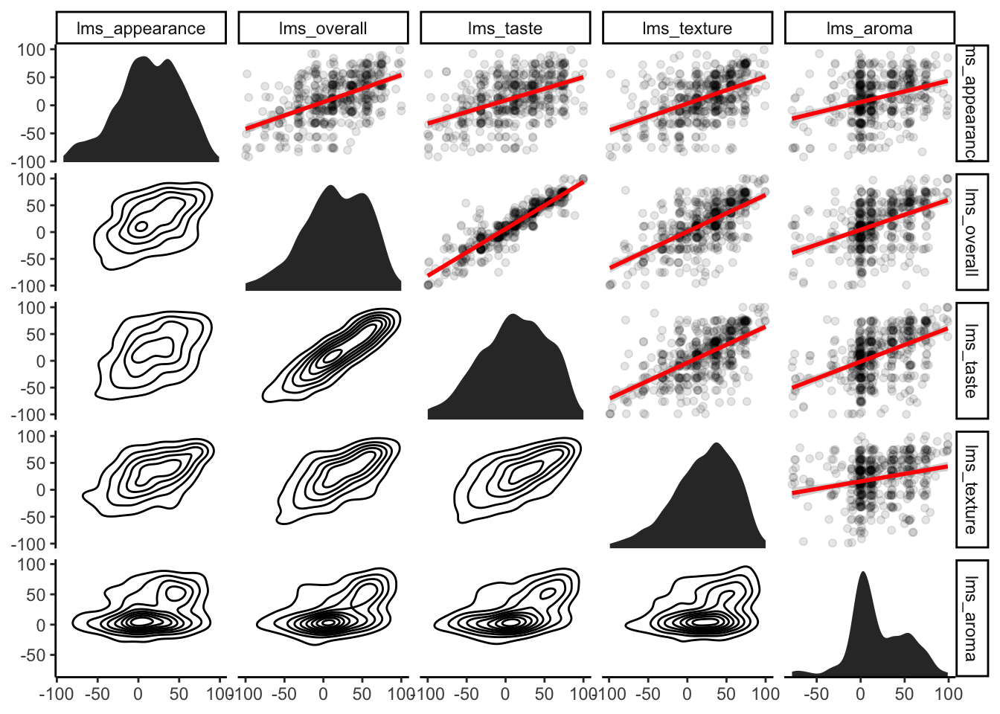
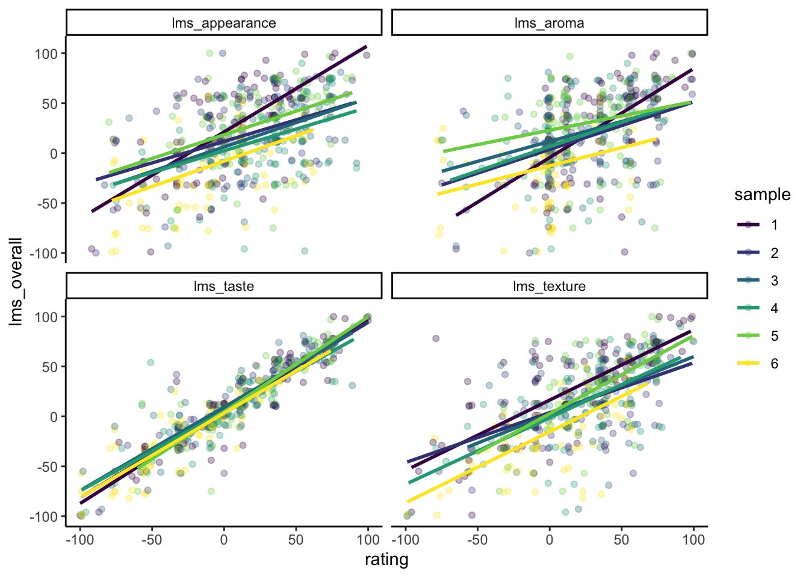

# Dealing with multiple factors


## Introduction

Last week, we learned the basics of the linear model: how we might try to predict a continuous outcome based on a single continuous (regression) or categorical (ANOVA) predictor. This week, we're going to tackle the much more common situation of having multiple (even *many*) possible predictors for a single continuous *or* categorical outcome.

We're going to switch up the order slightly and start by talking about **multi-way ANOVA**, which extends the basic model of ANOVA you have become somewhat familiar with to the case of multiple, categorical predictor variables. As you might guess, we are then going to talk about **multiple regression**, which extends regression to predicting a single, continuous outcome from multiple continuous *or* categorical predictors. Finally--and I am very excited and nervous to present this material--we're going to dip our toes into one of the more modern, increasingly popular methods for predicting a single continuous *or* categorical outcome from multiple (many) predictors: **categorization and regression tree (CART)** models. These are powerful approaches that are the beginning of what we often refer to as *machine learning*, but we will be exploring them in their most accessible form.

### Data example

This week, we are going to build on the berry data from last week. If you glanced at the paper, you might have seen that we didn't just collect liking data: we collected a whole bunch of other results about each berry. In order to keep our data manageable, we are going to work only with strawberry data and Labeled Affective Magnitude (LAM) outcomes, which gives us a much smaller dataset without all of the `NA`s we were dealing with last week.


```r
skim(berry_data)
```


Table: (\#tab:unnamed-chunk-1)Data summary

|                         |           |
|:------------------------|:----------|
|Name                     |berry_data |
|Number of rows           |510        |
|Number of columns        |24         |
|_______________________  |           |
|Column type frequency:   |           |
|character                |1          |
|factor                   |5          |
|numeric                  |18         |
|________________________ |           |
|Group variables          |None       |


**Variable type: character**

|skim_variable | n_missing| complete_rate| min| max| empty| n_unique| whitespace|
|:-------------|---------:|-------------:|---:|---:|-----:|--------:|----------:|
|berry         |         0|             1|  10|  10|     0|        1|          0|


**Variable type: factor**

|skim_variable    | n_missing| complete_rate|ordered | n_unique|top_counts                     |
|:----------------|---------:|-------------:|:-------|--------:|:------------------------------|
|subject          |         0|             1|FALSE   |       85|103: 6, 103: 6, 103: 6, 103: 6 |
|age              |         0|             1|TRUE    |        3|36-: 222, 21-: 144, 51-: 144   |
|gender           |         0|             1|FALSE   |        2|fem: 426, mal: 84              |
|sample           |         0|             1|FALSE   |        6|1: 85, 2: 85, 3: 85, 4: 85     |
|percent_shopping |         0|             1|TRUE    |        2|75-: 366, 50-: 144             |


**Variable type: numeric**

|skim_variable        | n_missing| complete_rate|  mean|    sd|   p0|    p25| p50|   p75| p100|hist  |
|:--------------------|---------:|-------------:|-----:|-----:|----:|------:|---:|-----:|----:|:-----|
|lms_appearance       |         0|             1| 13.23| 39.04|  -92| -10.00|  13| 40.00|   99|▂▃▇▇▂ |
|lms_overall          |         0|             1| 15.29| 41.98| -100| -10.00|  13| 51.00|  100|▁▃▇▇▃ |
|lms_taste            |         0|             1| 10.65| 43.99| -100| -21.75|  12| 42.75|  100|▂▅▇▇▃ |
|lms_texture          |         0|             1| 21.13| 39.81|  -99|  -7.75|  27| 54.00|  100|▁▂▆▇▃ |
|lms_aroma            |         0|             1| 19.47| 33.39|  -78|  -1.00|  12| 45.75|   99|▁▁▇▅▂ |
|cata_taste_floral    |         0|             1|  0.15|  0.36|    0|   0.00|   0|  0.00|    1|▇▁▁▁▂ |
|cata_taste_berry     |         0|             1|  0.46|  0.50|    0|   0.00|   0|  1.00|    1|▇▁▁▁▇ |
|cata_taste_grassy    |         0|             1|  0.31|  0.46|    0|   0.00|   0|  1.00|    1|▇▁▁▁▃ |
|cata_taste_fermented |         0|             1|  0.14|  0.35|    0|   0.00|   0|  0.00|    1|▇▁▁▁▁ |
|cata_taste_fruity    |         0|             1|  0.42|  0.49|    0|   0.00|   0|  1.00|    1|▇▁▁▁▆ |
|cata_taste_citrus    |         0|             1|  0.18|  0.38|    0|   0.00|   0|  0.00|    1|▇▁▁▁▂ |
|cata_taste_earthy    |         0|             1|  0.26|  0.44|    0|   0.00|   0|  1.00|    1|▇▁▁▁▃ |
|cata_taste_none      |         0|             1|  0.06|  0.24|    0|   0.00|   0|  0.00|    1|▇▁▁▁▁ |
|cata_taste_peachy    |         0|             1|  0.08|  0.27|    0|   0.00|   0|  0.00|    1|▇▁▁▁▁ |
|cata_taste_caramel   |         0|             1|  0.03|  0.17|    0|   0.00|   0|  0.00|    1|▇▁▁▁▁ |
|cata_taste_grapey    |         0|             1|  0.11|  0.32|    0|   0.00|   0|  0.00|    1|▇▁▁▁▁ |
|cata_taste_melon     |         0|             1|  0.10|  0.29|    0|   0.00|   0|  0.00|    1|▇▁▁▁▁ |
|cata_taste_cherry    |         0|             1|  0.11|  0.32|    0|   0.00|   0|  0.00|    1|▇▁▁▁▁ |

In this dataset, we now have not only `lms_overall`, but several other `lms_*` variables, which represent LAM liking for different *modalities*: taste, texture, etc. We also have a large number of `cata_*` variables, which represent "Check All That Apply" (CATA) questions asking subjects to indicate the presence or absence of a particular flavor. As before, our goal will be to understand overall liking, represented by the familiar `lms_overall`, but we will be using a new set of tools to do so.

## Multi-way ANOVA

When we first examined this dataset via **ANOVA**, we investigated the effect of the categorical predictor `berry` type on `us_overall` (recall this was our unstructured line-scale outcome).  This week we will be mostly focusing on `lms_overall` as the outcome variable, and we've limited ourselves to `berry == "strawberry"` because we wanted a consistent set of "CATA" attributes (and less missing data).  But we have added a lot of other predictor variables--both categorical (`factor`) and continuous (`numeric`) predictors.  

To motivate the idea of multi-way ANOVA, let's think about how we might see differences in overall *scale use* by subject.  This is a common issue in any kind of human-subjects research:


```r
berry_data %>%
  ggplot(aes(x = subject, y = lms_overall, color = sample)) + 
  geom_point(alpha = 0.5) +
  geom_hline(yintercept = 0, color = "black", linetype = "dashed") +
  theme_bw() +
  scale_color_viridis_d() + 
  theme(axis.text.x = element_text(angle = 90, size = 6))
```


We can see that some subjects tend to use the upper part of the scale, and that while we see subjects are less likely to use the negative side of the scale ("endpoint avoidance"), some subjects are more likely to use the full scale than others.  This indicates that the fact we have repeated measurements from each subject may introduce some nuisance patterns to our data.

Now, let's imagine we want to predict `lms_overall` based on how much shopping each subject does for their household.  This is slightly arbitrary, but we could imagine our thought process is: "Well, those who buy a lot of strawberries might have stronger opinions about strawberry flavor than those who do less."  We learned how to set up a 1-way ANOVA last week:


```r
# How do we set up a 1-way ANOVA for lms_overall dependent on percent_shopping
```

We can see that overall the effect is not significant (unsurprisingly), but perhaps the effect is obscured by the variation we noted in individual scale use by `subject`.  We can use a **multiway ANOVA** to investigate this possibility:


```r
berry_data %>%
  aov(lms_overall ~ percent_shopping * subject, data = .) %>%
  summary()
```

```
##                   Df Sum Sq Mean Sq F value   Pr(>F)    
## percent_shopping   1    142   142.2   0.090 0.763706    
## subject           83 229247  2762.0   1.758 0.000181 ***
## Residuals        425 667758  1571.2                     
## ---
## Signif. codes:  0 '***' 0.001 '**' 0.01 '*' 0.05 '.' 0.1 ' ' 1
```

Hmm, well unsurprisingly that's nothing either, although you can see that the effect-size estimate (*F*-statistic) for `percent_shopping` increased very slightly.

We use the same function, `aov()`, to build multi-way ANOVA models, and the only difference is that we will add a new set of tools to our `formula` interface:

-   `+` adds a **main effect** for a term to our formula
-   `<variable 1> * <variable 2>` interacts the two (or more) variables as well as adding all lower-level interactions and main effects
-   `<variable 1> : <variable 2>` adds **only** the interaction term between the two (or more) variables

The type of model we just fit is often called a **"blocked"** design: our `subject`s are formally declared to be experimental "blocks" (units), and we accounted for the effect of differences in these blocks by including them in our model.  This is why our estimate for the effect of `percent_shopping` increased slightly.  This is the simplest example of a **mixed-effects** model, which are the subject of extensive research and writing.  For more information on different kinds of ANOVA models, I highly recommend *Statistical methods for psychology* by David @howell2010.  While he does not write the textbook using R, [his personal webpage](https://www.uvm.edu/~statdhtx/StatPages/index.html) (charmingly antiquated looking) has a huge wealth of information and R scripts for a number of statistical topics, including resampling approaches to ANOVA.

You might note that we asked for the interaction (`percent_shopping * subject`) but we got no interaction effect in our model output.  What gives?  Well, `subject` is entirely nested within `percent_shopping`--if we know the `subject` variable we already know what `percent_shopping` they are responsible for.  Let's take a look at a model in which we predict `lms_overall` from some variables that do not have this relationship:


```r
berry_data %>%
  aov(lms_overall ~ percent_shopping * age * sample, data = .) %>%
  summary()
```

```
##                              Df Sum Sq Mean Sq F value   Pr(>F)    
## percent_shopping              1    142     142   0.090   0.7646    
## age                           2   8369    4184   2.643   0.0722 .  
## sample                        5 101078   20216  12.766 1.17e-11 ***
## percent_shopping:age          2   2959    1479   0.934   0.3936    
## percent_shopping:sample       5   7195    1439   0.909   0.4750    
## age:sample                   10  12143    1214   0.767   0.6609    
## percent_shopping:age:sample  10  14675    1467   0.927   0.5081    
## Residuals                   474 750586    1584                     
## ---
## Signif. codes:  0 '***' 0.001 '**' 0.01 '*' 0.05 '.' 0.1 ' ' 1
```

Here we see a number of interactions, none of them "signficant".  Again, this makes sense--honestly, it's unclear why `age`, `gender`, or `percent_shopping` would really predict overall liking for strawberry varieties.  But we do see the estimated interaction effects, like `percent_shopping:age`.

Let's try running one more multi-way ANOVA for variables we might actually expect to predict `lms_overall`: some of the CATA variables.  These are binary variables that indicate the presence or absence of a particular sensory attribute.  There are a lot of them.  We are going to just pick a couple and see if they predict overall liking:


```r
berry_data %>%
  aov(lms_overall ~ cata_taste_berry * cata_taste_fruity * cata_taste_fermented * sample, 
      data = .) %>%
  anova() %>% # the anova() function returns a data.frame, unlike summary()
  as_tibble(rownames = "effect") # purely for printing kind of nicely
```

```
## # A tibble: 16 × 6
##    effect                                   Df Sum S…¹ Mean …² F val…³  `Pr(>F)`
##    <chr>                                 <int>   <dbl>   <dbl>   <dbl>     <dbl>
##  1 cata_taste_berry                          1  2.98e5  2.98e5 300.     2.86e-52
##  2 cata_taste_fruity                         1  4.74e4  4.74e4  47.7    1.61e-11
##  3 cata_taste_fermented                      1  3.05e4  3.05e4  30.7    5.15e- 8
##  4 sample                                    5  3.07e4  6.14e3   6.18   1.47e- 5
##  5 cata_taste_berry:cata_taste_fruity        1  9.93e1  9.93e1   0.100  7.52e- 1
##  6 cata_taste_berry:cata_taste_fermented     1  2.57e3  2.57e3   2.58   1.09e- 1
##  7 cata_taste_fruity:cata_taste_ferment…     1  2.13e3  2.13e3   2.15   1.43e- 1
##  8 cata_taste_berry:sample                   5  4.26e3  8.52e2   0.857  5.10e- 1
##  9 cata_taste_fruity:sample                  5  4.43e3  8.86e2   0.892  4.86e- 1
## 10 cata_taste_fermented:sample               5  3.60e3  7.20e2   0.725  6.05e- 1
## 11 cata_taste_berry:cata_taste_fruity:c…     1  1.63e2  1.63e2   0.164  6.86e- 1
## 12 cata_taste_berry:cata_taste_fruity:s…     5  1.05e3  2.11e2   0.212  9.57e- 1
## 13 cata_taste_berry:cata_taste_fermente…     5  1.64e3  3.29e2   0.331  8.94e- 1
## 14 cata_taste_fruity:cata_taste_ferment…     4  1.12e3  2.81e2   0.283  8.89e- 1
## 15 cata_taste_berry:cata_taste_fruity:c…     3  6.89e3  2.30e3   2.31   7.54e- 2
## 16 Residuals                               465  4.62e5  9.94e2  NA     NA       
## # … with abbreviated variable names ¹​`Sum Sq`, ²​`Mean Sq`, ³​`F value`
```

Here we can see a lot of things (probably too many things, as we'll get to in a moment).  But I want to point out several aspects of this model that are of interest to us:

1. The **main effects** of the CATA variables are all significant, as is the `sample` variable: the data tell us that the different strawberry samples are liked differently, and that the presence or absence of these 3 CATA variables matters as well.
2. None of the interactions are very important.  This means that different CATA effects, for example, don't matter differently for overall liking for different samples.
3. Because we requested interactions among 4 variables, we get estimates of interactions up to 4-way interactions.  This is a lot of information, and probably an "overfit" model.

However, we picked 3 CATA variables at random.  There are 13 of these actually collected.  If even 4-way interactions are probably overfit, how can we possibly pick which of these to include in our model?  We will learn about a data-driven approach to this called a ["Partition Tree"](#tree) later today, but for now let's look at a classic approach: stepwise regression/ANOVA.

### Stepwise model fitting

Imagine we have a large number of predictor variables, and part of our analysis needs are deciding which to include in a model.  This is a common situation, as it corresponds to the general research question: "Which treatments actually matter?"

We can approach this question by letting our data drive the analysis.  We know about $R^2$, which is an estimate of how well our model fits the data.  There are *many* other [fit criteria](https://en.wikipedia.org/wiki/Goodness_of_fit).  What if we just add variables to our model if they make it fit the data better?  This is a reasonable (although very risky, it turns out!) approach that is quite common.  This is often called "stepwise model selection" or "fitting".


```r
# We first subset our data for ease of use to just the variables we will consider
berry_cata <- berry_data %>% select(lms_overall, sample, contains("cata"))

# Then we fit a model with no variables
intercept_only <- aov(lms_overall ~ 1, data = berry_cata)

# And we fit a model with ALL possible variables
all <- aov(lms_overall ~ .^2, data = berry_cata)

# Finally, we tell R to "step" between the no-variable model and the model with
# all the variables.  At each step, R will consider all possible variables to
# add to or subtract from the model, based on which one will most decrease a
# fit criterion called the AIC (don't worry about it right now).  This will 
# be repeated until the model can no longer be improved, at which point we have
# a final, data-driven model
stepwise <- step(intercept_only, direction = "both", scope = formula(all), trace = 0)
anova(stepwise) %>% as_tibble(rownames = "effect")
```

```
## # A tibble: 18 × 6
##    effect                                   Df Sum S…¹ Mean …² F val…³  `Pr(>F)`
##    <chr>                                 <int>   <dbl>   <dbl>   <dbl>     <dbl>
##  1 cata_taste_berry                          1 298464. 298464. 339.     9.44e-58
##  2 cata_taste_fruity                         1  47443.  47443.  53.9    9.15e-13
##  3 cata_taste_fermented                      1  30470.  30470.  34.6    7.59e- 9
##  4 sample                                    5  30699.   6140.   6.97   2.66e- 6
##  5 cata_taste_floral                         1  11900.  11900.  13.5    2.64e- 4
##  6 cata_taste_caramel                        1   8830.   8830.  10.0    1.64e- 3
##  7 cata_taste_earthy                         1   2848.   2848.   3.23   7.28e- 2
##  8 cata_taste_melon                          1   2803.   2803.   3.18   7.50e- 2
##  9 cata_taste_none                           1    694.    694.   0.788  3.75e- 1
## 10 cata_taste_berry:cata_taste_floral        1   4671.   4671.   5.30   2.17e- 2
## 11 cata_taste_berry:cata_taste_caramel       1   3576.   3576.   4.06   4.45e- 2
## 12 sample:cata_taste_earthy                  5  11938.   2388.   2.71   1.98e- 2
## 13 cata_taste_fermented:cata_taste_melon     1   5446.   5446.   6.18   1.32e- 2
## 14 cata_taste_berry:cata_taste_earthy        1   3069.   3069.   3.48   6.25e- 2
## 15 cata_taste_berry:cata_taste_fermented     1   3902.   3902.   4.43   3.58e- 2
## 16 cata_taste_fruity:cata_taste_none         1   2309.   2309.   2.62   1.06e- 1
## 17 cata_taste_floral:cata_taste_melon        1   1779.   1779.   2.02   1.56e- 1
## 18 Residuals                               484 426306.    881.  NA     NA       
## # … with abbreviated variable names ¹​`Sum Sq`, ²​`Mean Sq`, ³​`F value`
```

```r
# We can also see the actual effect on lms_overall of the selected variables
stepwise$coefficients %>% as_tibble(rownames = "effect")
```

```
## # A tibble: 26 × 2
##    effect                 value
##    <chr>                  <dbl>
##  1 (Intercept)           -3.02 
##  2 cata_taste_berry      38.5  
##  3 cata_taste_fruity     17.3  
##  4 cata_taste_fermented -28.0  
##  5 sample2              -10.7  
##  6 sample3               -1.70 
##  7 sample4               -7.15 
##  8 sample5                0.634
##  9 sample6              -24.3  
## 10 cata_taste_floral     23.6  
## # … with 16 more rows
## # ℹ Use `print(n = ...)` to see more rows
```

This kind of step-wise approach is very common, but it is also potentially problematic, as it finds a solution that fits the **data**, not the question.  Whether this model will predict future outcomes is unclear.  It is always a good idea when using these approaches to test the new model on unseen data, or to treat these approaches as *exploratory* rather than *explanatory* approaches: they are good for generating future, testable hypotheses, rather than giving a final answer or prediction.

Therefore, in our example, we might generate a hypothesis for further testing: "It is most important for strawberries to have 'berry', 'fruity', and *not* 'fermented' tastes for overall consumer acceptability."  We can then test this by obtaining berries known to have those qualities and testing whether, for example, more "berry"-like strawberries are indeed better liked.

### Plotting interaction effects

We really don't have much in the way of interaction effects in our ANOVA models, but let's look at how we might visualize those effects--this is one of the most effective ways to both understand and communicate about interacting variables in multi-way models.


```r
# First, we'll set up a summary table for our data: we want the mean lms_overall 
# for each berry sample for when cata_taste_fermented == 0 and == 1
example_interaction_data <- berry_data %>%
  group_by(sample, cata_taste_fermented) %>%
  summarize(mean_liking = mean(lms_overall),
            se_liking = sd(lms_overall)/sqrt(n()))
example_interaction_data  
```

```
## # A tibble: 12 × 4
## # Groups:   sample [6]
##    sample cata_taste_fermented mean_liking se_liking
##    <fct>                 <dbl>       <dbl>     <dbl>
##  1 1                         0       36.4       4.88
##  2 1                         1      -17.5      14.1 
##  3 2                         0       17.6       3.77
##  4 2                         1      -26        13.8 
##  5 3                         0       20.7       4.30
##  6 3                         1       20.8      15.5 
##  7 4                         0       14.9       4.23
##  8 4                         1      -12.1      14.7 
##  9 5                         0       37.2       3.74
## 10 5                         1       -7.46     13.6 
## 11 6                         0       -5.69      4.37
## 12 6                         1      -35.7      10.4
```

```r
# Now we can use this to draw a plot illustrating the INTERACTION of sample and 
# cata_taste_fermented on lms_overall
p <- example_interaction_data %>%
  ggplot(aes(x = cata_taste_fermented, y = mean_liking, color = sample)) + 
  geom_point() + 
  geom_errorbar(aes(ymin = mean_liking - 2 * se_liking, 
                    ymax = mean_liking + 2 * se_liking),
                linetype = "dashed", width = 0.1) +
  geom_line() + 
  theme_classic() + 
  scale_color_viridis_d()

p
```


We can see that there may in fact be some kind of interactive effect, in that while overall it seems like presence of a "fermented" flavor decreases liking for most samples, it doesn't have much of an effect on Sample 3.  But we don't see this as an overall effect in our model, and our uncertainty (error) bars indicate why this might be: it seems like there is such high variability in that sample's `lms_overall` ratings that we can't say for sure whether that mean estimate is very reliable--I would go so far as to say we'd want do some further exploration of that sample itself in order to understand why it is so much more variable than the other samples.


```r
# This is an interactive plot from the plotly package, which you may enjoy 
# fooling around with as you move forward.  It makes seeing plot elements a
# little easier in complex plots.

# It is possible to render ggplots interactive in one step
# (mostly) by saving them and using the ggplotly() function.
plotly::ggplotly(p)
```

```{=html}
<div id="htmlwidget-c1594ff65aadc444db21" style="width:672px;height:480px;" class="plotly html-widget"></div>
<script type="application/json" data-for="htmlwidget-c1594ff65aadc444db21">{"x":{"data":[{"x":[0,1],"y":[36.4166666666667,-17.5384615384615],"text":["cata_taste_fermented: 0<br />mean_liking:  36.416667<br />sample: 1","cata_taste_fermented: 1<br />mean_liking: -17.538462<br />sample: 1"],"type":"scatter","mode":"markers+lines","marker":{"autocolorscale":false,"color":"rgba(68,1,84,1)","opacity":1,"size":5.66929133858268,"symbol":"circle","line":{"width":1.88976377952756,"color":"rgba(68,1,84,1)"}},"hoveron":"points","name":"1","legendgroup":"1","showlegend":true,"xaxis":"x","yaxis":"y","hoverinfo":"text","line":{"width":1.88976377952756,"color":"rgba(68,1,84,1)","dash":"solid"},"frame":null},{"x":[0,1],"y":[17.56,-26],"text":["cata_taste_fermented: 0<br />mean_liking:  17.560000<br />sample: 2","cata_taste_fermented: 1<br />mean_liking: -26.000000<br />sample: 2"],"type":"scatter","mode":"markers+lines","marker":{"autocolorscale":false,"color":"rgba(65,68,135,1)","opacity":1,"size":5.66929133858268,"symbol":"circle","line":{"width":1.88976377952756,"color":"rgba(65,68,135,1)"}},"hoveron":"points","name":"2","legendgroup":"2","showlegend":true,"xaxis":"x","yaxis":"y","hoverinfo":"text","line":{"width":1.88976377952756,"color":"rgba(65,68,135,1)","dash":"solid"},"frame":null},{"x":[0,1],"y":[20.6973684210526,20.7777777777778],"text":["cata_taste_fermented: 0<br />mean_liking:  20.697368<br />sample: 3","cata_taste_fermented: 1<br />mean_liking:  20.777778<br />sample: 3"],"type":"scatter","mode":"markers+lines","marker":{"autocolorscale":false,"color":"rgba(42,120,142,1)","opacity":1,"size":5.66929133858268,"symbol":"circle","line":{"width":1.88976377952756,"color":"rgba(42,120,142,1)"}},"hoveron":"points","name":"3","legendgroup":"3","showlegend":true,"xaxis":"x","yaxis":"y","hoverinfo":"text","line":{"width":1.88976377952756,"color":"rgba(42,120,142,1)","dash":"solid"},"frame":null},{"x":[0,1],"y":[14.9473684210526,-12.1111111111111],"text":["cata_taste_fermented: 0<br />mean_liking:  14.947368<br />sample: 4","cata_taste_fermented: 1<br />mean_liking: -12.111111<br />sample: 4"],"type":"scatter","mode":"markers+lines","marker":{"autocolorscale":false,"color":"rgba(34,168,132,1)","opacity":1,"size":5.66929133858268,"symbol":"circle","line":{"width":1.88976377952756,"color":"rgba(34,168,132,1)"}},"hoveron":"points","name":"4","legendgroup":"4","showlegend":true,"xaxis":"x","yaxis":"y","hoverinfo":"text","line":{"width":1.88976377952756,"color":"rgba(34,168,132,1)","dash":"solid"},"frame":null},{"x":[0,1],"y":[37.2361111111111,-7.46153846153846],"text":["cata_taste_fermented: 0<br />mean_liking:  37.236111<br />sample: 5","cata_taste_fermented: 1<br />mean_liking:  -7.461538<br />sample: 5"],"type":"scatter","mode":"markers+lines","marker":{"autocolorscale":false,"color":"rgba(122,209,81,1)","opacity":1,"size":5.66929133858268,"symbol":"circle","line":{"width":1.88976377952756,"color":"rgba(122,209,81,1)"}},"hoveron":"points","name":"5","legendgroup":"5","showlegend":true,"xaxis":"x","yaxis":"y","hoverinfo":"text","line":{"width":1.88976377952756,"color":"rgba(122,209,81,1)","dash":"solid"},"frame":null},{"x":[0,1],"y":[-5.6865671641791,-35.7222222222222],"text":["cata_taste_fermented: 0<br />mean_liking:  -5.686567<br />sample: 6","cata_taste_fermented: 1<br />mean_liking: -35.722222<br />sample: 6"],"type":"scatter","mode":"markers+lines","marker":{"autocolorscale":false,"color":"rgba(253,231,37,1)","opacity":1,"size":5.66929133858268,"symbol":"circle","line":{"width":1.88976377952756,"color":"rgba(253,231,37,1)"}},"hoveron":"points","name":"6","legendgroup":"6","showlegend":true,"xaxis":"x","yaxis":"y","hoverinfo":"text","line":{"width":1.88976377952756,"color":"rgba(253,231,37,1)","dash":"solid"},"frame":null},{"x":[0,1],"y":[36.4166666666667,-17.5384615384615],"text":["cata_taste_fermented: 0<br />mean_liking:  36.416667<br />sample: 1<br />mean_liking - 2 * se_liking:  26.647600<br />mean_liking + 2 * se_liking:  46.185733","cata_taste_fermented: 1<br />mean_liking: -17.538462<br />sample: 1<br />mean_liking - 2 * se_liking: -45.826917<br />mean_liking + 2 * se_liking:  10.749993"],"type":"scatter","mode":"lines","opacity":1,"line":{"color":"transparent"},"error_y":{"array":[9.76906666661541,28.2884550018295],"arrayminus":[9.76906666661541,28.2884550018295],"type":"data","width":13.8842975206612,"symmetric":false,"color":"rgba(68,1,84,1)"},"name":"1","legendgroup":"1","showlegend":false,"xaxis":"x","yaxis":"y","hoverinfo":"text","frame":null},{"x":[0,1],"y":[17.56,-26],"text":["cata_taste_fermented: 0<br />mean_liking:  17.560000<br />sample: 2<br />mean_liking - 2 * se_liking:  10.021965<br />mean_liking + 2 * se_liking:  25.098035","cata_taste_fermented: 1<br />mean_liking: -26.000000<br />sample: 2<br />mean_liking - 2 * se_liking: -53.587437<br />mean_liking + 2 * se_liking:   1.587437"],"type":"scatter","mode":"lines","opacity":1,"line":{"color":"transparent"},"error_y":{"array":[7.53803472846653,27.5874367541942],"arrayminus":[7.53803472846653,27.5874367541942],"type":"data","width":13.8842975206612,"symmetric":false,"color":"rgba(65,68,135,1)"},"name":"2","legendgroup":"2","showlegend":false,"xaxis":"x","yaxis":"y","hoverinfo":"text","frame":null},{"x":[0,1],"y":[20.6973684210526,20.7777777777778],"text":["cata_taste_fermented: 0<br />mean_liking:  20.697368<br />sample: 3<br />mean_liking - 2 * se_liking:  12.105898<br />mean_liking + 2 * se_liking:  29.288839","cata_taste_fermented: 1<br />mean_liking:  20.777778<br />sample: 3<br />mean_liking - 2 * se_liking: -10.302366<br />mean_liking + 2 * se_liking:  51.857921"],"type":"scatter","mode":"lines","opacity":1,"line":{"color":"transparent"},"error_y":{"array":[8.59147024869227,31.0801433175907],"arrayminus":[8.59147024869227,31.0801433175907],"type":"data","width":13.8842975206612,"symmetric":false,"color":"rgba(42,120,142,1)"},"name":"3","legendgroup":"3","showlegend":false,"xaxis":"x","yaxis":"y","hoverinfo":"text","frame":null},{"x":[0,1],"y":[14.9473684210526,-12.1111111111111],"text":["cata_taste_fermented: 0<br />mean_liking:  14.947368<br />sample: 4<br />mean_liking - 2 * se_liking:   6.496653<br />mean_liking + 2 * se_liking:  23.398084","cata_taste_fermented: 1<br />mean_liking: -12.111111<br />sample: 4<br />mean_liking - 2 * se_liking: -41.598292<br />mean_liking + 2 * se_liking:  17.376070"],"type":"scatter","mode":"lines","opacity":1,"line":{"color":"transparent"},"error_y":{"array":[8.45071530134223,29.4871807258764],"arrayminus":[8.45071530134224,29.4871807258764],"type":"data","width":13.8842975206612,"symmetric":false,"color":"rgba(34,168,132,1)"},"name":"4","legendgroup":"4","showlegend":false,"xaxis":"x","yaxis":"y","hoverinfo":"text","frame":null},{"x":[0,1],"y":[37.2361111111111,-7.46153846153846],"text":["cata_taste_fermented: 0<br />mean_liking:  37.236111<br />sample: 5<br />mean_liking - 2 * se_liking:  29.761638<br />mean_liking + 2 * se_liking:  44.710584","cata_taste_fermented: 1<br />mean_liking:  -7.461538<br />sample: 5<br />mean_liking - 2 * se_liking: -34.611280<br />mean_liking + 2 * se_liking:  19.688203"],"type":"scatter","mode":"lines","opacity":1,"line":{"color":"transparent"},"error_y":{"array":[7.47447330991625,27.149741826808],"arrayminus":[7.47447330991625,27.149741826808],"type":"data","width":13.8842975206612,"symmetric":false,"color":"rgba(122,209,81,1)"},"name":"5","legendgroup":"5","showlegend":false,"xaxis":"x","yaxis":"y","hoverinfo":"text","frame":null},{"x":[0,1],"y":[-5.6865671641791,-35.7222222222222],"text":["cata_taste_fermented: 0<br />mean_liking:  -5.686567<br />sample: 6<br />mean_liking - 2 * se_liking: -14.418590<br />mean_liking + 2 * se_liking:   3.045456","cata_taste_fermented: 1<br />mean_liking: -35.722222<br />sample: 6<br />mean_liking - 2 * se_liking: -56.495386<br />mean_liking + 2 * se_liking: -14.949059"],"type":"scatter","mode":"lines","opacity":1,"line":{"color":"transparent"},"error_y":{"array":[8.73202322942875,20.7731636552986],"arrayminus":[8.73202322942875,20.7731636552986],"type":"data","width":13.8842975206612,"symmetric":false,"color":"rgba(253,231,37,1)"},"name":"6","legendgroup":"6","showlegend":false,"xaxis":"x","yaxis":"y","hoverinfo":"text","frame":null}],"layout":{"margin":{"t":26.2283105022831,"r":7.30593607305936,"b":40.1826484018265,"l":43.1050228310502},"plot_bgcolor":"rgba(255,255,255,1)","paper_bgcolor":"rgba(255,255,255,1)","font":{"color":"rgba(0,0,0,1)","family":"","size":14.6118721461187},"xaxis":{"domain":[0,1],"automargin":true,"type":"linear","autorange":false,"range":[-0.105,1.105],"tickmode":"array","ticktext":["0.00","0.25","0.50","0.75","1.00"],"tickvals":[0,0.25,0.5,0.75,1],"categoryorder":"array","categoryarray":["0.00","0.25","0.50","0.75","1.00"],"nticks":null,"ticks":"outside","tickcolor":"rgba(51,51,51,1)","ticklen":3.65296803652968,"tickwidth":0.66417600664176,"showticklabels":true,"tickfont":{"color":"rgba(77,77,77,1)","family":"","size":11.689497716895},"tickangle":-0,"showline":true,"linecolor":"rgba(0,0,0,1)","linewidth":0.66417600664176,"showgrid":false,"gridcolor":null,"gridwidth":0,"zeroline":false,"anchor":"y","title":{"text":"cata_taste_fermented","font":{"color":"rgba(0,0,0,1)","family":"","size":14.6118721461187}},"hoverformat":".2f"},"yaxis":{"domain":[0,1],"automargin":true,"type":"linear","autorange":false,"range":[-61.9130512261653,57.2755864440129],"tickmode":"array","ticktext":["-60","-30","0","30"],"tickvals":[-60,-30,0,30],"categoryorder":"array","categoryarray":["-60","-30","0","30"],"nticks":null,"ticks":"outside","tickcolor":"rgba(51,51,51,1)","ticklen":3.65296803652968,"tickwidth":0.66417600664176,"showticklabels":true,"tickfont":{"color":"rgba(77,77,77,1)","family":"","size":11.689497716895},"tickangle":-0,"showline":true,"linecolor":"rgba(0,0,0,1)","linewidth":0.66417600664176,"showgrid":false,"gridcolor":null,"gridwidth":0,"zeroline":false,"anchor":"x","title":{"text":"mean_liking","font":{"color":"rgba(0,0,0,1)","family":"","size":14.6118721461187}},"hoverformat":".2f"},"shapes":[{"type":"rect","fillcolor":null,"line":{"color":null,"width":0,"linetype":[]},"yref":"paper","xref":"paper","x0":0,"x1":1,"y0":0,"y1":1}],"showlegend":true,"legend":{"bgcolor":"rgba(255,255,255,1)","bordercolor":"transparent","borderwidth":1.88976377952756,"font":{"color":"rgba(0,0,0,1)","family":"","size":11.689497716895},"title":{"text":"sample","font":{"color":"rgba(0,0,0,1)","family":"","size":14.6118721461187}}},"hovermode":"closest","barmode":"relative"},"config":{"doubleClick":"reset","modeBarButtonsToAdd":["hoverclosest","hovercompare"],"showSendToCloud":false},"source":"A","attrs":{"9beba0faeb1":{"x":{},"y":{},"colour":{},"type":"scatter"},"9bebb95eba0":{"x":{},"y":{},"colour":{},"ymin":{},"ymax":{}},"9beb1fa05b51":{"x":{},"y":{},"colour":{}}},"cur_data":"9beba0faeb1","visdat":{"9beba0faeb1":["function (y) ","x"],"9bebb95eba0":["function (y) ","x"],"9beb1fa05b51":["function (y) ","x"]},"highlight":{"on":"plotly_click","persistent":false,"dynamic":false,"selectize":false,"opacityDim":0.2,"selected":{"opacity":1},"debounce":0},"shinyEvents":["plotly_hover","plotly_click","plotly_selected","plotly_relayout","plotly_brushed","plotly_brushing","plotly_clickannotation","plotly_doubleclick","plotly_deselect","plotly_afterplot","plotly_sunburstclick"],"base_url":"https://plot.ly"},"evals":[],"jsHooks":[]}</script>
```

## Multiple regression

So far we have focused our thinking on multiple, categorical predictors: variables that can take one of a set of *discrete* values.  This is advantageous for learning about interactions, because it is much easier to visualize the interaction of categorical variables through interactions like those above.  

But what if we have several continuous predictors?  Just as simple regression and ANOVA are analogues of each other, multiple regression is the equivalent of multi-way ANOVA when one or more of the predictors is continuous instead of categorical (when we have a mix of continuous and categorical variables we tend to deal with them through either multiple regression or with something called ANCOVA: Analysis of Co-Variance).

**Multiple regression** involves predicting the value of an outcome from many continuous or categorical predictors. Multiple regression is also a topic that deserves (and is taught as) a course-length topic in its own right (see for example [STAT 6634](https://secure.graduateschool.vt.edu/graduate_catalog/program.htm?programID=002d14431ce38e83011ce38e956c0032&nocache=1646319580643)). I will be *barely* scratching the surface of multiple regression here--as always, I am going to attempt to show you how to implement a method in R.

We can frame our objective in multiple regression as predicting the value of a single outcome $y$ from a set of predictors $x_1, x_2, ..., x_n$.

<center>

$\hat{y}_i = \beta_1 * x_{1i} + \beta_2 * x_{2i} + ... + \beta_n * x_{ni} + \alpha$

</center>

The tasks in multiple regression are:

1.  To develop a model that predicts $y$
2.  To identify variables $x_1, x_2, ...$ etc that are actually important in predicting $y$

The first task is usually evaluated in the same way as we did in simple regression--by investigating goodness-of-fit statistics like $R^2$. This is often interpreted as overall quality of the model.

The second task is often considered more important in research applications: we want to understand which $x$-variables *significantly* predict $y$. We usually assess this by investigating *statistical significance* of the $\beta$-coefficients for each predictor.

Finally, a third and important task in multiple regression is identifying **interacting** predictor variables. In my usual, imprecise interpretation, an interactive effect can be stated as "the effect of $x_1$ is different at different values of $x_2$"--this means that we have a *multiplicative effect* in our model.

The model given above omits interactive terms, which would look like:

<center>

$\hat{y}_i = \beta_1 * x_{1i} + \beta_2 * x_{2i} + ... + \beta_n * x_{ni} + \beta_{1*2} * x_{1i} * x_{2i} + ... + \alpha$

</center>

You can see why I left them out!

### Fitting a multiple regression to our model

It's been long enough--let's review what our dataset looks like:


```r
berry_data %>%
  glimpse
```

```
## Rows: 510
## Columns: 24
## $ subject              <fct> 1033784, 1033784, 1033784, 1033784, 1033784, 1033…
## $ age                  <ord> 51-65, 51-65, 51-65, 51-65, 51-65, 51-65, 51-65, …
## $ gender               <fct> female, female, female, female, female, female, f…
## $ berry                <chr> "strawberry", "strawberry", "strawberry", "strawb…
## $ sample               <fct> 4, 1, 2, 6, 3, 5, 4, 1, 2, 6, 3, 5, 4, 1, 2, 6, 3…
## $ percent_shopping     <ord> 75-100%, 75-100%, 75-100%, 75-100%, 75-100%, 75-1…
## $ lms_appearance       <dbl> 9, 68, 11, 47, 71, 68, 73, 13, -11, -13, 75, 37, …
## $ lms_overall          <dbl> -19, 74, 26, -28, 51, 51, 57, -10, 12, 36, 53, 39…
## $ lms_taste            <dbl> -3, 77, 27, -28, 51, 48, 39, -10, 14, 25, 57, 34,…
## $ lms_texture          <dbl> 20, 72, 27, 30, 68, 63, 72, 37, 53, 36, 77, 39, 1…
## $ lms_aroma            <dbl> -1, 81, 76, 57, 72, 21, -29, 11, -1, 1, 58, -11, …
## $ cata_taste_floral    <dbl> 0, 1, 0, 0, 1, 0, 0, 0, 0, 0, 0, 0, 0, 0, 0, 1, 0…
## $ cata_taste_berry     <dbl> 0, 1, 1, 0, 1, 1, 0, 0, 0, 0, 0, 0, 1, 1, 1, 0, 0…
## $ cata_taste_grassy    <dbl> 0, 0, 0, 1, 0, 0, 0, 0, 0, 0, 0, 0, 0, 0, 0, 1, 1…
## $ cata_taste_fermented <dbl> 0, 0, 0, 0, 0, 0, 0, 0, 0, 0, 0, 0, 0, 0, 0, 0, 0…
## $ cata_taste_fruity    <dbl> 0, 1, 1, 0, 1, 1, 0, 1, 0, 0, 1, 0, 0, 1, 1, 0, 0…
## $ cata_taste_citrus    <dbl> 0, 0, 0, 0, 0, 0, 0, 0, 0, 0, 0, 0, 0, 0, 0, 0, 0…
## $ cata_taste_earthy    <dbl> 0, 0, 0, 1, 0, 0, 0, 0, 0, 0, 0, 0, 0, 0, 0, 1, 1…
## $ cata_taste_none      <dbl> 1, 0, 0, 0, 0, 0, 1, 0, 1, 1, 0, 1, 0, 0, 0, 0, 0…
## $ cata_taste_peachy    <dbl> 0, 0, 0, 0, 0, 0, 0, 0, 0, 0, 0, 0, 1, 0, 0, 0, 0…
## $ cata_taste_caramel   <dbl> 0, 0, 0, 0, 0, 0, 0, 0, 0, 0, 0, 0, 0, 0, 0, 0, 0…
## $ cata_taste_grapey    <dbl> 0, 0, 0, 0, 0, 0, 0, 0, 0, 0, 0, 0, 0, 0, 0, 0, 0…
## $ cata_taste_melon     <dbl> 0, 0, 0, 0, 0, 0, 0, 0, 0, 0, 0, 0, 0, 0, 0, 0, 0…
## $ cata_taste_cherry    <dbl> 0, 0, 0, 0, 0, 0, 0, 0, 0, 0, 0, 0, 1, 1, 1, 0, 0…
```

While we have no real reason to do so, let's build a model that predicts `lms_overall` from `lms_appearance`, `lms_taste`, `lms_aroma`, and `lms_texture`. We can frame the research question as: "In this dataset, can we understand overall liking as an interaction of multiple modalities?"

So we would write the model we asked for in words above as: `lms_overall ~ lms_taste + lms_appearance + lms_aroma + lms_texture` (notice we are not adding interactions yet).


```r
berry_mlm <- berry_data %>%
  lm(lms_overall ~ lms_taste + lms_appearance + lms_aroma + lms_texture, data = .)

summary(berry_mlm)
```

```
## 
## Call:
## lm(formula = lms_overall ~ lms_taste + lms_appearance + lms_aroma + 
##     lms_texture, data = .)
## 
## Residuals:
##     Min      1Q  Median      3Q     Max 
## -75.936  -8.169  -0.751   8.788  88.033 
## 
## Coefficients:
##                Estimate Std. Error t value Pr(>|t|)    
## (Intercept)    3.153003   0.883068   3.571  0.00039 ***
## lms_taste      0.769195   0.022335  34.439  < 2e-16 ***
## lms_appearance 0.087427   0.021291   4.106 4.69e-05 ***
## lms_aroma      0.008425   0.024036   0.350  0.72612    
## lms_texture    0.124233   0.023159   5.364 1.24e-07 ***
## ---
## Signif. codes:  0 '***' 0.001 '**' 0.01 '*' 0.05 '.' 0.1 ' ' 1
## 
## Residual standard error: 15.66 on 505 degrees of freedom
## Multiple R-squared:  0.8619,	Adjusted R-squared:  0.8608 
## F-statistic:   788 on 4 and 505 DF,  p-value: < 2.2e-16
```

This model explores the relationships we can visualize in various ways shown below:


```r
library(ggforce)
berry_data %>%
  ggplot(aes(x = .panel_x, y = .panel_y)) +
  geom_point(alpha = 0.1) +
  geom_smooth(method = lm, color = "red") +
  geom_density_2d(color = "black") +
  geom_autodensity() +
  facet_matrix(rows = vars(contains("lms")), 
               cols = vars(contains("lms")), 
               layer.lower = 3, 
               layer.upper = c(1, 2), 
               layer.diag = 4) +
  theme_classic()
```



Just as in simple regression, we can use accessor functions to get coefficients, predicted values, etc.


```r
coefficients(berry_mlm) %>% as_tibble(rownames = "effect")
```

```
## # A tibble: 5 × 2
##   effect           value
##   <chr>            <dbl>
## 1 (Intercept)    3.15   
## 2 lms_taste      0.769  
## 3 lms_appearance 0.0874 
## 4 lms_aroma      0.00842
## 5 lms_texture    0.124
```

```r
# just looking at the first few predictions
head(predict(berry_mlm)) 
```

```
##          1          2          3          4          5          6 
##   4.108488  77.953222  28.877523 -10.068231  57.643668  54.022987
```

```r
# the actual values of lms_overall
berry_data %>% head() %>% select(contains("lms")) %>% relocate(lms_overall)
```

```
## # A tibble: 6 × 5
##   lms_overall lms_appearance lms_taste lms_texture lms_aroma
##         <dbl>          <dbl>     <dbl>       <dbl>     <dbl>
## 1         -19              9        -3          20        -1
## 2          74             68        77          72        81
## 3          26             11        27          27        76
## 4         -28             47       -28          30        57
## 5          51             71        51          68        72
## 6          51             68        48          63        21
```

Now, we will take a look at what happens when we allow interactions in the model:


```r
berry_mlm_interactions <- berry_data %>%
  lm(lms_overall ~ lms_taste * lms_appearance * lms_aroma * lms_texture, data = .)
anova(berry_mlm_interactions) %>% as_tibble(rownames = "effect")
```

```
## # A tibble: 16 × 6
##    effect                                 Df Sum S…¹ Mean …² F valu…³   `Pr(>F)`
##    <chr>                               <int>   <dbl>   <dbl>    <dbl>      <dbl>
##  1 lms_taste                               1  7.57e5  7.57e5  3.13e+3  5.82e-216
##  2 lms_appearance                          1  8.96e3  8.96e3  3.71e+1  2.30e-  9
##  3 lms_aroma                               1  2.42e1  2.42e1  1.00e-1  7.52e-  1
##  4 lms_texture                             1  7.06e3  7.06e3  2.92e+1  1.02e-  7
##  5 lms_taste:lms_appearance                1  7.21e1  7.21e1  2.98e-1  5.85e-  1
##  6 lms_taste:lms_aroma                     1  3.85e2  3.85e2  1.59e+0  2.07e-  1
##  7 lms_appearance:lms_aroma                1  6.57e2  6.57e2  2.72e+0  9.99e-  2
##  8 lms_taste:lms_texture                   1  2.39e2  2.39e2  9.89e-1  3.20e-  1
##  9 lms_appearance:lms_texture              1  7.95e0  7.95e0  3.29e-2  8.56e-  1
## 10 lms_aroma:lms_texture                   1  4.04e2  4.04e2  1.67e+0  1.97e-  1
## 11 lms_taste:lms_appearance:lms_aroma      1  5.38e2  5.38e2  2.23e+0  1.36e-  1
## 12 lms_taste:lms_appearance:lms_textu…     1  4.01e2  4.01e2  1.66e+0  1.99e-  1
## 13 lms_taste:lms_aroma:lms_texture         1  9.52e1  9.52e1  3.94e-1  5.31e-  1
## 14 lms_appearance:lms_aroma:lms_textu…     1  1.09e3  1.09e3  4.49e+0  3.46e-  2
## 15 lms_taste:lms_appearance:lms_aroma…     1  5.69e2  5.69e2  2.35e+0  1.26e-  1
## 16 Residuals                             494  1.19e5  2.42e2 NA       NA        
## # … with abbreviated variable names ¹​`Sum Sq`, ²​`Mean Sq`, ³​`F value`
```

We have some significant higher-order interactions, but again we are ending up estimating a lot of new effects to gain very little in predictive power.  We can compare the $R^2$ for both models:


```r
map(list(berry_mlm, berry_mlm_interactions), ~summary(.) %>% .$r.squared)
```

```
## [[1]]
## [1] 0.8619019
## 
## [[2]]
## [1] 0.8668665
```

We are adding a lot of "cruft" to our models without getting much in return.

### A second example of stepwise model fitting

We can use a stepwise model fitting approach on regression just as easily as we can on ANOVA.  To do so, we will follow the same steps:

1. Set up a "null" model that just estimates the mean of the outcome variable (`lms_overall`)
2. Set up a "full" model that includes all possible predictors for the outcome variable
3. Use the `step()` function to fit successive models until the best fit *to the data* is achieved


```r
# Trim our data for convenience
berry_lms <- select(berry_data, contains('lms'))

# Set up our null model
null_model <- lm(lms_overall ~ 1, data = berry_lms)
# Set up the full model, including all possible-level interactions
full_model <- lm(lms_overall ~ .^4, data = berry_lms)
# Use step() to try all possible models
selected_model <- step(null_model, scope = formula(full_model), direction = "both", trace = 0)
summary(selected_model)
```

```
## 
## Call:
## lm(formula = lms_overall ~ lms_taste + lms_texture + lms_appearance, 
##     data = berry_lms)
## 
## Residuals:
##     Min      1Q  Median      3Q     Max 
## -75.461  -8.219  -0.825   8.963  87.996 
## 
## Coefficients:
##                Estimate Std. Error t value Pr(>|t|)    
## (Intercept)     3.28919    0.79231   4.151 3.88e-05 ***
## lms_taste       0.77229    0.02050  37.682  < 2e-16 ***
## lms_texture     0.12323    0.02296   5.367 1.22e-07 ***
## lms_appearance  0.08864    0.02099   4.223 2.86e-05 ***
## ---
## Signif. codes:  0 '***' 0.001 '**' 0.01 '*' 0.05 '.' 0.1 ' ' 1
## 
## Residual standard error: 15.65 on 506 degrees of freedom
## Multiple R-squared:  0.8619,	Adjusted R-squared:  0.861 
## F-statistic:  1052 on 3 and 506 DF,  p-value: < 2.2e-16
```

```r
selected_model$coefficients %>% as_tibble(rownames = "effect")
```

```
## # A tibble: 4 × 2
##   effect          value
##   <chr>           <dbl>
## 1 (Intercept)    3.29  
## 2 lms_taste      0.772 
## 3 lms_texture    0.123 
## 4 lms_appearance 0.0886
```

In this case the model selection process dismisses all the higher-level interactions, as well as the main effect of `lms_aroma`.  

### Combining continuous and categorical data

In `berry_data` we have both categorical and continuous predictors.  Wouldn't it be nice if we could combine them?  In particular, we know that `sample` is an important variable, as different samples are definitely differently liked.   Let's see what happens when we include this in our multiple linear regression:


```r
berry_mlm_cat <- berry_data %>%
# We will restrict our interactions to "2nd-order" (2-element) interactions
# Because we think 3rd- and 4th-order are unlikely to be important and they are 
# A huge mess in the output
  lm(lms_overall ~ (sample + lms_appearance + lms_taste + lms_texture + lms_aroma)^2, 
     data = .)
anova(berry_mlm_cat) %>% as_tibble(rownames = "effect")
```

```
## # A tibble: 16 × 6
##    effect                        Df   `Sum Sq`  `Mean Sq`  `F value`   `Pr(>F)`
##    <chr>                      <int>      <dbl>      <dbl>      <dbl>      <dbl>
##  1 sample                         5 101078.     20216.      84.3      2.83e- 63
##  2 lms_appearance                 1 194144.    194144.     810.       1.25e-104
##  3 lms_taste                      1 472036.    472036.    1969.       6.58e-171
##  4 lms_texture                    1   7214.      7214.      30.1      6.70e-  8
##  5 lms_aroma                      1      4.24       4.24     0.0177   8.94e-  1
##  6 sample:lms_appearance          5    852.       170.       0.711    6.15e-  1
##  7 sample:lms_taste               5   1504.       301.       1.26     2.82e-  1
##  8 sample:lms_texture             5   1681.       336.       1.40     2.22e-  1
##  9 sample:lms_aroma               5   4280.       856.       3.57     3.52e-  3
## 10 lms_appearance:lms_taste       1      2.19       2.19     0.00912  9.24e-  1
## 11 lms_appearance:lms_texture     1      0.549      0.549    0.00229  9.62e-  1
## 12 lms_appearance:lms_aroma       1    291.       291.       1.21     2.71e-  1
## 13 lms_taste:lms_texture          1     20.6       20.6      0.0858   7.70e-  1
## 14 lms_taste:lms_aroma            1    412.       412.       1.72     1.91e-  1
## 15 lms_texture:lms_aroma          1     11.7       11.7      0.0489   8.25e-  1
## 16 Residuals                    474 113615.       240.      NA       NA
```

```r
coefficients(berry_mlm_cat) %>% as_tibble(rownames = "effect")
```

```
## # A tibble: 36 × 2
##    effect           value
##    <chr>            <dbl>
##  1 (Intercept)     2.86  
##  2 sample2         3.02  
##  3 sample3         1.16  
##  4 sample4        -3.95  
##  5 sample5         2.00  
##  6 sample6        -2.12  
##  7 lms_appearance  0.209 
##  8 lms_taste       0.724 
##  9 lms_texture     0.0668
## 10 lms_aroma       0.0975
## # … with 26 more rows
## # ℹ Use `print(n = ...)` to see more rows
```

Whoa, what just happened?  Well, `sample` is a categorical variable with 6 levels, and when we enter it into a regression the most conventional way to deal with that data is to create a set of $6 - 1 = 5$ "dummy" variables , and which take on a value of 1 whenever the sample is equal to that level, and 0 otherwise.  That means that each adds some constant to the mean based on the estimated difference from that sample.  

This is where the difference between the `summary()` and `anova()` function becomes important.  If we look at the summary table for our new model with both categorical and continuous variables we see something awful:


```r
summary(berry_mlm_cat)
```

```
## 
## Call:
## lm(formula = lms_overall ~ (sample + lms_appearance + lms_taste + 
##     lms_texture + lms_aroma)^2, data = .)
## 
## Residuals:
##     Min      1Q  Median      3Q     Max 
## -59.378  -7.651  -0.844   8.240  85.050 
## 
## Coefficients:
##                              Estimate Std. Error t value Pr(>|t|)    
## (Intercept)                 2.861e+00  2.908e+00   0.984  0.32572    
## sample2                     3.017e+00  3.540e+00   0.852  0.39453    
## sample3                     1.162e+00  3.939e+00   0.295  0.76808    
## sample4                    -3.946e+00  3.656e+00  -1.079  0.28101    
## sample5                     2.005e+00  4.209e+00   0.476  0.63408    
## sample6                    -2.122e+00  3.538e+00  -0.600  0.54884    
## lms_appearance              2.093e-01  7.155e-02   2.925  0.00361 ** 
## lms_taste                   7.236e-01  5.926e-02  12.211  < 2e-16 ***
## lms_texture                 6.684e-02  6.104e-02   1.095  0.27410    
## lms_aroma                   9.746e-02  7.094e-02   1.374  0.17014    
## sample2:lms_appearance     -1.007e-01  8.436e-02  -1.194  0.23302    
## sample3:lms_appearance     -1.471e-01  9.139e-02  -1.610  0.10812    
## sample4:lms_appearance     -7.646e-02  8.866e-02  -0.862  0.38891    
## sample5:lms_appearance     -1.062e-01  8.753e-02  -1.213  0.22558    
## sample6:lms_appearance     -1.297e-01  9.381e-02  -1.382  0.16748    
## sample2:lms_taste           7.621e-02  8.298e-02   0.918  0.35890    
## sample3:lms_taste           2.964e-02  7.747e-02   0.383  0.70216    
## sample4:lms_taste          -7.585e-02  8.206e-02  -0.924  0.35579    
## sample5:lms_taste           1.857e-01  9.133e-02   2.034  0.04254 *  
## sample6:lms_taste          -1.038e-02  8.185e-02  -0.127  0.89914    
## sample2:lms_texture        -1.768e-02  7.820e-02  -0.226  0.82119    
## sample3:lms_texture         1.135e-01  8.243e-02   1.378  0.16900    
## sample4:lms_texture         7.640e-02  8.791e-02   0.869  0.38522    
## sample5:lms_texture         2.949e-02  9.143e-02   0.323  0.74715    
## sample6:lms_texture         1.286e-01  8.845e-02   1.454  0.14668    
## sample2:lms_aroma          -1.079e-01  9.158e-02  -1.179  0.23914    
## sample3:lms_aroma          -1.297e-01  9.394e-02  -1.381  0.16792    
## sample4:lms_aroma           5.080e-02  9.373e-02   0.542  0.58807    
## sample5:lms_aroma          -2.864e-01  9.608e-02  -2.980  0.00303 ** 
## sample6:lms_aroma          -1.092e-01  9.636e-02  -1.134  0.25753    
## lms_appearance:lms_taste    1.939e-04  6.653e-04   0.291  0.77085    
## lms_appearance:lms_texture  5.889e-05  6.243e-04   0.094  0.92488    
## lms_appearance:lms_aroma   -8.988e-04  6.320e-04  -1.422  0.15568    
## lms_taste:lms_texture      -2.195e-04  5.244e-04  -0.419  0.67576    
## lms_taste:lms_aroma         7.886e-04  6.207e-04   1.270  0.20454    
## lms_texture:lms_aroma      -1.709e-04  7.728e-04  -0.221  0.82509    
## ---
## Signif. codes:  0 '***' 0.001 '**' 0.01 '*' 0.05 '.' 0.1 ' ' 1
## 
## Residual standard error: 15.48 on 474 degrees of freedom
## Multiple R-squared:  0.8734,	Adjusted R-squared:  0.864 
## F-statistic:  93.4 on 35 and 474 DF,  p-value: < 2.2e-16
```

Not only is this ugly, but it also obscures a potentially important effect: according to this summary, we don't have any significant effects of `sample`, which contradicts our initial ANOVA.  So we need to be careful--when we use `summary()` on categorical variables in an `lm()` model object, it doesn't give us the summary we're expecting.  But it *does* give us the expected coefficients for each level of the categorical variable.  So when we have more complicated models we need to explore them carefully and thoroughly, using multiple functions.

There do seem to be some potentially interesting interactions in this model--let's take a look:


```r
p <- berry_data %>%
  select(sample, contains("lms")) %>%
  pivot_longer(names_to = "scale", values_to = "rating", cols = -c("sample", "lms_overall")) %>%
  ggplot(aes(x = rating, y = lms_overall, color = sample)) + 
  geom_point(alpha = 0.3) + 
  geom_smooth(method = lm, se = FALSE) + 
  facet_wrap(~scale) + 
  scale_color_viridis_d() +
  theme_classic()
p
```



We can see that the response of sample 1 is quite different than the others for `lms_appearance` and `lms_aroma`.  It seems like being rated higher on those attributes has a larger effect on `lms_overall` for sample 1 than for the other 5 samples.


```r
ggplotly(p)
```

```{=html}
<div id="htmlwidget-875a517cd178256b69d9" style="width:672px;height:480px;" class="plotly html-widget"></div>
<script type="application/json" data-for="htmlwidget-875a517cd178256b69d9">{"x":{"data":[{"x":[68,13,-6,-21,36,-11,16,-9,13,14,14,-30,-2,34,-28,11,21,-11,27,47,-56,12,-17,7,-51,13,39,-92,-10,56,14,77,-1,7,-47,-8,-11,56,-33,35,39,35,-21,-33,-41,-32,35,-74,13,42,99,35,52,34,-3,74,-75,-5,45,33,-19,-17,12,-13,18,-9,31,-33,29,-11,10,37,46,54,-5,23,-2,37,35,33,-3,75,28,-58,-54],"y":[74,-10,11,-32,65,1,64,-57,53,34,78,11,55,74,60,12,66,57,-46,63,-32,74,51,59,-99,34,78,-96,38,35,-11,100,-25,31,-26,13,54,99,-29,36,51,75,55,1,-44,-11,70,-55,26,-27,98,56,65,38,37,57,12,-31,56,12,-30,-64,74,72,57,-30,55,-33,93,36,54,70,54,55,58,80,14,11,38,38,12,96,75,11,-60],"text":["rating:   68<br />lms_overall:   74<br />sample: 1","rating:   13<br />lms_overall:  -10<br />sample: 1","rating:   -6<br />lms_overall:   11<br />sample: 1","rating:  -21<br />lms_overall:  -32<br />sample: 1","rating:   36<br />lms_overall:   65<br />sample: 1","rating:  -11<br />lms_overall:    1<br />sample: 1","rating:   16<br />lms_overall:   64<br />sample: 1","rating:   -9<br />lms_overall:  -57<br />sample: 1","rating:   13<br />lms_overall:   53<br />sample: 1","rating:   14<br />lms_overall:   34<br />sample: 1","rating:   14<br />lms_overall:   78<br />sample: 1","rating:  -30<br />lms_overall:   11<br />sample: 1","rating:   -2<br />lms_overall:   55<br />sample: 1","rating:   34<br />lms_overall:   74<br />sample: 1","rating:  -28<br />lms_overall:   60<br />sample: 1","rating:   11<br />lms_overall:   12<br />sample: 1","rating:   21<br />lms_overall:   66<br />sample: 1","rating:  -11<br />lms_overall:   57<br />sample: 1","rating:   27<br />lms_overall:  -46<br />sample: 1","rating:   47<br />lms_overall:   63<br />sample: 1","rating:  -56<br />lms_overall:  -32<br />sample: 1","rating:   12<br />lms_overall:   74<br />sample: 1","rating:  -17<br />lms_overall:   51<br />sample: 1","rating:    7<br />lms_overall:   59<br />sample: 1","rating:  -51<br />lms_overall:  -99<br />sample: 1","rating:   13<br />lms_overall:   34<br />sample: 1","rating:   39<br />lms_overall:   78<br />sample: 1","rating:  -92<br />lms_overall:  -96<br />sample: 1","rating:  -10<br />lms_overall:   38<br />sample: 1","rating:   56<br />lms_overall:   35<br />sample: 1","rating:   14<br />lms_overall:  -11<br />sample: 1","rating:   77<br />lms_overall:  100<br />sample: 1","rating:   -1<br />lms_overall:  -25<br />sample: 1","rating:    7<br />lms_overall:   31<br />sample: 1","rating:  -47<br />lms_overall:  -26<br />sample: 1","rating:   -8<br />lms_overall:   13<br />sample: 1","rating:  -11<br />lms_overall:   54<br />sample: 1","rating:   56<br />lms_overall:   99<br />sample: 1","rating:  -33<br />lms_overall:  -29<br />sample: 1","rating:   35<br />lms_overall:   36<br />sample: 1","rating:   39<br />lms_overall:   51<br />sample: 1","rating:   35<br />lms_overall:   75<br />sample: 1","rating:  -21<br />lms_overall:   55<br />sample: 1","rating:  -33<br />lms_overall:    1<br />sample: 1","rating:  -41<br />lms_overall:  -44<br />sample: 1","rating:  -32<br />lms_overall:  -11<br />sample: 1","rating:   35<br />lms_overall:   70<br />sample: 1","rating:  -74<br />lms_overall:  -55<br />sample: 1","rating:   13<br />lms_overall:   26<br />sample: 1","rating:   42<br />lms_overall:  -27<br />sample: 1","rating:   99<br />lms_overall:   98<br />sample: 1","rating:   35<br />lms_overall:   56<br />sample: 1","rating:   52<br />lms_overall:   65<br />sample: 1","rating:   34<br />lms_overall:   38<br />sample: 1","rating:   -3<br />lms_overall:   37<br />sample: 1","rating:   74<br />lms_overall:   57<br />sample: 1","rating:  -75<br />lms_overall:   12<br />sample: 1","rating:   -5<br />lms_overall:  -31<br />sample: 1","rating:   45<br />lms_overall:   56<br />sample: 1","rating:   33<br />lms_overall:   12<br />sample: 1","rating:  -19<br />lms_overall:  -30<br />sample: 1","rating:  -17<br />lms_overall:  -64<br />sample: 1","rating:   12<br />lms_overall:   74<br />sample: 1","rating:  -13<br />lms_overall:   72<br />sample: 1","rating:   18<br />lms_overall:   57<br />sample: 1","rating:   -9<br />lms_overall:  -30<br />sample: 1","rating:   31<br />lms_overall:   55<br />sample: 1","rating:  -33<br />lms_overall:  -33<br />sample: 1","rating:   29<br />lms_overall:   93<br />sample: 1","rating:  -11<br />lms_overall:   36<br />sample: 1","rating:   10<br />lms_overall:   54<br />sample: 1","rating:   37<br />lms_overall:   70<br />sample: 1","rating:   46<br />lms_overall:   54<br />sample: 1","rating:   54<br />lms_overall:   55<br />sample: 1","rating:   -5<br />lms_overall:   58<br />sample: 1","rating:   23<br />lms_overall:   80<br />sample: 1","rating:   -2<br />lms_overall:   14<br />sample: 1","rating:   37<br />lms_overall:   11<br />sample: 1","rating:   35<br />lms_overall:   38<br />sample: 1","rating:   33<br />lms_overall:   38<br />sample: 1","rating:   -3<br />lms_overall:   12<br />sample: 1","rating:   75<br />lms_overall:   96<br />sample: 1","rating:   28<br />lms_overall:   75<br />sample: 1","rating:  -58<br />lms_overall:   11<br />sample: 1","rating:  -54<br />lms_overall:  -60<br />sample: 1"],"type":"scatter","mode":"markers","marker":{"autocolorscale":false,"color":"rgba(68,1,84,1)","opacity":0.3,"size":5.66929133858268,"symbol":"circle","line":{"width":1.88976377952756,"color":"rgba(68,1,84,1)"}},"hoveron":"points","name":"1","legendgroup":"1","showlegend":true,"xaxis":"x","yaxis":"y","hoverinfo":"text","frame":null},{"x":[81,11,37,10,56,10,12,12,13,35,73,55,54,74,57,34,94,72,35,60,-11,11,35,65,52,37,59,-65,35,55,0,74,14,11,0,2,37,99,35,12,31,75,72,1,-3,1,56,1,12,61,57,55,-3,74,28,24,13,26,56,74,-10,50,99,14,59,15,35,-1,87,1,54,36,75,27,60,47,-1,57,75,-1,57,72,49,3,-2],"y":[74,-10,11,-32,65,1,64,-57,53,34,78,11,55,74,60,12,66,57,-46,63,-32,74,51,59,-99,34,78,-96,38,35,-11,100,-25,31,-26,13,54,99,-29,36,51,75,55,1,-44,-11,70,-55,26,-27,98,56,65,38,37,57,12,-31,56,12,-30,-64,74,72,57,-30,55,-33,93,36,54,70,54,55,58,80,14,11,38,38,12,96,75,11,-60],"text":["rating:   81<br />lms_overall:   74<br />sample: 1","rating:   11<br />lms_overall:  -10<br />sample: 1","rating:   37<br />lms_overall:   11<br />sample: 1","rating:   10<br />lms_overall:  -32<br />sample: 1","rating:   56<br />lms_overall:   65<br />sample: 1","rating:   10<br />lms_overall:    1<br />sample: 1","rating:   12<br />lms_overall:   64<br />sample: 1","rating:   12<br />lms_overall:  -57<br />sample: 1","rating:   13<br />lms_overall:   53<br />sample: 1","rating:   35<br />lms_overall:   34<br />sample: 1","rating:   73<br />lms_overall:   78<br />sample: 1","rating:   55<br />lms_overall:   11<br />sample: 1","rating:   54<br />lms_overall:   55<br />sample: 1","rating:   74<br />lms_overall:   74<br />sample: 1","rating:   57<br />lms_overall:   60<br />sample: 1","rating:   34<br />lms_overall:   12<br />sample: 1","rating:   94<br />lms_overall:   66<br />sample: 1","rating:   72<br />lms_overall:   57<br />sample: 1","rating:   35<br />lms_overall:  -46<br />sample: 1","rating:   60<br />lms_overall:   63<br />sample: 1","rating:  -11<br />lms_overall:  -32<br />sample: 1","rating:   11<br />lms_overall:   74<br />sample: 1","rating:   35<br />lms_overall:   51<br />sample: 1","rating:   65<br />lms_overall:   59<br />sample: 1","rating:   52<br />lms_overall:  -99<br />sample: 1","rating:   37<br />lms_overall:   34<br />sample: 1","rating:   59<br />lms_overall:   78<br />sample: 1","rating:  -65<br />lms_overall:  -96<br />sample: 1","rating:   35<br />lms_overall:   38<br />sample: 1","rating:   55<br />lms_overall:   35<br />sample: 1","rating:    0<br />lms_overall:  -11<br />sample: 1","rating:   74<br />lms_overall:  100<br />sample: 1","rating:   14<br />lms_overall:  -25<br />sample: 1","rating:   11<br />lms_overall:   31<br />sample: 1","rating:    0<br />lms_overall:  -26<br />sample: 1","rating:    2<br />lms_overall:   13<br />sample: 1","rating:   37<br />lms_overall:   54<br />sample: 1","rating:   99<br />lms_overall:   99<br />sample: 1","rating:   35<br />lms_overall:  -29<br />sample: 1","rating:   12<br />lms_overall:   36<br />sample: 1","rating:   31<br />lms_overall:   51<br />sample: 1","rating:   75<br />lms_overall:   75<br />sample: 1","rating:   72<br />lms_overall:   55<br />sample: 1","rating:    1<br />lms_overall:    1<br />sample: 1","rating:   -3<br />lms_overall:  -44<br />sample: 1","rating:    1<br />lms_overall:  -11<br />sample: 1","rating:   56<br />lms_overall:   70<br />sample: 1","rating:    1<br />lms_overall:  -55<br />sample: 1","rating:   12<br />lms_overall:   26<br />sample: 1","rating:   61<br />lms_overall:  -27<br />sample: 1","rating:   57<br />lms_overall:   98<br />sample: 1","rating:   55<br />lms_overall:   56<br />sample: 1","rating:   -3<br />lms_overall:   65<br />sample: 1","rating:   74<br />lms_overall:   38<br />sample: 1","rating:   28<br />lms_overall:   37<br />sample: 1","rating:   24<br />lms_overall:   57<br />sample: 1","rating:   13<br />lms_overall:   12<br />sample: 1","rating:   26<br />lms_overall:  -31<br />sample: 1","rating:   56<br />lms_overall:   56<br />sample: 1","rating:   74<br />lms_overall:   12<br />sample: 1","rating:  -10<br />lms_overall:  -30<br />sample: 1","rating:   50<br />lms_overall:  -64<br />sample: 1","rating:   99<br />lms_overall:   74<br />sample: 1","rating:   14<br />lms_overall:   72<br />sample: 1","rating:   59<br />lms_overall:   57<br />sample: 1","rating:   15<br />lms_overall:  -30<br />sample: 1","rating:   35<br />lms_overall:   55<br />sample: 1","rating:   -1<br />lms_overall:  -33<br />sample: 1","rating:   87<br />lms_overall:   93<br />sample: 1","rating:    1<br />lms_overall:   36<br />sample: 1","rating:   54<br />lms_overall:   54<br />sample: 1","rating:   36<br />lms_overall:   70<br />sample: 1","rating:   75<br />lms_overall:   54<br />sample: 1","rating:   27<br />lms_overall:   55<br />sample: 1","rating:   60<br />lms_overall:   58<br />sample: 1","rating:   47<br />lms_overall:   80<br />sample: 1","rating:   -1<br />lms_overall:   14<br />sample: 1","rating:   57<br />lms_overall:   11<br />sample: 1","rating:   75<br />lms_overall:   38<br />sample: 1","rating:   -1<br />lms_overall:   38<br />sample: 1","rating:   57<br />lms_overall:   12<br />sample: 1","rating:   72<br />lms_overall:   96<br />sample: 1","rating:   49<br />lms_overall:   75<br />sample: 1","rating:    3<br />lms_overall:   11<br />sample: 1","rating:   -2<br />lms_overall:  -60<br />sample: 1"],"type":"scatter","mode":"markers","marker":{"autocolorscale":false,"color":"rgba(68,1,84,1)","opacity":0.3,"size":5.66929133858268,"symbol":"circle","line":{"width":1.88976377952756,"color":"rgba(68,1,84,1)"}},"hoveron":"points","name":"1","legendgroup":"1","showlegend":false,"xaxis":"x2","yaxis":"y","hoverinfo":"text","frame":null},{"x":[77,-10,34,-46,72,0,39,-30,35,34,75,-9,56,74,60,12,80,57,-45,46,0,75,43,46,-100,55,76,-87,34,-33,-10,76,-39,10,-73,0,57,99,13,35,69,71,55,-1,-9,-32,61,-54,15,-28,84,55,71,38,44,56,12,-32,56,0,-22,-61,73,73,35,-55,61,-55,96,72,45,75,71,55,76,69,10,-8,13,41,-7,100,56,35,-64],"y":[74,-10,11,-32,65,1,64,-57,53,34,78,11,55,74,60,12,66,57,-46,63,-32,74,51,59,-99,34,78,-96,38,35,-11,100,-25,31,-26,13,54,99,-29,36,51,75,55,1,-44,-11,70,-55,26,-27,98,56,65,38,37,57,12,-31,56,12,-30,-64,74,72,57,-30,55,-33,93,36,54,70,54,55,58,80,14,11,38,38,12,96,75,11,-60],"text":["rating:   77<br />lms_overall:   74<br />sample: 1","rating:  -10<br />lms_overall:  -10<br />sample: 1","rating:   34<br />lms_overall:   11<br />sample: 1","rating:  -46<br />lms_overall:  -32<br />sample: 1","rating:   72<br />lms_overall:   65<br />sample: 1","rating:    0<br />lms_overall:    1<br />sample: 1","rating:   39<br />lms_overall:   64<br />sample: 1","rating:  -30<br />lms_overall:  -57<br />sample: 1","rating:   35<br />lms_overall:   53<br />sample: 1","rating:   34<br />lms_overall:   34<br />sample: 1","rating:   75<br />lms_overall:   78<br />sample: 1","rating:   -9<br />lms_overall:   11<br />sample: 1","rating:   56<br />lms_overall:   55<br />sample: 1","rating:   74<br />lms_overall:   74<br />sample: 1","rating:   60<br />lms_overall:   60<br />sample: 1","rating:   12<br />lms_overall:   12<br />sample: 1","rating:   80<br />lms_overall:   66<br />sample: 1","rating:   57<br />lms_overall:   57<br />sample: 1","rating:  -45<br />lms_overall:  -46<br />sample: 1","rating:   46<br />lms_overall:   63<br />sample: 1","rating:    0<br />lms_overall:  -32<br />sample: 1","rating:   75<br />lms_overall:   74<br />sample: 1","rating:   43<br />lms_overall:   51<br />sample: 1","rating:   46<br />lms_overall:   59<br />sample: 1","rating: -100<br />lms_overall:  -99<br />sample: 1","rating:   55<br />lms_overall:   34<br />sample: 1","rating:   76<br />lms_overall:   78<br />sample: 1","rating:  -87<br />lms_overall:  -96<br />sample: 1","rating:   34<br />lms_overall:   38<br />sample: 1","rating:  -33<br />lms_overall:   35<br />sample: 1","rating:  -10<br />lms_overall:  -11<br />sample: 1","rating:   76<br />lms_overall:  100<br />sample: 1","rating:  -39<br />lms_overall:  -25<br />sample: 1","rating:   10<br />lms_overall:   31<br />sample: 1","rating:  -73<br />lms_overall:  -26<br />sample: 1","rating:    0<br />lms_overall:   13<br />sample: 1","rating:   57<br />lms_overall:   54<br />sample: 1","rating:   99<br />lms_overall:   99<br />sample: 1","rating:   13<br />lms_overall:  -29<br />sample: 1","rating:   35<br />lms_overall:   36<br />sample: 1","rating:   69<br />lms_overall:   51<br />sample: 1","rating:   71<br />lms_overall:   75<br />sample: 1","rating:   55<br />lms_overall:   55<br />sample: 1","rating:   -1<br />lms_overall:    1<br />sample: 1","rating:   -9<br />lms_overall:  -44<br />sample: 1","rating:  -32<br />lms_overall:  -11<br />sample: 1","rating:   61<br />lms_overall:   70<br />sample: 1","rating:  -54<br />lms_overall:  -55<br />sample: 1","rating:   15<br />lms_overall:   26<br />sample: 1","rating:  -28<br />lms_overall:  -27<br />sample: 1","rating:   84<br />lms_overall:   98<br />sample: 1","rating:   55<br />lms_overall:   56<br />sample: 1","rating:   71<br />lms_overall:   65<br />sample: 1","rating:   38<br />lms_overall:   38<br />sample: 1","rating:   44<br />lms_overall:   37<br />sample: 1","rating:   56<br />lms_overall:   57<br />sample: 1","rating:   12<br />lms_overall:   12<br />sample: 1","rating:  -32<br />lms_overall:  -31<br />sample: 1","rating:   56<br />lms_overall:   56<br />sample: 1","rating:    0<br />lms_overall:   12<br />sample: 1","rating:  -22<br />lms_overall:  -30<br />sample: 1","rating:  -61<br />lms_overall:  -64<br />sample: 1","rating:   73<br />lms_overall:   74<br />sample: 1","rating:   73<br />lms_overall:   72<br />sample: 1","rating:   35<br />lms_overall:   57<br />sample: 1","rating:  -55<br />lms_overall:  -30<br />sample: 1","rating:   61<br />lms_overall:   55<br />sample: 1","rating:  -55<br />lms_overall:  -33<br />sample: 1","rating:   96<br />lms_overall:   93<br />sample: 1","rating:   72<br />lms_overall:   36<br />sample: 1","rating:   45<br />lms_overall:   54<br />sample: 1","rating:   75<br />lms_overall:   70<br />sample: 1","rating:   71<br />lms_overall:   54<br />sample: 1","rating:   55<br />lms_overall:   55<br />sample: 1","rating:   76<br />lms_overall:   58<br />sample: 1","rating:   69<br />lms_overall:   80<br />sample: 1","rating:   10<br />lms_overall:   14<br />sample: 1","rating:   -8<br />lms_overall:   11<br />sample: 1","rating:   13<br />lms_overall:   38<br />sample: 1","rating:   41<br />lms_overall:   38<br />sample: 1","rating:   -7<br />lms_overall:   12<br />sample: 1","rating:  100<br />lms_overall:   96<br />sample: 1","rating:   56<br />lms_overall:   75<br />sample: 1","rating:   35<br />lms_overall:   11<br />sample: 1","rating:  -64<br />lms_overall:  -60<br />sample: 1"],"type":"scatter","mode":"markers","marker":{"autocolorscale":false,"color":"rgba(68,1,84,1)","opacity":0.3,"size":5.66929133858268,"symbol":"circle","line":{"width":1.88976377952756,"color":"rgba(68,1,84,1)"}},"hoveron":"points","name":"1","legendgroup":"1","showlegend":false,"xaxis":"x","yaxis":"y2","hoverinfo":"text","frame":null},{"x":[72,37,35,-34,77,-10,36,-11,71,-10,72,12,24,76,-10,-32,70,-10,0,46,-32,38,-7,55,-54,34,-79,-96,36,-57,-29,76,-10,47,-81,-9,-32,84,-75,36,12,-1,13,-8,-56,-10,63,-91,11,19,98,55,92,38,45,56,11,-30,56,11,-19,-63,74,73,39,38,49,-23,90,57,57,38,69,50,0,54,30,-54,-8,52,32,93,74,-56,-59],"y":[74,-10,11,-32,65,1,64,-57,53,34,78,11,55,74,60,12,66,57,-46,63,-32,74,51,59,-99,34,78,-96,38,35,-11,100,-25,31,-26,13,54,99,-29,36,51,75,55,1,-44,-11,70,-55,26,-27,98,56,65,38,37,57,12,-31,56,12,-30,-64,74,72,57,-30,55,-33,93,36,54,70,54,55,58,80,14,11,38,38,12,96,75,11,-60],"text":["rating:   72<br />lms_overall:   74<br />sample: 1","rating:   37<br />lms_overall:  -10<br />sample: 1","rating:   35<br />lms_overall:   11<br />sample: 1","rating:  -34<br />lms_overall:  -32<br />sample: 1","rating:   77<br />lms_overall:   65<br />sample: 1","rating:  -10<br />lms_overall:    1<br />sample: 1","rating:   36<br />lms_overall:   64<br />sample: 1","rating:  -11<br />lms_overall:  -57<br />sample: 1","rating:   71<br />lms_overall:   53<br />sample: 1","rating:  -10<br />lms_overall:   34<br />sample: 1","rating:   72<br />lms_overall:   78<br />sample: 1","rating:   12<br />lms_overall:   11<br />sample: 1","rating:   24<br />lms_overall:   55<br />sample: 1","rating:   76<br />lms_overall:   74<br />sample: 1","rating:  -10<br />lms_overall:   60<br />sample: 1","rating:  -32<br />lms_overall:   12<br />sample: 1","rating:   70<br />lms_overall:   66<br />sample: 1","rating:  -10<br />lms_overall:   57<br />sample: 1","rating:    0<br />lms_overall:  -46<br />sample: 1","rating:   46<br />lms_overall:   63<br />sample: 1","rating:  -32<br />lms_overall:  -32<br />sample: 1","rating:   38<br />lms_overall:   74<br />sample: 1","rating:   -7<br />lms_overall:   51<br />sample: 1","rating:   55<br />lms_overall:   59<br />sample: 1","rating:  -54<br />lms_overall:  -99<br />sample: 1","rating:   34<br />lms_overall:   34<br />sample: 1","rating:  -79<br />lms_overall:   78<br />sample: 1","rating:  -96<br />lms_overall:  -96<br />sample: 1","rating:   36<br />lms_overall:   38<br />sample: 1","rating:  -57<br />lms_overall:   35<br />sample: 1","rating:  -29<br />lms_overall:  -11<br />sample: 1","rating:   76<br />lms_overall:  100<br />sample: 1","rating:  -10<br />lms_overall:  -25<br />sample: 1","rating:   47<br />lms_overall:   31<br />sample: 1","rating:  -81<br />lms_overall:  -26<br />sample: 1","rating:   -9<br />lms_overall:   13<br />sample: 1","rating:  -32<br />lms_overall:   54<br />sample: 1","rating:   84<br />lms_overall:   99<br />sample: 1","rating:  -75<br />lms_overall:  -29<br />sample: 1","rating:   36<br />lms_overall:   36<br />sample: 1","rating:   12<br />lms_overall:   51<br />sample: 1","rating:   -1<br />lms_overall:   75<br />sample: 1","rating:   13<br />lms_overall:   55<br />sample: 1","rating:   -8<br />lms_overall:    1<br />sample: 1","rating:  -56<br />lms_overall:  -44<br />sample: 1","rating:  -10<br />lms_overall:  -11<br />sample: 1","rating:   63<br />lms_overall:   70<br />sample: 1","rating:  -91<br />lms_overall:  -55<br />sample: 1","rating:   11<br />lms_overall:   26<br />sample: 1","rating:   19<br />lms_overall:  -27<br />sample: 1","rating:   98<br />lms_overall:   98<br />sample: 1","rating:   55<br />lms_overall:   56<br />sample: 1","rating:   92<br />lms_overall:   65<br />sample: 1","rating:   38<br />lms_overall:   38<br />sample: 1","rating:   45<br />lms_overall:   37<br />sample: 1","rating:   56<br />lms_overall:   57<br />sample: 1","rating:   11<br />lms_overall:   12<br />sample: 1","rating:  -30<br />lms_overall:  -31<br />sample: 1","rating:   56<br />lms_overall:   56<br />sample: 1","rating:   11<br />lms_overall:   12<br />sample: 1","rating:  -19<br />lms_overall:  -30<br />sample: 1","rating:  -63<br />lms_overall:  -64<br />sample: 1","rating:   74<br />lms_overall:   74<br />sample: 1","rating:   73<br />lms_overall:   72<br />sample: 1","rating:   39<br />lms_overall:   57<br />sample: 1","rating:   38<br />lms_overall:  -30<br />sample: 1","rating:   49<br />lms_overall:   55<br />sample: 1","rating:  -23<br />lms_overall:  -33<br />sample: 1","rating:   90<br />lms_overall:   93<br />sample: 1","rating:   57<br />lms_overall:   36<br />sample: 1","rating:   57<br />lms_overall:   54<br />sample: 1","rating:   38<br />lms_overall:   70<br />sample: 1","rating:   69<br />lms_overall:   54<br />sample: 1","rating:   50<br />lms_overall:   55<br />sample: 1","rating:    0<br />lms_overall:   58<br />sample: 1","rating:   54<br />lms_overall:   80<br />sample: 1","rating:   30<br />lms_overall:   14<br />sample: 1","rating:  -54<br />lms_overall:   11<br />sample: 1","rating:   -8<br />lms_overall:   38<br />sample: 1","rating:   52<br />lms_overall:   38<br />sample: 1","rating:   32<br />lms_overall:   12<br />sample: 1","rating:   93<br />lms_overall:   96<br />sample: 1","rating:   74<br />lms_overall:   75<br />sample: 1","rating:  -56<br />lms_overall:   11<br />sample: 1","rating:  -59<br />lms_overall:  -60<br />sample: 1"],"type":"scatter","mode":"markers","marker":{"autocolorscale":false,"color":"rgba(68,1,84,1)","opacity":0.3,"size":5.66929133858268,"symbol":"circle","line":{"width":1.88976377952756,"color":"rgba(68,1,84,1)"}},"hoveron":"points","name":"1","legendgroup":"1","showlegend":false,"xaxis":"x2","yaxis":"y2","hoverinfo":"text","frame":null},{"x":[11,-11,-76,-9,13,56,-56,-58,20,-56,77,-9,-32,28,-26,-33,-18,37,14,38,54,-9,-28,31,-60,-3,-77,-89,-57,56,0,37,-30,10,-83,-77,0,74,10,35,-17,0,-12,35,44,-10,64,89,10,47,-1,45,28,-33,41,-10,12,-10,47,-33,36,-10,1,24,13,-34,-28,-11,85,12,53,-41,-9,0,12,52,-16,-10,1,2,35,-47,-32,-33,44],"y":[26,12,10,-9,10,73,-8,-55,-32,-9,13,34,55,12,-32,-31,74,13,-5,46,0,0,-3,38,-29,12,-57,-100,-10,-11,-11,36,1,46,-32,14,-36,36,-19,37,-17,10,36,72,65,38,-8,73,57,-7,100,57,53,58,21,25,-30,9,49,47,13,6,-9,51,21,2,-14,-32,59,-34,55,-74,6,43,-3,20,41,13,-11,-33,56,42,-11,11,22],"text":["rating:   11<br />lms_overall:   26<br />sample: 2","rating:  -11<br />lms_overall:   12<br />sample: 2","rating:  -76<br />lms_overall:   10<br />sample: 2","rating:   -9<br />lms_overall:   -9<br />sample: 2","rating:   13<br />lms_overall:   10<br />sample: 2","rating:   56<br />lms_overall:   73<br />sample: 2","rating:  -56<br />lms_overall:   -8<br />sample: 2","rating:  -58<br />lms_overall:  -55<br />sample: 2","rating:   20<br />lms_overall:  -32<br />sample: 2","rating:  -56<br />lms_overall:   -9<br />sample: 2","rating:   77<br />lms_overall:   13<br />sample: 2","rating:   -9<br />lms_overall:   34<br />sample: 2","rating:  -32<br />lms_overall:   55<br />sample: 2","rating:   28<br />lms_overall:   12<br />sample: 2","rating:  -26<br />lms_overall:  -32<br />sample: 2","rating:  -33<br />lms_overall:  -31<br />sample: 2","rating:  -18<br />lms_overall:   74<br />sample: 2","rating:   37<br />lms_overall:   13<br />sample: 2","rating:   14<br />lms_overall:   -5<br />sample: 2","rating:   38<br />lms_overall:   46<br />sample: 2","rating:   54<br />lms_overall:    0<br />sample: 2","rating:   -9<br />lms_overall:    0<br />sample: 2","rating:  -28<br />lms_overall:   -3<br />sample: 2","rating:   31<br />lms_overall:   38<br />sample: 2","rating:  -60<br />lms_overall:  -29<br />sample: 2","rating:   -3<br />lms_overall:   12<br />sample: 2","rating:  -77<br />lms_overall:  -57<br />sample: 2","rating:  -89<br />lms_overall: -100<br />sample: 2","rating:  -57<br />lms_overall:  -10<br />sample: 2","rating:   56<br />lms_overall:  -11<br />sample: 2","rating:    0<br />lms_overall:  -11<br />sample: 2","rating:   37<br />lms_overall:   36<br />sample: 2","rating:  -30<br />lms_overall:    1<br />sample: 2","rating:   10<br />lms_overall:   46<br />sample: 2","rating:  -83<br />lms_overall:  -32<br />sample: 2","rating:  -77<br />lms_overall:   14<br />sample: 2","rating:    0<br />lms_overall:  -36<br />sample: 2","rating:   74<br />lms_overall:   36<br />sample: 2","rating:   10<br />lms_overall:  -19<br />sample: 2","rating:   35<br />lms_overall:   37<br />sample: 2","rating:  -17<br />lms_overall:  -17<br />sample: 2","rating:    0<br />lms_overall:   10<br />sample: 2","rating:  -12<br />lms_overall:   36<br />sample: 2","rating:   35<br />lms_overall:   72<br />sample: 2","rating:   44<br />lms_overall:   65<br />sample: 2","rating:  -10<br />lms_overall:   38<br />sample: 2","rating:   64<br />lms_overall:   -8<br />sample: 2","rating:   89<br />lms_overall:   73<br />sample: 2","rating:   10<br />lms_overall:   57<br />sample: 2","rating:   47<br />lms_overall:   -7<br />sample: 2","rating:   -1<br />lms_overall:  100<br />sample: 2","rating:   45<br />lms_overall:   57<br />sample: 2","rating:   28<br />lms_overall:   53<br />sample: 2","rating:  -33<br />lms_overall:   58<br />sample: 2","rating:   41<br />lms_overall:   21<br />sample: 2","rating:  -10<br />lms_overall:   25<br />sample: 2","rating:   12<br />lms_overall:  -30<br />sample: 2","rating:  -10<br />lms_overall:    9<br />sample: 2","rating:   47<br />lms_overall:   49<br />sample: 2","rating:  -33<br />lms_overall:   47<br />sample: 2","rating:   36<br />lms_overall:   13<br />sample: 2","rating:  -10<br />lms_overall:    6<br />sample: 2","rating:    1<br />lms_overall:   -9<br />sample: 2","rating:   24<br />lms_overall:   51<br />sample: 2","rating:   13<br />lms_overall:   21<br />sample: 2","rating:  -34<br />lms_overall:    2<br />sample: 2","rating:  -28<br />lms_overall:  -14<br />sample: 2","rating:  -11<br />lms_overall:  -32<br />sample: 2","rating:   85<br />lms_overall:   59<br />sample: 2","rating:   12<br />lms_overall:  -34<br />sample: 2","rating:   53<br />lms_overall:   55<br />sample: 2","rating:  -41<br />lms_overall:  -74<br />sample: 2","rating:   -9<br />lms_overall:    6<br />sample: 2","rating:    0<br />lms_overall:   43<br />sample: 2","rating:   12<br />lms_overall:   -3<br />sample: 2","rating:   52<br />lms_overall:   20<br />sample: 2","rating:  -16<br />lms_overall:   41<br />sample: 2","rating:  -10<br />lms_overall:   13<br />sample: 2","rating:    1<br />lms_overall:  -11<br />sample: 2","rating:    2<br />lms_overall:  -33<br />sample: 2","rating:   35<br />lms_overall:   56<br />sample: 2","rating:  -47<br />lms_overall:   42<br />sample: 2","rating:  -32<br />lms_overall:  -11<br />sample: 2","rating:  -33<br />lms_overall:   11<br />sample: 2","rating:   44<br />lms_overall:   22<br />sample: 2"],"type":"scatter","mode":"markers","marker":{"autocolorscale":false,"color":"rgba(65,68,135,1)","opacity":0.3,"size":5.66929133858268,"symbol":"circle","line":{"width":1.88976377952756,"color":"rgba(65,68,135,1)"}},"hoveron":"points","name":"2","legendgroup":"2","showlegend":true,"xaxis":"x","yaxis":"y","hoverinfo":"text","frame":null},{"x":[76,-1,21,35,-3,55,56,-1,72,13,16,-1,56,13,-36,11,98,0,31,70,-10,36,12,24,45,-1,-58,-14,15,35,1,38,-10,45,70,12,2,-2,10,13,16,74,37,35,73,12,75,34,53,17,99,57,-2,53,15,22,-75,-3,12,55,-1,12,-31,-1,55,-1,-11,-1,99,-1,-1,-1,-2,11,3,-17,-21,-10,-9,-10,42,-60,1,1,-1],"y":[26,12,10,-9,10,73,-8,-55,-32,-9,13,34,55,12,-32,-31,74,13,-5,46,0,0,-3,38,-29,12,-57,-100,-10,-11,-11,36,1,46,-32,14,-36,36,-19,37,-17,10,36,72,65,38,-8,73,57,-7,100,57,53,58,21,25,-30,9,49,47,13,6,-9,51,21,2,-14,-32,59,-34,55,-74,6,43,-3,20,41,13,-11,-33,56,42,-11,11,22],"text":["rating:   76<br />lms_overall:   26<br />sample: 2","rating:   -1<br />lms_overall:   12<br />sample: 2","rating:   21<br />lms_overall:   10<br />sample: 2","rating:   35<br />lms_overall:   -9<br />sample: 2","rating:   -3<br />lms_overall:   10<br />sample: 2","rating:   55<br />lms_overall:   73<br />sample: 2","rating:   56<br />lms_overall:   -8<br />sample: 2","rating:   -1<br />lms_overall:  -55<br />sample: 2","rating:   72<br />lms_overall:  -32<br />sample: 2","rating:   13<br />lms_overall:   -9<br />sample: 2","rating:   16<br />lms_overall:   13<br />sample: 2","rating:   -1<br />lms_overall:   34<br />sample: 2","rating:   56<br />lms_overall:   55<br />sample: 2","rating:   13<br />lms_overall:   12<br />sample: 2","rating:  -36<br />lms_overall:  -32<br />sample: 2","rating:   11<br />lms_overall:  -31<br />sample: 2","rating:   98<br />lms_overall:   74<br />sample: 2","rating:    0<br />lms_overall:   13<br />sample: 2","rating:   31<br />lms_overall:   -5<br />sample: 2","rating:   70<br />lms_overall:   46<br />sample: 2","rating:  -10<br />lms_overall:    0<br />sample: 2","rating:   36<br />lms_overall:    0<br />sample: 2","rating:   12<br />lms_overall:   -3<br />sample: 2","rating:   24<br />lms_overall:   38<br />sample: 2","rating:   45<br />lms_overall:  -29<br />sample: 2","rating:   -1<br />lms_overall:   12<br />sample: 2","rating:  -58<br />lms_overall:  -57<br />sample: 2","rating:  -14<br />lms_overall: -100<br />sample: 2","rating:   15<br />lms_overall:  -10<br />sample: 2","rating:   35<br />lms_overall:  -11<br />sample: 2","rating:    1<br />lms_overall:  -11<br />sample: 2","rating:   38<br />lms_overall:   36<br />sample: 2","rating:  -10<br />lms_overall:    1<br />sample: 2","rating:   45<br />lms_overall:   46<br />sample: 2","rating:   70<br />lms_overall:  -32<br />sample: 2","rating:   12<br />lms_overall:   14<br />sample: 2","rating:    2<br />lms_overall:  -36<br />sample: 2","rating:   -2<br />lms_overall:   36<br />sample: 2","rating:   10<br />lms_overall:  -19<br />sample: 2","rating:   13<br />lms_overall:   37<br />sample: 2","rating:   16<br />lms_overall:  -17<br />sample: 2","rating:   74<br />lms_overall:   10<br />sample: 2","rating:   37<br />lms_overall:   36<br />sample: 2","rating:   35<br />lms_overall:   72<br />sample: 2","rating:   73<br />lms_overall:   65<br />sample: 2","rating:   12<br />lms_overall:   38<br />sample: 2","rating:   75<br />lms_overall:   -8<br />sample: 2","rating:   34<br />lms_overall:   73<br />sample: 2","rating:   53<br />lms_overall:   57<br />sample: 2","rating:   17<br />lms_overall:   -7<br />sample: 2","rating:   99<br />lms_overall:  100<br />sample: 2","rating:   57<br />lms_overall:   57<br />sample: 2","rating:   -2<br />lms_overall:   53<br />sample: 2","rating:   53<br />lms_overall:   58<br />sample: 2","rating:   15<br />lms_overall:   21<br />sample: 2","rating:   22<br />lms_overall:   25<br />sample: 2","rating:  -75<br />lms_overall:  -30<br />sample: 2","rating:   -3<br />lms_overall:    9<br />sample: 2","rating:   12<br />lms_overall:   49<br />sample: 2","rating:   55<br />lms_overall:   47<br />sample: 2","rating:   -1<br />lms_overall:   13<br />sample: 2","rating:   12<br />lms_overall:    6<br />sample: 2","rating:  -31<br />lms_overall:   -9<br />sample: 2","rating:   -1<br />lms_overall:   51<br />sample: 2","rating:   55<br />lms_overall:   21<br />sample: 2","rating:   -1<br />lms_overall:    2<br />sample: 2","rating:  -11<br />lms_overall:  -14<br />sample: 2","rating:   -1<br />lms_overall:  -32<br />sample: 2","rating:   99<br />lms_overall:   59<br />sample: 2","rating:   -1<br />lms_overall:  -34<br />sample: 2","rating:   -1<br />lms_overall:   55<br />sample: 2","rating:   -1<br />lms_overall:  -74<br />sample: 2","rating:   -2<br />lms_overall:    6<br />sample: 2","rating:   11<br />lms_overall:   43<br />sample: 2","rating:    3<br />lms_overall:   -3<br />sample: 2","rating:  -17<br />lms_overall:   20<br />sample: 2","rating:  -21<br />lms_overall:   41<br />sample: 2","rating:  -10<br />lms_overall:   13<br />sample: 2","rating:   -9<br />lms_overall:  -11<br />sample: 2","rating:  -10<br />lms_overall:  -33<br />sample: 2","rating:   42<br />lms_overall:   56<br />sample: 2","rating:  -60<br />lms_overall:   42<br />sample: 2","rating:    1<br />lms_overall:  -11<br />sample: 2","rating:    1<br />lms_overall:   11<br />sample: 2","rating:   -1<br />lms_overall:   22<br />sample: 2"],"type":"scatter","mode":"markers","marker":{"autocolorscale":false,"color":"rgba(65,68,135,1)","opacity":0.3,"size":5.66929133858268,"symbol":"circle","line":{"width":1.88976377952756,"color":"rgba(65,68,135,1)"}},"hoveron":"points","name":"2","legendgroup":"2","showlegend":false,"xaxis":"x2","yaxis":"y","hoverinfo":"text","frame":null},{"x":[27,14,36,12,6,75,-8,-76,-32,1,11,13,55,10,-32,-32,77,0,-10,34,-11,0,-21,29,-67,35,0,-99,-9,-11,-31,12,-31,34,-44,12,-55,24,-45,36,-23,36,34,72,67,35,-7,57,64,-7,100,44,46,56,16,19,-55,13,49,39,0,-5,-17,22,19,0,-32,-32,45,-32,55,-53,11,44,-23,1,20,11,-15,-30,56,-33,-32,-10,19],"y":[26,12,10,-9,10,73,-8,-55,-32,-9,13,34,55,12,-32,-31,74,13,-5,46,0,0,-3,38,-29,12,-57,-100,-10,-11,-11,36,1,46,-32,14,-36,36,-19,37,-17,10,36,72,65,38,-8,73,57,-7,100,57,53,58,21,25,-30,9,49,47,13,6,-9,51,21,2,-14,-32,59,-34,55,-74,6,43,-3,20,41,13,-11,-33,56,42,-11,11,22],"text":["rating:   27<br />lms_overall:   26<br />sample: 2","rating:   14<br />lms_overall:   12<br />sample: 2","rating:   36<br />lms_overall:   10<br />sample: 2","rating:   12<br />lms_overall:   -9<br />sample: 2","rating:    6<br />lms_overall:   10<br />sample: 2","rating:   75<br />lms_overall:   73<br />sample: 2","rating:   -8<br />lms_overall:   -8<br />sample: 2","rating:  -76<br />lms_overall:  -55<br />sample: 2","rating:  -32<br />lms_overall:  -32<br />sample: 2","rating:    1<br />lms_overall:   -9<br />sample: 2","rating:   11<br />lms_overall:   13<br />sample: 2","rating:   13<br />lms_overall:   34<br />sample: 2","rating:   55<br />lms_overall:   55<br />sample: 2","rating:   10<br />lms_overall:   12<br />sample: 2","rating:  -32<br />lms_overall:  -32<br />sample: 2","rating:  -32<br />lms_overall:  -31<br />sample: 2","rating:   77<br />lms_overall:   74<br />sample: 2","rating:    0<br />lms_overall:   13<br />sample: 2","rating:  -10<br />lms_overall:   -5<br />sample: 2","rating:   34<br />lms_overall:   46<br />sample: 2","rating:  -11<br />lms_overall:    0<br />sample: 2","rating:    0<br />lms_overall:    0<br />sample: 2","rating:  -21<br />lms_overall:   -3<br />sample: 2","rating:   29<br />lms_overall:   38<br />sample: 2","rating:  -67<br />lms_overall:  -29<br />sample: 2","rating:   35<br />lms_overall:   12<br />sample: 2","rating:    0<br />lms_overall:  -57<br />sample: 2","rating:  -99<br />lms_overall: -100<br />sample: 2","rating:   -9<br />lms_overall:  -10<br />sample: 2","rating:  -11<br />lms_overall:  -11<br />sample: 2","rating:  -31<br />lms_overall:  -11<br />sample: 2","rating:   12<br />lms_overall:   36<br />sample: 2","rating:  -31<br />lms_overall:    1<br />sample: 2","rating:   34<br />lms_overall:   46<br />sample: 2","rating:  -44<br />lms_overall:  -32<br />sample: 2","rating:   12<br />lms_overall:   14<br />sample: 2","rating:  -55<br />lms_overall:  -36<br />sample: 2","rating:   24<br />lms_overall:   36<br />sample: 2","rating:  -45<br />lms_overall:  -19<br />sample: 2","rating:   36<br />lms_overall:   37<br />sample: 2","rating:  -23<br />lms_overall:  -17<br />sample: 2","rating:   36<br />lms_overall:   10<br />sample: 2","rating:   34<br />lms_overall:   36<br />sample: 2","rating:   72<br />lms_overall:   72<br />sample: 2","rating:   67<br />lms_overall:   65<br />sample: 2","rating:   35<br />lms_overall:   38<br />sample: 2","rating:   -7<br />lms_overall:   -8<br />sample: 2","rating:   57<br />lms_overall:   73<br />sample: 2","rating:   64<br />lms_overall:   57<br />sample: 2","rating:   -7<br />lms_overall:   -7<br />sample: 2","rating:  100<br />lms_overall:  100<br />sample: 2","rating:   44<br />lms_overall:   57<br />sample: 2","rating:   46<br />lms_overall:   53<br />sample: 2","rating:   56<br />lms_overall:   58<br />sample: 2","rating:   16<br />lms_overall:   21<br />sample: 2","rating:   19<br />lms_overall:   25<br />sample: 2","rating:  -55<br />lms_overall:  -30<br />sample: 2","rating:   13<br />lms_overall:    9<br />sample: 2","rating:   49<br />lms_overall:   49<br />sample: 2","rating:   39<br />lms_overall:   47<br />sample: 2","rating:    0<br />lms_overall:   13<br />sample: 2","rating:   -5<br />lms_overall:    6<br />sample: 2","rating:  -17<br />lms_overall:   -9<br />sample: 2","rating:   22<br />lms_overall:   51<br />sample: 2","rating:   19<br />lms_overall:   21<br />sample: 2","rating:    0<br />lms_overall:    2<br />sample: 2","rating:  -32<br />lms_overall:  -14<br />sample: 2","rating:  -32<br />lms_overall:  -32<br />sample: 2","rating:   45<br />lms_overall:   59<br />sample: 2","rating:  -32<br />lms_overall:  -34<br />sample: 2","rating:   55<br />lms_overall:   55<br />sample: 2","rating:  -53<br />lms_overall:  -74<br />sample: 2","rating:   11<br />lms_overall:    6<br />sample: 2","rating:   44<br />lms_overall:   43<br />sample: 2","rating:  -23<br />lms_overall:   -3<br />sample: 2","rating:    1<br />lms_overall:   20<br />sample: 2","rating:   20<br />lms_overall:   41<br />sample: 2","rating:   11<br />lms_overall:   13<br />sample: 2","rating:  -15<br />lms_overall:  -11<br />sample: 2","rating:  -30<br />lms_overall:  -33<br />sample: 2","rating:   56<br />lms_overall:   56<br />sample: 2","rating:  -33<br />lms_overall:   42<br />sample: 2","rating:  -32<br />lms_overall:  -11<br />sample: 2","rating:  -10<br />lms_overall:   11<br />sample: 2","rating:   19<br />lms_overall:   22<br />sample: 2"],"type":"scatter","mode":"markers","marker":{"autocolorscale":false,"color":"rgba(65,68,135,1)","opacity":0.3,"size":5.66929133858268,"symbol":"circle","line":{"width":1.88976377952756,"color":"rgba(65,68,135,1)"}},"hoveron":"points","name":"2","legendgroup":"2","showlegend":false,"xaxis":"x","yaxis":"y2","hoverinfo":"text","frame":null},{"x":[27,53,-8,-30,-4,35,-10,-77,13,-10,76,74,-12,37,-55,-32,73,57,-10,34,35,-33,22,41,-9,36,58,-99,-11,-10,-32,56,0,35,-5,-31,14,68,1,36,44,-56,-10,21,-12,-9,51,-10,10,41,99,37,72,38,15,24,13,11,53,38,34,-18,73,15,40,56,-7,-1,84,39,53,-54,39,46,18,10,46,38,12,-54,75,-31,-8,36,67],"y":[26,12,10,-9,10,73,-8,-55,-32,-9,13,34,55,12,-32,-31,74,13,-5,46,0,0,-3,38,-29,12,-57,-100,-10,-11,-11,36,1,46,-32,14,-36,36,-19,37,-17,10,36,72,65,38,-8,73,57,-7,100,57,53,58,21,25,-30,9,49,47,13,6,-9,51,21,2,-14,-32,59,-34,55,-74,6,43,-3,20,41,13,-11,-33,56,42,-11,11,22],"text":["rating:   27<br />lms_overall:   26<br />sample: 2","rating:   53<br />lms_overall:   12<br />sample: 2","rating:   -8<br />lms_overall:   10<br />sample: 2","rating:  -30<br />lms_overall:   -9<br />sample: 2","rating:   -4<br />lms_overall:   10<br />sample: 2","rating:   35<br />lms_overall:   73<br />sample: 2","rating:  -10<br />lms_overall:   -8<br />sample: 2","rating:  -77<br />lms_overall:  -55<br />sample: 2","rating:   13<br />lms_overall:  -32<br />sample: 2","rating:  -10<br />lms_overall:   -9<br />sample: 2","rating:   76<br />lms_overall:   13<br />sample: 2","rating:   74<br />lms_overall:   34<br />sample: 2","rating:  -12<br />lms_overall:   55<br />sample: 2","rating:   37<br />lms_overall:   12<br />sample: 2","rating:  -55<br />lms_overall:  -32<br />sample: 2","rating:  -32<br />lms_overall:  -31<br />sample: 2","rating:   73<br />lms_overall:   74<br />sample: 2","rating:   57<br />lms_overall:   13<br />sample: 2","rating:  -10<br />lms_overall:   -5<br />sample: 2","rating:   34<br />lms_overall:   46<br />sample: 2","rating:   35<br />lms_overall:    0<br />sample: 2","rating:  -33<br />lms_overall:    0<br />sample: 2","rating:   22<br />lms_overall:   -3<br />sample: 2","rating:   41<br />lms_overall:   38<br />sample: 2","rating:   -9<br />lms_overall:  -29<br />sample: 2","rating:   36<br />lms_overall:   12<br />sample: 2","rating:   58<br />lms_overall:  -57<br />sample: 2","rating:  -99<br />lms_overall: -100<br />sample: 2","rating:  -11<br />lms_overall:  -10<br />sample: 2","rating:  -10<br />lms_overall:  -11<br />sample: 2","rating:  -32<br />lms_overall:  -11<br />sample: 2","rating:   56<br />lms_overall:   36<br />sample: 2","rating:    0<br />lms_overall:    1<br />sample: 2","rating:   35<br />lms_overall:   46<br />sample: 2","rating:   -5<br />lms_overall:  -32<br />sample: 2","rating:  -31<br />lms_overall:   14<br />sample: 2","rating:   14<br />lms_overall:  -36<br />sample: 2","rating:   68<br />lms_overall:   36<br />sample: 2","rating:    1<br />lms_overall:  -19<br />sample: 2","rating:   36<br />lms_overall:   37<br />sample: 2","rating:   44<br />lms_overall:  -17<br />sample: 2","rating:  -56<br />lms_overall:   10<br />sample: 2","rating:  -10<br />lms_overall:   36<br />sample: 2","rating:   21<br />lms_overall:   72<br />sample: 2","rating:  -12<br />lms_overall:   65<br />sample: 2","rating:   -9<br />lms_overall:   38<br />sample: 2","rating:   51<br />lms_overall:   -8<br />sample: 2","rating:  -10<br />lms_overall:   73<br />sample: 2","rating:   10<br />lms_overall:   57<br />sample: 2","rating:   41<br />lms_overall:   -7<br />sample: 2","rating:   99<br />lms_overall:  100<br />sample: 2","rating:   37<br />lms_overall:   57<br />sample: 2","rating:   72<br />lms_overall:   53<br />sample: 2","rating:   38<br />lms_overall:   58<br />sample: 2","rating:   15<br />lms_overall:   21<br />sample: 2","rating:   24<br />lms_overall:   25<br />sample: 2","rating:   13<br />lms_overall:  -30<br />sample: 2","rating:   11<br />lms_overall:    9<br />sample: 2","rating:   53<br />lms_overall:   49<br />sample: 2","rating:   38<br />lms_overall:   47<br />sample: 2","rating:   34<br />lms_overall:   13<br />sample: 2","rating:  -18<br />lms_overall:    6<br />sample: 2","rating:   73<br />lms_overall:   -9<br />sample: 2","rating:   15<br />lms_overall:   51<br />sample: 2","rating:   40<br />lms_overall:   21<br />sample: 2","rating:   56<br />lms_overall:    2<br />sample: 2","rating:   -7<br />lms_overall:  -14<br />sample: 2","rating:   -1<br />lms_overall:  -32<br />sample: 2","rating:   84<br />lms_overall:   59<br />sample: 2","rating:   39<br />lms_overall:  -34<br />sample: 2","rating:   53<br />lms_overall:   55<br />sample: 2","rating:  -54<br />lms_overall:  -74<br />sample: 2","rating:   39<br />lms_overall:    6<br />sample: 2","rating:   46<br />lms_overall:   43<br />sample: 2","rating:   18<br />lms_overall:   -3<br />sample: 2","rating:   10<br />lms_overall:   20<br />sample: 2","rating:   46<br />lms_overall:   41<br />sample: 2","rating:   38<br />lms_overall:   13<br />sample: 2","rating:   12<br />lms_overall:  -11<br />sample: 2","rating:  -54<br />lms_overall:  -33<br />sample: 2","rating:   75<br />lms_overall:   56<br />sample: 2","rating:  -31<br />lms_overall:   42<br />sample: 2","rating:   -8<br />lms_overall:  -11<br />sample: 2","rating:   36<br />lms_overall:   11<br />sample: 2","rating:   67<br />lms_overall:   22<br />sample: 2"],"type":"scatter","mode":"markers","marker":{"autocolorscale":false,"color":"rgba(65,68,135,1)","opacity":0.3,"size":5.66929133858268,"symbol":"circle","line":{"width":1.88976377952756,"color":"rgba(65,68,135,1)"}},"hoveron":"points","name":"2","legendgroup":"2","showlegend":false,"xaxis":"x2","yaxis":"y2","hoverinfo":"text","frame":null},{"x":[71,75,-31,12,11,59,20,12,66,-1,74,75,55,71,-15,-9,14,81,54,18,0,55,16,49,45,-3,-10,-66,73,56,57,73,-32,-1,18,57,-54,66,13,35,21,34,54,11,92,-9,42,84,57,40,37,56,50,56,3,-7,-75,-3,14,73,-11,35,60,12,-1,57,19,5,8,39,37,35,35,-1,76,28,32,35,60,73,73,-39,-9,56,30],"y":[51,53,-16,13,11,74,34,35,-11,-9,74,75,-24,66,-5,-32,-69,81,47,55,57,12,-25,47,27,10,-8,35,14,35,42,72,0,12,61,54,-55,46,11,56,-28,74,12,-31,-10,-56,71,13,25,43,57,46,51,38,17,-1,13,55,-31,74,12,-32,-10,67,1,-27,17,11,31,53,14,72,16,11,56,4,-10,75,17,-8,56,-93,-56,34,11],"text":["rating:   71<br />lms_overall:   51<br />sample: 3","rating:   75<br />lms_overall:   53<br />sample: 3","rating:  -31<br />lms_overall:  -16<br />sample: 3","rating:   12<br />lms_overall:   13<br />sample: 3","rating:   11<br />lms_overall:   11<br />sample: 3","rating:   59<br />lms_overall:   74<br />sample: 3","rating:   20<br />lms_overall:   34<br />sample: 3","rating:   12<br />lms_overall:   35<br />sample: 3","rating:   66<br />lms_overall:  -11<br />sample: 3","rating:   -1<br />lms_overall:   -9<br />sample: 3","rating:   74<br />lms_overall:   74<br />sample: 3","rating:   75<br />lms_overall:   75<br />sample: 3","rating:   55<br />lms_overall:  -24<br />sample: 3","rating:   71<br />lms_overall:   66<br />sample: 3","rating:  -15<br />lms_overall:   -5<br />sample: 3","rating:   -9<br />lms_overall:  -32<br />sample: 3","rating:   14<br />lms_overall:  -69<br />sample: 3","rating:   81<br />lms_overall:   81<br />sample: 3","rating:   54<br />lms_overall:   47<br />sample: 3","rating:   18<br />lms_overall:   55<br />sample: 3","rating:    0<br />lms_overall:   57<br />sample: 3","rating:   55<br />lms_overall:   12<br />sample: 3","rating:   16<br />lms_overall:  -25<br />sample: 3","rating:   49<br />lms_overall:   47<br />sample: 3","rating:   45<br />lms_overall:   27<br />sample: 3","rating:   -3<br />lms_overall:   10<br />sample: 3","rating:  -10<br />lms_overall:   -8<br />sample: 3","rating:  -66<br />lms_overall:   35<br />sample: 3","rating:   73<br />lms_overall:   14<br />sample: 3","rating:   56<br />lms_overall:   35<br />sample: 3","rating:   57<br />lms_overall:   42<br />sample: 3","rating:   73<br />lms_overall:   72<br />sample: 3","rating:  -32<br />lms_overall:    0<br />sample: 3","rating:   -1<br />lms_overall:   12<br />sample: 3","rating:   18<br />lms_overall:   61<br />sample: 3","rating:   57<br />lms_overall:   54<br />sample: 3","rating:  -54<br />lms_overall:  -55<br />sample: 3","rating:   66<br />lms_overall:   46<br />sample: 3","rating:   13<br />lms_overall:   11<br />sample: 3","rating:   35<br />lms_overall:   56<br />sample: 3","rating:   21<br />lms_overall:  -28<br />sample: 3","rating:   34<br />lms_overall:   74<br />sample: 3","rating:   54<br />lms_overall:   12<br />sample: 3","rating:   11<br />lms_overall:  -31<br />sample: 3","rating:   92<br />lms_overall:  -10<br />sample: 3","rating:   -9<br />lms_overall:  -56<br />sample: 3","rating:   42<br />lms_overall:   71<br />sample: 3","rating:   84<br />lms_overall:   13<br />sample: 3","rating:   57<br />lms_overall:   25<br />sample: 3","rating:   40<br />lms_overall:   43<br />sample: 3","rating:   37<br />lms_overall:   57<br />sample: 3","rating:   56<br />lms_overall:   46<br />sample: 3","rating:   50<br />lms_overall:   51<br />sample: 3","rating:   56<br />lms_overall:   38<br />sample: 3","rating:    3<br />lms_overall:   17<br />sample: 3","rating:   -7<br />lms_overall:   -1<br />sample: 3","rating:  -75<br />lms_overall:   13<br />sample: 3","rating:   -3<br />lms_overall:   55<br />sample: 3","rating:   14<br />lms_overall:  -31<br />sample: 3","rating:   73<br />lms_overall:   74<br />sample: 3","rating:  -11<br />lms_overall:   12<br />sample: 3","rating:   35<br />lms_overall:  -32<br />sample: 3","rating:   60<br />lms_overall:  -10<br />sample: 3","rating:   12<br />lms_overall:   67<br />sample: 3","rating:   -1<br />lms_overall:    1<br />sample: 3","rating:   57<br />lms_overall:  -27<br />sample: 3","rating:   19<br />lms_overall:   17<br />sample: 3","rating:    5<br />lms_overall:   11<br />sample: 3","rating:    8<br />lms_overall:   31<br />sample: 3","rating:   39<br />lms_overall:   53<br />sample: 3","rating:   37<br />lms_overall:   14<br />sample: 3","rating:   35<br />lms_overall:   72<br />sample: 3","rating:   35<br />lms_overall:   16<br />sample: 3","rating:   -1<br />lms_overall:   11<br />sample: 3","rating:   76<br />lms_overall:   56<br />sample: 3","rating:   28<br />lms_overall:    4<br />sample: 3","rating:   32<br />lms_overall:  -10<br />sample: 3","rating:   35<br />lms_overall:   75<br />sample: 3","rating:   60<br />lms_overall:   17<br />sample: 3","rating:   73<br />lms_overall:   -8<br />sample: 3","rating:   73<br />lms_overall:   56<br />sample: 3","rating:  -39<br />lms_overall:  -93<br />sample: 3","rating:   -9<br />lms_overall:  -56<br />sample: 3","rating:   56<br />lms_overall:   34<br />sample: 3","rating:   30<br />lms_overall:   11<br />sample: 3"],"type":"scatter","mode":"markers","marker":{"autocolorscale":false,"color":"rgba(42,120,142,1)","opacity":0.3,"size":5.66929133858268,"symbol":"circle","line":{"width":1.88976377952756,"color":"rgba(42,120,142,1)"}},"hoveron":"points","name":"3","legendgroup":"3","showlegend":true,"xaxis":"x","yaxis":"y","hoverinfo":"text","frame":null},{"x":[72,58,1,11,-11,56,9,13,58,11,1,56,-1,76,-28,1,64,-1,35,68,10,-1,-28,56,-22,-4,35,32,37,75,35,76,12,22,69,12,23,0,7,56,1,11,35,0,-2,12,54,53,27,57,35,48,73,-58,14,-1,-75,-1,74,73,1,0,56,15,0,35,0,12,79,-1,-1,18,53,1,0,-4,-3,74,38,53,52,-65,13,-1,-1],"y":[51,53,-16,13,11,74,34,35,-11,-9,74,75,-24,66,-5,-32,-69,81,47,55,57,12,-25,47,27,10,-8,35,14,35,42,72,0,12,61,54,-55,46,11,56,-28,74,12,-31,-10,-56,71,13,25,43,57,46,51,38,17,-1,13,55,-31,74,12,-32,-10,67,1,-27,17,11,31,53,14,72,16,11,56,4,-10,75,17,-8,56,-93,-56,34,11],"text":["rating:   72<br />lms_overall:   51<br />sample: 3","rating:   58<br />lms_overall:   53<br />sample: 3","rating:    1<br />lms_overall:  -16<br />sample: 3","rating:   11<br />lms_overall:   13<br />sample: 3","rating:  -11<br />lms_overall:   11<br />sample: 3","rating:   56<br />lms_overall:   74<br />sample: 3","rating:    9<br />lms_overall:   34<br />sample: 3","rating:   13<br />lms_overall:   35<br />sample: 3","rating:   58<br />lms_overall:  -11<br />sample: 3","rating:   11<br />lms_overall:   -9<br />sample: 3","rating:    1<br />lms_overall:   74<br />sample: 3","rating:   56<br />lms_overall:   75<br />sample: 3","rating:   -1<br />lms_overall:  -24<br />sample: 3","rating:   76<br />lms_overall:   66<br />sample: 3","rating:  -28<br />lms_overall:   -5<br />sample: 3","rating:    1<br />lms_overall:  -32<br />sample: 3","rating:   64<br />lms_overall:  -69<br />sample: 3","rating:   -1<br />lms_overall:   81<br />sample: 3","rating:   35<br />lms_overall:   47<br />sample: 3","rating:   68<br />lms_overall:   55<br />sample: 3","rating:   10<br />lms_overall:   57<br />sample: 3","rating:   -1<br />lms_overall:   12<br />sample: 3","rating:  -28<br />lms_overall:  -25<br />sample: 3","rating:   56<br />lms_overall:   47<br />sample: 3","rating:  -22<br />lms_overall:   27<br />sample: 3","rating:   -4<br />lms_overall:   10<br />sample: 3","rating:   35<br />lms_overall:   -8<br />sample: 3","rating:   32<br />lms_overall:   35<br />sample: 3","rating:   37<br />lms_overall:   14<br />sample: 3","rating:   75<br />lms_overall:   35<br />sample: 3","rating:   35<br />lms_overall:   42<br />sample: 3","rating:   76<br />lms_overall:   72<br />sample: 3","rating:   12<br />lms_overall:    0<br />sample: 3","rating:   22<br />lms_overall:   12<br />sample: 3","rating:   69<br />lms_overall:   61<br />sample: 3","rating:   12<br />lms_overall:   54<br />sample: 3","rating:   23<br />lms_overall:  -55<br />sample: 3","rating:    0<br />lms_overall:   46<br />sample: 3","rating:    7<br />lms_overall:   11<br />sample: 3","rating:   56<br />lms_overall:   56<br />sample: 3","rating:    1<br />lms_overall:  -28<br />sample: 3","rating:   11<br />lms_overall:   74<br />sample: 3","rating:   35<br />lms_overall:   12<br />sample: 3","rating:    0<br />lms_overall:  -31<br />sample: 3","rating:   -2<br />lms_overall:  -10<br />sample: 3","rating:   12<br />lms_overall:  -56<br />sample: 3","rating:   54<br />lms_overall:   71<br />sample: 3","rating:   53<br />lms_overall:   13<br />sample: 3","rating:   27<br />lms_overall:   25<br />sample: 3","rating:   57<br />lms_overall:   43<br />sample: 3","rating:   35<br />lms_overall:   57<br />sample: 3","rating:   48<br />lms_overall:   46<br />sample: 3","rating:   73<br />lms_overall:   51<br />sample: 3","rating:  -58<br />lms_overall:   38<br />sample: 3","rating:   14<br />lms_overall:   17<br />sample: 3","rating:   -1<br />lms_overall:   -1<br />sample: 3","rating:  -75<br />lms_overall:   13<br />sample: 3","rating:   -1<br />lms_overall:   55<br />sample: 3","rating:   74<br />lms_overall:  -31<br />sample: 3","rating:   73<br />lms_overall:   74<br />sample: 3","rating:    1<br />lms_overall:   12<br />sample: 3","rating:    0<br />lms_overall:  -32<br />sample: 3","rating:   56<br />lms_overall:  -10<br />sample: 3","rating:   15<br />lms_overall:   67<br />sample: 3","rating:    0<br />lms_overall:    1<br />sample: 3","rating:   35<br />lms_overall:  -27<br />sample: 3","rating:    0<br />lms_overall:   17<br />sample: 3","rating:   12<br />lms_overall:   11<br />sample: 3","rating:   79<br />lms_overall:   31<br />sample: 3","rating:   -1<br />lms_overall:   53<br />sample: 3","rating:   -1<br />lms_overall:   14<br />sample: 3","rating:   18<br />lms_overall:   72<br />sample: 3","rating:   53<br />lms_overall:   16<br />sample: 3","rating:    1<br />lms_overall:   11<br />sample: 3","rating:    0<br />lms_overall:   56<br />sample: 3","rating:   -4<br />lms_overall:    4<br />sample: 3","rating:   -3<br />lms_overall:  -10<br />sample: 3","rating:   74<br />lms_overall:   75<br />sample: 3","rating:   38<br />lms_overall:   17<br />sample: 3","rating:   53<br />lms_overall:   -8<br />sample: 3","rating:   52<br />lms_overall:   56<br />sample: 3","rating:  -65<br />lms_overall:  -93<br />sample: 3","rating:   13<br />lms_overall:  -56<br />sample: 3","rating:   -1<br />lms_overall:   34<br />sample: 3","rating:   -1<br />lms_overall:   11<br />sample: 3"],"type":"scatter","mode":"markers","marker":{"autocolorscale":false,"color":"rgba(42,120,142,1)","opacity":0.3,"size":5.66929133858268,"symbol":"circle","line":{"width":1.88976377952756,"color":"rgba(42,120,142,1)"}},"hoveron":"points","name":"3","legendgroup":"3","showlegend":false,"xaxis":"x2","yaxis":"y","hoverinfo":"text","frame":null},{"x":[51,57,-38,-10,-6,72,35,11,-8,-31,38,76,-27,70,-10,-32,-78,55,46,55,38,11,-25,35,-37,10,-32,17,14,11,35,74,5,9,55,36,-98,12,14,66,-20,73,23,-31,-8,-58,63,13,26,42,38,47,43,10,11,-4,13,51,-31,72,-4,-32,-76,59,-49,-10,14,10,89,37,-27,70,21,11,70,11,-12,75,19,-27,50,-85,-44,12,23],"y":[51,53,-16,13,11,74,34,35,-11,-9,74,75,-24,66,-5,-32,-69,81,47,55,57,12,-25,47,27,10,-8,35,14,35,42,72,0,12,61,54,-55,46,11,56,-28,74,12,-31,-10,-56,71,13,25,43,57,46,51,38,17,-1,13,55,-31,74,12,-32,-10,67,1,-27,17,11,31,53,14,72,16,11,56,4,-10,75,17,-8,56,-93,-56,34,11],"text":["rating:   51<br />lms_overall:   51<br />sample: 3","rating:   57<br />lms_overall:   53<br />sample: 3","rating:  -38<br />lms_overall:  -16<br />sample: 3","rating:  -10<br />lms_overall:   13<br />sample: 3","rating:   -6<br />lms_overall:   11<br />sample: 3","rating:   72<br />lms_overall:   74<br />sample: 3","rating:   35<br />lms_overall:   34<br />sample: 3","rating:   11<br />lms_overall:   35<br />sample: 3","rating:   -8<br />lms_overall:  -11<br />sample: 3","rating:  -31<br />lms_overall:   -9<br />sample: 3","rating:   38<br />lms_overall:   74<br />sample: 3","rating:   76<br />lms_overall:   75<br />sample: 3","rating:  -27<br />lms_overall:  -24<br />sample: 3","rating:   70<br />lms_overall:   66<br />sample: 3","rating:  -10<br />lms_overall:   -5<br />sample: 3","rating:  -32<br />lms_overall:  -32<br />sample: 3","rating:  -78<br />lms_overall:  -69<br />sample: 3","rating:   55<br />lms_overall:   81<br />sample: 3","rating:   46<br />lms_overall:   47<br />sample: 3","rating:   55<br />lms_overall:   55<br />sample: 3","rating:   38<br />lms_overall:   57<br />sample: 3","rating:   11<br />lms_overall:   12<br />sample: 3","rating:  -25<br />lms_overall:  -25<br />sample: 3","rating:   35<br />lms_overall:   47<br />sample: 3","rating:  -37<br />lms_overall:   27<br />sample: 3","rating:   10<br />lms_overall:   10<br />sample: 3","rating:  -32<br />lms_overall:   -8<br />sample: 3","rating:   17<br />lms_overall:   35<br />sample: 3","rating:   14<br />lms_overall:   14<br />sample: 3","rating:   11<br />lms_overall:   35<br />sample: 3","rating:   35<br />lms_overall:   42<br />sample: 3","rating:   74<br />lms_overall:   72<br />sample: 3","rating:    5<br />lms_overall:    0<br />sample: 3","rating:    9<br />lms_overall:   12<br />sample: 3","rating:   55<br />lms_overall:   61<br />sample: 3","rating:   36<br />lms_overall:   54<br />sample: 3","rating:  -98<br />lms_overall:  -55<br />sample: 3","rating:   12<br />lms_overall:   46<br />sample: 3","rating:   14<br />lms_overall:   11<br />sample: 3","rating:   66<br />lms_overall:   56<br />sample: 3","rating:  -20<br />lms_overall:  -28<br />sample: 3","rating:   73<br />lms_overall:   74<br />sample: 3","rating:   23<br />lms_overall:   12<br />sample: 3","rating:  -31<br />lms_overall:  -31<br />sample: 3","rating:   -8<br />lms_overall:  -10<br />sample: 3","rating:  -58<br />lms_overall:  -56<br />sample: 3","rating:   63<br />lms_overall:   71<br />sample: 3","rating:   13<br />lms_overall:   13<br />sample: 3","rating:   26<br />lms_overall:   25<br />sample: 3","rating:   42<br />lms_overall:   43<br />sample: 3","rating:   38<br />lms_overall:   57<br />sample: 3","rating:   47<br />lms_overall:   46<br />sample: 3","rating:   43<br />lms_overall:   51<br />sample: 3","rating:   10<br />lms_overall:   38<br />sample: 3","rating:   11<br />lms_overall:   17<br />sample: 3","rating:   -4<br />lms_overall:   -1<br />sample: 3","rating:   13<br />lms_overall:   13<br />sample: 3","rating:   51<br />lms_overall:   55<br />sample: 3","rating:  -31<br />lms_overall:  -31<br />sample: 3","rating:   72<br />lms_overall:   74<br />sample: 3","rating:   -4<br />lms_overall:   12<br />sample: 3","rating:  -32<br />lms_overall:  -32<br />sample: 3","rating:  -76<br />lms_overall:  -10<br />sample: 3","rating:   59<br />lms_overall:   67<br />sample: 3","rating:  -49<br />lms_overall:    1<br />sample: 3","rating:  -10<br />lms_overall:  -27<br />sample: 3","rating:   14<br />lms_overall:   17<br />sample: 3","rating:   10<br />lms_overall:   11<br />sample: 3","rating:   89<br />lms_overall:   31<br />sample: 3","rating:   37<br />lms_overall:   53<br />sample: 3","rating:  -27<br />lms_overall:   14<br />sample: 3","rating:   70<br />lms_overall:   72<br />sample: 3","rating:   21<br />lms_overall:   16<br />sample: 3","rating:   11<br />lms_overall:   11<br />sample: 3","rating:   70<br />lms_overall:   56<br />sample: 3","rating:   11<br />lms_overall:    4<br />sample: 3","rating:  -12<br />lms_overall:  -10<br />sample: 3","rating:   75<br />lms_overall:   75<br />sample: 3","rating:   19<br />lms_overall:   17<br />sample: 3","rating:  -27<br />lms_overall:   -8<br />sample: 3","rating:   50<br />lms_overall:   56<br />sample: 3","rating:  -85<br />lms_overall:  -93<br />sample: 3","rating:  -44<br />lms_overall:  -56<br />sample: 3","rating:   12<br />lms_overall:   34<br />sample: 3","rating:   23<br />lms_overall:   11<br />sample: 3"],"type":"scatter","mode":"markers","marker":{"autocolorscale":false,"color":"rgba(42,120,142,1)","opacity":0.3,"size":5.66929133858268,"symbol":"circle","line":{"width":1.88976377952756,"color":"rgba(42,120,142,1)"}},"hoveron":"points","name":"3","legendgroup":"3","showlegend":false,"xaxis":"x","yaxis":"y2","hoverinfo":"text","frame":null},{"x":[68,77,20,-11,11,74,39,13,54,37,74,74,36,74,-1,-31,41,72,26,61,55,12,30,36,42,10,61,-10,-34,36,34,73,2,39,28,37,-56,74,12,55,39,78,36,0,12,-57,66,-17,46,-6,36,57,-34,15,13,8,56,15,63,74,22,-32,76,47,11,55,14,14,-42,58,36,56,38,35,64,25,36,100,56,59,74,20,-23,56,35],"y":[51,53,-16,13,11,74,34,35,-11,-9,74,75,-24,66,-5,-32,-69,81,47,55,57,12,-25,47,27,10,-8,35,14,35,42,72,0,12,61,54,-55,46,11,56,-28,74,12,-31,-10,-56,71,13,25,43,57,46,51,38,17,-1,13,55,-31,74,12,-32,-10,67,1,-27,17,11,31,53,14,72,16,11,56,4,-10,75,17,-8,56,-93,-56,34,11],"text":["rating:   68<br />lms_overall:   51<br />sample: 3","rating:   77<br />lms_overall:   53<br />sample: 3","rating:   20<br />lms_overall:  -16<br />sample: 3","rating:  -11<br />lms_overall:   13<br />sample: 3","rating:   11<br />lms_overall:   11<br />sample: 3","rating:   74<br />lms_overall:   74<br />sample: 3","rating:   39<br />lms_overall:   34<br />sample: 3","rating:   13<br />lms_overall:   35<br />sample: 3","rating:   54<br />lms_overall:  -11<br />sample: 3","rating:   37<br />lms_overall:   -9<br />sample: 3","rating:   74<br />lms_overall:   74<br />sample: 3","rating:   74<br />lms_overall:   75<br />sample: 3","rating:   36<br />lms_overall:  -24<br />sample: 3","rating:   74<br />lms_overall:   66<br />sample: 3","rating:   -1<br />lms_overall:   -5<br />sample: 3","rating:  -31<br />lms_overall:  -32<br />sample: 3","rating:   41<br />lms_overall:  -69<br />sample: 3","rating:   72<br />lms_overall:   81<br />sample: 3","rating:   26<br />lms_overall:   47<br />sample: 3","rating:   61<br />lms_overall:   55<br />sample: 3","rating:   55<br />lms_overall:   57<br />sample: 3","rating:   12<br />lms_overall:   12<br />sample: 3","rating:   30<br />lms_overall:  -25<br />sample: 3","rating:   36<br />lms_overall:   47<br />sample: 3","rating:   42<br />lms_overall:   27<br />sample: 3","rating:   10<br />lms_overall:   10<br />sample: 3","rating:   61<br />lms_overall:   -8<br />sample: 3","rating:  -10<br />lms_overall:   35<br />sample: 3","rating:  -34<br />lms_overall:   14<br />sample: 3","rating:   36<br />lms_overall:   35<br />sample: 3","rating:   34<br />lms_overall:   42<br />sample: 3","rating:   73<br />lms_overall:   72<br />sample: 3","rating:    2<br />lms_overall:    0<br />sample: 3","rating:   39<br />lms_overall:   12<br />sample: 3","rating:   28<br />lms_overall:   61<br />sample: 3","rating:   37<br />lms_overall:   54<br />sample: 3","rating:  -56<br />lms_overall:  -55<br />sample: 3","rating:   74<br />lms_overall:   46<br />sample: 3","rating:   12<br />lms_overall:   11<br />sample: 3","rating:   55<br />lms_overall:   56<br />sample: 3","rating:   39<br />lms_overall:  -28<br />sample: 3","rating:   78<br />lms_overall:   74<br />sample: 3","rating:   36<br />lms_overall:   12<br />sample: 3","rating:    0<br />lms_overall:  -31<br />sample: 3","rating:   12<br />lms_overall:  -10<br />sample: 3","rating:  -57<br />lms_overall:  -56<br />sample: 3","rating:   66<br />lms_overall:   71<br />sample: 3","rating:  -17<br />lms_overall:   13<br />sample: 3","rating:   46<br />lms_overall:   25<br />sample: 3","rating:   -6<br />lms_overall:   43<br />sample: 3","rating:   36<br />lms_overall:   57<br />sample: 3","rating:   57<br />lms_overall:   46<br />sample: 3","rating:  -34<br />lms_overall:   51<br />sample: 3","rating:   15<br />lms_overall:   38<br />sample: 3","rating:   13<br />lms_overall:   17<br />sample: 3","rating:    8<br />lms_overall:   -1<br />sample: 3","rating:   56<br />lms_overall:   13<br />sample: 3","rating:   15<br />lms_overall:   55<br />sample: 3","rating:   63<br />lms_overall:  -31<br />sample: 3","rating:   74<br />lms_overall:   74<br />sample: 3","rating:   22<br />lms_overall:   12<br />sample: 3","rating:  -32<br />lms_overall:  -32<br />sample: 3","rating:   76<br />lms_overall:  -10<br />sample: 3","rating:   47<br />lms_overall:   67<br />sample: 3","rating:   11<br />lms_overall:    1<br />sample: 3","rating:   55<br />lms_overall:  -27<br />sample: 3","rating:   14<br />lms_overall:   17<br />sample: 3","rating:   14<br />lms_overall:   11<br />sample: 3","rating:  -42<br />lms_overall:   31<br />sample: 3","rating:   58<br />lms_overall:   53<br />sample: 3","rating:   36<br />lms_overall:   14<br />sample: 3","rating:   56<br />lms_overall:   72<br />sample: 3","rating:   38<br />lms_overall:   16<br />sample: 3","rating:   35<br />lms_overall:   11<br />sample: 3","rating:   64<br />lms_overall:   56<br />sample: 3","rating:   25<br />lms_overall:    4<br />sample: 3","rating:   36<br />lms_overall:  -10<br />sample: 3","rating:  100<br />lms_overall:   75<br />sample: 3","rating:   56<br />lms_overall:   17<br />sample: 3","rating:   59<br />lms_overall:   -8<br />sample: 3","rating:   74<br />lms_overall:   56<br />sample: 3","rating:   20<br />lms_overall:  -93<br />sample: 3","rating:  -23<br />lms_overall:  -56<br />sample: 3","rating:   56<br />lms_overall:   34<br />sample: 3","rating:   35<br />lms_overall:   11<br />sample: 3"],"type":"scatter","mode":"markers","marker":{"autocolorscale":false,"color":"rgba(42,120,142,1)","opacity":0.3,"size":5.66929133858268,"symbol":"circle","line":{"width":1.88976377952756,"color":"rgba(42,120,142,1)"}},"hoveron":"points","name":"3","legendgroup":"3","showlegend":false,"xaxis":"x2","yaxis":"y2","hoverinfo":"text","frame":null},{"x":[9,73,13,56,13,12,12,37,-7,-10,-1,56,-1,35,-8,36,42,18,5,58,12,54,9,71,-77,55,-57,-34,-9,54,37,73,-8,-32,-37,35,-9,56,11,13,0,72,-11,38,47,35,57,36,37,64,56,-9,41,30,52,-17,14,35,-75,54,-31,11,37,53,55,9,24,-8,92,23,48,22,-12,35,39,27,32,75,26,12,75,24,36,-57,38],"y":[-19,57,11,25,-5,-9,22,11,55,-32,58,36,26,17,27,-11,2,-8,25,61,11,11,35,34,-32,71,-32,1,11,90,-31,75,2,-12,-68,-31,-10,-9,1,38,-45,-10,35,13,-8,38,62,12,29,77,-98,-12,12,33,-21,-67,-96,-11,-48,56,23,65,73,56,-10,49,2,-34,-15,11,13,-23,37,21,54,34,13,75,37,-8,70,-11,36,1,3],"text":["rating:    9<br />lms_overall:  -19<br />sample: 4","rating:   73<br />lms_overall:   57<br />sample: 4","rating:   13<br />lms_overall:   11<br />sample: 4","rating:   56<br />lms_overall:   25<br />sample: 4","rating:   13<br />lms_overall:   -5<br />sample: 4","rating:   12<br />lms_overall:   -9<br />sample: 4","rating:   12<br />lms_overall:   22<br />sample: 4","rating:   37<br />lms_overall:   11<br />sample: 4","rating:   -7<br />lms_overall:   55<br />sample: 4","rating:  -10<br />lms_overall:  -32<br />sample: 4","rating:   -1<br />lms_overall:   58<br />sample: 4","rating:   56<br />lms_overall:   36<br />sample: 4","rating:   -1<br />lms_overall:   26<br />sample: 4","rating:   35<br />lms_overall:   17<br />sample: 4","rating:   -8<br />lms_overall:   27<br />sample: 4","rating:   36<br />lms_overall:  -11<br />sample: 4","rating:   42<br />lms_overall:    2<br />sample: 4","rating:   18<br />lms_overall:   -8<br />sample: 4","rating:    5<br />lms_overall:   25<br />sample: 4","rating:   58<br />lms_overall:   61<br />sample: 4","rating:   12<br />lms_overall:   11<br />sample: 4","rating:   54<br />lms_overall:   11<br />sample: 4","rating:    9<br />lms_overall:   35<br />sample: 4","rating:   71<br />lms_overall:   34<br />sample: 4","rating:  -77<br />lms_overall:  -32<br />sample: 4","rating:   55<br />lms_overall:   71<br />sample: 4","rating:  -57<br />lms_overall:  -32<br />sample: 4","rating:  -34<br />lms_overall:    1<br />sample: 4","rating:   -9<br />lms_overall:   11<br />sample: 4","rating:   54<br />lms_overall:   90<br />sample: 4","rating:   37<br />lms_overall:  -31<br />sample: 4","rating:   73<br />lms_overall:   75<br />sample: 4","rating:   -8<br />lms_overall:    2<br />sample: 4","rating:  -32<br />lms_overall:  -12<br />sample: 4","rating:  -37<br />lms_overall:  -68<br />sample: 4","rating:   35<br />lms_overall:  -31<br />sample: 4","rating:   -9<br />lms_overall:  -10<br />sample: 4","rating:   56<br />lms_overall:   -9<br />sample: 4","rating:   11<br />lms_overall:    1<br />sample: 4","rating:   13<br />lms_overall:   38<br />sample: 4","rating:    0<br />lms_overall:  -45<br />sample: 4","rating:   72<br />lms_overall:  -10<br />sample: 4","rating:  -11<br />lms_overall:   35<br />sample: 4","rating:   38<br />lms_overall:   13<br />sample: 4","rating:   47<br />lms_overall:   -8<br />sample: 4","rating:   35<br />lms_overall:   38<br />sample: 4","rating:   57<br />lms_overall:   62<br />sample: 4","rating:   36<br />lms_overall:   12<br />sample: 4","rating:   37<br />lms_overall:   29<br />sample: 4","rating:   64<br />lms_overall:   77<br />sample: 4","rating:   56<br />lms_overall:  -98<br />sample: 4","rating:   -9<br />lms_overall:  -12<br />sample: 4","rating:   41<br />lms_overall:   12<br />sample: 4","rating:   30<br />lms_overall:   33<br />sample: 4","rating:   52<br />lms_overall:  -21<br />sample: 4","rating:  -17<br />lms_overall:  -67<br />sample: 4","rating:   14<br />lms_overall:  -96<br />sample: 4","rating:   35<br />lms_overall:  -11<br />sample: 4","rating:  -75<br />lms_overall:  -48<br />sample: 4","rating:   54<br />lms_overall:   56<br />sample: 4","rating:  -31<br />lms_overall:   23<br />sample: 4","rating:   11<br />lms_overall:   65<br />sample: 4","rating:   37<br />lms_overall:   73<br />sample: 4","rating:   53<br />lms_overall:   56<br />sample: 4","rating:   55<br />lms_overall:  -10<br />sample: 4","rating:    9<br />lms_overall:   49<br />sample: 4","rating:   24<br />lms_overall:    2<br />sample: 4","rating:   -8<br />lms_overall:  -34<br />sample: 4","rating:   92<br />lms_overall:  -15<br />sample: 4","rating:   23<br />lms_overall:   11<br />sample: 4","rating:   48<br />lms_overall:   13<br />sample: 4","rating:   22<br />lms_overall:  -23<br />sample: 4","rating:  -12<br />lms_overall:   37<br />sample: 4","rating:   35<br />lms_overall:   21<br />sample: 4","rating:   39<br />lms_overall:   54<br />sample: 4","rating:   27<br />lms_overall:   34<br />sample: 4","rating:   32<br />lms_overall:   13<br />sample: 4","rating:   75<br />lms_overall:   75<br />sample: 4","rating:   26<br />lms_overall:   37<br />sample: 4","rating:   12<br />lms_overall:   -8<br />sample: 4","rating:   75<br />lms_overall:   70<br />sample: 4","rating:   24<br />lms_overall:  -11<br />sample: 4","rating:   36<br />lms_overall:   36<br />sample: 4","rating:  -57<br />lms_overall:    1<br />sample: 4","rating:   38<br />lms_overall:    3<br />sample: 4"],"type":"scatter","mode":"markers","marker":{"autocolorscale":false,"color":"rgba(34,168,132,1)","opacity":0.3,"size":5.66929133858268,"symbol":"circle","line":{"width":1.88976377952756,"color":"rgba(34,168,132,1)"}},"hoveron":"points","name":"4","legendgroup":"4","showlegend":true,"xaxis":"x","yaxis":"y","hoverinfo":"text","frame":null},{"x":[-1,-29,9,-1,8,-9,-10,1,75,-31,37,12,-1,23,-3,-1,-1,1,12,66,36,1,-38,35,0,74,60,3,12,54,37,59,2,53,27,-1,1,1,12,12,-15,1,75,3,53,0,57,-30,36,42,-10,39,11,80,-1,0,1,9,28,48,-1,44,33,37,-1,9,12,-58,-47,0,-1,-18,-2,11,0,14,12,-29,-1,-34,15,-69,38,-9,0],"y":[-19,57,11,25,-5,-9,22,11,55,-32,58,36,26,17,27,-11,2,-8,25,61,11,11,35,34,-32,71,-32,1,11,90,-31,75,2,-12,-68,-31,-10,-9,1,38,-45,-10,35,13,-8,38,62,12,29,77,-98,-12,12,33,-21,-67,-96,-11,-48,56,23,65,73,56,-10,49,2,-34,-15,11,13,-23,37,21,54,34,13,75,37,-8,70,-11,36,1,3],"text":["rating:   -1<br />lms_overall:  -19<br />sample: 4","rating:  -29<br />lms_overall:   57<br />sample: 4","rating:    9<br />lms_overall:   11<br />sample: 4","rating:   -1<br />lms_overall:   25<br />sample: 4","rating:    8<br />lms_overall:   -5<br />sample: 4","rating:   -9<br />lms_overall:   -9<br />sample: 4","rating:  -10<br />lms_overall:   22<br />sample: 4","rating:    1<br />lms_overall:   11<br />sample: 4","rating:   75<br />lms_overall:   55<br />sample: 4","rating:  -31<br />lms_overall:  -32<br />sample: 4","rating:   37<br />lms_overall:   58<br />sample: 4","rating:   12<br />lms_overall:   36<br />sample: 4","rating:   -1<br />lms_overall:   26<br />sample: 4","rating:   23<br />lms_overall:   17<br />sample: 4","rating:   -3<br />lms_overall:   27<br />sample: 4","rating:   -1<br />lms_overall:  -11<br />sample: 4","rating:   -1<br />lms_overall:    2<br />sample: 4","rating:    1<br />lms_overall:   -8<br />sample: 4","rating:   12<br />lms_overall:   25<br />sample: 4","rating:   66<br />lms_overall:   61<br />sample: 4","rating:   36<br />lms_overall:   11<br />sample: 4","rating:    1<br />lms_overall:   11<br />sample: 4","rating:  -38<br />lms_overall:   35<br />sample: 4","rating:   35<br />lms_overall:   34<br />sample: 4","rating:    0<br />lms_overall:  -32<br />sample: 4","rating:   74<br />lms_overall:   71<br />sample: 4","rating:   60<br />lms_overall:  -32<br />sample: 4","rating:    3<br />lms_overall:    1<br />sample: 4","rating:   12<br />lms_overall:   11<br />sample: 4","rating:   54<br />lms_overall:   90<br />sample: 4","rating:   37<br />lms_overall:  -31<br />sample: 4","rating:   59<br />lms_overall:   75<br />sample: 4","rating:    2<br />lms_overall:    2<br />sample: 4","rating:   53<br />lms_overall:  -12<br />sample: 4","rating:   27<br />lms_overall:  -68<br />sample: 4","rating:   -1<br />lms_overall:  -31<br />sample: 4","rating:    1<br />lms_overall:  -10<br />sample: 4","rating:    1<br />lms_overall:   -9<br />sample: 4","rating:   12<br />lms_overall:    1<br />sample: 4","rating:   12<br />lms_overall:   38<br />sample: 4","rating:  -15<br />lms_overall:  -45<br />sample: 4","rating:    1<br />lms_overall:  -10<br />sample: 4","rating:   75<br />lms_overall:   35<br />sample: 4","rating:    3<br />lms_overall:   13<br />sample: 4","rating:   53<br />lms_overall:   -8<br />sample: 4","rating:    0<br />lms_overall:   38<br />sample: 4","rating:   57<br />lms_overall:   62<br />sample: 4","rating:  -30<br />lms_overall:   12<br />sample: 4","rating:   36<br />lms_overall:   29<br />sample: 4","rating:   42<br />lms_overall:   77<br />sample: 4","rating:  -10<br />lms_overall:  -98<br />sample: 4","rating:   39<br />lms_overall:  -12<br />sample: 4","rating:   11<br />lms_overall:   12<br />sample: 4","rating:   80<br />lms_overall:   33<br />sample: 4","rating:   -1<br />lms_overall:  -21<br />sample: 4","rating:    0<br />lms_overall:  -67<br />sample: 4","rating:    1<br />lms_overall:  -96<br />sample: 4","rating:    9<br />lms_overall:  -11<br />sample: 4","rating:   28<br />lms_overall:  -48<br />sample: 4","rating:   48<br />lms_overall:   56<br />sample: 4","rating:   -1<br />lms_overall:   23<br />sample: 4","rating:   44<br />lms_overall:   65<br />sample: 4","rating:   33<br />lms_overall:   73<br />sample: 4","rating:   37<br />lms_overall:   56<br />sample: 4","rating:   -1<br />lms_overall:  -10<br />sample: 4","rating:    9<br />lms_overall:   49<br />sample: 4","rating:   12<br />lms_overall:    2<br />sample: 4","rating:  -58<br />lms_overall:  -34<br />sample: 4","rating:  -47<br />lms_overall:  -15<br />sample: 4","rating:    0<br />lms_overall:   11<br />sample: 4","rating:   -1<br />lms_overall:   13<br />sample: 4","rating:  -18<br />lms_overall:  -23<br />sample: 4","rating:   -2<br />lms_overall:   37<br />sample: 4","rating:   11<br />lms_overall:   21<br />sample: 4","rating:    0<br />lms_overall:   54<br />sample: 4","rating:   14<br />lms_overall:   34<br />sample: 4","rating:   12<br />lms_overall:   13<br />sample: 4","rating:  -29<br />lms_overall:   75<br />sample: 4","rating:   -1<br />lms_overall:   37<br />sample: 4","rating:  -34<br />lms_overall:   -8<br />sample: 4","rating:   15<br />lms_overall:   70<br />sample: 4","rating:  -69<br />lms_overall:  -11<br />sample: 4","rating:   38<br />lms_overall:   36<br />sample: 4","rating:   -9<br />lms_overall:    1<br />sample: 4","rating:    0<br />lms_overall:    3<br />sample: 4"],"type":"scatter","mode":"markers","marker":{"autocolorscale":false,"color":"rgba(34,168,132,1)","opacity":0.3,"size":5.66929133858268,"symbol":"circle","line":{"width":1.88976377952756,"color":"rgba(34,168,132,1)"}},"hoveron":"points","name":"4","legendgroup":"4","showlegend":false,"xaxis":"x2","yaxis":"y","hoverinfo":"text","frame":null},{"x":[-3,39,34,17,-4,-10,23,12,57,-10,57,39,23,33,4,-10,9,-4,17,59,-57,1,77,35,-32,74,-71,-8,12,90,-32,57,2,-32,-90,-9,-32,-10,-31,36,-50,-10,75,10,0,13,76,36,34,59,-99,-32,6,34,-25,-76,-96,11,-22,59,35,75,56,57,-34,54,2,-32,-42,22,-10,-37,35,27,-51,18,8,74,36,-8,76,-30,20,12,3],"y":[-19,57,11,25,-5,-9,22,11,55,-32,58,36,26,17,27,-11,2,-8,25,61,11,11,35,34,-32,71,-32,1,11,90,-31,75,2,-12,-68,-31,-10,-9,1,38,-45,-10,35,13,-8,38,62,12,29,77,-98,-12,12,33,-21,-67,-96,-11,-48,56,23,65,73,56,-10,49,2,-34,-15,11,13,-23,37,21,54,34,13,75,37,-8,70,-11,36,1,3],"text":["rating:   -3<br />lms_overall:  -19<br />sample: 4","rating:   39<br />lms_overall:   57<br />sample: 4","rating:   34<br />lms_overall:   11<br />sample: 4","rating:   17<br />lms_overall:   25<br />sample: 4","rating:   -4<br />lms_overall:   -5<br />sample: 4","rating:  -10<br />lms_overall:   -9<br />sample: 4","rating:   23<br />lms_overall:   22<br />sample: 4","rating:   12<br />lms_overall:   11<br />sample: 4","rating:   57<br />lms_overall:   55<br />sample: 4","rating:  -10<br />lms_overall:  -32<br />sample: 4","rating:   57<br />lms_overall:   58<br />sample: 4","rating:   39<br />lms_overall:   36<br />sample: 4","rating:   23<br />lms_overall:   26<br />sample: 4","rating:   33<br />lms_overall:   17<br />sample: 4","rating:    4<br />lms_overall:   27<br />sample: 4","rating:  -10<br />lms_overall:  -11<br />sample: 4","rating:    9<br />lms_overall:    2<br />sample: 4","rating:   -4<br />lms_overall:   -8<br />sample: 4","rating:   17<br />lms_overall:   25<br />sample: 4","rating:   59<br />lms_overall:   61<br />sample: 4","rating:  -57<br />lms_overall:   11<br />sample: 4","rating:    1<br />lms_overall:   11<br />sample: 4","rating:   77<br />lms_overall:   35<br />sample: 4","rating:   35<br />lms_overall:   34<br />sample: 4","rating:  -32<br />lms_overall:  -32<br />sample: 4","rating:   74<br />lms_overall:   71<br />sample: 4","rating:  -71<br />lms_overall:  -32<br />sample: 4","rating:   -8<br />lms_overall:    1<br />sample: 4","rating:   12<br />lms_overall:   11<br />sample: 4","rating:   90<br />lms_overall:   90<br />sample: 4","rating:  -32<br />lms_overall:  -31<br />sample: 4","rating:   57<br />lms_overall:   75<br />sample: 4","rating:    2<br />lms_overall:    2<br />sample: 4","rating:  -32<br />lms_overall:  -12<br />sample: 4","rating:  -90<br />lms_overall:  -68<br />sample: 4","rating:   -9<br />lms_overall:  -31<br />sample: 4","rating:  -32<br />lms_overall:  -10<br />sample: 4","rating:  -10<br />lms_overall:   -9<br />sample: 4","rating:  -31<br />lms_overall:    1<br />sample: 4","rating:   36<br />lms_overall:   38<br />sample: 4","rating:  -50<br />lms_overall:  -45<br />sample: 4","rating:  -10<br />lms_overall:  -10<br />sample: 4","rating:   75<br />lms_overall:   35<br />sample: 4","rating:   10<br />lms_overall:   13<br />sample: 4","rating:    0<br />lms_overall:   -8<br />sample: 4","rating:   13<br />lms_overall:   38<br />sample: 4","rating:   76<br />lms_overall:   62<br />sample: 4","rating:   36<br />lms_overall:   12<br />sample: 4","rating:   34<br />lms_overall:   29<br />sample: 4","rating:   59<br />lms_overall:   77<br />sample: 4","rating:  -99<br />lms_overall:  -98<br />sample: 4","rating:  -32<br />lms_overall:  -12<br />sample: 4","rating:    6<br />lms_overall:   12<br />sample: 4","rating:   34<br />lms_overall:   33<br />sample: 4","rating:  -25<br />lms_overall:  -21<br />sample: 4","rating:  -76<br />lms_overall:  -67<br />sample: 4","rating:  -96<br />lms_overall:  -96<br />sample: 4","rating:   11<br />lms_overall:  -11<br />sample: 4","rating:  -22<br />lms_overall:  -48<br />sample: 4","rating:   59<br />lms_overall:   56<br />sample: 4","rating:   35<br />lms_overall:   23<br />sample: 4","rating:   75<br />lms_overall:   65<br />sample: 4","rating:   56<br />lms_overall:   73<br />sample: 4","rating:   57<br />lms_overall:   56<br />sample: 4","rating:  -34<br />lms_overall:  -10<br />sample: 4","rating:   54<br />lms_overall:   49<br />sample: 4","rating:    2<br />lms_overall:    2<br />sample: 4","rating:  -32<br />lms_overall:  -34<br />sample: 4","rating:  -42<br />lms_overall:  -15<br />sample: 4","rating:   22<br />lms_overall:   11<br />sample: 4","rating:  -10<br />lms_overall:   13<br />sample: 4","rating:  -37<br />lms_overall:  -23<br />sample: 4","rating:   35<br />lms_overall:   37<br />sample: 4","rating:   27<br />lms_overall:   21<br />sample: 4","rating:  -51<br />lms_overall:   54<br />sample: 4","rating:   18<br />lms_overall:   34<br />sample: 4","rating:    8<br />lms_overall:   13<br />sample: 4","rating:   74<br />lms_overall:   75<br />sample: 4","rating:   36<br />lms_overall:   37<br />sample: 4","rating:   -8<br />lms_overall:   -8<br />sample: 4","rating:   76<br />lms_overall:   70<br />sample: 4","rating:  -30<br />lms_overall:  -11<br />sample: 4","rating:   20<br />lms_overall:   36<br />sample: 4","rating:   12<br />lms_overall:    1<br />sample: 4","rating:    3<br />lms_overall:    3<br />sample: 4"],"type":"scatter","mode":"markers","marker":{"autocolorscale":false,"color":"rgba(34,168,132,1)","opacity":0.3,"size":5.66929133858268,"symbol":"circle","line":{"width":1.88976377952756,"color":"rgba(34,168,132,1)"}},"hoveron":"points","name":"4","legendgroup":"4","showlegend":false,"xaxis":"x","yaxis":"y2","hoverinfo":"text","frame":null},{"x":[20,72,11,36,13,57,25,12,74,-10,74,55,8,-20,40,-31,-23,37,17,55,0,57,43,25,-12,57,-79,-18,15,91,35,58,0,-10,17,4,13,12,-2,12,-72,-57,36,-8,13,37,76,-8,27,42,-98,13,-46,63,-32,-1,11,34,-46,38,32,64,55,49,11,34,2,10,63,36,50,-41,59,24,-11,30,28,75,36,-12,74,78,74,11,25],"y":[-19,57,11,25,-5,-9,22,11,55,-32,58,36,26,17,27,-11,2,-8,25,61,11,11,35,34,-32,71,-32,1,11,90,-31,75,2,-12,-68,-31,-10,-9,1,38,-45,-10,35,13,-8,38,62,12,29,77,-98,-12,12,33,-21,-67,-96,-11,-48,56,23,65,73,56,-10,49,2,-34,-15,11,13,-23,37,21,54,34,13,75,37,-8,70,-11,36,1,3],"text":["rating:   20<br />lms_overall:  -19<br />sample: 4","rating:   72<br />lms_overall:   57<br />sample: 4","rating:   11<br />lms_overall:   11<br />sample: 4","rating:   36<br />lms_overall:   25<br />sample: 4","rating:   13<br />lms_overall:   -5<br />sample: 4","rating:   57<br />lms_overall:   -9<br />sample: 4","rating:   25<br />lms_overall:   22<br />sample: 4","rating:   12<br />lms_overall:   11<br />sample: 4","rating:   74<br />lms_overall:   55<br />sample: 4","rating:  -10<br />lms_overall:  -32<br />sample: 4","rating:   74<br />lms_overall:   58<br />sample: 4","rating:   55<br />lms_overall:   36<br />sample: 4","rating:    8<br />lms_overall:   26<br />sample: 4","rating:  -20<br />lms_overall:   17<br />sample: 4","rating:   40<br />lms_overall:   27<br />sample: 4","rating:  -31<br />lms_overall:  -11<br />sample: 4","rating:  -23<br />lms_overall:    2<br />sample: 4","rating:   37<br />lms_overall:   -8<br />sample: 4","rating:   17<br />lms_overall:   25<br />sample: 4","rating:   55<br />lms_overall:   61<br />sample: 4","rating:    0<br />lms_overall:   11<br />sample: 4","rating:   57<br />lms_overall:   11<br />sample: 4","rating:   43<br />lms_overall:   35<br />sample: 4","rating:   25<br />lms_overall:   34<br />sample: 4","rating:  -12<br />lms_overall:  -32<br />sample: 4","rating:   57<br />lms_overall:   71<br />sample: 4","rating:  -79<br />lms_overall:  -32<br />sample: 4","rating:  -18<br />lms_overall:    1<br />sample: 4","rating:   15<br />lms_overall:   11<br />sample: 4","rating:   91<br />lms_overall:   90<br />sample: 4","rating:   35<br />lms_overall:  -31<br />sample: 4","rating:   58<br />lms_overall:   75<br />sample: 4","rating:    0<br />lms_overall:    2<br />sample: 4","rating:  -10<br />lms_overall:  -12<br />sample: 4","rating:   17<br />lms_overall:  -68<br />sample: 4","rating:    4<br />lms_overall:  -31<br />sample: 4","rating:   13<br />lms_overall:  -10<br />sample: 4","rating:   12<br />lms_overall:   -9<br />sample: 4","rating:   -2<br />lms_overall:    1<br />sample: 4","rating:   12<br />lms_overall:   38<br />sample: 4","rating:  -72<br />lms_overall:  -45<br />sample: 4","rating:  -57<br />lms_overall:  -10<br />sample: 4","rating:   36<br />lms_overall:   35<br />sample: 4","rating:   -8<br />lms_overall:   13<br />sample: 4","rating:   13<br />lms_overall:   -8<br />sample: 4","rating:   37<br />lms_overall:   38<br />sample: 4","rating:   76<br />lms_overall:   62<br />sample: 4","rating:   -8<br />lms_overall:   12<br />sample: 4","rating:   27<br />lms_overall:   29<br />sample: 4","rating:   42<br />lms_overall:   77<br />sample: 4","rating:  -98<br />lms_overall:  -98<br />sample: 4","rating:   13<br />lms_overall:  -12<br />sample: 4","rating:  -46<br />lms_overall:   12<br />sample: 4","rating:   63<br />lms_overall:   33<br />sample: 4","rating:  -32<br />lms_overall:  -21<br />sample: 4","rating:   -1<br />lms_overall:  -67<br />sample: 4","rating:   11<br />lms_overall:  -96<br />sample: 4","rating:   34<br />lms_overall:  -11<br />sample: 4","rating:  -46<br />lms_overall:  -48<br />sample: 4","rating:   38<br />lms_overall:   56<br />sample: 4","rating:   32<br />lms_overall:   23<br />sample: 4","rating:   64<br />lms_overall:   65<br />sample: 4","rating:   55<br />lms_overall:   73<br />sample: 4","rating:   49<br />lms_overall:   56<br />sample: 4","rating:   11<br />lms_overall:  -10<br />sample: 4","rating:   34<br />lms_overall:   49<br />sample: 4","rating:    2<br />lms_overall:    2<br />sample: 4","rating:   10<br />lms_overall:  -34<br />sample: 4","rating:   63<br />lms_overall:  -15<br />sample: 4","rating:   36<br />lms_overall:   11<br />sample: 4","rating:   50<br />lms_overall:   13<br />sample: 4","rating:  -41<br />lms_overall:  -23<br />sample: 4","rating:   59<br />lms_overall:   37<br />sample: 4","rating:   24<br />lms_overall:   21<br />sample: 4","rating:  -11<br />lms_overall:   54<br />sample: 4","rating:   30<br />lms_overall:   34<br />sample: 4","rating:   28<br />lms_overall:   13<br />sample: 4","rating:   75<br />lms_overall:   75<br />sample: 4","rating:   36<br />lms_overall:   37<br />sample: 4","rating:  -12<br />lms_overall:   -8<br />sample: 4","rating:   74<br />lms_overall:   70<br />sample: 4","rating:   78<br />lms_overall:  -11<br />sample: 4","rating:   74<br />lms_overall:   36<br />sample: 4","rating:   11<br />lms_overall:    1<br />sample: 4","rating:   25<br />lms_overall:    3<br />sample: 4"],"type":"scatter","mode":"markers","marker":{"autocolorscale":false,"color":"rgba(34,168,132,1)","opacity":0.3,"size":5.66929133858268,"symbol":"circle","line":{"width":1.88976377952756,"color":"rgba(34,168,132,1)"}},"hoveron":"points","name":"4","legendgroup":"4","showlegend":false,"xaxis":"x2","yaxis":"y2","hoverinfo":"text","frame":null},{"x":[68,37,5,36,6,56,25,-12,-31,-31,73,74,-11,55,48,36,-80,22,22,50,11,74,-11,89,14,35,-7,-35,54,65,54,73,0,46,43,1,10,73,-8,58,24,2,34,36,75,37,53,34,61,65,-3,33,23,74,4,0,-29,14,49,-33,-32,-1,-10,85,10,25,-9,35,45,55,13,-15,-36,40,-38,41,35,36,38,9,75,71,-9,36,27],"y":[51,39,18,35,50,59,46,36,55,-9,97,55,75,62,54,11,31,61,11,82,55,38,-3,76,12,34,-29,-75,14,57,54,76,25,23,-32,12,27,74,-14,70,55,-2,-75,34,55,75,72,76,56,41,-13,46,49,9,-11,56,13,-9,-32,-57,-57,35,100,75,2,36,12,-33,41,56,57,29,37,48,8,24,35,36,73,-51,48,61,55,11,-5],"text":["rating:   68<br />lms_overall:   51<br />sample: 5","rating:   37<br />lms_overall:   39<br />sample: 5","rating:    5<br />lms_overall:   18<br />sample: 5","rating:   36<br />lms_overall:   35<br />sample: 5","rating:    6<br />lms_overall:   50<br />sample: 5","rating:   56<br />lms_overall:   59<br />sample: 5","rating:   25<br />lms_overall:   46<br />sample: 5","rating:  -12<br />lms_overall:   36<br />sample: 5","rating:  -31<br />lms_overall:   55<br />sample: 5","rating:  -31<br />lms_overall:   -9<br />sample: 5","rating:   73<br />lms_overall:   97<br />sample: 5","rating:   74<br />lms_overall:   55<br />sample: 5","rating:  -11<br />lms_overall:   75<br />sample: 5","rating:   55<br />lms_overall:   62<br />sample: 5","rating:   48<br />lms_overall:   54<br />sample: 5","rating:   36<br />lms_overall:   11<br />sample: 5","rating:  -80<br />lms_overall:   31<br />sample: 5","rating:   22<br />lms_overall:   61<br />sample: 5","rating:   22<br />lms_overall:   11<br />sample: 5","rating:   50<br />lms_overall:   82<br />sample: 5","rating:   11<br />lms_overall:   55<br />sample: 5","rating:   74<br />lms_overall:   38<br />sample: 5","rating:  -11<br />lms_overall:   -3<br />sample: 5","rating:   89<br />lms_overall:   76<br />sample: 5","rating:   14<br />lms_overall:   12<br />sample: 5","rating:   35<br />lms_overall:   34<br />sample: 5","rating:   -7<br />lms_overall:  -29<br />sample: 5","rating:  -35<br />lms_overall:  -75<br />sample: 5","rating:   54<br />lms_overall:   14<br />sample: 5","rating:   65<br />lms_overall:   57<br />sample: 5","rating:   54<br />lms_overall:   54<br />sample: 5","rating:   73<br />lms_overall:   76<br />sample: 5","rating:    0<br />lms_overall:   25<br />sample: 5","rating:   46<br />lms_overall:   23<br />sample: 5","rating:   43<br />lms_overall:  -32<br />sample: 5","rating:    1<br />lms_overall:   12<br />sample: 5","rating:   10<br />lms_overall:   27<br />sample: 5","rating:   73<br />lms_overall:   74<br />sample: 5","rating:   -8<br />lms_overall:  -14<br />sample: 5","rating:   58<br />lms_overall:   70<br />sample: 5","rating:   24<br />lms_overall:   55<br />sample: 5","rating:    2<br />lms_overall:   -2<br />sample: 5","rating:   34<br />lms_overall:  -75<br />sample: 5","rating:   36<br />lms_overall:   34<br />sample: 5","rating:   75<br />lms_overall:   55<br />sample: 5","rating:   37<br />lms_overall:   75<br />sample: 5","rating:   53<br />lms_overall:   72<br />sample: 5","rating:   34<br />lms_overall:   76<br />sample: 5","rating:   61<br />lms_overall:   56<br />sample: 5","rating:   65<br />lms_overall:   41<br />sample: 5","rating:   -3<br />lms_overall:  -13<br />sample: 5","rating:   33<br />lms_overall:   46<br />sample: 5","rating:   23<br />lms_overall:   49<br />sample: 5","rating:   74<br />lms_overall:    9<br />sample: 5","rating:    4<br />lms_overall:  -11<br />sample: 5","rating:    0<br />lms_overall:   56<br />sample: 5","rating:  -29<br />lms_overall:   13<br />sample: 5","rating:   14<br />lms_overall:   -9<br />sample: 5","rating:   49<br />lms_overall:  -32<br />sample: 5","rating:  -33<br />lms_overall:  -57<br />sample: 5","rating:  -32<br />lms_overall:  -57<br />sample: 5","rating:   -1<br />lms_overall:   35<br />sample: 5","rating:  -10<br />lms_overall:  100<br />sample: 5","rating:   85<br />lms_overall:   75<br />sample: 5","rating:   10<br />lms_overall:    2<br />sample: 5","rating:   25<br />lms_overall:   36<br />sample: 5","rating:   -9<br />lms_overall:   12<br />sample: 5","rating:   35<br />lms_overall:  -33<br />sample: 5","rating:   45<br />lms_overall:   41<br />sample: 5","rating:   55<br />lms_overall:   56<br />sample: 5","rating:   13<br />lms_overall:   57<br />sample: 5","rating:  -15<br />lms_overall:   29<br />sample: 5","rating:  -36<br />lms_overall:   37<br />sample: 5","rating:   40<br />lms_overall:   48<br />sample: 5","rating:  -38<br />lms_overall:    8<br />sample: 5","rating:   41<br />lms_overall:   24<br />sample: 5","rating:   35<br />lms_overall:   35<br />sample: 5","rating:   36<br />lms_overall:   36<br />sample: 5","rating:   38<br />lms_overall:   73<br />sample: 5","rating:    9<br />lms_overall:  -51<br />sample: 5","rating:   75<br />lms_overall:   48<br />sample: 5","rating:   71<br />lms_overall:   61<br />sample: 5","rating:   -9<br />lms_overall:   55<br />sample: 5","rating:   36<br />lms_overall:   11<br />sample: 5","rating:   27<br />lms_overall:   -5<br />sample: 5"],"type":"scatter","mode":"markers","marker":{"autocolorscale":false,"color":"rgba(122,209,81,1)","opacity":0.3,"size":5.66929133858268,"symbol":"circle","line":{"width":1.88976377952756,"color":"rgba(122,209,81,1)"}},"hoveron":"points","name":"5","legendgroup":"5","showlegend":true,"xaxis":"x","yaxis":"y","hoverinfo":"text","frame":null},{"x":[21,-11,21,19,-7,37,47,35,0,-30,14,1,12,37,41,13,3,10,2,60,13,36,49,85,6,-1,77,16,12,56,74,1,2,53,-6,-1,18,86,-1,55,50,15,73,1,10,12,52,73,55,60,56,54,5,10,4,12,-74,14,48,35,4,37,98,1,-10,37,-1,35,44,12,73,8,19,43,42,46,25,-31,75,14,49,11,56,10,0],"y":[51,39,18,35,50,59,46,36,55,-9,97,55,75,62,54,11,31,61,11,82,55,38,-3,76,12,34,-29,-75,14,57,54,76,25,23,-32,12,27,74,-14,70,55,-2,-75,34,55,75,72,76,56,41,-13,46,49,9,-11,56,13,-9,-32,-57,-57,35,100,75,2,36,12,-33,41,56,57,29,37,48,8,24,35,36,73,-51,48,61,55,11,-5],"text":["rating:   21<br />lms_overall:   51<br />sample: 5","rating:  -11<br />lms_overall:   39<br />sample: 5","rating:   21<br />lms_overall:   18<br />sample: 5","rating:   19<br />lms_overall:   35<br />sample: 5","rating:   -7<br />lms_overall:   50<br />sample: 5","rating:   37<br />lms_overall:   59<br />sample: 5","rating:   47<br />lms_overall:   46<br />sample: 5","rating:   35<br />lms_overall:   36<br />sample: 5","rating:    0<br />lms_overall:   55<br />sample: 5","rating:  -30<br />lms_overall:   -9<br />sample: 5","rating:   14<br />lms_overall:   97<br />sample: 5","rating:    1<br />lms_overall:   55<br />sample: 5","rating:   12<br />lms_overall:   75<br />sample: 5","rating:   37<br />lms_overall:   62<br />sample: 5","rating:   41<br />lms_overall:   54<br />sample: 5","rating:   13<br />lms_overall:   11<br />sample: 5","rating:    3<br />lms_overall:   31<br />sample: 5","rating:   10<br />lms_overall:   61<br />sample: 5","rating:    2<br />lms_overall:   11<br />sample: 5","rating:   60<br />lms_overall:   82<br />sample: 5","rating:   13<br />lms_overall:   55<br />sample: 5","rating:   36<br />lms_overall:   38<br />sample: 5","rating:   49<br />lms_overall:   -3<br />sample: 5","rating:   85<br />lms_overall:   76<br />sample: 5","rating:    6<br />lms_overall:   12<br />sample: 5","rating:   -1<br />lms_overall:   34<br />sample: 5","rating:   77<br />lms_overall:  -29<br />sample: 5","rating:   16<br />lms_overall:  -75<br />sample: 5","rating:   12<br />lms_overall:   14<br />sample: 5","rating:   56<br />lms_overall:   57<br />sample: 5","rating:   74<br />lms_overall:   54<br />sample: 5","rating:    1<br />lms_overall:   76<br />sample: 5","rating:    2<br />lms_overall:   25<br />sample: 5","rating:   53<br />lms_overall:   23<br />sample: 5","rating:   -6<br />lms_overall:  -32<br />sample: 5","rating:   -1<br />lms_overall:   12<br />sample: 5","rating:   18<br />lms_overall:   27<br />sample: 5","rating:   86<br />lms_overall:   74<br />sample: 5","rating:   -1<br />lms_overall:  -14<br />sample: 5","rating:   55<br />lms_overall:   70<br />sample: 5","rating:   50<br />lms_overall:   55<br />sample: 5","rating:   15<br />lms_overall:   -2<br />sample: 5","rating:   73<br />lms_overall:  -75<br />sample: 5","rating:    1<br />lms_overall:   34<br />sample: 5","rating:   10<br />lms_overall:   55<br />sample: 5","rating:   12<br />lms_overall:   75<br />sample: 5","rating:   52<br />lms_overall:   72<br />sample: 5","rating:   73<br />lms_overall:   76<br />sample: 5","rating:   55<br />lms_overall:   56<br />sample: 5","rating:   60<br />lms_overall:   41<br />sample: 5","rating:   56<br />lms_overall:  -13<br />sample: 5","rating:   54<br />lms_overall:   46<br />sample: 5","rating:    5<br />lms_overall:   49<br />sample: 5","rating:   10<br />lms_overall:    9<br />sample: 5","rating:    4<br />lms_overall:  -11<br />sample: 5","rating:   12<br />lms_overall:   56<br />sample: 5","rating:  -74<br />lms_overall:   13<br />sample: 5","rating:   14<br />lms_overall:   -9<br />sample: 5","rating:   48<br />lms_overall:  -32<br />sample: 5","rating:   35<br />lms_overall:  -57<br />sample: 5","rating:    4<br />lms_overall:  -57<br />sample: 5","rating:   37<br />lms_overall:   35<br />sample: 5","rating:   98<br />lms_overall:  100<br />sample: 5","rating:    1<br />lms_overall:   75<br />sample: 5","rating:  -10<br />lms_overall:    2<br />sample: 5","rating:   37<br />lms_overall:   36<br />sample: 5","rating:   -1<br />lms_overall:   12<br />sample: 5","rating:   35<br />lms_overall:  -33<br />sample: 5","rating:   44<br />lms_overall:   41<br />sample: 5","rating:   12<br />lms_overall:   56<br />sample: 5","rating:   73<br />lms_overall:   57<br />sample: 5","rating:    8<br />lms_overall:   29<br />sample: 5","rating:   19<br />lms_overall:   37<br />sample: 5","rating:   43<br />lms_overall:   48<br />sample: 5","rating:   42<br />lms_overall:    8<br />sample: 5","rating:   46<br />lms_overall:   24<br />sample: 5","rating:   25<br />lms_overall:   35<br />sample: 5","rating:  -31<br />lms_overall:   36<br />sample: 5","rating:   75<br />lms_overall:   73<br />sample: 5","rating:   14<br />lms_overall:  -51<br />sample: 5","rating:   49<br />lms_overall:   48<br />sample: 5","rating:   11<br />lms_overall:   61<br />sample: 5","rating:   56<br />lms_overall:   55<br />sample: 5","rating:   10<br />lms_overall:   11<br />sample: 5","rating:    0<br />lms_overall:   -5<br />sample: 5"],"type":"scatter","mode":"markers","marker":{"autocolorscale":false,"color":"rgba(122,209,81,1)","opacity":0.3,"size":5.66929133858268,"symbol":"circle","line":{"width":1.88976377952756,"color":"rgba(122,209,81,1)"}},"hoveron":"points","name":"5","legendgroup":"5","showlegend":false,"xaxis":"x2","yaxis":"y","hoverinfo":"text","frame":null},{"x":[48,34,18,29,23,57,41,36,36,3,74,38,74,65,72,11,27,29,15,72,56,34,5,62,-30,32,-8,-60,11,35,39,74,13,34,-26,15,33,65,-8,74,74,-3,-9,26,56,74,74,76,36,42,-11,56,51,-8,-25,47,-57,-7,-32,-53,-31,36,100,72,-37,34,10,-31,11,59,55,11,31,50,11,17,34,14,72,-56,38,59,74,11,-4],"y":[51,39,18,35,50,59,46,36,55,-9,97,55,75,62,54,11,31,61,11,82,55,38,-3,76,12,34,-29,-75,14,57,54,76,25,23,-32,12,27,74,-14,70,55,-2,-75,34,55,75,72,76,56,41,-13,46,49,9,-11,56,13,-9,-32,-57,-57,35,100,75,2,36,12,-33,41,56,57,29,37,48,8,24,35,36,73,-51,48,61,55,11,-5],"text":["rating:   48<br />lms_overall:   51<br />sample: 5","rating:   34<br />lms_overall:   39<br />sample: 5","rating:   18<br />lms_overall:   18<br />sample: 5","rating:   29<br />lms_overall:   35<br />sample: 5","rating:   23<br />lms_overall:   50<br />sample: 5","rating:   57<br />lms_overall:   59<br />sample: 5","rating:   41<br />lms_overall:   46<br />sample: 5","rating:   36<br />lms_overall:   36<br />sample: 5","rating:   36<br />lms_overall:   55<br />sample: 5","rating:    3<br />lms_overall:   -9<br />sample: 5","rating:   74<br />lms_overall:   97<br />sample: 5","rating:   38<br />lms_overall:   55<br />sample: 5","rating:   74<br />lms_overall:   75<br />sample: 5","rating:   65<br />lms_overall:   62<br />sample: 5","rating:   72<br />lms_overall:   54<br />sample: 5","rating:   11<br />lms_overall:   11<br />sample: 5","rating:   27<br />lms_overall:   31<br />sample: 5","rating:   29<br />lms_overall:   61<br />sample: 5","rating:   15<br />lms_overall:   11<br />sample: 5","rating:   72<br />lms_overall:   82<br />sample: 5","rating:   56<br />lms_overall:   55<br />sample: 5","rating:   34<br />lms_overall:   38<br />sample: 5","rating:    5<br />lms_overall:   -3<br />sample: 5","rating:   62<br />lms_overall:   76<br />sample: 5","rating:  -30<br />lms_overall:   12<br />sample: 5","rating:   32<br />lms_overall:   34<br />sample: 5","rating:   -8<br />lms_overall:  -29<br />sample: 5","rating:  -60<br />lms_overall:  -75<br />sample: 5","rating:   11<br />lms_overall:   14<br />sample: 5","rating:   35<br />lms_overall:   57<br />sample: 5","rating:   39<br />lms_overall:   54<br />sample: 5","rating:   74<br />lms_overall:   76<br />sample: 5","rating:   13<br />lms_overall:   25<br />sample: 5","rating:   34<br />lms_overall:   23<br />sample: 5","rating:  -26<br />lms_overall:  -32<br />sample: 5","rating:   15<br />lms_overall:   12<br />sample: 5","rating:   33<br />lms_overall:   27<br />sample: 5","rating:   65<br />lms_overall:   74<br />sample: 5","rating:   -8<br />lms_overall:  -14<br />sample: 5","rating:   74<br />lms_overall:   70<br />sample: 5","rating:   74<br />lms_overall:   55<br />sample: 5","rating:   -3<br />lms_overall:   -2<br />sample: 5","rating:   -9<br />lms_overall:  -75<br />sample: 5","rating:   26<br />lms_overall:   34<br />sample: 5","rating:   56<br />lms_overall:   55<br />sample: 5","rating:   74<br />lms_overall:   75<br />sample: 5","rating:   74<br />lms_overall:   72<br />sample: 5","rating:   76<br />lms_overall:   76<br />sample: 5","rating:   36<br />lms_overall:   56<br />sample: 5","rating:   42<br />lms_overall:   41<br />sample: 5","rating:  -11<br />lms_overall:  -13<br />sample: 5","rating:   56<br />lms_overall:   46<br />sample: 5","rating:   51<br />lms_overall:   49<br />sample: 5","rating:   -8<br />lms_overall:    9<br />sample: 5","rating:  -25<br />lms_overall:  -11<br />sample: 5","rating:   47<br />lms_overall:   56<br />sample: 5","rating:  -57<br />lms_overall:   13<br />sample: 5","rating:   -7<br />lms_overall:   -9<br />sample: 5","rating:  -32<br />lms_overall:  -32<br />sample: 5","rating:  -53<br />lms_overall:  -57<br />sample: 5","rating:  -31<br />lms_overall:  -57<br />sample: 5","rating:   36<br />lms_overall:   35<br />sample: 5","rating:  100<br />lms_overall:  100<br />sample: 5","rating:   72<br />lms_overall:   75<br />sample: 5","rating:  -37<br />lms_overall:    2<br />sample: 5","rating:   34<br />lms_overall:   36<br />sample: 5","rating:   10<br />lms_overall:   12<br />sample: 5","rating:  -31<br />lms_overall:  -33<br />sample: 5","rating:   11<br />lms_overall:   41<br />sample: 5","rating:   59<br />lms_overall:   56<br />sample: 5","rating:   55<br />lms_overall:   57<br />sample: 5","rating:   11<br />lms_overall:   29<br />sample: 5","rating:   31<br />lms_overall:   37<br />sample: 5","rating:   50<br />lms_overall:   48<br />sample: 5","rating:   11<br />lms_overall:    8<br />sample: 5","rating:   17<br />lms_overall:   24<br />sample: 5","rating:   34<br />lms_overall:   35<br />sample: 5","rating:   14<br />lms_overall:   36<br />sample: 5","rating:   72<br />lms_overall:   73<br />sample: 5","rating:  -56<br />lms_overall:  -51<br />sample: 5","rating:   38<br />lms_overall:   48<br />sample: 5","rating:   59<br />lms_overall:   61<br />sample: 5","rating:   74<br />lms_overall:   55<br />sample: 5","rating:   11<br />lms_overall:   11<br />sample: 5","rating:   -4<br />lms_overall:   -5<br />sample: 5"],"type":"scatter","mode":"markers","marker":{"autocolorscale":false,"color":"rgba(122,209,81,1)","opacity":0.3,"size":5.66929133858268,"symbol":"circle","line":{"width":1.88976377952756,"color":"rgba(122,209,81,1)"}},"hoveron":"points","name":"5","legendgroup":"5","showlegend":false,"xaxis":"x","yaxis":"y2","hoverinfo":"text","frame":null},{"x":[63,39,39,11,18,65,42,36,72,37,75,35,34,66,47,11,54,34,30,66,57,74,17,25,36,33,59,-35,37,55,54,99,12,30,-27,13,42,68,-1,70,68,0,9,3,73,57,74,-10,11,42,-2,54,87,36,-15,74,56,1,-51,-11,24,56,71,73,40,56,6,-32,28,55,57,0,34,26,-32,55,55,56,18,-29,75,11,75,33,54],"y":[51,39,18,35,50,59,46,36,55,-9,97,55,75,62,54,11,31,61,11,82,55,38,-3,76,12,34,-29,-75,14,57,54,76,25,23,-32,12,27,74,-14,70,55,-2,-75,34,55,75,72,76,56,41,-13,46,49,9,-11,56,13,-9,-32,-57,-57,35,100,75,2,36,12,-33,41,56,57,29,37,48,8,24,35,36,73,-51,48,61,55,11,-5],"text":["rating:   63<br />lms_overall:   51<br />sample: 5","rating:   39<br />lms_overall:   39<br />sample: 5","rating:   39<br />lms_overall:   18<br />sample: 5","rating:   11<br />lms_overall:   35<br />sample: 5","rating:   18<br />lms_overall:   50<br />sample: 5","rating:   65<br />lms_overall:   59<br />sample: 5","rating:   42<br />lms_overall:   46<br />sample: 5","rating:   36<br />lms_overall:   36<br />sample: 5","rating:   72<br />lms_overall:   55<br />sample: 5","rating:   37<br />lms_overall:   -9<br />sample: 5","rating:   75<br />lms_overall:   97<br />sample: 5","rating:   35<br />lms_overall:   55<br />sample: 5","rating:   34<br />lms_overall:   75<br />sample: 5","rating:   66<br />lms_overall:   62<br />sample: 5","rating:   47<br />lms_overall:   54<br />sample: 5","rating:   11<br />lms_overall:   11<br />sample: 5","rating:   54<br />lms_overall:   31<br />sample: 5","rating:   34<br />lms_overall:   61<br />sample: 5","rating:   30<br />lms_overall:   11<br />sample: 5","rating:   66<br />lms_overall:   82<br />sample: 5","rating:   57<br />lms_overall:   55<br />sample: 5","rating:   74<br />lms_overall:   38<br />sample: 5","rating:   17<br />lms_overall:   -3<br />sample: 5","rating:   25<br />lms_overall:   76<br />sample: 5","rating:   36<br />lms_overall:   12<br />sample: 5","rating:   33<br />lms_overall:   34<br />sample: 5","rating:   59<br />lms_overall:  -29<br />sample: 5","rating:  -35<br />lms_overall:  -75<br />sample: 5","rating:   37<br />lms_overall:   14<br />sample: 5","rating:   55<br />lms_overall:   57<br />sample: 5","rating:   54<br />lms_overall:   54<br />sample: 5","rating:   99<br />lms_overall:   76<br />sample: 5","rating:   12<br />lms_overall:   25<br />sample: 5","rating:   30<br />lms_overall:   23<br />sample: 5","rating:  -27<br />lms_overall:  -32<br />sample: 5","rating:   13<br />lms_overall:   12<br />sample: 5","rating:   42<br />lms_overall:   27<br />sample: 5","rating:   68<br />lms_overall:   74<br />sample: 5","rating:   -1<br />lms_overall:  -14<br />sample: 5","rating:   70<br />lms_overall:   70<br />sample: 5","rating:   68<br />lms_overall:   55<br />sample: 5","rating:    0<br />lms_overall:   -2<br />sample: 5","rating:    9<br />lms_overall:  -75<br />sample: 5","rating:    3<br />lms_overall:   34<br />sample: 5","rating:   73<br />lms_overall:   55<br />sample: 5","rating:   57<br />lms_overall:   75<br />sample: 5","rating:   74<br />lms_overall:   72<br />sample: 5","rating:  -10<br />lms_overall:   76<br />sample: 5","rating:   11<br />lms_overall:   56<br />sample: 5","rating:   42<br />lms_overall:   41<br />sample: 5","rating:   -2<br />lms_overall:  -13<br />sample: 5","rating:   54<br />lms_overall:   46<br />sample: 5","rating:   87<br />lms_overall:   49<br />sample: 5","rating:   36<br />lms_overall:    9<br />sample: 5","rating:  -15<br />lms_overall:  -11<br />sample: 5","rating:   74<br />lms_overall:   56<br />sample: 5","rating:   56<br />lms_overall:   13<br />sample: 5","rating:    1<br />lms_overall:   -9<br />sample: 5","rating:  -51<br />lms_overall:  -32<br />sample: 5","rating:  -11<br />lms_overall:  -57<br />sample: 5","rating:   24<br />lms_overall:  -57<br />sample: 5","rating:   56<br />lms_overall:   35<br />sample: 5","rating:   71<br />lms_overall:  100<br />sample: 5","rating:   73<br />lms_overall:   75<br />sample: 5","rating:   40<br />lms_overall:    2<br />sample: 5","rating:   56<br />lms_overall:   36<br />sample: 5","rating:    6<br />lms_overall:   12<br />sample: 5","rating:  -32<br />lms_overall:  -33<br />sample: 5","rating:   28<br />lms_overall:   41<br />sample: 5","rating:   55<br />lms_overall:   56<br />sample: 5","rating:   57<br />lms_overall:   57<br />sample: 5","rating:    0<br />lms_overall:   29<br />sample: 5","rating:   34<br />lms_overall:   37<br />sample: 5","rating:   26<br />lms_overall:   48<br />sample: 5","rating:  -32<br />lms_overall:    8<br />sample: 5","rating:   55<br />lms_overall:   24<br />sample: 5","rating:   55<br />lms_overall:   35<br />sample: 5","rating:   56<br />lms_overall:   36<br />sample: 5","rating:   18<br />lms_overall:   73<br />sample: 5","rating:  -29<br />lms_overall:  -51<br />sample: 5","rating:   75<br />lms_overall:   48<br />sample: 5","rating:   11<br />lms_overall:   61<br />sample: 5","rating:   75<br />lms_overall:   55<br />sample: 5","rating:   33<br />lms_overall:   11<br />sample: 5","rating:   54<br />lms_overall:   -5<br />sample: 5"],"type":"scatter","mode":"markers","marker":{"autocolorscale":false,"color":"rgba(122,209,81,1)","opacity":0.3,"size":5.66929133858268,"symbol":"circle","line":{"width":1.88976377952756,"color":"rgba(122,209,81,1)"}},"hoveron":"points","name":"5","legendgroup":"5","showlegend":false,"xaxis":"x2","yaxis":"y2","hoverinfo":"text","frame":null},{"x":[47,-13,-5,-33,-8,-10,30,14,56,-56,11,-56,-6,10,2,-32,28,48,-22,56,-77,-56,-20,10,-34,12,-77,-56,11,35,15,36,-53,60,56,1,-30,14,13,34,-30,-2,-33,-30,8,-57,54,13,11,-22,-75,37,7,-9,-5,-15,-76,-32,-76,-30,-31,-66,-78,-26,-32,32,12,-10,23,-11,29,15,-11,-11,-58,62,-31,58,-33,-75,11,14,-12,-31,-11],"y":[-28,36,-29,-11,33,-44,24,12,13,13,56,-57,-2,35,-10,-57,-22,13,-33,40,12,-33,-54,12,-75,-2,-10,-18,39,-57,-11,75,-76,-13,-29,15,2,36,50,36,-27,11,-76,-32,1,-75,37,0,11,-4,-98,50,24,13,-5,-10,-7,33,-82,-10,-52,-50,-99,-54,-32,0,29,4,-34,-78,-32,-74,-31,-33,-49,-19,-10,-10,10,-80,17,25,-55,-9,57],"text":["rating:   47<br />lms_overall:  -28<br />sample: 6","rating:  -13<br />lms_overall:   36<br />sample: 6","rating:   -5<br />lms_overall:  -29<br />sample: 6","rating:  -33<br />lms_overall:  -11<br />sample: 6","rating:   -8<br />lms_overall:   33<br />sample: 6","rating:  -10<br />lms_overall:  -44<br />sample: 6","rating:   30<br />lms_overall:   24<br />sample: 6","rating:   14<br />lms_overall:   12<br />sample: 6","rating:   56<br />lms_overall:   13<br />sample: 6","rating:  -56<br />lms_overall:   13<br />sample: 6","rating:   11<br />lms_overall:   56<br />sample: 6","rating:  -56<br />lms_overall:  -57<br />sample: 6","rating:   -6<br />lms_overall:   -2<br />sample: 6","rating:   10<br />lms_overall:   35<br />sample: 6","rating:    2<br />lms_overall:  -10<br />sample: 6","rating:  -32<br />lms_overall:  -57<br />sample: 6","rating:   28<br />lms_overall:  -22<br />sample: 6","rating:   48<br />lms_overall:   13<br />sample: 6","rating:  -22<br />lms_overall:  -33<br />sample: 6","rating:   56<br />lms_overall:   40<br />sample: 6","rating:  -77<br />lms_overall:   12<br />sample: 6","rating:  -56<br />lms_overall:  -33<br />sample: 6","rating:  -20<br />lms_overall:  -54<br />sample: 6","rating:   10<br />lms_overall:   12<br />sample: 6","rating:  -34<br />lms_overall:  -75<br />sample: 6","rating:   12<br />lms_overall:   -2<br />sample: 6","rating:  -77<br />lms_overall:  -10<br />sample: 6","rating:  -56<br />lms_overall:  -18<br />sample: 6","rating:   11<br />lms_overall:   39<br />sample: 6","rating:   35<br />lms_overall:  -57<br />sample: 6","rating:   15<br />lms_overall:  -11<br />sample: 6","rating:   36<br />lms_overall:   75<br />sample: 6","rating:  -53<br />lms_overall:  -76<br />sample: 6","rating:   60<br />lms_overall:  -13<br />sample: 6","rating:   56<br />lms_overall:  -29<br />sample: 6","rating:    1<br />lms_overall:   15<br />sample: 6","rating:  -30<br />lms_overall:    2<br />sample: 6","rating:   14<br />lms_overall:   36<br />sample: 6","rating:   13<br />lms_overall:   50<br />sample: 6","rating:   34<br />lms_overall:   36<br />sample: 6","rating:  -30<br />lms_overall:  -27<br />sample: 6","rating:   -2<br />lms_overall:   11<br />sample: 6","rating:  -33<br />lms_overall:  -76<br />sample: 6","rating:  -30<br />lms_overall:  -32<br />sample: 6","rating:    8<br />lms_overall:    1<br />sample: 6","rating:  -57<br />lms_overall:  -75<br />sample: 6","rating:   54<br />lms_overall:   37<br />sample: 6","rating:   13<br />lms_overall:    0<br />sample: 6","rating:   11<br />lms_overall:   11<br />sample: 6","rating:  -22<br />lms_overall:   -4<br />sample: 6","rating:  -75<br />lms_overall:  -98<br />sample: 6","rating:   37<br />lms_overall:   50<br />sample: 6","rating:    7<br />lms_overall:   24<br />sample: 6","rating:   -9<br />lms_overall:   13<br />sample: 6","rating:   -5<br />lms_overall:   -5<br />sample: 6","rating:  -15<br />lms_overall:  -10<br />sample: 6","rating:  -76<br />lms_overall:   -7<br />sample: 6","rating:  -32<br />lms_overall:   33<br />sample: 6","rating:  -76<br />lms_overall:  -82<br />sample: 6","rating:  -30<br />lms_overall:  -10<br />sample: 6","rating:  -31<br />lms_overall:  -52<br />sample: 6","rating:  -66<br />lms_overall:  -50<br />sample: 6","rating:  -78<br />lms_overall:  -99<br />sample: 6","rating:  -26<br />lms_overall:  -54<br />sample: 6","rating:  -32<br />lms_overall:  -32<br />sample: 6","rating:   32<br />lms_overall:    0<br />sample: 6","rating:   12<br />lms_overall:   29<br />sample: 6","rating:  -10<br />lms_overall:    4<br />sample: 6","rating:   23<br />lms_overall:  -34<br />sample: 6","rating:  -11<br />lms_overall:  -78<br />sample: 6","rating:   29<br />lms_overall:  -32<br />sample: 6","rating:   15<br />lms_overall:  -74<br />sample: 6","rating:  -11<br />lms_overall:  -31<br />sample: 6","rating:  -11<br />lms_overall:  -33<br />sample: 6","rating:  -58<br />lms_overall:  -49<br />sample: 6","rating:   62<br />lms_overall:  -19<br />sample: 6","rating:  -31<br />lms_overall:  -10<br />sample: 6","rating:   58<br />lms_overall:  -10<br />sample: 6","rating:  -33<br />lms_overall:   10<br />sample: 6","rating:  -75<br />lms_overall:  -80<br />sample: 6","rating:   11<br />lms_overall:   17<br />sample: 6","rating:   14<br />lms_overall:   25<br />sample: 6","rating:  -12<br />lms_overall:  -55<br />sample: 6","rating:  -31<br />lms_overall:   -9<br />sample: 6","rating:  -11<br />lms_overall:   57<br />sample: 6"],"type":"scatter","mode":"markers","marker":{"autocolorscale":false,"color":"rgba(253,231,37,1)","opacity":0.3,"size":5.66929133858268,"symbol":"circle","line":{"width":1.88976377952756,"color":"rgba(253,231,37,1)"}},"hoveron":"points","name":"6","legendgroup":"6","showlegend":true,"xaxis":"x","yaxis":"y","hoverinfo":"text","frame":null},{"x":[57,1,0,-1,0,56,58,-1,36,10,2,-1,-5,50,-12,-11,4,7,12,34,-77,11,-24,0,-76,-4,-57,0,10,55,-1,74,2,0,1,0,0,58,35,12,-9,-1,1,-33,6,2,58,-33,35,16,-32,0,12,-78,7,-3,-74,-1,-77,56,-1,1,-8,12,0,-1,31,11,0,0,5,1,12,12,-1,-4,-9,-33,1,1,17,-74,-2,-2,35],"y":[-28,36,-29,-11,33,-44,24,12,13,13,56,-57,-2,35,-10,-57,-22,13,-33,40,12,-33,-54,12,-75,-2,-10,-18,39,-57,-11,75,-76,-13,-29,15,2,36,50,36,-27,11,-76,-32,1,-75,37,0,11,-4,-98,50,24,13,-5,-10,-7,33,-82,-10,-52,-50,-99,-54,-32,0,29,4,-34,-78,-32,-74,-31,-33,-49,-19,-10,-10,10,-80,17,25,-55,-9,57],"text":["rating:   57<br />lms_overall:  -28<br />sample: 6","rating:    1<br />lms_overall:   36<br />sample: 6","rating:    0<br />lms_overall:  -29<br />sample: 6","rating:   -1<br />lms_overall:  -11<br />sample: 6","rating:    0<br />lms_overall:   33<br />sample: 6","rating:   56<br />lms_overall:  -44<br />sample: 6","rating:   58<br />lms_overall:   24<br />sample: 6","rating:   -1<br />lms_overall:   12<br />sample: 6","rating:   36<br />lms_overall:   13<br />sample: 6","rating:   10<br />lms_overall:   13<br />sample: 6","rating:    2<br />lms_overall:   56<br />sample: 6","rating:   -1<br />lms_overall:  -57<br />sample: 6","rating:   -5<br />lms_overall:   -2<br />sample: 6","rating:   50<br />lms_overall:   35<br />sample: 6","rating:  -12<br />lms_overall:  -10<br />sample: 6","rating:  -11<br />lms_overall:  -57<br />sample: 6","rating:    4<br />lms_overall:  -22<br />sample: 6","rating:    7<br />lms_overall:   13<br />sample: 6","rating:   12<br />lms_overall:  -33<br />sample: 6","rating:   34<br />lms_overall:   40<br />sample: 6","rating:  -77<br />lms_overall:   12<br />sample: 6","rating:   11<br />lms_overall:  -33<br />sample: 6","rating:  -24<br />lms_overall:  -54<br />sample: 6","rating:    0<br />lms_overall:   12<br />sample: 6","rating:  -76<br />lms_overall:  -75<br />sample: 6","rating:   -4<br />lms_overall:   -2<br />sample: 6","rating:  -57<br />lms_overall:  -10<br />sample: 6","rating:    0<br />lms_overall:  -18<br />sample: 6","rating:   10<br />lms_overall:   39<br />sample: 6","rating:   55<br />lms_overall:  -57<br />sample: 6","rating:   -1<br />lms_overall:  -11<br />sample: 6","rating:   74<br />lms_overall:   75<br />sample: 6","rating:    2<br />lms_overall:  -76<br />sample: 6","rating:    0<br />lms_overall:  -13<br />sample: 6","rating:    1<br />lms_overall:  -29<br />sample: 6","rating:    0<br />lms_overall:   15<br />sample: 6","rating:    0<br />lms_overall:    2<br />sample: 6","rating:   58<br />lms_overall:   36<br />sample: 6","rating:   35<br />lms_overall:   50<br />sample: 6","rating:   12<br />lms_overall:   36<br />sample: 6","rating:   -9<br />lms_overall:  -27<br />sample: 6","rating:   -1<br />lms_overall:   11<br />sample: 6","rating:    1<br />lms_overall:  -76<br />sample: 6","rating:  -33<br />lms_overall:  -32<br />sample: 6","rating:    6<br />lms_overall:    1<br />sample: 6","rating:    2<br />lms_overall:  -75<br />sample: 6","rating:   58<br />lms_overall:   37<br />sample: 6","rating:  -33<br />lms_overall:    0<br />sample: 6","rating:   35<br />lms_overall:   11<br />sample: 6","rating:   16<br />lms_overall:   -4<br />sample: 6","rating:  -32<br />lms_overall:  -98<br />sample: 6","rating:    0<br />lms_overall:   50<br />sample: 6","rating:   12<br />lms_overall:   24<br />sample: 6","rating:  -78<br />lms_overall:   13<br />sample: 6","rating:    7<br />lms_overall:   -5<br />sample: 6","rating:   -3<br />lms_overall:  -10<br />sample: 6","rating:  -74<br />lms_overall:   -7<br />sample: 6","rating:   -1<br />lms_overall:   33<br />sample: 6","rating:  -77<br />lms_overall:  -82<br />sample: 6","rating:   56<br />lms_overall:  -10<br />sample: 6","rating:   -1<br />lms_overall:  -52<br />sample: 6","rating:    1<br />lms_overall:  -50<br />sample: 6","rating:   -8<br />lms_overall:  -99<br />sample: 6","rating:   12<br />lms_overall:  -54<br />sample: 6","rating:    0<br />lms_overall:  -32<br />sample: 6","rating:   -1<br />lms_overall:    0<br />sample: 6","rating:   31<br />lms_overall:   29<br />sample: 6","rating:   11<br />lms_overall:    4<br />sample: 6","rating:    0<br />lms_overall:  -34<br />sample: 6","rating:    0<br />lms_overall:  -78<br />sample: 6","rating:    5<br />lms_overall:  -32<br />sample: 6","rating:    1<br />lms_overall:  -74<br />sample: 6","rating:   12<br />lms_overall:  -31<br />sample: 6","rating:   12<br />lms_overall:  -33<br />sample: 6","rating:   -1<br />lms_overall:  -49<br />sample: 6","rating:   -4<br />lms_overall:  -19<br />sample: 6","rating:   -9<br />lms_overall:  -10<br />sample: 6","rating:  -33<br />lms_overall:  -10<br />sample: 6","rating:    1<br />lms_overall:   10<br />sample: 6","rating:    1<br />lms_overall:  -80<br />sample: 6","rating:   17<br />lms_overall:   17<br />sample: 6","rating:  -74<br />lms_overall:   25<br />sample: 6","rating:   -2<br />lms_overall:  -55<br />sample: 6","rating:   -2<br />lms_overall:   -9<br />sample: 6","rating:   35<br />lms_overall:   57<br />sample: 6"],"type":"scatter","mode":"markers","marker":{"autocolorscale":false,"color":"rgba(253,231,37,1)","opacity":0.3,"size":5.66929133858268,"symbol":"circle","line":{"width":1.88976377952756,"color":"rgba(253,231,37,1)"}},"hoveron":"points","name":"6","legendgroup":"6","showlegend":false,"xaxis":"x2","yaxis":"y","hoverinfo":"text","frame":null},{"x":[-28,25,-75,-21,29,-54,30,12,1,35,39,-99,0,36,-16,-57,-10,4,-55,39,-1,-55,-27,0,-99,12,10,-18,37,-56,-32,74,-54,-76,-48,25,-1,36,57,36,-48,13,-76,-56,-44,-76,24,13,-6,-29,-99,57,10,-12,-36,-8,-33,38,-66,-8,-55,-51,-99,-55,-79,-1,30,-10,-50,-55,9,-64,-52,-32,-51,-17,-15,-9,-9,-78,24,-34,-32,-30,63],"y":[-28,36,-29,-11,33,-44,24,12,13,13,56,-57,-2,35,-10,-57,-22,13,-33,40,12,-33,-54,12,-75,-2,-10,-18,39,-57,-11,75,-76,-13,-29,15,2,36,50,36,-27,11,-76,-32,1,-75,37,0,11,-4,-98,50,24,13,-5,-10,-7,33,-82,-10,-52,-50,-99,-54,-32,0,29,4,-34,-78,-32,-74,-31,-33,-49,-19,-10,-10,10,-80,17,25,-55,-9,57],"text":["rating:  -28<br />lms_overall:  -28<br />sample: 6","rating:   25<br />lms_overall:   36<br />sample: 6","rating:  -75<br />lms_overall:  -29<br />sample: 6","rating:  -21<br />lms_overall:  -11<br />sample: 6","rating:   29<br />lms_overall:   33<br />sample: 6","rating:  -54<br />lms_overall:  -44<br />sample: 6","rating:   30<br />lms_overall:   24<br />sample: 6","rating:   12<br />lms_overall:   12<br />sample: 6","rating:    1<br />lms_overall:   13<br />sample: 6","rating:   35<br />lms_overall:   13<br />sample: 6","rating:   39<br />lms_overall:   56<br />sample: 6","rating:  -99<br />lms_overall:  -57<br />sample: 6","rating:    0<br />lms_overall:   -2<br />sample: 6","rating:   36<br />lms_overall:   35<br />sample: 6","rating:  -16<br />lms_overall:  -10<br />sample: 6","rating:  -57<br />lms_overall:  -57<br />sample: 6","rating:  -10<br />lms_overall:  -22<br />sample: 6","rating:    4<br />lms_overall:   13<br />sample: 6","rating:  -55<br />lms_overall:  -33<br />sample: 6","rating:   39<br />lms_overall:   40<br />sample: 6","rating:   -1<br />lms_overall:   12<br />sample: 6","rating:  -55<br />lms_overall:  -33<br />sample: 6","rating:  -27<br />lms_overall:  -54<br />sample: 6","rating:    0<br />lms_overall:   12<br />sample: 6","rating:  -99<br />lms_overall:  -75<br />sample: 6","rating:   12<br />lms_overall:   -2<br />sample: 6","rating:   10<br />lms_overall:  -10<br />sample: 6","rating:  -18<br />lms_overall:  -18<br />sample: 6","rating:   37<br />lms_overall:   39<br />sample: 6","rating:  -56<br />lms_overall:  -57<br />sample: 6","rating:  -32<br />lms_overall:  -11<br />sample: 6","rating:   74<br />lms_overall:   75<br />sample: 6","rating:  -54<br />lms_overall:  -76<br />sample: 6","rating:  -76<br />lms_overall:  -13<br />sample: 6","rating:  -48<br />lms_overall:  -29<br />sample: 6","rating:   25<br />lms_overall:   15<br />sample: 6","rating:   -1<br />lms_overall:    2<br />sample: 6","rating:   36<br />lms_overall:   36<br />sample: 6","rating:   57<br />lms_overall:   50<br />sample: 6","rating:   36<br />lms_overall:   36<br />sample: 6","rating:  -48<br />lms_overall:  -27<br />sample: 6","rating:   13<br />lms_overall:   11<br />sample: 6","rating:  -76<br />lms_overall:  -76<br />sample: 6","rating:  -56<br />lms_overall:  -32<br />sample: 6","rating:  -44<br />lms_overall:    1<br />sample: 6","rating:  -76<br />lms_overall:  -75<br />sample: 6","rating:   24<br />lms_overall:   37<br />sample: 6","rating:   13<br />lms_overall:    0<br />sample: 6","rating:   -6<br />lms_overall:   11<br />sample: 6","rating:  -29<br />lms_overall:   -4<br />sample: 6","rating:  -99<br />lms_overall:  -98<br />sample: 6","rating:   57<br />lms_overall:   50<br />sample: 6","rating:   10<br />lms_overall:   24<br />sample: 6","rating:  -12<br />lms_overall:   13<br />sample: 6","rating:  -36<br />lms_overall:   -5<br />sample: 6","rating:   -8<br />lms_overall:  -10<br />sample: 6","rating:  -33<br />lms_overall:   -7<br />sample: 6","rating:   38<br />lms_overall:   33<br />sample: 6","rating:  -66<br />lms_overall:  -82<br />sample: 6","rating:   -8<br />lms_overall:  -10<br />sample: 6","rating:  -55<br />lms_overall:  -52<br />sample: 6","rating:  -51<br />lms_overall:  -50<br />sample: 6","rating:  -99<br />lms_overall:  -99<br />sample: 6","rating:  -55<br />lms_overall:  -54<br />sample: 6","rating:  -79<br />lms_overall:  -32<br />sample: 6","rating:   -1<br />lms_overall:    0<br />sample: 6","rating:   30<br />lms_overall:   29<br />sample: 6","rating:  -10<br />lms_overall:    4<br />sample: 6","rating:  -50<br />lms_overall:  -34<br />sample: 6","rating:  -55<br />lms_overall:  -78<br />sample: 6","rating:    9<br />lms_overall:  -32<br />sample: 6","rating:  -64<br />lms_overall:  -74<br />sample: 6","rating:  -52<br />lms_overall:  -31<br />sample: 6","rating:  -32<br />lms_overall:  -33<br />sample: 6","rating:  -51<br />lms_overall:  -49<br />sample: 6","rating:  -17<br />lms_overall:  -19<br />sample: 6","rating:  -15<br />lms_overall:  -10<br />sample: 6","rating:   -9<br />lms_overall:  -10<br />sample: 6","rating:   -9<br />lms_overall:   10<br />sample: 6","rating:  -78<br />lms_overall:  -80<br />sample: 6","rating:   24<br />lms_overall:   17<br />sample: 6","rating:  -34<br />lms_overall:   25<br />sample: 6","rating:  -32<br />lms_overall:  -55<br />sample: 6","rating:  -30<br />lms_overall:   -9<br />sample: 6","rating:   63<br />lms_overall:   57<br />sample: 6"],"type":"scatter","mode":"markers","marker":{"autocolorscale":false,"color":"rgba(253,231,37,1)","opacity":0.3,"size":5.66929133858268,"symbol":"circle","line":{"width":1.88976377952756,"color":"rgba(253,231,37,1)"}},"hoveron":"points","name":"6","legendgroup":"6","showlegend":false,"xaxis":"x","yaxis":"y2","hoverinfo":"text","frame":null},{"x":[30,36,8,-21,7,-57,12,-9,14,11,56,-12,50,46,-19,-56,-80,54,-43,68,36,-33,10,45,23,-4,14,19,53,-56,11,56,-10,56,-9,21,-32,55,25,36,-31,36,-32,-10,46,-29,34,-8,54,17,-99,57,13,10,-28,23,-10,25,23,0,13,-27,-78,-30,-8,36,28,6,-21,36,17,-70,21,-11,-54,-22,-38,57,12,-76,27,41,-22,12,53],"y":[-28,36,-29,-11,33,-44,24,12,13,13,56,-57,-2,35,-10,-57,-22,13,-33,40,12,-33,-54,12,-75,-2,-10,-18,39,-57,-11,75,-76,-13,-29,15,2,36,50,36,-27,11,-76,-32,1,-75,37,0,11,-4,-98,50,24,13,-5,-10,-7,33,-82,-10,-52,-50,-99,-54,-32,0,29,4,-34,-78,-32,-74,-31,-33,-49,-19,-10,-10,10,-80,17,25,-55,-9,57],"text":["rating:   30<br />lms_overall:  -28<br />sample: 6","rating:   36<br />lms_overall:   36<br />sample: 6","rating:    8<br />lms_overall:  -29<br />sample: 6","rating:  -21<br />lms_overall:  -11<br />sample: 6","rating:    7<br />lms_overall:   33<br />sample: 6","rating:  -57<br />lms_overall:  -44<br />sample: 6","rating:   12<br />lms_overall:   24<br />sample: 6","rating:   -9<br />lms_overall:   12<br />sample: 6","rating:   14<br />lms_overall:   13<br />sample: 6","rating:   11<br />lms_overall:   13<br />sample: 6","rating:   56<br />lms_overall:   56<br />sample: 6","rating:  -12<br />lms_overall:  -57<br />sample: 6","rating:   50<br />lms_overall:   -2<br />sample: 6","rating:   46<br />lms_overall:   35<br />sample: 6","rating:  -19<br />lms_overall:  -10<br />sample: 6","rating:  -56<br />lms_overall:  -57<br />sample: 6","rating:  -80<br />lms_overall:  -22<br />sample: 6","rating:   54<br />lms_overall:   13<br />sample: 6","rating:  -43<br />lms_overall:  -33<br />sample: 6","rating:   68<br />lms_overall:   40<br />sample: 6","rating:   36<br />lms_overall:   12<br />sample: 6","rating:  -33<br />lms_overall:  -33<br />sample: 6","rating:   10<br />lms_overall:  -54<br />sample: 6","rating:   45<br />lms_overall:   12<br />sample: 6","rating:   23<br />lms_overall:  -75<br />sample: 6","rating:   -4<br />lms_overall:   -2<br />sample: 6","rating:   14<br />lms_overall:  -10<br />sample: 6","rating:   19<br />lms_overall:  -18<br />sample: 6","rating:   53<br />lms_overall:   39<br />sample: 6","rating:  -56<br />lms_overall:  -57<br />sample: 6","rating:   11<br />lms_overall:  -11<br />sample: 6","rating:   56<br />lms_overall:   75<br />sample: 6","rating:  -10<br />lms_overall:  -76<br />sample: 6","rating:   56<br />lms_overall:  -13<br />sample: 6","rating:   -9<br />lms_overall:  -29<br />sample: 6","rating:   21<br />lms_overall:   15<br />sample: 6","rating:  -32<br />lms_overall:    2<br />sample: 6","rating:   55<br />lms_overall:   36<br />sample: 6","rating:   25<br />lms_overall:   50<br />sample: 6","rating:   36<br />lms_overall:   36<br />sample: 6","rating:  -31<br />lms_overall:  -27<br />sample: 6","rating:   36<br />lms_overall:   11<br />sample: 6","rating:  -32<br />lms_overall:  -76<br />sample: 6","rating:  -10<br />lms_overall:  -32<br />sample: 6","rating:   46<br />lms_overall:    1<br />sample: 6","rating:  -29<br />lms_overall:  -75<br />sample: 6","rating:   34<br />lms_overall:   37<br />sample: 6","rating:   -8<br />lms_overall:    0<br />sample: 6","rating:   54<br />lms_overall:   11<br />sample: 6","rating:   17<br />lms_overall:   -4<br />sample: 6","rating:  -99<br />lms_overall:  -98<br />sample: 6","rating:   57<br />lms_overall:   50<br />sample: 6","rating:   13<br />lms_overall:   24<br />sample: 6","rating:   10<br />lms_overall:   13<br />sample: 6","rating:  -28<br />lms_overall:   -5<br />sample: 6","rating:   23<br />lms_overall:  -10<br />sample: 6","rating:  -10<br />lms_overall:   -7<br />sample: 6","rating:   25<br />lms_overall:   33<br />sample: 6","rating:   23<br />lms_overall:  -82<br />sample: 6","rating:    0<br />lms_overall:  -10<br />sample: 6","rating:   13<br />lms_overall:  -52<br />sample: 6","rating:  -27<br />lms_overall:  -50<br />sample: 6","rating:  -78<br />lms_overall:  -99<br />sample: 6","rating:  -30<br />lms_overall:  -54<br />sample: 6","rating:   -8<br />lms_overall:  -32<br />sample: 6","rating:   36<br />lms_overall:    0<br />sample: 6","rating:   28<br />lms_overall:   29<br />sample: 6","rating:    6<br />lms_overall:    4<br />sample: 6","rating:  -21<br />lms_overall:  -34<br />sample: 6","rating:   36<br />lms_overall:  -78<br />sample: 6","rating:   17<br />lms_overall:  -32<br />sample: 6","rating:  -70<br />lms_overall:  -74<br />sample: 6","rating:   21<br />lms_overall:  -31<br />sample: 6","rating:  -11<br />lms_overall:  -33<br />sample: 6","rating:  -54<br />lms_overall:  -49<br />sample: 6","rating:  -22<br />lms_overall:  -19<br />sample: 6","rating:  -38<br />lms_overall:  -10<br />sample: 6","rating:   57<br />lms_overall:  -10<br />sample: 6","rating:   12<br />lms_overall:   10<br />sample: 6","rating:  -76<br />lms_overall:  -80<br />sample: 6","rating:   27<br />lms_overall:   17<br />sample: 6","rating:   41<br />lms_overall:   25<br />sample: 6","rating:  -22<br />lms_overall:  -55<br />sample: 6","rating:   12<br />lms_overall:   -9<br />sample: 6","rating:   53<br />lms_overall:   57<br />sample: 6"],"type":"scatter","mode":"markers","marker":{"autocolorscale":false,"color":"rgba(253,231,37,1)","opacity":0.3,"size":5.66929133858268,"symbol":"circle","line":{"width":1.88976377952756,"color":"rgba(253,231,37,1)"}},"hoveron":"points","name":"6","legendgroup":"6","showlegend":false,"xaxis":"x2","yaxis":"y2","hoverinfo":"text","frame":null},{"x":[-92,-89.5822784810127,-87.1645569620253,-84.746835443038,-82.3291139240506,-79.9113924050633,-77.4936708860759,-75.0759493670886,-72.6582278481013,-70.2405063291139,-67.8227848101266,-65.4050632911392,-62.9873417721519,-60.5696202531646,-58.1518987341772,-55.7341772151899,-53.3164556962025,-50.8987341772152,-48.4810126582278,-46.0632911392405,-43.6455696202532,-41.2278481012658,-38.8101265822785,-36.3924050632911,-33.9746835443038,-31.5569620253165,-29.1392405063291,-26.7215189873418,-24.3037974683544,-21.8860759493671,-19.4683544303797,-17.0506329113924,-14.6329113924051,-12.2151898734177,-9.79746835443038,-7.37974683544304,-4.96202531645569,-2.54430379746836,-0.12658227848101,2.29113924050633,4.70886075949367,7.12658227848101,9.54430379746836,11.9620253164557,14.379746835443,16.7974683544304,19.2151898734177,21.6329113924051,24.0506329113924,26.4683544303797,28.8860759493671,31.3037974683544,33.7215189873418,36.1392405063291,38.5569620253165,40.9746835443038,43.3924050632911,45.8101265822785,48.2278481012658,50.6455696202532,53.0632911392405,55.4810126582279,57.8987341772152,60.3164556962025,62.7341772151899,65.1518987341772,67.5696202531645,69.9873417721519,72.4050632911392,74.8227848101266,77.2405063291139,79.6582278481013,82.0759493670886,84.493670886076,86.9113924050633,89.3291139240506,91.746835443038,94.1645569620253,96.5822784810127,99],"y":[-58.5939684434821,-56.4968787375902,-54.3997890316983,-52.3026993258065,-50.2056096199146,-48.1085199140227,-46.0114302081308,-43.9143405022389,-41.817250796347,-39.7201610904551,-37.6230713845632,-35.5259816786714,-33.4288919727795,-31.3318022668876,-29.2347125609957,-27.1376228551038,-25.0405331492119,-22.94344344332,-20.8463537374282,-18.7492640315363,-16.6521743256444,-14.5550846197525,-12.4579949138606,-10.3609052079687,-8.26381550207685,-6.16672579618496,-4.06963609029307,-1.97254638440118,0.124543321490698,2.22163302738259,4.31872273327447,6.41581243916636,8.51290214505824,10.6099918509501,12.707081556842,14.8041712627339,16.9012609686258,18.9983506745177,21.0954403804096,23.1925300863014,25.2896197921933,27.3867094980852,29.4837992039771,31.580888909869,33.6779786157609,35.7750683216528,37.8721580275446,39.9692477334365,42.0663374393284,44.1634271452203,46.2605168511122,48.3576065570041,50.454696262896,52.5517859687878,54.6488756746797,56.7459653805716,58.8430550864635,60.9401447923554,63.0372344982473,65.1343242041391,67.2314139100311,69.3285036159229,71.4255933218148,73.5226830277067,75.6197727335986,77.7168624394905,79.8139521453824,81.9110418512742,84.0081315571661,86.105221263058,88.2023109689499,90.2994006748418,92.3964903807337,94.4935800866256,96.5906697925174,98.6877594984093,100.784849204301,102.881938910193,104.979028616085,107.076118321977],"text":["rating:  -92.00000000<br />lms_overall: -58.59396844<br />sample: 1","rating:  -89.58227848<br />lms_overall: -56.49687874<br />sample: 1","rating:  -87.16455696<br />lms_overall: -54.39978903<br />sample: 1","rating:  -84.74683544<br />lms_overall: -52.30269933<br />sample: 1","rating:  -82.32911392<br />lms_overall: -50.20560962<br />sample: 1","rating:  -79.91139241<br />lms_overall: -48.10851991<br />sample: 1","rating:  -77.49367089<br />lms_overall: -46.01143021<br />sample: 1","rating:  -75.07594937<br />lms_overall: -43.91434050<br />sample: 1","rating:  -72.65822785<br />lms_overall: -41.81725080<br />sample: 1","rating:  -70.24050633<br />lms_overall: -39.72016109<br />sample: 1","rating:  -67.82278481<br />lms_overall: -37.62307138<br />sample: 1","rating:  -65.40506329<br />lms_overall: -35.52598168<br />sample: 1","rating:  -62.98734177<br />lms_overall: -33.42889197<br />sample: 1","rating:  -60.56962025<br />lms_overall: -31.33180227<br />sample: 1","rating:  -58.15189873<br />lms_overall: -29.23471256<br />sample: 1","rating:  -55.73417722<br />lms_overall: -27.13762286<br />sample: 1","rating:  -53.31645570<br />lms_overall: -25.04053315<br />sample: 1","rating:  -50.89873418<br />lms_overall: -22.94344344<br />sample: 1","rating:  -48.48101266<br />lms_overall: -20.84635374<br />sample: 1","rating:  -46.06329114<br />lms_overall: -18.74926403<br />sample: 1","rating:  -43.64556962<br />lms_overall: -16.65217433<br />sample: 1","rating:  -41.22784810<br />lms_overall: -14.55508462<br />sample: 1","rating:  -38.81012658<br />lms_overall: -12.45799491<br />sample: 1","rating:  -36.39240506<br />lms_overall: -10.36090521<br />sample: 1","rating:  -33.97468354<br />lms_overall:  -8.26381550<br />sample: 1","rating:  -31.55696203<br />lms_overall:  -6.16672580<br />sample: 1","rating:  -29.13924051<br />lms_overall:  -4.06963609<br />sample: 1","rating:  -26.72151899<br />lms_overall:  -1.97254638<br />sample: 1","rating:  -24.30379747<br />lms_overall:   0.12454332<br />sample: 1","rating:  -21.88607595<br />lms_overall:   2.22163303<br />sample: 1","rating:  -19.46835443<br />lms_overall:   4.31872273<br />sample: 1","rating:  -17.05063291<br />lms_overall:   6.41581244<br />sample: 1","rating:  -14.63291139<br />lms_overall:   8.51290215<br />sample: 1","rating:  -12.21518987<br />lms_overall:  10.60999185<br />sample: 1","rating:   -9.79746835<br />lms_overall:  12.70708156<br />sample: 1","rating:   -7.37974684<br />lms_overall:  14.80417126<br />sample: 1","rating:   -4.96202532<br />lms_overall:  16.90126097<br />sample: 1","rating:   -2.54430380<br />lms_overall:  18.99835067<br />sample: 1","rating:   -0.12658228<br />lms_overall:  21.09544038<br />sample: 1","rating:    2.29113924<br />lms_overall:  23.19253009<br />sample: 1","rating:    4.70886076<br />lms_overall:  25.28961979<br />sample: 1","rating:    7.12658228<br />lms_overall:  27.38670950<br />sample: 1","rating:    9.54430380<br />lms_overall:  29.48379920<br />sample: 1","rating:   11.96202532<br />lms_overall:  31.58088891<br />sample: 1","rating:   14.37974684<br />lms_overall:  33.67797862<br />sample: 1","rating:   16.79746835<br />lms_overall:  35.77506832<br />sample: 1","rating:   19.21518987<br />lms_overall:  37.87215803<br />sample: 1","rating:   21.63291139<br />lms_overall:  39.96924773<br />sample: 1","rating:   24.05063291<br />lms_overall:  42.06633744<br />sample: 1","rating:   26.46835443<br />lms_overall:  44.16342715<br />sample: 1","rating:   28.88607595<br />lms_overall:  46.26051685<br />sample: 1","rating:   31.30379747<br />lms_overall:  48.35760656<br />sample: 1","rating:   33.72151899<br />lms_overall:  50.45469626<br />sample: 1","rating:   36.13924051<br />lms_overall:  52.55178597<br />sample: 1","rating:   38.55696203<br />lms_overall:  54.64887567<br />sample: 1","rating:   40.97468354<br />lms_overall:  56.74596538<br />sample: 1","rating:   43.39240506<br />lms_overall:  58.84305509<br />sample: 1","rating:   45.81012658<br />lms_overall:  60.94014479<br />sample: 1","rating:   48.22784810<br />lms_overall:  63.03723450<br />sample: 1","rating:   50.64556962<br />lms_overall:  65.13432420<br />sample: 1","rating:   53.06329114<br />lms_overall:  67.23141391<br />sample: 1","rating:   55.48101266<br />lms_overall:  69.32850362<br />sample: 1","rating:   57.89873418<br />lms_overall:  71.42559332<br />sample: 1","rating:   60.31645570<br />lms_overall:  73.52268303<br />sample: 1","rating:   62.73417722<br />lms_overall:  75.61977273<br />sample: 1","rating:   65.15189873<br />lms_overall:  77.71686244<br />sample: 1","rating:   67.56962025<br />lms_overall:  79.81395215<br />sample: 1","rating:   69.98734177<br />lms_overall:  81.91104185<br />sample: 1","rating:   72.40506329<br />lms_overall:  84.00813156<br />sample: 1","rating:   74.82278481<br />lms_overall:  86.10522126<br />sample: 1","rating:   77.24050633<br />lms_overall:  88.20231097<br />sample: 1","rating:   79.65822785<br />lms_overall:  90.29940067<br />sample: 1","rating:   82.07594937<br />lms_overall:  92.39649038<br />sample: 1","rating:   84.49367089<br />lms_overall:  94.49358009<br />sample: 1","rating:   86.91139241<br />lms_overall:  96.59066979<br />sample: 1","rating:   89.32911392<br />lms_overall:  98.68775950<br />sample: 1","rating:   91.74683544<br />lms_overall: 100.78484920<br />sample: 1","rating:   94.16455696<br />lms_overall: 102.88193891<br />sample: 1","rating:   96.58227848<br />lms_overall: 104.97902862<br />sample: 1","rating:   99.00000000<br />lms_overall: 107.07611832<br />sample: 1"],"type":"scatter","mode":"lines","name":"1","line":{"width":3.77952755905512,"color":"rgba(68,1,84,1)","dash":"solid"},"hoveron":"points","legendgroup":"1","showlegend":false,"xaxis":"x","yaxis":"y","hoverinfo":"text","frame":null},{"x":[-65,-62.9240506329114,-60.8481012658228,-58.7721518987342,-56.6962025316456,-54.620253164557,-52.5443037974684,-50.4683544303797,-48.3924050632911,-46.3164556962025,-44.2405063291139,-42.1645569620253,-40.0886075949367,-38.0126582278481,-35.9367088607595,-33.8607594936709,-31.7848101265823,-29.7088607594937,-27.6329113924051,-25.5569620253165,-23.4810126582278,-21.4050632911392,-19.3291139240506,-17.253164556962,-15.1772151898734,-13.1012658227848,-11.0253164556962,-8.94936708860759,-6.87341772151899,-4.79746835443038,-2.72151898734177,-0.64556962025317,1.43037974683544,3.50632911392405,5.58227848101265,7.65822784810126,9.73417721518987,11.8101265822785,13.8860759493671,15.9620253164557,18.0379746835443,20.1139240506329,22.1898734177215,24.2658227848101,26.3417721518987,28.4177215189873,30.4936708860759,32.5696202531646,34.6455696202532,36.7215189873418,38.7974683544304,40.873417721519,42.9493670886076,45.0253164556962,47.1012658227848,49.1772151898734,51.253164556962,53.3291139240506,55.4050632911392,57.4810126582278,59.5569620253165,61.6329113924051,63.7088607594937,65.7848101265823,67.8607594936709,69.9367088607595,72.0126582278481,74.0886075949367,76.1645569620253,78.2405063291139,80.3164556962025,82.3924050632911,84.4683544303797,86.5443037974684,88.620253164557,90.6962025316456,92.7721518987342,94.8481012658228,96.9240506329114,99],"y":[-62.4459758093134,-60.5943520778382,-58.7427283463629,-56.8911046148876,-55.0394808834123,-53.1878571519371,-51.3362334204618,-49.4846096889865,-47.6329859575112,-45.781362226036,-43.9297384945607,-42.0781147630854,-40.2264910316102,-38.3748673001349,-36.5232435686596,-34.6716198371843,-32.8199961057091,-30.9683723742338,-29.1167486427585,-27.2651249112832,-25.413501179808,-23.5618774483327,-21.7102537168574,-19.8586299853822,-18.0070062539069,-16.1553825224316,-14.3037587909563,-12.4521350594811,-10.6005113280058,-8.74888759653052,-6.89726386505524,-5.04564013357998,-3.1940164021047,-1.34239267062942,0.509231060845841,2.36085479232112,4.21247852379639,6.06410225527167,7.91572598674693,9.76734971822221,11.6189734496975,13.4705971811727,15.322220912648,17.1738446441233,19.0254683755986,20.8770921070738,22.7287158385491,24.5803395700244,26.4319633014997,28.2835870329749,30.1352107644502,31.9868344959255,33.8384582274008,35.690081958876,37.5417056903513,39.3933294218266,41.2449531533018,43.0965768847771,44.9482006162524,46.7998243477277,48.6514480792029,50.5030718106782,52.3546955421535,54.2063192736288,56.057943005104,57.9095667365793,59.7611904680546,61.6128141995299,63.4644379310051,65.3160616624804,67.1676853939557,69.0193091254309,70.8709328569062,72.7225565883815,74.5741803198568,76.425804051332,78.2774277828073,80.1290515142826,81.9806752457578,83.8322989772331],"text":["rating:  -65.00000000<br />lms_overall: -62.44597581<br />sample: 1","rating:  -62.92405063<br />lms_overall: -60.59435208<br />sample: 1","rating:  -60.84810127<br />lms_overall: -58.74272835<br />sample: 1","rating:  -58.77215190<br />lms_overall: -56.89110461<br />sample: 1","rating:  -56.69620253<br />lms_overall: -55.03948088<br />sample: 1","rating:  -54.62025316<br />lms_overall: -53.18785715<br />sample: 1","rating:  -52.54430380<br />lms_overall: -51.33623342<br />sample: 1","rating:  -50.46835443<br />lms_overall: -49.48460969<br />sample: 1","rating:  -48.39240506<br />lms_overall: -47.63298596<br />sample: 1","rating:  -46.31645570<br />lms_overall: -45.78136223<br />sample: 1","rating:  -44.24050633<br />lms_overall: -43.92973849<br />sample: 1","rating:  -42.16455696<br />lms_overall: -42.07811476<br />sample: 1","rating:  -40.08860759<br />lms_overall: -40.22649103<br />sample: 1","rating:  -38.01265823<br />lms_overall: -38.37486730<br />sample: 1","rating:  -35.93670886<br />lms_overall: -36.52324357<br />sample: 1","rating:  -33.86075949<br />lms_overall: -34.67161984<br />sample: 1","rating:  -31.78481013<br />lms_overall: -32.81999611<br />sample: 1","rating:  -29.70886076<br />lms_overall: -30.96837237<br />sample: 1","rating:  -27.63291139<br />lms_overall: -29.11674864<br />sample: 1","rating:  -25.55696203<br />lms_overall: -27.26512491<br />sample: 1","rating:  -23.48101266<br />lms_overall: -25.41350118<br />sample: 1","rating:  -21.40506329<br />lms_overall: -23.56187745<br />sample: 1","rating:  -19.32911392<br />lms_overall: -21.71025372<br />sample: 1","rating:  -17.25316456<br />lms_overall: -19.85862999<br />sample: 1","rating:  -15.17721519<br />lms_overall: -18.00700625<br />sample: 1","rating:  -13.10126582<br />lms_overall: -16.15538252<br />sample: 1","rating:  -11.02531646<br />lms_overall: -14.30375879<br />sample: 1","rating:   -8.94936709<br />lms_overall: -12.45213506<br />sample: 1","rating:   -6.87341772<br />lms_overall: -10.60051133<br />sample: 1","rating:   -4.79746835<br />lms_overall:  -8.74888760<br />sample: 1","rating:   -2.72151899<br />lms_overall:  -6.89726387<br />sample: 1","rating:   -0.64556962<br />lms_overall:  -5.04564013<br />sample: 1","rating:    1.43037975<br />lms_overall:  -3.19401640<br />sample: 1","rating:    3.50632911<br />lms_overall:  -1.34239267<br />sample: 1","rating:    5.58227848<br />lms_overall:   0.50923106<br />sample: 1","rating:    7.65822785<br />lms_overall:   2.36085479<br />sample: 1","rating:    9.73417722<br />lms_overall:   4.21247852<br />sample: 1","rating:   11.81012658<br />lms_overall:   6.06410226<br />sample: 1","rating:   13.88607595<br />lms_overall:   7.91572599<br />sample: 1","rating:   15.96202532<br />lms_overall:   9.76734972<br />sample: 1","rating:   18.03797468<br />lms_overall:  11.61897345<br />sample: 1","rating:   20.11392405<br />lms_overall:  13.47059718<br />sample: 1","rating:   22.18987342<br />lms_overall:  15.32222091<br />sample: 1","rating:   24.26582278<br />lms_overall:  17.17384464<br />sample: 1","rating:   26.34177215<br />lms_overall:  19.02546838<br />sample: 1","rating:   28.41772152<br />lms_overall:  20.87709211<br />sample: 1","rating:   30.49367089<br />lms_overall:  22.72871584<br />sample: 1","rating:   32.56962025<br />lms_overall:  24.58033957<br />sample: 1","rating:   34.64556962<br />lms_overall:  26.43196330<br />sample: 1","rating:   36.72151899<br />lms_overall:  28.28358703<br />sample: 1","rating:   38.79746835<br />lms_overall:  30.13521076<br />sample: 1","rating:   40.87341772<br />lms_overall:  31.98683450<br />sample: 1","rating:   42.94936709<br />lms_overall:  33.83845823<br />sample: 1","rating:   45.02531646<br />lms_overall:  35.69008196<br />sample: 1","rating:   47.10126582<br />lms_overall:  37.54170569<br />sample: 1","rating:   49.17721519<br />lms_overall:  39.39332942<br />sample: 1","rating:   51.25316456<br />lms_overall:  41.24495315<br />sample: 1","rating:   53.32911392<br />lms_overall:  43.09657688<br />sample: 1","rating:   55.40506329<br />lms_overall:  44.94820062<br />sample: 1","rating:   57.48101266<br />lms_overall:  46.79982435<br />sample: 1","rating:   59.55696203<br />lms_overall:  48.65144808<br />sample: 1","rating:   61.63291139<br />lms_overall:  50.50307181<br />sample: 1","rating:   63.70886076<br />lms_overall:  52.35469554<br />sample: 1","rating:   65.78481013<br />lms_overall:  54.20631927<br />sample: 1","rating:   67.86075949<br />lms_overall:  56.05794301<br />sample: 1","rating:   69.93670886<br />lms_overall:  57.90956674<br />sample: 1","rating:   72.01265823<br />lms_overall:  59.76119047<br />sample: 1","rating:   74.08860759<br />lms_overall:  61.61281420<br />sample: 1","rating:   76.16455696<br />lms_overall:  63.46443793<br />sample: 1","rating:   78.24050633<br />lms_overall:  65.31606166<br />sample: 1","rating:   80.31645570<br />lms_overall:  67.16768539<br />sample: 1","rating:   82.39240506<br />lms_overall:  69.01930913<br />sample: 1","rating:   84.46835443<br />lms_overall:  70.87093286<br />sample: 1","rating:   86.54430380<br />lms_overall:  72.72255659<br />sample: 1","rating:   88.62025316<br />lms_overall:  74.57418032<br />sample: 1","rating:   90.69620253<br />lms_overall:  76.42580405<br />sample: 1","rating:   92.77215190<br />lms_overall:  78.27742778<br />sample: 1","rating:   94.84810127<br />lms_overall:  80.12905151<br />sample: 1","rating:   96.92405063<br />lms_overall:  81.98067525<br />sample: 1","rating:   99.00000000<br />lms_overall:  83.83229898<br />sample: 1"],"type":"scatter","mode":"lines","name":"1","line":{"width":3.77952755905512,"color":"rgba(68,1,84,1)","dash":"solid"},"hoveron":"points","legendgroup":"1","showlegend":false,"xaxis":"x2","yaxis":"y","hoverinfo":"text","frame":null},{"x":[-100,-97.4683544303797,-94.9367088607595,-92.4050632911392,-89.873417721519,-87.3417721518987,-84.8101265822785,-82.2784810126582,-79.746835443038,-77.2151898734177,-74.6835443037975,-72.1518987341772,-69.620253164557,-67.0886075949367,-64.5569620253165,-62.0253164556962,-59.4936708860759,-56.9620253164557,-54.4303797468354,-51.8987341772152,-49.3670886075949,-46.8354430379747,-44.3037974683544,-41.7721518987342,-39.2405063291139,-36.7088607594937,-34.1772151898734,-31.6455696202532,-29.1139240506329,-26.5822784810127,-24.0506329113924,-21.5189873417721,-18.9873417721519,-16.4556962025316,-13.9240506329114,-11.3924050632911,-8.86075949367088,-6.32911392405063,-3.79746835443038,-1.26582278481013,1.26582278481013,3.79746835443039,6.32911392405065,8.8607594936709,11.3924050632912,13.9240506329114,16.4556962025317,18.9873417721519,21.5189873417722,24.0506329113924,26.5822784810127,29.1139240506329,31.6455696202532,34.1772151898734,36.7088607594937,39.2405063291139,41.7721518987342,44.3037974683544,46.8354430379747,49.367088607595,51.8987341772152,54.4303797468355,56.9620253164557,59.493670886076,62.0253164556962,64.5569620253165,67.0886075949367,69.620253164557,72.1518987341772,74.6835443037975,77.2151898734177,79.746835443038,82.2784810126582,84.8101265822785,87.3417721518987,89.873417721519,92.4050632911392,94.9367088607595,97.4683544303797,100],"y":[-87.2450527055491,-84.9246741816119,-82.6042956576746,-80.2839171337373,-77.9635386098001,-75.6431600858628,-73.3227815619256,-71.0024030379883,-68.6820245140511,-66.3616459901138,-64.0412674661766,-61.7208889422393,-59.4005104183021,-57.0801318943648,-54.7597533704275,-52.4393748464903,-50.118996322553,-47.7986177986158,-45.4782392746785,-43.1578607507413,-40.837482226804,-38.5171037028668,-36.1967251789295,-33.8763466549922,-31.555968131055,-29.2355896071177,-26.9152110831805,-24.5948325592432,-22.274454035306,-19.9540755113687,-17.6336969874315,-15.3133184634942,-12.9929399395569,-10.6725614156197,-8.35218289168243,-6.03180436774518,-3.71142584380792,-1.39104731987067,0.929331204066587,3.24970972800384,5.5700882519411,7.89046677587836,10.2108452998156,12.5312238237529,14.8516023476901,17.1719808716274,19.4923593955646,21.8127379195019,24.1331164434391,26.4534949673764,28.7738734913137,31.0942520152509,33.4146305391882,35.7350090631254,38.0553875870627,40.3757661109999,42.6961446349372,45.0165231588745,47.3369016828117,49.657280206749,51.9776587306862,54.2980372546235,56.6184157785607,58.938794302498,61.2591728264352,63.5795513503725,65.8999298743097,68.220308398247,70.5406869221843,72.8610654461215,75.1814439700588,77.501822493996,79.8222010179333,82.1425795418705,84.4629580658078,86.783336589745,89.1037151136823,91.4240936376196,93.7444721615568,96.0648506854941],"text":["rating: -100.00000000<br />lms_overall: -87.24505271<br />sample: 1","rating:  -97.46835443<br />lms_overall: -84.92467418<br />sample: 1","rating:  -94.93670886<br />lms_overall: -82.60429566<br />sample: 1","rating:  -92.40506329<br />lms_overall: -80.28391713<br />sample: 1","rating:  -89.87341772<br />lms_overall: -77.96353861<br />sample: 1","rating:  -87.34177215<br />lms_overall: -75.64316009<br />sample: 1","rating:  -84.81012658<br />lms_overall: -73.32278156<br />sample: 1","rating:  -82.27848101<br />lms_overall: -71.00240304<br />sample: 1","rating:  -79.74683544<br />lms_overall: -68.68202451<br />sample: 1","rating:  -77.21518987<br />lms_overall: -66.36164599<br />sample: 1","rating:  -74.68354430<br />lms_overall: -64.04126747<br />sample: 1","rating:  -72.15189873<br />lms_overall: -61.72088894<br />sample: 1","rating:  -69.62025316<br />lms_overall: -59.40051042<br />sample: 1","rating:  -67.08860759<br />lms_overall: -57.08013189<br />sample: 1","rating:  -64.55696203<br />lms_overall: -54.75975337<br />sample: 1","rating:  -62.02531646<br />lms_overall: -52.43937485<br />sample: 1","rating:  -59.49367089<br />lms_overall: -50.11899632<br />sample: 1","rating:  -56.96202532<br />lms_overall: -47.79861780<br />sample: 1","rating:  -54.43037975<br />lms_overall: -45.47823927<br />sample: 1","rating:  -51.89873418<br />lms_overall: -43.15786075<br />sample: 1","rating:  -49.36708861<br />lms_overall: -40.83748223<br />sample: 1","rating:  -46.83544304<br />lms_overall: -38.51710370<br />sample: 1","rating:  -44.30379747<br />lms_overall: -36.19672518<br />sample: 1","rating:  -41.77215190<br />lms_overall: -33.87634665<br />sample: 1","rating:  -39.24050633<br />lms_overall: -31.55596813<br />sample: 1","rating:  -36.70886076<br />lms_overall: -29.23558961<br />sample: 1","rating:  -34.17721519<br />lms_overall: -26.91521108<br />sample: 1","rating:  -31.64556962<br />lms_overall: -24.59483256<br />sample: 1","rating:  -29.11392405<br />lms_overall: -22.27445404<br />sample: 1","rating:  -26.58227848<br />lms_overall: -19.95407551<br />sample: 1","rating:  -24.05063291<br />lms_overall: -17.63369699<br />sample: 1","rating:  -21.51898734<br />lms_overall: -15.31331846<br />sample: 1","rating:  -18.98734177<br />lms_overall: -12.99293994<br />sample: 1","rating:  -16.45569620<br />lms_overall: -10.67256142<br />sample: 1","rating:  -13.92405063<br />lms_overall:  -8.35218289<br />sample: 1","rating:  -11.39240506<br />lms_overall:  -6.03180437<br />sample: 1","rating:   -8.86075949<br />lms_overall:  -3.71142584<br />sample: 1","rating:   -6.32911392<br />lms_overall:  -1.39104732<br />sample: 1","rating:   -3.79746835<br />lms_overall:   0.92933120<br />sample: 1","rating:   -1.26582278<br />lms_overall:   3.24970973<br />sample: 1","rating:    1.26582278<br />lms_overall:   5.57008825<br />sample: 1","rating:    3.79746835<br />lms_overall:   7.89046678<br />sample: 1","rating:    6.32911392<br />lms_overall:  10.21084530<br />sample: 1","rating:    8.86075949<br />lms_overall:  12.53122382<br />sample: 1","rating:   11.39240506<br />lms_overall:  14.85160235<br />sample: 1","rating:   13.92405063<br />lms_overall:  17.17198087<br />sample: 1","rating:   16.45569620<br />lms_overall:  19.49235940<br />sample: 1","rating:   18.98734177<br />lms_overall:  21.81273792<br />sample: 1","rating:   21.51898734<br />lms_overall:  24.13311644<br />sample: 1","rating:   24.05063291<br />lms_overall:  26.45349497<br />sample: 1","rating:   26.58227848<br />lms_overall:  28.77387349<br />sample: 1","rating:   29.11392405<br />lms_overall:  31.09425202<br />sample: 1","rating:   31.64556962<br />lms_overall:  33.41463054<br />sample: 1","rating:   34.17721519<br />lms_overall:  35.73500906<br />sample: 1","rating:   36.70886076<br />lms_overall:  38.05538759<br />sample: 1","rating:   39.24050633<br />lms_overall:  40.37576611<br />sample: 1","rating:   41.77215190<br />lms_overall:  42.69614463<br />sample: 1","rating:   44.30379747<br />lms_overall:  45.01652316<br />sample: 1","rating:   46.83544304<br />lms_overall:  47.33690168<br />sample: 1","rating:   49.36708861<br />lms_overall:  49.65728021<br />sample: 1","rating:   51.89873418<br />lms_overall:  51.97765873<br />sample: 1","rating:   54.43037975<br />lms_overall:  54.29803725<br />sample: 1","rating:   56.96202532<br />lms_overall:  56.61841578<br />sample: 1","rating:   59.49367089<br />lms_overall:  58.93879430<br />sample: 1","rating:   62.02531646<br />lms_overall:  61.25917283<br />sample: 1","rating:   64.55696203<br />lms_overall:  63.57955135<br />sample: 1","rating:   67.08860759<br />lms_overall:  65.89992987<br />sample: 1","rating:   69.62025316<br />lms_overall:  68.22030840<br />sample: 1","rating:   72.15189873<br />lms_overall:  70.54068692<br />sample: 1","rating:   74.68354430<br />lms_overall:  72.86106545<br />sample: 1","rating:   77.21518987<br />lms_overall:  75.18144397<br />sample: 1","rating:   79.74683544<br />lms_overall:  77.50182249<br />sample: 1","rating:   82.27848101<br />lms_overall:  79.82220102<br />sample: 1","rating:   84.81012658<br />lms_overall:  82.14257954<br />sample: 1","rating:   87.34177215<br />lms_overall:  84.46295807<br />sample: 1","rating:   89.87341772<br />lms_overall:  86.78333659<br />sample: 1","rating:   92.40506329<br />lms_overall:  89.10371511<br />sample: 1","rating:   94.93670886<br />lms_overall:  91.42409364<br />sample: 1","rating:   97.46835443<br />lms_overall:  93.74447216<br />sample: 1","rating:  100.00000000<br />lms_overall:  96.06485069<br />sample: 1"],"type":"scatter","mode":"lines","name":"1","line":{"width":3.77952755905512,"color":"rgba(68,1,84,1)","dash":"solid"},"hoveron":"points","legendgroup":"1","showlegend":false,"xaxis":"x","yaxis":"y2","hoverinfo":"text","frame":null},{"x":[-96,-93.5443037974684,-91.0886075949367,-88.6329113924051,-86.1772151898734,-83.7215189873418,-81.2658227848101,-78.8101265822785,-76.3544303797468,-73.8987341772152,-71.4430379746835,-68.9873417721519,-66.5316455696203,-64.0759493670886,-61.620253164557,-59.1645569620253,-56.7088607594937,-54.253164556962,-51.7974683544304,-49.3417721518987,-46.8860759493671,-44.4303797468354,-41.9746835443038,-39.5189873417721,-37.0632911392405,-34.6075949367089,-32.1518987341772,-29.6962025316456,-27.2405063291139,-24.7848101265823,-22.3291139240506,-19.873417721519,-17.4177215189873,-14.9620253164557,-12.506329113924,-10.0506329113924,-7.59493670886076,-5.1392405063291,-2.68354430379746,-0.22784810126582,2.22784810126583,4.68354430379748,7.13924050632912,9.59493670886077,12.0506329113924,14.5063291139241,16.9620253164557,19.4177215189873,21.873417721519,24.3291139240506,26.7848101265823,29.2405063291139,31.6962025316456,34.1518987341772,36.6075949367089,39.0632911392405,41.5189873417722,43.9746835443038,46.4303797468355,48.8860759493671,51.3417721518987,53.7974683544304,56.253164556962,58.7088607594937,61.1645569620253,63.620253164557,66.0759493670886,68.5316455696203,70.9873417721519,73.4430379746836,75.8987341772152,78.3544303797468,80.8101265822785,83.2658227848102,85.7215189873418,88.1772151898734,90.6329113924051,93.0886075949367,95.5443037974684,98],"y":[-51.2742834822843,-49.5446879796418,-47.8150924769993,-46.0854969743568,-44.3559014717142,-42.6263059690717,-40.8967104664292,-39.1671149637867,-37.4375194611442,-35.7079239585017,-33.9783284558592,-32.2487329532166,-30.5191374505741,-28.7895419479316,-27.0599464452891,-25.3303509426466,-23.6007554400041,-21.8711599373616,-20.1415644347191,-18.4119689320765,-16.682373429434,-14.9527779267915,-13.223182424149,-11.4935869215065,-9.76399141886397,-8.03439591622146,-6.30480041357894,-4.57520491093643,-2.84560940829391,-1.1160139056514,0.613581596991112,2.34317709963363,4.07277260227614,5.80236810491865,7.53196360756117,9.26155911020368,10.9911546128462,12.7207501154887,14.4503456181312,16.1799411207737,17.9095366234163,19.6391321260588,21.3687276287013,23.0983231313438,24.8279186339863,26.5575141366288,28.2871096392713,30.0167051419138,31.7463006445564,33.4758961471989,35.2054916498414,36.9350871524839,38.6646826551264,40.3942781577689,42.1238736604114,43.853469163054,45.5830646656965,47.312660168339,49.0422556709815,50.771851173624,52.5014466762665,54.231042178909,55.9606376815516,57.6902331841941,59.4198286868366,61.1494241894791,62.8790196921216,64.6086151947641,66.3382106974067,68.0678062000491,69.7974017026917,71.5269972053342,73.2565927079767,74.9861882106192,76.7157837132617,78.4453792159042,80.1749747185467,81.9045702211893,83.6341657238318,85.3637612264743],"text":["rating:  -96.00000000<br />lms_overall: -51.27428348<br />sample: 1","rating:  -93.54430380<br />lms_overall: -49.54468798<br />sample: 1","rating:  -91.08860759<br />lms_overall: -47.81509248<br />sample: 1","rating:  -88.63291139<br />lms_overall: -46.08549697<br />sample: 1","rating:  -86.17721519<br />lms_overall: -44.35590147<br />sample: 1","rating:  -83.72151899<br />lms_overall: -42.62630597<br />sample: 1","rating:  -81.26582278<br />lms_overall: -40.89671047<br />sample: 1","rating:  -78.81012658<br />lms_overall: -39.16711496<br />sample: 1","rating:  -76.35443038<br />lms_overall: -37.43751946<br />sample: 1","rating:  -73.89873418<br />lms_overall: -35.70792396<br />sample: 1","rating:  -71.44303797<br />lms_overall: -33.97832846<br />sample: 1","rating:  -68.98734177<br />lms_overall: -32.24873295<br />sample: 1","rating:  -66.53164557<br />lms_overall: -30.51913745<br />sample: 1","rating:  -64.07594937<br />lms_overall: -28.78954195<br />sample: 1","rating:  -61.62025316<br />lms_overall: -27.05994645<br />sample: 1","rating:  -59.16455696<br />lms_overall: -25.33035094<br />sample: 1","rating:  -56.70886076<br />lms_overall: -23.60075544<br />sample: 1","rating:  -54.25316456<br />lms_overall: -21.87115994<br />sample: 1","rating:  -51.79746835<br />lms_overall: -20.14156443<br />sample: 1","rating:  -49.34177215<br />lms_overall: -18.41196893<br />sample: 1","rating:  -46.88607595<br />lms_overall: -16.68237343<br />sample: 1","rating:  -44.43037975<br />lms_overall: -14.95277793<br />sample: 1","rating:  -41.97468354<br />lms_overall: -13.22318242<br />sample: 1","rating:  -39.51898734<br />lms_overall: -11.49358692<br />sample: 1","rating:  -37.06329114<br />lms_overall:  -9.76399142<br />sample: 1","rating:  -34.60759494<br />lms_overall:  -8.03439592<br />sample: 1","rating:  -32.15189873<br />lms_overall:  -6.30480041<br />sample: 1","rating:  -29.69620253<br />lms_overall:  -4.57520491<br />sample: 1","rating:  -27.24050633<br />lms_overall:  -2.84560941<br />sample: 1","rating:  -24.78481013<br />lms_overall:  -1.11601391<br />sample: 1","rating:  -22.32911392<br />lms_overall:   0.61358160<br />sample: 1","rating:  -19.87341772<br />lms_overall:   2.34317710<br />sample: 1","rating:  -17.41772152<br />lms_overall:   4.07277260<br />sample: 1","rating:  -14.96202532<br />lms_overall:   5.80236810<br />sample: 1","rating:  -12.50632911<br />lms_overall:   7.53196361<br />sample: 1","rating:  -10.05063291<br />lms_overall:   9.26155911<br />sample: 1","rating:   -7.59493671<br />lms_overall:  10.99115461<br />sample: 1","rating:   -5.13924051<br />lms_overall:  12.72075012<br />sample: 1","rating:   -2.68354430<br />lms_overall:  14.45034562<br />sample: 1","rating:   -0.22784810<br />lms_overall:  16.17994112<br />sample: 1","rating:    2.22784810<br />lms_overall:  17.90953662<br />sample: 1","rating:    4.68354430<br />lms_overall:  19.63913213<br />sample: 1","rating:    7.13924051<br />lms_overall:  21.36872763<br />sample: 1","rating:    9.59493671<br />lms_overall:  23.09832313<br />sample: 1","rating:   12.05063291<br />lms_overall:  24.82791863<br />sample: 1","rating:   14.50632911<br />lms_overall:  26.55751414<br />sample: 1","rating:   16.96202532<br />lms_overall:  28.28710964<br />sample: 1","rating:   19.41772152<br />lms_overall:  30.01670514<br />sample: 1","rating:   21.87341772<br />lms_overall:  31.74630064<br />sample: 1","rating:   24.32911392<br />lms_overall:  33.47589615<br />sample: 1","rating:   26.78481013<br />lms_overall:  35.20549165<br />sample: 1","rating:   29.24050633<br />lms_overall:  36.93508715<br />sample: 1","rating:   31.69620253<br />lms_overall:  38.66468266<br />sample: 1","rating:   34.15189873<br />lms_overall:  40.39427816<br />sample: 1","rating:   36.60759494<br />lms_overall:  42.12387366<br />sample: 1","rating:   39.06329114<br />lms_overall:  43.85346916<br />sample: 1","rating:   41.51898734<br />lms_overall:  45.58306467<br />sample: 1","rating:   43.97468354<br />lms_overall:  47.31266017<br />sample: 1","rating:   46.43037975<br />lms_overall:  49.04225567<br />sample: 1","rating:   48.88607595<br />lms_overall:  50.77185117<br />sample: 1","rating:   51.34177215<br />lms_overall:  52.50144668<br />sample: 1","rating:   53.79746835<br />lms_overall:  54.23104218<br />sample: 1","rating:   56.25316456<br />lms_overall:  55.96063768<br />sample: 1","rating:   58.70886076<br />lms_overall:  57.69023318<br />sample: 1","rating:   61.16455696<br />lms_overall:  59.41982869<br />sample: 1","rating:   63.62025316<br />lms_overall:  61.14942419<br />sample: 1","rating:   66.07594937<br />lms_overall:  62.87901969<br />sample: 1","rating:   68.53164557<br />lms_overall:  64.60861519<br />sample: 1","rating:   70.98734177<br />lms_overall:  66.33821070<br />sample: 1","rating:   73.44303797<br />lms_overall:  68.06780620<br />sample: 1","rating:   75.89873418<br />lms_overall:  69.79740170<br />sample: 1","rating:   78.35443038<br />lms_overall:  71.52699721<br />sample: 1","rating:   80.81012658<br />lms_overall:  73.25659271<br />sample: 1","rating:   83.26582278<br />lms_overall:  74.98618821<br />sample: 1","rating:   85.72151899<br />lms_overall:  76.71578371<br />sample: 1","rating:   88.17721519<br />lms_overall:  78.44537922<br />sample: 1","rating:   90.63291139<br />lms_overall:  80.17497472<br />sample: 1","rating:   93.08860759<br />lms_overall:  81.90457022<br />sample: 1","rating:   95.54430380<br />lms_overall:  83.63416572<br />sample: 1","rating:   98.00000000<br />lms_overall:  85.36376123<br />sample: 1"],"type":"scatter","mode":"lines","name":"1","line":{"width":3.77952755905512,"color":"rgba(68,1,84,1)","dash":"solid"},"hoveron":"points","legendgroup":"1","showlegend":false,"xaxis":"x2","yaxis":"y2","hoverinfo":"text","frame":null},{"x":[-89,-86.746835443038,-84.4936708860759,-82.2405063291139,-79.9873417721519,-77.7341772151899,-75.4810126582279,-73.2278481012658,-70.9746835443038,-68.7215189873418,-66.4683544303797,-64.2151898734177,-61.9620253164557,-59.7088607594937,-57.4556962025316,-55.2025316455696,-52.9493670886076,-50.6962025316456,-48.4430379746835,-46.1898734177215,-43.9367088607595,-41.6835443037975,-39.4303797468354,-37.1772151898734,-34.9240506329114,-32.6708860759494,-30.4177215189873,-28.1645569620253,-25.9113924050633,-23.6582278481013,-21.4050632911392,-19.1518987341772,-16.8987341772152,-14.6455696202532,-12.3924050632911,-10.1392405063291,-7.88607594936708,-5.63291139240506,-3.37974683544304,-1.12658227848101,1.12658227848101,3.37974683544304,5.63291139240506,7.88607594936708,10.1392405063291,12.3924050632911,14.6455696202532,16.8987341772152,19.1518987341772,21.4050632911392,23.6582278481013,25.9113924050633,28.1645569620253,30.4177215189873,32.6708860759494,34.9240506329114,37.1772151898734,39.4303797468355,41.6835443037975,43.9367088607595,46.1898734177215,48.4430379746835,50.6962025316456,52.9493670886076,55.2025316455696,57.4556962025316,59.7088607594937,61.9620253164557,64.2151898734177,66.4683544303797,68.7215189873418,70.9746835443038,73.2278481012658,75.4810126582279,77.7341772151899,79.9873417721519,82.2405063291139,84.493670886076,86.746835443038,89],"y":[-26.6115845884933,-25.6408916148877,-24.6701986412822,-23.6995056676767,-22.7288126940711,-21.7581197204656,-20.7874267468601,-19.8167337732546,-18.846040799649,-17.8753478260435,-16.904654852438,-15.9339618788324,-14.9632689052269,-13.9925759316214,-13.0218829580158,-12.0511899844103,-11.0804970108048,-10.1098040371993,-9.13911106359373,-8.1684180899882,-7.19772511638267,-6.22703214277714,-5.25633916917161,-4.28564619556608,-3.31495322196055,-2.34426024835502,-1.37356727474949,-0.402874301143958,0.567818672461573,1.5385116460671,2.50920461967263,3.47989759327817,4.45059056688369,5.42128354048922,6.39197651409475,7.36266948770028,8.33336246130581,9.30405543491134,10.2747484085169,11.2454413821224,12.2161343557279,13.1868273293335,14.157520302939,15.1282132765445,16.0989062501501,17.0695992237556,18.0402921973611,19.0109851709666,19.9816781445722,20.9523711181777,21.9230640917832,22.8937570653888,23.8644500389943,24.8351430125998,25.8058359862054,26.7765289598109,27.7472219334164,28.7179149070219,29.6886078806275,30.659300854233,31.6299938278385,32.6006868014441,33.5713797750496,34.5420727486551,35.5127657222607,36.4834586958662,37.4541516694717,38.4248446430773,39.3955376166828,40.3662305902883,41.3369235638938,42.3076165374994,43.2783095111049,44.2490024847104,45.219695458316,46.1903884319215,47.161081405527,48.1317743791326,49.1024673527381,50.0731603263436],"text":["rating:  -89.00000000<br />lms_overall: -26.61158459<br />sample: 2","rating:  -86.74683544<br />lms_overall: -25.64089161<br />sample: 2","rating:  -84.49367089<br />lms_overall: -24.67019864<br />sample: 2","rating:  -82.24050633<br />lms_overall: -23.69950567<br />sample: 2","rating:  -79.98734177<br />lms_overall: -22.72881269<br />sample: 2","rating:  -77.73417722<br />lms_overall: -21.75811972<br />sample: 2","rating:  -75.48101266<br />lms_overall: -20.78742675<br />sample: 2","rating:  -73.22784810<br />lms_overall: -19.81673377<br />sample: 2","rating:  -70.97468354<br />lms_overall: -18.84604080<br />sample: 2","rating:  -68.72151899<br />lms_overall: -17.87534783<br />sample: 2","rating:  -66.46835443<br />lms_overall: -16.90465485<br />sample: 2","rating:  -64.21518987<br />lms_overall: -15.93396188<br />sample: 2","rating:  -61.96202532<br />lms_overall: -14.96326891<br />sample: 2","rating:  -59.70886076<br />lms_overall: -13.99257593<br />sample: 2","rating:  -57.45569620<br />lms_overall: -13.02188296<br />sample: 2","rating:  -55.20253165<br />lms_overall: -12.05118998<br />sample: 2","rating:  -52.94936709<br />lms_overall: -11.08049701<br />sample: 2","rating:  -50.69620253<br />lms_overall: -10.10980404<br />sample: 2","rating:  -48.44303797<br />lms_overall:  -9.13911106<br />sample: 2","rating:  -46.18987342<br />lms_overall:  -8.16841809<br />sample: 2","rating:  -43.93670886<br />lms_overall:  -7.19772512<br />sample: 2","rating:  -41.68354430<br />lms_overall:  -6.22703214<br />sample: 2","rating:  -39.43037975<br />lms_overall:  -5.25633917<br />sample: 2","rating:  -37.17721519<br />lms_overall:  -4.28564620<br />sample: 2","rating:  -34.92405063<br />lms_overall:  -3.31495322<br />sample: 2","rating:  -32.67088608<br />lms_overall:  -2.34426025<br />sample: 2","rating:  -30.41772152<br />lms_overall:  -1.37356727<br />sample: 2","rating:  -28.16455696<br />lms_overall:  -0.40287430<br />sample: 2","rating:  -25.91139241<br />lms_overall:   0.56781867<br />sample: 2","rating:  -23.65822785<br />lms_overall:   1.53851165<br />sample: 2","rating:  -21.40506329<br />lms_overall:   2.50920462<br />sample: 2","rating:  -19.15189873<br />lms_overall:   3.47989759<br />sample: 2","rating:  -16.89873418<br />lms_overall:   4.45059057<br />sample: 2","rating:  -14.64556962<br />lms_overall:   5.42128354<br />sample: 2","rating:  -12.39240506<br />lms_overall:   6.39197651<br />sample: 2","rating:  -10.13924051<br />lms_overall:   7.36266949<br />sample: 2","rating:   -7.88607595<br />lms_overall:   8.33336246<br />sample: 2","rating:   -5.63291139<br />lms_overall:   9.30405543<br />sample: 2","rating:   -3.37974684<br />lms_overall:  10.27474841<br />sample: 2","rating:   -1.12658228<br />lms_overall:  11.24544138<br />sample: 2","rating:    1.12658228<br />lms_overall:  12.21613436<br />sample: 2","rating:    3.37974684<br />lms_overall:  13.18682733<br />sample: 2","rating:    5.63291139<br />lms_overall:  14.15752030<br />sample: 2","rating:    7.88607595<br />lms_overall:  15.12821328<br />sample: 2","rating:   10.13924051<br />lms_overall:  16.09890625<br />sample: 2","rating:   12.39240506<br />lms_overall:  17.06959922<br />sample: 2","rating:   14.64556962<br />lms_overall:  18.04029220<br />sample: 2","rating:   16.89873418<br />lms_overall:  19.01098517<br />sample: 2","rating:   19.15189873<br />lms_overall:  19.98167814<br />sample: 2","rating:   21.40506329<br />lms_overall:  20.95237112<br />sample: 2","rating:   23.65822785<br />lms_overall:  21.92306409<br />sample: 2","rating:   25.91139241<br />lms_overall:  22.89375707<br />sample: 2","rating:   28.16455696<br />lms_overall:  23.86445004<br />sample: 2","rating:   30.41772152<br />lms_overall:  24.83514301<br />sample: 2","rating:   32.67088608<br />lms_overall:  25.80583599<br />sample: 2","rating:   34.92405063<br />lms_overall:  26.77652896<br />sample: 2","rating:   37.17721519<br />lms_overall:  27.74722193<br />sample: 2","rating:   39.43037975<br />lms_overall:  28.71791491<br />sample: 2","rating:   41.68354430<br />lms_overall:  29.68860788<br />sample: 2","rating:   43.93670886<br />lms_overall:  30.65930085<br />sample: 2","rating:   46.18987342<br />lms_overall:  31.62999383<br />sample: 2","rating:   48.44303797<br />lms_overall:  32.60068680<br />sample: 2","rating:   50.69620253<br />lms_overall:  33.57137978<br />sample: 2","rating:   52.94936709<br />lms_overall:  34.54207275<br />sample: 2","rating:   55.20253165<br />lms_overall:  35.51276572<br />sample: 2","rating:   57.45569620<br />lms_overall:  36.48345870<br />sample: 2","rating:   59.70886076<br />lms_overall:  37.45415167<br />sample: 2","rating:   61.96202532<br />lms_overall:  38.42484464<br />sample: 2","rating:   64.21518987<br />lms_overall:  39.39553762<br />sample: 2","rating:   66.46835443<br />lms_overall:  40.36623059<br />sample: 2","rating:   68.72151899<br />lms_overall:  41.33692356<br />sample: 2","rating:   70.97468354<br />lms_overall:  42.30761654<br />sample: 2","rating:   73.22784810<br />lms_overall:  43.27830951<br />sample: 2","rating:   75.48101266<br />lms_overall:  44.24900248<br />sample: 2","rating:   77.73417722<br />lms_overall:  45.21969546<br />sample: 2","rating:   79.98734177<br />lms_overall:  46.19038843<br />sample: 2","rating:   82.24050633<br />lms_overall:  47.16108141<br />sample: 2","rating:   84.49367089<br />lms_overall:  48.13177438<br />sample: 2","rating:   86.74683544<br />lms_overall:  49.10246735<br />sample: 2","rating:   89.00000000<br />lms_overall:  50.07316033<br />sample: 2"],"type":"scatter","mode":"lines","name":"2","line":{"width":3.77952755905512,"color":"rgba(65,68,135,1)","dash":"solid"},"hoveron":"points","legendgroup":"2","showlegend":false,"xaxis":"x","yaxis":"y","hoverinfo":"text","frame":null},{"x":[-75,-72.7974683544304,-70.5949367088608,-68.3924050632911,-66.1898734177215,-63.9873417721519,-61.7848101265823,-59.5822784810127,-57.379746835443,-55.1772151898734,-52.9746835443038,-50.7721518987342,-48.5696202531646,-46.3670886075949,-44.1645569620253,-41.9620253164557,-39.7594936708861,-37.5569620253165,-35.3544303797468,-33.1518987341772,-30.9493670886076,-28.746835443038,-26.5443037974684,-24.3417721518987,-22.1392405063291,-19.9367088607595,-17.7341772151899,-15.5316455696202,-13.3291139240506,-11.126582278481,-8.92405063291139,-6.72151898734177,-4.51898734177215,-2.31645569620252,-0.113924050632903,2.08860759493672,4.29113924050634,6.49367088607596,8.69620253164558,10.8987341772152,13.1012658227848,15.3037974683544,17.5063291139241,19.7088607594937,21.9113924050633,24.1139240506329,26.3164556962025,28.5189873417722,30.7215189873418,32.9240506329114,35.126582278481,37.3291139240506,39.5316455696203,41.7341772151899,43.9367088607595,46.1392405063291,48.3417721518987,50.5443037974684,52.746835443038,54.9493670886076,57.1518987341772,59.3544303797468,61.5569620253165,63.7594936708861,65.9620253164557,68.1645569620253,70.367088607595,72.5696202531646,74.7721518987342,76.9746835443038,79.1772151898734,81.3797468354431,83.5822784810127,85.7848101265823,87.9873417721519,90.1898734177215,92.3924050632912,94.5949367088608,96.7974683544304,99],"y":[-31.9649318777166,-30.9157842391775,-29.8666366006385,-28.8174889620995,-27.7683413235605,-26.7191936850215,-25.6700460464824,-24.6208984079434,-23.5717507694044,-22.5226031308654,-21.4734554923264,-20.4243078537873,-19.3751602152483,-18.3260125767093,-17.2768649381703,-16.2277172996313,-15.1785696610922,-14.1294220225532,-13.0802743840142,-12.0311267454752,-10.9819791069362,-9.93283146839714,-8.88368382985812,-7.8345361913191,-6.78538855278008,-5.73624091424106,-4.68709327570204,-3.63794563716301,-2.588797998624,-1.53965036008498,-0.490502721545956,0.558644916993065,1.60779255553209,2.65694019407111,3.70608783261013,4.75523547114915,5.80438310968817,6.85353074822719,7.90267838676621,8.95182602530523,10.0009736638443,11.0501213023833,12.0992689409223,13.1484165794613,14.1975642180003,15.2467118565393,16.2958594950784,17.3450071336174,18.3941547721564,19.4433024106954,20.4924500492345,21.5415976877735,22.5907453263125,23.6398929648515,24.6890406033905,25.7381882419296,26.7873358804686,27.8364835190076,28.8856311575466,29.9347787960856,30.9839264346247,32.0330740731637,33.0822217117027,34.1313693502417,35.1805169887807,36.2296646273198,37.2788122658588,38.3279599043978,39.3771075429368,40.4262551814758,41.4754028200149,42.5245504585539,43.5736980970929,44.6228457356319,45.6719933741709,46.72114101271,47.770288651249,48.819436289788,49.868583928327,50.917731566866],"text":["rating:  -75.00000000<br />lms_overall: -31.96493188<br />sample: 2","rating:  -72.79746835<br />lms_overall: -30.91578424<br />sample: 2","rating:  -70.59493671<br />lms_overall: -29.86663660<br />sample: 2","rating:  -68.39240506<br />lms_overall: -28.81748896<br />sample: 2","rating:  -66.18987342<br />lms_overall: -27.76834132<br />sample: 2","rating:  -63.98734177<br />lms_overall: -26.71919369<br />sample: 2","rating:  -61.78481013<br />lms_overall: -25.67004605<br />sample: 2","rating:  -59.58227848<br />lms_overall: -24.62089841<br />sample: 2","rating:  -57.37974684<br />lms_overall: -23.57175077<br />sample: 2","rating:  -55.17721519<br />lms_overall: -22.52260313<br />sample: 2","rating:  -52.97468354<br />lms_overall: -21.47345549<br />sample: 2","rating:  -50.77215190<br />lms_overall: -20.42430785<br />sample: 2","rating:  -48.56962025<br />lms_overall: -19.37516022<br />sample: 2","rating:  -46.36708861<br />lms_overall: -18.32601258<br />sample: 2","rating:  -44.16455696<br />lms_overall: -17.27686494<br />sample: 2","rating:  -41.96202532<br />lms_overall: -16.22771730<br />sample: 2","rating:  -39.75949367<br />lms_overall: -15.17856966<br />sample: 2","rating:  -37.55696203<br />lms_overall: -14.12942202<br />sample: 2","rating:  -35.35443038<br />lms_overall: -13.08027438<br />sample: 2","rating:  -33.15189873<br />lms_overall: -12.03112675<br />sample: 2","rating:  -30.94936709<br />lms_overall: -10.98197911<br />sample: 2","rating:  -28.74683544<br />lms_overall:  -9.93283147<br />sample: 2","rating:  -26.54430380<br />lms_overall:  -8.88368383<br />sample: 2","rating:  -24.34177215<br />lms_overall:  -7.83453619<br />sample: 2","rating:  -22.13924051<br />lms_overall:  -6.78538855<br />sample: 2","rating:  -19.93670886<br />lms_overall:  -5.73624091<br />sample: 2","rating:  -17.73417722<br />lms_overall:  -4.68709328<br />sample: 2","rating:  -15.53164557<br />lms_overall:  -3.63794564<br />sample: 2","rating:  -13.32911392<br />lms_overall:  -2.58879800<br />sample: 2","rating:  -11.12658228<br />lms_overall:  -1.53965036<br />sample: 2","rating:   -8.92405063<br />lms_overall:  -0.49050272<br />sample: 2","rating:   -6.72151899<br />lms_overall:   0.55864492<br />sample: 2","rating:   -4.51898734<br />lms_overall:   1.60779256<br />sample: 2","rating:   -2.31645570<br />lms_overall:   2.65694019<br />sample: 2","rating:   -0.11392405<br />lms_overall:   3.70608783<br />sample: 2","rating:    2.08860759<br />lms_overall:   4.75523547<br />sample: 2","rating:    4.29113924<br />lms_overall:   5.80438311<br />sample: 2","rating:    6.49367089<br />lms_overall:   6.85353075<br />sample: 2","rating:    8.69620253<br />lms_overall:   7.90267839<br />sample: 2","rating:   10.89873418<br />lms_overall:   8.95182603<br />sample: 2","rating:   13.10126582<br />lms_overall:  10.00097366<br />sample: 2","rating:   15.30379747<br />lms_overall:  11.05012130<br />sample: 2","rating:   17.50632911<br />lms_overall:  12.09926894<br />sample: 2","rating:   19.70886076<br />lms_overall:  13.14841658<br />sample: 2","rating:   21.91139241<br />lms_overall:  14.19756422<br />sample: 2","rating:   24.11392405<br />lms_overall:  15.24671186<br />sample: 2","rating:   26.31645570<br />lms_overall:  16.29585950<br />sample: 2","rating:   28.51898734<br />lms_overall:  17.34500713<br />sample: 2","rating:   30.72151899<br />lms_overall:  18.39415477<br />sample: 2","rating:   32.92405063<br />lms_overall:  19.44330241<br />sample: 2","rating:   35.12658228<br />lms_overall:  20.49245005<br />sample: 2","rating:   37.32911392<br />lms_overall:  21.54159769<br />sample: 2","rating:   39.53164557<br />lms_overall:  22.59074533<br />sample: 2","rating:   41.73417722<br />lms_overall:  23.63989296<br />sample: 2","rating:   43.93670886<br />lms_overall:  24.68904060<br />sample: 2","rating:   46.13924051<br />lms_overall:  25.73818824<br />sample: 2","rating:   48.34177215<br />lms_overall:  26.78733588<br />sample: 2","rating:   50.54430380<br />lms_overall:  27.83648352<br />sample: 2","rating:   52.74683544<br />lms_overall:  28.88563116<br />sample: 2","rating:   54.94936709<br />lms_overall:  29.93477880<br />sample: 2","rating:   57.15189873<br />lms_overall:  30.98392643<br />sample: 2","rating:   59.35443038<br />lms_overall:  32.03307407<br />sample: 2","rating:   61.55696203<br />lms_overall:  33.08222171<br />sample: 2","rating:   63.75949367<br />lms_overall:  34.13136935<br />sample: 2","rating:   65.96202532<br />lms_overall:  35.18051699<br />sample: 2","rating:   68.16455696<br />lms_overall:  36.22966463<br />sample: 2","rating:   70.36708861<br />lms_overall:  37.27881227<br />sample: 2","rating:   72.56962025<br />lms_overall:  38.32795990<br />sample: 2","rating:   74.77215190<br />lms_overall:  39.37710754<br />sample: 2","rating:   76.97468354<br />lms_overall:  40.42625518<br />sample: 2","rating:   79.17721519<br />lms_overall:  41.47540282<br />sample: 2","rating:   81.37974684<br />lms_overall:  42.52455046<br />sample: 2","rating:   83.58227848<br />lms_overall:  43.57369810<br />sample: 2","rating:   85.78481013<br />lms_overall:  44.62284574<br />sample: 2","rating:   87.98734177<br />lms_overall:  45.67199337<br />sample: 2","rating:   90.18987342<br />lms_overall:  46.72114101<br />sample: 2","rating:   92.39240506<br />lms_overall:  47.77028865<br />sample: 2","rating:   94.59493671<br />lms_overall:  48.81943629<br />sample: 2","rating:   96.79746835<br />lms_overall:  49.86858393<br />sample: 2","rating:   99.00000000<br />lms_overall:  50.91773157<br />sample: 2"],"type":"scatter","mode":"lines","name":"2","line":{"width":3.77952755905512,"color":"rgba(65,68,135,1)","dash":"solid"},"hoveron":"points","legendgroup":"2","showlegend":false,"xaxis":"x2","yaxis":"y","hoverinfo":"text","frame":null},{"x":[-99,-96.4810126582279,-93.9620253164557,-91.4430379746835,-88.9240506329114,-86.4050632911392,-83.8860759493671,-81.3670886075949,-78.8481012658228,-76.3291139240506,-73.8101265822785,-71.2911392405063,-68.7721518987342,-66.253164556962,-63.7341772151899,-61.2151898734177,-58.6962025316456,-56.1772151898734,-53.6582278481013,-51.1392405063291,-48.620253164557,-46.1012658227848,-43.5822784810127,-41.0632911392405,-38.5443037974684,-36.0253164556962,-33.5063291139241,-30.9873417721519,-28.4683544303797,-25.9493670886076,-23.4303797468354,-20.9113924050633,-18.3924050632911,-15.873417721519,-13.3544303797468,-10.8354430379747,-8.31645569620252,-5.79746835443038,-3.27848101265822,-0.759493670886073,1.75949367088609,4.27848101265823,6.79746835443038,9.31645569620254,11.8354430379747,14.3544303797468,16.873417721519,19.3924050632912,21.9113924050633,24.4303797468354,26.9493670886076,29.4683544303797,31.9873417721519,34.5063291139241,37.0253164556962,39.5443037974684,42.0632911392405,44.5822784810127,47.1012658227848,49.620253164557,52.1392405063291,54.6582278481013,57.1772151898734,59.6962025316456,62.2151898734177,64.7341772151899,67.253164556962,69.7721518987342,72.2911392405063,74.8101265822785,77.3291139240506,79.8481012658228,82.367088607595,84.8860759493671,87.4050632911392,89.9240506329114,92.4430379746836,94.9620253164557,97.4810126582279,100],"y":[-80.5458636909429,-78.3333097277101,-76.1207557644773,-73.9082018012446,-71.6956478380118,-69.4830938747791,-67.2705399115463,-65.0579859483136,-62.8454319850808,-60.632878021848,-58.4203240586153,-56.2077700953825,-53.9952161321498,-51.782662168917,-49.5701082056843,-47.3575542424515,-45.1450002792188,-42.932446315986,-40.7198923527532,-38.5073383895205,-36.2947844262877,-34.082230463055,-31.8696764998222,-29.6571225365895,-27.4445685733567,-25.232014610124,-23.0194606468912,-20.8069066836584,-18.5943527204257,-16.3817987571929,-14.1692447939602,-11.9566908307274,-9.74413686749466,-7.53158290426191,-5.31902894102915,-3.1064749777964,-0.893921014563639,1.31863294866911,3.53118691190187,5.74374087513462,7.95629483836739,10.1688488016001,12.3814027648329,14.5939567280656,16.8065106912984,19.0190646545312,21.2316186177639,23.4441725809967,25.6567265442294,27.8692805074622,30.0818344706949,32.2943884339277,34.5069423971604,36.7194963603932,38.932050323626,41.1446042868587,43.3571582500915,45.5697122133242,47.782266176557,49.9948201397897,52.2073741030225,54.4199280662552,56.632482029488,58.8450359927208,61.0575899559535,63.2701439191863,65.482697882419,67.6952518456518,69.9078058088845,72.1203597721173,74.33291373535,76.5454676985828,78.7580216618156,80.9705756250483,83.1831295882811,85.3956835515138,87.6082375147466,89.8207914779793,92.0333454412121,94.2458994044448],"text":["rating:  -99.00000000<br />lms_overall: -80.54586369<br />sample: 2","rating:  -96.48101266<br />lms_overall: -78.33330973<br />sample: 2","rating:  -93.96202532<br />lms_overall: -76.12075576<br />sample: 2","rating:  -91.44303797<br />lms_overall: -73.90820180<br />sample: 2","rating:  -88.92405063<br />lms_overall: -71.69564784<br />sample: 2","rating:  -86.40506329<br />lms_overall: -69.48309387<br />sample: 2","rating:  -83.88607595<br />lms_overall: -67.27053991<br />sample: 2","rating:  -81.36708861<br />lms_overall: -65.05798595<br />sample: 2","rating:  -78.84810127<br />lms_overall: -62.84543199<br />sample: 2","rating:  -76.32911392<br />lms_overall: -60.63287802<br />sample: 2","rating:  -73.81012658<br />lms_overall: -58.42032406<br />sample: 2","rating:  -71.29113924<br />lms_overall: -56.20777010<br />sample: 2","rating:  -68.77215190<br />lms_overall: -53.99521613<br />sample: 2","rating:  -66.25316456<br />lms_overall: -51.78266217<br />sample: 2","rating:  -63.73417722<br />lms_overall: -49.57010821<br />sample: 2","rating:  -61.21518987<br />lms_overall: -47.35755424<br />sample: 2","rating:  -58.69620253<br />lms_overall: -45.14500028<br />sample: 2","rating:  -56.17721519<br />lms_overall: -42.93244632<br />sample: 2","rating:  -53.65822785<br />lms_overall: -40.71989235<br />sample: 2","rating:  -51.13924051<br />lms_overall: -38.50733839<br />sample: 2","rating:  -48.62025316<br />lms_overall: -36.29478443<br />sample: 2","rating:  -46.10126582<br />lms_overall: -34.08223046<br />sample: 2","rating:  -43.58227848<br />lms_overall: -31.86967650<br />sample: 2","rating:  -41.06329114<br />lms_overall: -29.65712254<br />sample: 2","rating:  -38.54430380<br />lms_overall: -27.44456857<br />sample: 2","rating:  -36.02531646<br />lms_overall: -25.23201461<br />sample: 2","rating:  -33.50632911<br />lms_overall: -23.01946065<br />sample: 2","rating:  -30.98734177<br />lms_overall: -20.80690668<br />sample: 2","rating:  -28.46835443<br />lms_overall: -18.59435272<br />sample: 2","rating:  -25.94936709<br />lms_overall: -16.38179876<br />sample: 2","rating:  -23.43037975<br />lms_overall: -14.16924479<br />sample: 2","rating:  -20.91139241<br />lms_overall: -11.95669083<br />sample: 2","rating:  -18.39240506<br />lms_overall:  -9.74413687<br />sample: 2","rating:  -15.87341772<br />lms_overall:  -7.53158290<br />sample: 2","rating:  -13.35443038<br />lms_overall:  -5.31902894<br />sample: 2","rating:  -10.83544304<br />lms_overall:  -3.10647498<br />sample: 2","rating:   -8.31645570<br />lms_overall:  -0.89392101<br />sample: 2","rating:   -5.79746835<br />lms_overall:   1.31863295<br />sample: 2","rating:   -3.27848101<br />lms_overall:   3.53118691<br />sample: 2","rating:   -0.75949367<br />lms_overall:   5.74374088<br />sample: 2","rating:    1.75949367<br />lms_overall:   7.95629484<br />sample: 2","rating:    4.27848101<br />lms_overall:  10.16884880<br />sample: 2","rating:    6.79746835<br />lms_overall:  12.38140276<br />sample: 2","rating:    9.31645570<br />lms_overall:  14.59395673<br />sample: 2","rating:   11.83544304<br />lms_overall:  16.80651069<br />sample: 2","rating:   14.35443038<br />lms_overall:  19.01906465<br />sample: 2","rating:   16.87341772<br />lms_overall:  21.23161862<br />sample: 2","rating:   19.39240506<br />lms_overall:  23.44417258<br />sample: 2","rating:   21.91139241<br />lms_overall:  25.65672654<br />sample: 2","rating:   24.43037975<br />lms_overall:  27.86928051<br />sample: 2","rating:   26.94936709<br />lms_overall:  30.08183447<br />sample: 2","rating:   29.46835443<br />lms_overall:  32.29438843<br />sample: 2","rating:   31.98734177<br />lms_overall:  34.50694240<br />sample: 2","rating:   34.50632911<br />lms_overall:  36.71949636<br />sample: 2","rating:   37.02531646<br />lms_overall:  38.93205032<br />sample: 2","rating:   39.54430380<br />lms_overall:  41.14460429<br />sample: 2","rating:   42.06329114<br />lms_overall:  43.35715825<br />sample: 2","rating:   44.58227848<br />lms_overall:  45.56971221<br />sample: 2","rating:   47.10126582<br />lms_overall:  47.78226618<br />sample: 2","rating:   49.62025316<br />lms_overall:  49.99482014<br />sample: 2","rating:   52.13924051<br />lms_overall:  52.20737410<br />sample: 2","rating:   54.65822785<br />lms_overall:  54.41992807<br />sample: 2","rating:   57.17721519<br />lms_overall:  56.63248203<br />sample: 2","rating:   59.69620253<br />lms_overall:  58.84503599<br />sample: 2","rating:   62.21518987<br />lms_overall:  61.05758996<br />sample: 2","rating:   64.73417722<br />lms_overall:  63.27014392<br />sample: 2","rating:   67.25316456<br />lms_overall:  65.48269788<br />sample: 2","rating:   69.77215190<br />lms_overall:  67.69525185<br />sample: 2","rating:   72.29113924<br />lms_overall:  69.90780581<br />sample: 2","rating:   74.81012658<br />lms_overall:  72.12035977<br />sample: 2","rating:   77.32911392<br />lms_overall:  74.33291374<br />sample: 2","rating:   79.84810127<br />lms_overall:  76.54546770<br />sample: 2","rating:   82.36708861<br />lms_overall:  78.75802166<br />sample: 2","rating:   84.88607595<br />lms_overall:  80.97057563<br />sample: 2","rating:   87.40506329<br />lms_overall:  83.18312959<br />sample: 2","rating:   89.92405063<br />lms_overall:  85.39568355<br />sample: 2","rating:   92.44303797<br />lms_overall:  87.60823751<br />sample: 2","rating:   94.96202532<br />lms_overall:  89.82079148<br />sample: 2","rating:   97.48101266<br />lms_overall:  92.03334544<br />sample: 2","rating:  100.00000000<br />lms_overall:  94.24589940<br />sample: 2"],"type":"scatter","mode":"lines","name":"2","line":{"width":3.77952755905512,"color":"rgba(65,68,135,1)","dash":"solid"},"hoveron":"points","legendgroup":"2","showlegend":false,"xaxis":"x","yaxis":"y2","hoverinfo":"text","frame":null},{"x":[-99,-96.4936708860759,-93.9873417721519,-91.4810126582279,-88.9746835443038,-86.4683544303797,-83.9620253164557,-81.4556962025316,-78.9493670886076,-76.4430379746835,-73.9367088607595,-71.4303797468354,-68.9240506329114,-66.4177215189873,-63.9113924050633,-61.4050632911392,-58.8987341772152,-56.3924050632911,-53.8860759493671,-51.379746835443,-48.873417721519,-46.3670886075949,-43.8607594936709,-41.3544303797468,-38.8481012658228,-36.3417721518987,-33.8354430379747,-31.3291139240506,-28.8227848101266,-26.3164556962025,-23.8101265822785,-21.3037974683544,-18.7974683544304,-16.2911392405063,-13.7848101265823,-11.2784810126582,-8.77215189873418,-6.26582278481013,-3.75949367088607,-1.25316455696202,1.25316455696202,3.75949367088607,6.26582278481013,8.77215189873418,11.2784810126582,13.7848101265823,16.2911392405063,18.7974683544304,21.3037974683544,23.8101265822785,26.3164556962025,28.8227848101266,31.3291139240506,33.8354430379747,36.3417721518987,38.8481012658228,41.3544303797468,43.8607594936709,46.367088607595,48.873417721519,51.379746835443,53.8860759493671,56.3924050632911,58.8987341772152,61.4050632911392,63.9113924050633,66.4177215189873,68.9240506329114,71.4303797468355,73.9367088607595,76.4430379746835,78.9493670886076,81.4556962025316,83.9620253164557,86.4683544303797,88.9746835443038,91.4810126582279,93.9873417721519,96.493670886076,99],"y":[-45.7096723876739,-44.4579458413586,-43.2062192950433,-41.9544927487281,-40.7027662024128,-39.4510396560975,-38.1993131097822,-36.9475865634669,-35.6958600171516,-34.4441334708363,-33.192406924521,-31.9406803782057,-30.6889538318904,-29.4372272855752,-28.1855007392599,-26.9337741929446,-25.6820476466293,-24.430321100314,-23.1785945539987,-21.9268680076834,-20.6751414613681,-19.4234149150528,-18.1716883687376,-16.9199618224223,-15.668235276107,-14.4165087297917,-13.1647821834764,-11.9130556371611,-10.6613290908458,-9.40960254453052,-8.15787599821524,-6.90614945189995,-5.65442290558466,-4.40269635926937,-3.15096981295408,-1.89924326663879,-0.647516720323501,0.60420982599179,1.85593637230708,3.10766291862237,4.35938946493765,5.61111601125295,6.86284255756824,8.11456910388353,9.36629565019882,10.6180221965141,11.8697487428294,13.1214752891447,14.37320183546,15.6249283817753,16.8766549280906,18.1283814744058,19.3801080207211,20.6318345670364,21.8835611133517,23.135287659667,24.3870142059823,25.6387407522976,26.8904672986129,28.1421938449282,29.3939203912434,30.6456469375587,31.897373483874,33.1491000301893,34.4008265765046,35.6525531228199,36.9042796691352,38.1560062154505,39.4077327617658,40.6594593080811,41.9111858543963,43.1629124007116,44.4146389470269,45.6663654933422,46.9180920396575,48.1698185859728,49.4215451322881,50.6732716786034,51.9249982249187,53.1767247712339],"text":["rating:  -99.00000000<br />lms_overall: -45.70967239<br />sample: 2","rating:  -96.49367089<br />lms_overall: -44.45794584<br />sample: 2","rating:  -93.98734177<br />lms_overall: -43.20621930<br />sample: 2","rating:  -91.48101266<br />lms_overall: -41.95449275<br />sample: 2","rating:  -88.97468354<br />lms_overall: -40.70276620<br />sample: 2","rating:  -86.46835443<br />lms_overall: -39.45103966<br />sample: 2","rating:  -83.96202532<br />lms_overall: -38.19931311<br />sample: 2","rating:  -81.45569620<br />lms_overall: -36.94758656<br />sample: 2","rating:  -78.94936709<br />lms_overall: -35.69586002<br />sample: 2","rating:  -76.44303797<br />lms_overall: -34.44413347<br />sample: 2","rating:  -73.93670886<br />lms_overall: -33.19240692<br />sample: 2","rating:  -71.43037975<br />lms_overall: -31.94068038<br />sample: 2","rating:  -68.92405063<br />lms_overall: -30.68895383<br />sample: 2","rating:  -66.41772152<br />lms_overall: -29.43722729<br />sample: 2","rating:  -63.91139241<br />lms_overall: -28.18550074<br />sample: 2","rating:  -61.40506329<br />lms_overall: -26.93377419<br />sample: 2","rating:  -58.89873418<br />lms_overall: -25.68204765<br />sample: 2","rating:  -56.39240506<br />lms_overall: -24.43032110<br />sample: 2","rating:  -53.88607595<br />lms_overall: -23.17859455<br />sample: 2","rating:  -51.37974684<br />lms_overall: -21.92686801<br />sample: 2","rating:  -48.87341772<br />lms_overall: -20.67514146<br />sample: 2","rating:  -46.36708861<br />lms_overall: -19.42341492<br />sample: 2","rating:  -43.86075949<br />lms_overall: -18.17168837<br />sample: 2","rating:  -41.35443038<br />lms_overall: -16.91996182<br />sample: 2","rating:  -38.84810127<br />lms_overall: -15.66823528<br />sample: 2","rating:  -36.34177215<br />lms_overall: -14.41650873<br />sample: 2","rating:  -33.83544304<br />lms_overall: -13.16478218<br />sample: 2","rating:  -31.32911392<br />lms_overall: -11.91305564<br />sample: 2","rating:  -28.82278481<br />lms_overall: -10.66132909<br />sample: 2","rating:  -26.31645570<br />lms_overall:  -9.40960254<br />sample: 2","rating:  -23.81012658<br />lms_overall:  -8.15787600<br />sample: 2","rating:  -21.30379747<br />lms_overall:  -6.90614945<br />sample: 2","rating:  -18.79746835<br />lms_overall:  -5.65442291<br />sample: 2","rating:  -16.29113924<br />lms_overall:  -4.40269636<br />sample: 2","rating:  -13.78481013<br />lms_overall:  -3.15096981<br />sample: 2","rating:  -11.27848101<br />lms_overall:  -1.89924327<br />sample: 2","rating:   -8.77215190<br />lms_overall:  -0.64751672<br />sample: 2","rating:   -6.26582278<br />lms_overall:   0.60420983<br />sample: 2","rating:   -3.75949367<br />lms_overall:   1.85593637<br />sample: 2","rating:   -1.25316456<br />lms_overall:   3.10766292<br />sample: 2","rating:    1.25316456<br />lms_overall:   4.35938946<br />sample: 2","rating:    3.75949367<br />lms_overall:   5.61111601<br />sample: 2","rating:    6.26582278<br />lms_overall:   6.86284256<br />sample: 2","rating:    8.77215190<br />lms_overall:   8.11456910<br />sample: 2","rating:   11.27848101<br />lms_overall:   9.36629565<br />sample: 2","rating:   13.78481013<br />lms_overall:  10.61802220<br />sample: 2","rating:   16.29113924<br />lms_overall:  11.86974874<br />sample: 2","rating:   18.79746835<br />lms_overall:  13.12147529<br />sample: 2","rating:   21.30379747<br />lms_overall:  14.37320184<br />sample: 2","rating:   23.81012658<br />lms_overall:  15.62492838<br />sample: 2","rating:   26.31645570<br />lms_overall:  16.87665493<br />sample: 2","rating:   28.82278481<br />lms_overall:  18.12838147<br />sample: 2","rating:   31.32911392<br />lms_overall:  19.38010802<br />sample: 2","rating:   33.83544304<br />lms_overall:  20.63183457<br />sample: 2","rating:   36.34177215<br />lms_overall:  21.88356111<br />sample: 2","rating:   38.84810127<br />lms_overall:  23.13528766<br />sample: 2","rating:   41.35443038<br />lms_overall:  24.38701421<br />sample: 2","rating:   43.86075949<br />lms_overall:  25.63874075<br />sample: 2","rating:   46.36708861<br />lms_overall:  26.89046730<br />sample: 2","rating:   48.87341772<br />lms_overall:  28.14219384<br />sample: 2","rating:   51.37974684<br />lms_overall:  29.39392039<br />sample: 2","rating:   53.88607595<br />lms_overall:  30.64564694<br />sample: 2","rating:   56.39240506<br />lms_overall:  31.89737348<br />sample: 2","rating:   58.89873418<br />lms_overall:  33.14910003<br />sample: 2","rating:   61.40506329<br />lms_overall:  34.40082658<br />sample: 2","rating:   63.91139241<br />lms_overall:  35.65255312<br />sample: 2","rating:   66.41772152<br />lms_overall:  36.90427967<br />sample: 2","rating:   68.92405063<br />lms_overall:  38.15600622<br />sample: 2","rating:   71.43037975<br />lms_overall:  39.40773276<br />sample: 2","rating:   73.93670886<br />lms_overall:  40.65945931<br />sample: 2","rating:   76.44303797<br />lms_overall:  41.91118585<br />sample: 2","rating:   78.94936709<br />lms_overall:  43.16291240<br />sample: 2","rating:   81.45569620<br />lms_overall:  44.41463895<br />sample: 2","rating:   83.96202532<br />lms_overall:  45.66636549<br />sample: 2","rating:   86.46835443<br />lms_overall:  46.91809204<br />sample: 2","rating:   88.97468354<br />lms_overall:  48.16981859<br />sample: 2","rating:   91.48101266<br />lms_overall:  49.42154513<br />sample: 2","rating:   93.98734177<br />lms_overall:  50.67327168<br />sample: 2","rating:   96.49367089<br />lms_overall:  51.92499822<br />sample: 2","rating:   99.00000000<br />lms_overall:  53.17672477<br />sample: 2"],"type":"scatter","mode":"lines","name":"2","line":{"width":3.77952755905512,"color":"rgba(65,68,135,1)","dash":"solid"},"hoveron":"points","legendgroup":"2","showlegend":false,"xaxis":"x2","yaxis":"y2","hoverinfo":"text","frame":null},{"x":[-75,-72.8860759493671,-70.7721518987342,-68.6582278481013,-66.5443037974684,-64.4303797468354,-62.3164556962025,-60.2025316455696,-58.0886075949367,-55.9746835443038,-53.8607594936709,-51.746835443038,-49.6329113924051,-47.5189873417721,-45.4050632911392,-43.2911392405063,-41.1772151898734,-39.0632911392405,-36.9493670886076,-34.8354430379747,-32.7215189873418,-30.6075949367089,-28.4936708860759,-26.379746835443,-24.2658227848101,-22.1518987341772,-20.0379746835443,-17.9240506329114,-15.8101265822785,-13.6962025316456,-11.5822784810127,-9.46835443037975,-7.35443037974683,-5.24050632911391,-3.12658227848101,-1.01265822784809,1.10126582278481,3.21518987341773,5.32911392405065,7.44303797468355,9.55696202531647,11.6708860759494,13.7848101265823,15.8987341772152,18.0126582278481,20.126582278481,22.2405063291139,24.3544303797468,26.4683544303797,28.5822784810127,30.6962025316456,32.8101265822785,34.9240506329114,37.0379746835443,39.1518987341772,41.2658227848101,43.379746835443,45.493670886076,47.6075949367089,49.7215189873418,51.8354430379747,53.9493670886076,56.0632911392405,58.1772151898734,60.2911392405063,62.4050632911392,64.5189873417722,66.6329113924051,68.746835443038,70.8607594936709,72.9746835443038,75.0886075949367,77.2025316455696,79.3164556962026,81.4303797468355,83.5443037974684,85.6582278481013,87.7721518987342,89.8860759493671,92],"y":[-30.4263851212845,-29.3949945680673,-28.3636040148501,-27.3322134616329,-26.3008229084158,-25.2694323551986,-24.2380418019814,-23.2066512487642,-22.175260695547,-21.1438701423299,-20.1124795891127,-19.0810890358955,-18.0496984826783,-17.0183079294611,-15.986917376244,-14.9555268230268,-13.9241362698096,-12.8927457165924,-11.8613551633752,-10.829964610158,-9.79857405694086,-8.76718350372368,-7.7357929505065,-6.70440239728932,-5.67301184407214,-4.64162129085496,-3.61023073763777,-2.57884018442059,-1.54744963120341,-0.516059077986233,0.515331475230951,1.54672202844813,2.57811258166531,3.6095031348825,4.64089368809967,5.67228424131686,6.70367479453404,7.73506534775122,8.7664559009684,9.79784645418558,10.8292370074028,11.8606275606199,12.8920181138371,13.9234086670543,14.9547992202715,15.9861897734887,17.0175803267058,18.048970879923,19.0803614331402,20.1117519863574,21.1431425395746,22.1745330927918,23.2059236460089,24.2373141992261,25.2687047524433,26.3000953056605,27.3314858588777,28.3628764120948,29.394266965312,30.4256575185292,31.4570480717464,32.4884386249636,33.5198291781807,34.5512197313979,35.5826102846151,36.6140008378323,37.6453913910495,38.6767819442667,39.7081724974838,40.739563050701,41.7709536039182,42.8023441571354,43.8337347103526,44.8651252635698,45.8965158167869,46.9279063700041,47.9592969232213,48.9906874764385,50.0220780296557,51.0534685828728],"text":["rating:  -75.00000000<br />lms_overall: -30.42638512<br />sample: 3","rating:  -72.88607595<br />lms_overall: -29.39499457<br />sample: 3","rating:  -70.77215190<br />lms_overall: -28.36360401<br />sample: 3","rating:  -68.65822785<br />lms_overall: -27.33221346<br />sample: 3","rating:  -66.54430380<br />lms_overall: -26.30082291<br />sample: 3","rating:  -64.43037975<br />lms_overall: -25.26943236<br />sample: 3","rating:  -62.31645570<br />lms_overall: -24.23804180<br />sample: 3","rating:  -60.20253165<br />lms_overall: -23.20665125<br />sample: 3","rating:  -58.08860759<br />lms_overall: -22.17526070<br />sample: 3","rating:  -55.97468354<br />lms_overall: -21.14387014<br />sample: 3","rating:  -53.86075949<br />lms_overall: -20.11247959<br />sample: 3","rating:  -51.74683544<br />lms_overall: -19.08108904<br />sample: 3","rating:  -49.63291139<br />lms_overall: -18.04969848<br />sample: 3","rating:  -47.51898734<br />lms_overall: -17.01830793<br />sample: 3","rating:  -45.40506329<br />lms_overall: -15.98691738<br />sample: 3","rating:  -43.29113924<br />lms_overall: -14.95552682<br />sample: 3","rating:  -41.17721519<br />lms_overall: -13.92413627<br />sample: 3","rating:  -39.06329114<br />lms_overall: -12.89274572<br />sample: 3","rating:  -36.94936709<br />lms_overall: -11.86135516<br />sample: 3","rating:  -34.83544304<br />lms_overall: -10.82996461<br />sample: 3","rating:  -32.72151899<br />lms_overall:  -9.79857406<br />sample: 3","rating:  -30.60759494<br />lms_overall:  -8.76718350<br />sample: 3","rating:  -28.49367089<br />lms_overall:  -7.73579295<br />sample: 3","rating:  -26.37974684<br />lms_overall:  -6.70440240<br />sample: 3","rating:  -24.26582278<br />lms_overall:  -5.67301184<br />sample: 3","rating:  -22.15189873<br />lms_overall:  -4.64162129<br />sample: 3","rating:  -20.03797468<br />lms_overall:  -3.61023074<br />sample: 3","rating:  -17.92405063<br />lms_overall:  -2.57884018<br />sample: 3","rating:  -15.81012658<br />lms_overall:  -1.54744963<br />sample: 3","rating:  -13.69620253<br />lms_overall:  -0.51605908<br />sample: 3","rating:  -11.58227848<br />lms_overall:   0.51533148<br />sample: 3","rating:   -9.46835443<br />lms_overall:   1.54672203<br />sample: 3","rating:   -7.35443038<br />lms_overall:   2.57811258<br />sample: 3","rating:   -5.24050633<br />lms_overall:   3.60950313<br />sample: 3","rating:   -3.12658228<br />lms_overall:   4.64089369<br />sample: 3","rating:   -1.01265823<br />lms_overall:   5.67228424<br />sample: 3","rating:    1.10126582<br />lms_overall:   6.70367479<br />sample: 3","rating:    3.21518987<br />lms_overall:   7.73506535<br />sample: 3","rating:    5.32911392<br />lms_overall:   8.76645590<br />sample: 3","rating:    7.44303797<br />lms_overall:   9.79784645<br />sample: 3","rating:    9.55696203<br />lms_overall:  10.82923701<br />sample: 3","rating:   11.67088608<br />lms_overall:  11.86062756<br />sample: 3","rating:   13.78481013<br />lms_overall:  12.89201811<br />sample: 3","rating:   15.89873418<br />lms_overall:  13.92340867<br />sample: 3","rating:   18.01265823<br />lms_overall:  14.95479922<br />sample: 3","rating:   20.12658228<br />lms_overall:  15.98618977<br />sample: 3","rating:   22.24050633<br />lms_overall:  17.01758033<br />sample: 3","rating:   24.35443038<br />lms_overall:  18.04897088<br />sample: 3","rating:   26.46835443<br />lms_overall:  19.08036143<br />sample: 3","rating:   28.58227848<br />lms_overall:  20.11175199<br />sample: 3","rating:   30.69620253<br />lms_overall:  21.14314254<br />sample: 3","rating:   32.81012658<br />lms_overall:  22.17453309<br />sample: 3","rating:   34.92405063<br />lms_overall:  23.20592365<br />sample: 3","rating:   37.03797468<br />lms_overall:  24.23731420<br />sample: 3","rating:   39.15189873<br />lms_overall:  25.26870475<br />sample: 3","rating:   41.26582278<br />lms_overall:  26.30009531<br />sample: 3","rating:   43.37974684<br />lms_overall:  27.33148586<br />sample: 3","rating:   45.49367089<br />lms_overall:  28.36287641<br />sample: 3","rating:   47.60759494<br />lms_overall:  29.39426697<br />sample: 3","rating:   49.72151899<br />lms_overall:  30.42565752<br />sample: 3","rating:   51.83544304<br />lms_overall:  31.45704807<br />sample: 3","rating:   53.94936709<br />lms_overall:  32.48843862<br />sample: 3","rating:   56.06329114<br />lms_overall:  33.51982918<br />sample: 3","rating:   58.17721519<br />lms_overall:  34.55121973<br />sample: 3","rating:   60.29113924<br />lms_overall:  35.58261028<br />sample: 3","rating:   62.40506329<br />lms_overall:  36.61400084<br />sample: 3","rating:   64.51898734<br />lms_overall:  37.64539139<br />sample: 3","rating:   66.63291139<br />lms_overall:  38.67678194<br />sample: 3","rating:   68.74683544<br />lms_overall:  39.70817250<br />sample: 3","rating:   70.86075949<br />lms_overall:  40.73956305<br />sample: 3","rating:   72.97468354<br />lms_overall:  41.77095360<br />sample: 3","rating:   75.08860759<br />lms_overall:  42.80234416<br />sample: 3","rating:   77.20253165<br />lms_overall:  43.83373471<br />sample: 3","rating:   79.31645570<br />lms_overall:  44.86512526<br />sample: 3","rating:   81.43037975<br />lms_overall:  45.89651582<br />sample: 3","rating:   83.54430380<br />lms_overall:  46.92790637<br />sample: 3","rating:   85.65822785<br />lms_overall:  47.95929692<br />sample: 3","rating:   87.77215190<br />lms_overall:  48.99068748<br />sample: 3","rating:   89.88607595<br />lms_overall:  50.02207803<br />sample: 3","rating:   92.00000000<br />lms_overall:  51.05346858<br />sample: 3"],"type":"scatter","mode":"lines","name":"3","line":{"width":3.77952755905512,"color":"rgba(42,120,142,1)","dash":"solid"},"hoveron":"points","legendgroup":"3","showlegend":false,"xaxis":"x","yaxis":"y","hoverinfo":"text","frame":null},{"x":[-75,-73.0506329113924,-71.1012658227848,-69.1518987341772,-67.2025316455696,-65.253164556962,-63.3037974683544,-61.3544303797468,-59.4050632911392,-57.4556962025316,-55.5063291139241,-53.5569620253165,-51.6075949367089,-49.6582278481013,-47.7088607594937,-45.7594936708861,-43.8101265822785,-41.8607594936709,-39.9113924050633,-37.9620253164557,-36.0126582278481,-34.0632911392405,-32.1139240506329,-30.1645569620253,-28.2151898734177,-26.2658227848101,-24.3164556962025,-22.3670886075949,-20.4177215189873,-18.4683544303797,-16.5189873417722,-14.5696202531646,-12.620253164557,-10.6708860759494,-8.72151898734177,-6.77215189873418,-4.82278481012658,-2.87341772151899,-0.924050632911388,1.0253164556962,2.9746835443038,4.92405063291139,6.87341772151899,8.82278481012658,10.7721518987342,12.7215189873418,14.6708860759494,16.620253164557,18.5696202531646,20.5189873417721,22.4683544303797,24.4177215189873,26.3670886075949,28.3164556962025,30.2658227848101,32.2151898734177,34.1645569620253,36.1139240506329,38.0632911392405,40.0126582278481,41.9620253164557,43.9113924050633,45.8607594936709,47.8101265822785,49.7594936708861,51.7088607594937,53.6582278481013,55.6075949367089,57.5569620253165,59.506329113924,61.4556962025316,63.4050632911392,65.3544303797468,67.3037974683544,69.253164556962,71.2025316455696,73.1518987341772,75.1012658227848,77.0506329113924,79],"y":[-18.2322520335623,-17.4530369367615,-16.6738218399607,-15.8946067431599,-15.1153916463591,-14.3361765495583,-13.5569614527576,-12.7777463559568,-11.998531259156,-11.2193161623552,-10.4401010655544,-9.66088596875362,-8.88167087195284,-8.10245577515205,-7.32324067835127,-6.54402558155048,-5.7648104847497,-4.98559538794891,-4.20638029114812,-3.42716519434734,-2.64795009754655,-1.86873500074577,-1.08951990394498,-0.310304807144194,0.468910289656593,1.24812538645738,2.02734048325816,2.80655558005895,3.58577067685974,4.36498577366052,5.14420087046131,5.92341596726209,6.70263106406288,7.48184616086366,8.26106125766445,9.04027635446524,9.81949145126602,10.5987065480668,11.3779216448676,12.1571367416684,12.9363518384692,13.71556693527,14.4947820320707,15.2739971288715,16.0532122256723,16.8324273224731,17.6116424192739,18.3908575160747,19.1700726128755,19.9492877096762,20.728502806477,21.5077179032778,22.2869330000786,23.0661480968794,23.8453631936802,24.624578290481,25.4037933872817,26.1830084840825,26.9622235808833,27.7414386776841,28.5206537744849,29.2998688712857,30.0790839680865,30.8582990648872,31.637514161688,32.4167292584888,33.1959443552896,33.9751594520904,34.7543745488912,35.533589645692,36.3128047424927,37.0920198392935,37.8712349360943,38.6504500328951,39.4296651296959,40.2088802264967,40.9880953232975,41.7673104200982,42.546525516899,43.3257406136998],"text":["rating:  -75.00000000<br />lms_overall: -18.23225203<br />sample: 3","rating:  -73.05063291<br />lms_overall: -17.45303694<br />sample: 3","rating:  -71.10126582<br />lms_overall: -16.67382184<br />sample: 3","rating:  -69.15189873<br />lms_overall: -15.89460674<br />sample: 3","rating:  -67.20253165<br />lms_overall: -15.11539165<br />sample: 3","rating:  -65.25316456<br />lms_overall: -14.33617655<br />sample: 3","rating:  -63.30379747<br />lms_overall: -13.55696145<br />sample: 3","rating:  -61.35443038<br />lms_overall: -12.77774636<br />sample: 3","rating:  -59.40506329<br />lms_overall: -11.99853126<br />sample: 3","rating:  -57.45569620<br />lms_overall: -11.21931616<br />sample: 3","rating:  -55.50632911<br />lms_overall: -10.44010107<br />sample: 3","rating:  -53.55696203<br />lms_overall:  -9.66088597<br />sample: 3","rating:  -51.60759494<br />lms_overall:  -8.88167087<br />sample: 3","rating:  -49.65822785<br />lms_overall:  -8.10245578<br />sample: 3","rating:  -47.70886076<br />lms_overall:  -7.32324068<br />sample: 3","rating:  -45.75949367<br />lms_overall:  -6.54402558<br />sample: 3","rating:  -43.81012658<br />lms_overall:  -5.76481048<br />sample: 3","rating:  -41.86075949<br />lms_overall:  -4.98559539<br />sample: 3","rating:  -39.91139241<br />lms_overall:  -4.20638029<br />sample: 3","rating:  -37.96202532<br />lms_overall:  -3.42716519<br />sample: 3","rating:  -36.01265823<br />lms_overall:  -2.64795010<br />sample: 3","rating:  -34.06329114<br />lms_overall:  -1.86873500<br />sample: 3","rating:  -32.11392405<br />lms_overall:  -1.08951990<br />sample: 3","rating:  -30.16455696<br />lms_overall:  -0.31030481<br />sample: 3","rating:  -28.21518987<br />lms_overall:   0.46891029<br />sample: 3","rating:  -26.26582278<br />lms_overall:   1.24812539<br />sample: 3","rating:  -24.31645570<br />lms_overall:   2.02734048<br />sample: 3","rating:  -22.36708861<br />lms_overall:   2.80655558<br />sample: 3","rating:  -20.41772152<br />lms_overall:   3.58577068<br />sample: 3","rating:  -18.46835443<br />lms_overall:   4.36498577<br />sample: 3","rating:  -16.51898734<br />lms_overall:   5.14420087<br />sample: 3","rating:  -14.56962025<br />lms_overall:   5.92341597<br />sample: 3","rating:  -12.62025316<br />lms_overall:   6.70263106<br />sample: 3","rating:  -10.67088608<br />lms_overall:   7.48184616<br />sample: 3","rating:   -8.72151899<br />lms_overall:   8.26106126<br />sample: 3","rating:   -6.77215190<br />lms_overall:   9.04027635<br />sample: 3","rating:   -4.82278481<br />lms_overall:   9.81949145<br />sample: 3","rating:   -2.87341772<br />lms_overall:  10.59870655<br />sample: 3","rating:   -0.92405063<br />lms_overall:  11.37792164<br />sample: 3","rating:    1.02531646<br />lms_overall:  12.15713674<br />sample: 3","rating:    2.97468354<br />lms_overall:  12.93635184<br />sample: 3","rating:    4.92405063<br />lms_overall:  13.71556694<br />sample: 3","rating:    6.87341772<br />lms_overall:  14.49478203<br />sample: 3","rating:    8.82278481<br />lms_overall:  15.27399713<br />sample: 3","rating:   10.77215190<br />lms_overall:  16.05321223<br />sample: 3","rating:   12.72151899<br />lms_overall:  16.83242732<br />sample: 3","rating:   14.67088608<br />lms_overall:  17.61164242<br />sample: 3","rating:   16.62025316<br />lms_overall:  18.39085752<br />sample: 3","rating:   18.56962025<br />lms_overall:  19.17007261<br />sample: 3","rating:   20.51898734<br />lms_overall:  19.94928771<br />sample: 3","rating:   22.46835443<br />lms_overall:  20.72850281<br />sample: 3","rating:   24.41772152<br />lms_overall:  21.50771790<br />sample: 3","rating:   26.36708861<br />lms_overall:  22.28693300<br />sample: 3","rating:   28.31645570<br />lms_overall:  23.06614810<br />sample: 3","rating:   30.26582278<br />lms_overall:  23.84536319<br />sample: 3","rating:   32.21518987<br />lms_overall:  24.62457829<br />sample: 3","rating:   34.16455696<br />lms_overall:  25.40379339<br />sample: 3","rating:   36.11392405<br />lms_overall:  26.18300848<br />sample: 3","rating:   38.06329114<br />lms_overall:  26.96222358<br />sample: 3","rating:   40.01265823<br />lms_overall:  27.74143868<br />sample: 3","rating:   41.96202532<br />lms_overall:  28.52065377<br />sample: 3","rating:   43.91139241<br />lms_overall:  29.29986887<br />sample: 3","rating:   45.86075949<br />lms_overall:  30.07908397<br />sample: 3","rating:   47.81012658<br />lms_overall:  30.85829906<br />sample: 3","rating:   49.75949367<br />lms_overall:  31.63751416<br />sample: 3","rating:   51.70886076<br />lms_overall:  32.41672926<br />sample: 3","rating:   53.65822785<br />lms_overall:  33.19594436<br />sample: 3","rating:   55.60759494<br />lms_overall:  33.97515945<br />sample: 3","rating:   57.55696203<br />lms_overall:  34.75437455<br />sample: 3","rating:   59.50632911<br />lms_overall:  35.53358965<br />sample: 3","rating:   61.45569620<br />lms_overall:  36.31280474<br />sample: 3","rating:   63.40506329<br />lms_overall:  37.09201984<br />sample: 3","rating:   65.35443038<br />lms_overall:  37.87123494<br />sample: 3","rating:   67.30379747<br />lms_overall:  38.65045003<br />sample: 3","rating:   69.25316456<br />lms_overall:  39.42966513<br />sample: 3","rating:   71.20253165<br />lms_overall:  40.20888023<br />sample: 3","rating:   73.15189873<br />lms_overall:  40.98809532<br />sample: 3","rating:   75.10126582<br />lms_overall:  41.76731042<br />sample: 3","rating:   77.05063291<br />lms_overall:  42.54652552<br />sample: 3","rating:   79.00000000<br />lms_overall:  43.32574061<br />sample: 3"],"type":"scatter","mode":"lines","name":"3","line":{"width":3.77952755905512,"color":"rgba(42,120,142,1)","dash":"solid"},"hoveron":"points","legendgroup":"3","showlegend":false,"xaxis":"x2","yaxis":"y","hoverinfo":"text","frame":null},{"x":[-98,-95.6329113924051,-93.2658227848101,-90.8987341772152,-88.5316455696203,-86.1645569620253,-83.7974683544304,-81.4303797468354,-79.0632911392405,-76.6962025316456,-74.3291139240506,-71.9620253164557,-69.5949367088608,-67.2278481012658,-64.8607594936709,-62.4936708860759,-60.126582278481,-57.7594936708861,-55.3924050632911,-53.0253164556962,-50.6582278481013,-48.2911392405063,-45.9240506329114,-43.5569620253165,-41.1898734177215,-38.8227848101266,-36.4556962025316,-34.0886075949367,-31.7215189873418,-29.3544303797468,-26.9873417721519,-24.620253164557,-22.253164556962,-19.8860759493671,-17.5189873417721,-15.1518987341772,-12.7848101265823,-10.4177215189873,-8.0506329113924,-5.68354430379746,-3.31645569620252,-0.949367088607588,1.41772151898735,3.78481012658229,6.15189873417722,8.51898734177216,10.8860759493671,13.253164556962,15.620253164557,17.9873417721519,20.3544303797468,22.7215189873418,25.0886075949367,27.4556962025317,29.8227848101266,32.1898734177215,34.5569620253165,36.9240506329114,39.2911392405063,41.6582278481013,44.0253164556962,46.3924050632912,48.7594936708861,51.126582278481,53.493670886076,55.8607594936709,58.2278481012658,60.5949367088608,62.9620253164557,65.3291139240507,67.6962025316456,70.0632911392405,72.4303797468355,74.7974683544304,77.1645569620253,79.5316455696203,81.8987341772152,84.2658227848102,86.6329113924051,89],"y":[-72.5955637619244,-70.6161787804289,-68.6367937989333,-66.6574088174378,-64.6780238359423,-62.6986388544467,-60.7192538729512,-58.7398688914557,-56.7604839099601,-54.7810989284646,-52.8017139469691,-50.8223289654735,-48.842943983978,-46.8635590024825,-44.8841740209869,-42.9047890394914,-40.9254040579958,-38.9460190765003,-36.9666340950048,-34.9872491135092,-33.0078641320137,-31.0284791505182,-29.0490941690226,-27.0697091875271,-25.0903242060316,-23.110939224536,-21.1315542430405,-19.152169261545,-17.1727842800494,-15.1933992985539,-13.2140143170584,-11.2346293355628,-9.25524435406729,-7.27585937257175,-5.29647439107622,-3.31708940958068,-1.33770442808515,0.641680553410385,2.62106553490592,4.60045051640146,6.57983549789699,8.55922047939253,10.5386054608881,12.5179904423836,14.4973754238791,16.4767604053747,18.4561453868702,20.4355303683657,22.4149153498613,24.3943003313568,26.3736853128523,28.3530702943479,30.3324552758434,32.3118402573389,34.2912252388345,36.27061022033,38.2499952018255,40.2293801833211,42.2087651648166,44.1881501463121,46.1675351278077,48.1469201093032,50.1263050907988,52.1056900722943,54.0850750537898,56.0644600352854,58.0438450167809,60.0232299982764,62.002614979772,63.9819999612675,65.961384942763,67.9407699242586,69.9201549057541,71.8995398872497,73.8789248687452,75.8583098502407,77.8376948317362,79.8170798132318,81.7964647947273,83.7758497762228],"text":["rating:  -98.00000000<br />lms_overall: -72.59556376<br />sample: 3","rating:  -95.63291139<br />lms_overall: -70.61617878<br />sample: 3","rating:  -93.26582278<br />lms_overall: -68.63679380<br />sample: 3","rating:  -90.89873418<br />lms_overall: -66.65740882<br />sample: 3","rating:  -88.53164557<br />lms_overall: -64.67802384<br />sample: 3","rating:  -86.16455696<br />lms_overall: -62.69863885<br />sample: 3","rating:  -83.79746835<br />lms_overall: -60.71925387<br />sample: 3","rating:  -81.43037975<br />lms_overall: -58.73986889<br />sample: 3","rating:  -79.06329114<br />lms_overall: -56.76048391<br />sample: 3","rating:  -76.69620253<br />lms_overall: -54.78109893<br />sample: 3","rating:  -74.32911392<br />lms_overall: -52.80171395<br />sample: 3","rating:  -71.96202532<br />lms_overall: -50.82232897<br />sample: 3","rating:  -69.59493671<br />lms_overall: -48.84294398<br />sample: 3","rating:  -67.22784810<br />lms_overall: -46.86355900<br />sample: 3","rating:  -64.86075949<br />lms_overall: -44.88417402<br />sample: 3","rating:  -62.49367089<br />lms_overall: -42.90478904<br />sample: 3","rating:  -60.12658228<br />lms_overall: -40.92540406<br />sample: 3","rating:  -57.75949367<br />lms_overall: -38.94601908<br />sample: 3","rating:  -55.39240506<br />lms_overall: -36.96663410<br />sample: 3","rating:  -53.02531646<br />lms_overall: -34.98724911<br />sample: 3","rating:  -50.65822785<br />lms_overall: -33.00786413<br />sample: 3","rating:  -48.29113924<br />lms_overall: -31.02847915<br />sample: 3","rating:  -45.92405063<br />lms_overall: -29.04909417<br />sample: 3","rating:  -43.55696203<br />lms_overall: -27.06970919<br />sample: 3","rating:  -41.18987342<br />lms_overall: -25.09032421<br />sample: 3","rating:  -38.82278481<br />lms_overall: -23.11093922<br />sample: 3","rating:  -36.45569620<br />lms_overall: -21.13155424<br />sample: 3","rating:  -34.08860759<br />lms_overall: -19.15216926<br />sample: 3","rating:  -31.72151899<br />lms_overall: -17.17278428<br />sample: 3","rating:  -29.35443038<br />lms_overall: -15.19339930<br />sample: 3","rating:  -26.98734177<br />lms_overall: -13.21401432<br />sample: 3","rating:  -24.62025316<br />lms_overall: -11.23462934<br />sample: 3","rating:  -22.25316456<br />lms_overall:  -9.25524435<br />sample: 3","rating:  -19.88607595<br />lms_overall:  -7.27585937<br />sample: 3","rating:  -17.51898734<br />lms_overall:  -5.29647439<br />sample: 3","rating:  -15.15189873<br />lms_overall:  -3.31708941<br />sample: 3","rating:  -12.78481013<br />lms_overall:  -1.33770443<br />sample: 3","rating:  -10.41772152<br />lms_overall:   0.64168055<br />sample: 3","rating:   -8.05063291<br />lms_overall:   2.62106553<br />sample: 3","rating:   -5.68354430<br />lms_overall:   4.60045052<br />sample: 3","rating:   -3.31645570<br />lms_overall:   6.57983550<br />sample: 3","rating:   -0.94936709<br />lms_overall:   8.55922048<br />sample: 3","rating:    1.41772152<br />lms_overall:  10.53860546<br />sample: 3","rating:    3.78481013<br />lms_overall:  12.51799044<br />sample: 3","rating:    6.15189873<br />lms_overall:  14.49737542<br />sample: 3","rating:    8.51898734<br />lms_overall:  16.47676041<br />sample: 3","rating:   10.88607595<br />lms_overall:  18.45614539<br />sample: 3","rating:   13.25316456<br />lms_overall:  20.43553037<br />sample: 3","rating:   15.62025316<br />lms_overall:  22.41491535<br />sample: 3","rating:   17.98734177<br />lms_overall:  24.39430033<br />sample: 3","rating:   20.35443038<br />lms_overall:  26.37368531<br />sample: 3","rating:   22.72151899<br />lms_overall:  28.35307029<br />sample: 3","rating:   25.08860759<br />lms_overall:  30.33245528<br />sample: 3","rating:   27.45569620<br />lms_overall:  32.31184026<br />sample: 3","rating:   29.82278481<br />lms_overall:  34.29122524<br />sample: 3","rating:   32.18987342<br />lms_overall:  36.27061022<br />sample: 3","rating:   34.55696203<br />lms_overall:  38.24999520<br />sample: 3","rating:   36.92405063<br />lms_overall:  40.22938018<br />sample: 3","rating:   39.29113924<br />lms_overall:  42.20876516<br />sample: 3","rating:   41.65822785<br />lms_overall:  44.18815015<br />sample: 3","rating:   44.02531646<br />lms_overall:  46.16753513<br />sample: 3","rating:   46.39240506<br />lms_overall:  48.14692011<br />sample: 3","rating:   48.75949367<br />lms_overall:  50.12630509<br />sample: 3","rating:   51.12658228<br />lms_overall:  52.10569007<br />sample: 3","rating:   53.49367089<br />lms_overall:  54.08507505<br />sample: 3","rating:   55.86075949<br />lms_overall:  56.06446004<br />sample: 3","rating:   58.22784810<br />lms_overall:  58.04384502<br />sample: 3","rating:   60.59493671<br />lms_overall:  60.02323000<br />sample: 3","rating:   62.96202532<br />lms_overall:  62.00261498<br />sample: 3","rating:   65.32911392<br />lms_overall:  63.98199996<br />sample: 3","rating:   67.69620253<br />lms_overall:  65.96138494<br />sample: 3","rating:   70.06329114<br />lms_overall:  67.94076992<br />sample: 3","rating:   72.43037975<br />lms_overall:  69.92015491<br />sample: 3","rating:   74.79746835<br />lms_overall:  71.89953989<br />sample: 3","rating:   77.16455696<br />lms_overall:  73.87892487<br />sample: 3","rating:   79.53164557<br />lms_overall:  75.85830985<br />sample: 3","rating:   81.89873418<br />lms_overall:  77.83769483<br />sample: 3","rating:   84.26582278<br />lms_overall:  79.81707981<br />sample: 3","rating:   86.63291139<br />lms_overall:  81.79646479<br />sample: 3","rating:   89.00000000<br />lms_overall:  83.77584978<br />sample: 3"],"type":"scatter","mode":"lines","name":"3","line":{"width":3.77952755905512,"color":"rgba(42,120,142,1)","dash":"solid"},"hoveron":"points","legendgroup":"3","showlegend":false,"xaxis":"x","yaxis":"y2","hoverinfo":"text","frame":null},{"x":[-57,-55.0126582278481,-53.0253164556962,-51.0379746835443,-49.0506329113924,-47.0632911392405,-45.0759493670886,-43.0886075949367,-41.1012658227848,-39.1139240506329,-37.126582278481,-35.1392405063291,-33.1518987341772,-31.1645569620253,-29.1772151898734,-27.1898734177215,-25.2025316455696,-23.2151898734177,-21.2278481012658,-19.2405063291139,-17.253164556962,-15.2658227848101,-13.2784810126582,-11.2911392405063,-9.30379746835443,-7.31645569620253,-5.32911392405063,-3.34177215189874,-1.35443037974684,0.632911392405063,2.62025316455696,4.60759493670886,6.59493670886076,8.58227848101265,10.5696202531646,12.5569620253165,14.5443037974684,16.5316455696203,18.5189873417721,20.5063291139241,22.4936708860759,24.4810126582278,26.4683544303797,28.4556962025316,30.4430379746835,32.4303797468354,34.4177215189873,36.4050632911392,38.3924050632911,40.379746835443,42.3670886075949,44.3544303797468,46.3417721518987,48.3291139240506,50.3164556962025,52.3037974683544,54.2911392405063,56.2784810126582,58.2658227848101,60.253164556962,62.2405063291139,64.2278481012658,66.2151898734177,68.2025316455696,70.1898734177215,72.1772151898734,74.1645569620253,76.1518987341772,78.1392405063291,80.126582278481,82.1139240506329,84.1012658227848,86.0886075949367,88.0759493670886,90.0632911392405,92.0506329113924,94.0379746835443,96.0253164556962,98.0126582278481,100],"y":[-30.7811168206491,-29.6335521742134,-28.4859875277777,-27.338422881342,-26.1908582349063,-25.0432935884706,-23.8957289420349,-22.7481642955992,-21.6005996491635,-20.4530350027278,-19.3054703562921,-18.1579057098563,-17.0103410634206,-15.8627764169849,-14.7152117705492,-13.5676471241135,-12.4200824776778,-11.2725178312421,-10.1249531848064,-8.97738853837067,-7.82982389193496,-6.68225924549925,-5.53469459906355,-4.38712995262784,-3.23956530619213,-2.09200065975642,-0.944436013320706,0.203128633115,1.35069327955071,2.49825792598642,3.64582257242213,4.79338721885784,5.94095186529355,7.08851651172925,8.23608115816497,9.38364580460067,10.5312104510364,11.6787750974721,12.8263397439078,13.9739043903435,15.1214690367792,16.2690336832149,17.4165983296506,18.5641629760863,19.7117276225221,20.8592922689578,22.0068569153935,23.1544215618292,24.3019862082649,25.4495508547006,26.5971155011363,27.744680147572,28.8922447940077,30.0398094404434,31.1873740868791,32.3349387333149,33.4825033797506,34.6300680261863,35.777632672622,36.9251973190577,38.0727619654934,39.2203266119291,40.3678912583648,41.5154559048005,42.6630205512362,43.8105851976719,44.9581498441077,46.1057144905434,47.2532791369791,48.4008437834148,49.5484084298505,50.6959730762862,51.8435377227219,52.9911023691576,54.1386670155933,55.286231662029,56.4337963084647,57.5813609549004,58.7289256013362,59.8764902477719],"text":["rating:  -57.00000000<br />lms_overall: -30.78111682<br />sample: 3","rating:  -55.01265823<br />lms_overall: -29.63355217<br />sample: 3","rating:  -53.02531646<br />lms_overall: -28.48598753<br />sample: 3","rating:  -51.03797468<br />lms_overall: -27.33842288<br />sample: 3","rating:  -49.05063291<br />lms_overall: -26.19085823<br />sample: 3","rating:  -47.06329114<br />lms_overall: -25.04329359<br />sample: 3","rating:  -45.07594937<br />lms_overall: -23.89572894<br />sample: 3","rating:  -43.08860759<br />lms_overall: -22.74816430<br />sample: 3","rating:  -41.10126582<br />lms_overall: -21.60059965<br />sample: 3","rating:  -39.11392405<br />lms_overall: -20.45303500<br />sample: 3","rating:  -37.12658228<br />lms_overall: -19.30547036<br />sample: 3","rating:  -35.13924051<br />lms_overall: -18.15790571<br />sample: 3","rating:  -33.15189873<br />lms_overall: -17.01034106<br />sample: 3","rating:  -31.16455696<br />lms_overall: -15.86277642<br />sample: 3","rating:  -29.17721519<br />lms_overall: -14.71521177<br />sample: 3","rating:  -27.18987342<br />lms_overall: -13.56764712<br />sample: 3","rating:  -25.20253165<br />lms_overall: -12.42008248<br />sample: 3","rating:  -23.21518987<br />lms_overall: -11.27251783<br />sample: 3","rating:  -21.22784810<br />lms_overall: -10.12495318<br />sample: 3","rating:  -19.24050633<br />lms_overall:  -8.97738854<br />sample: 3","rating:  -17.25316456<br />lms_overall:  -7.82982389<br />sample: 3","rating:  -15.26582278<br />lms_overall:  -6.68225925<br />sample: 3","rating:  -13.27848101<br />lms_overall:  -5.53469460<br />sample: 3","rating:  -11.29113924<br />lms_overall:  -4.38712995<br />sample: 3","rating:   -9.30379747<br />lms_overall:  -3.23956531<br />sample: 3","rating:   -7.31645570<br />lms_overall:  -2.09200066<br />sample: 3","rating:   -5.32911392<br />lms_overall:  -0.94443601<br />sample: 3","rating:   -3.34177215<br />lms_overall:   0.20312863<br />sample: 3","rating:   -1.35443038<br />lms_overall:   1.35069328<br />sample: 3","rating:    0.63291139<br />lms_overall:   2.49825793<br />sample: 3","rating:    2.62025316<br />lms_overall:   3.64582257<br />sample: 3","rating:    4.60759494<br />lms_overall:   4.79338722<br />sample: 3","rating:    6.59493671<br />lms_overall:   5.94095187<br />sample: 3","rating:    8.58227848<br />lms_overall:   7.08851651<br />sample: 3","rating:   10.56962025<br />lms_overall:   8.23608116<br />sample: 3","rating:   12.55696203<br />lms_overall:   9.38364580<br />sample: 3","rating:   14.54430380<br />lms_overall:  10.53121045<br />sample: 3","rating:   16.53164557<br />lms_overall:  11.67877510<br />sample: 3","rating:   18.51898734<br />lms_overall:  12.82633974<br />sample: 3","rating:   20.50632911<br />lms_overall:  13.97390439<br />sample: 3","rating:   22.49367089<br />lms_overall:  15.12146904<br />sample: 3","rating:   24.48101266<br />lms_overall:  16.26903368<br />sample: 3","rating:   26.46835443<br />lms_overall:  17.41659833<br />sample: 3","rating:   28.45569620<br />lms_overall:  18.56416298<br />sample: 3","rating:   30.44303797<br />lms_overall:  19.71172762<br />sample: 3","rating:   32.43037975<br />lms_overall:  20.85929227<br />sample: 3","rating:   34.41772152<br />lms_overall:  22.00685692<br />sample: 3","rating:   36.40506329<br />lms_overall:  23.15442156<br />sample: 3","rating:   38.39240506<br />lms_overall:  24.30198621<br />sample: 3","rating:   40.37974684<br />lms_overall:  25.44955085<br />sample: 3","rating:   42.36708861<br />lms_overall:  26.59711550<br />sample: 3","rating:   44.35443038<br />lms_overall:  27.74468015<br />sample: 3","rating:   46.34177215<br />lms_overall:  28.89224479<br />sample: 3","rating:   48.32911392<br />lms_overall:  30.03980944<br />sample: 3","rating:   50.31645570<br />lms_overall:  31.18737409<br />sample: 3","rating:   52.30379747<br />lms_overall:  32.33493873<br />sample: 3","rating:   54.29113924<br />lms_overall:  33.48250338<br />sample: 3","rating:   56.27848101<br />lms_overall:  34.63006803<br />sample: 3","rating:   58.26582278<br />lms_overall:  35.77763267<br />sample: 3","rating:   60.25316456<br />lms_overall:  36.92519732<br />sample: 3","rating:   62.24050633<br />lms_overall:  38.07276197<br />sample: 3","rating:   64.22784810<br />lms_overall:  39.22032661<br />sample: 3","rating:   66.21518987<br />lms_overall:  40.36789126<br />sample: 3","rating:   68.20253165<br />lms_overall:  41.51545590<br />sample: 3","rating:   70.18987342<br />lms_overall:  42.66302055<br />sample: 3","rating:   72.17721519<br />lms_overall:  43.81058520<br />sample: 3","rating:   74.16455696<br />lms_overall:  44.95814984<br />sample: 3","rating:   76.15189873<br />lms_overall:  46.10571449<br />sample: 3","rating:   78.13924051<br />lms_overall:  47.25327914<br />sample: 3","rating:   80.12658228<br />lms_overall:  48.40084378<br />sample: 3","rating:   82.11392405<br />lms_overall:  49.54840843<br />sample: 3","rating:   84.10126582<br />lms_overall:  50.69597308<br />sample: 3","rating:   86.08860759<br />lms_overall:  51.84353772<br />sample: 3","rating:   88.07594937<br />lms_overall:  52.99110237<br />sample: 3","rating:   90.06329114<br />lms_overall:  54.13866702<br />sample: 3","rating:   92.05063291<br />lms_overall:  55.28623166<br />sample: 3","rating:   94.03797468<br />lms_overall:  56.43379631<br />sample: 3","rating:   96.02531646<br />lms_overall:  57.58136095<br />sample: 3","rating:   98.01265823<br />lms_overall:  58.72892560<br />sample: 3","rating:  100.00000000<br />lms_overall:  59.87649025<br />sample: 3"],"type":"scatter","mode":"lines","name":"3","line":{"width":3.77952755905512,"color":"rgba(42,120,142,1)","dash":"solid"},"hoveron":"points","legendgroup":"3","showlegend":false,"xaxis":"x2","yaxis":"y2","hoverinfo":"text","frame":null},{"x":[-77,-74.8607594936709,-72.7215189873418,-70.5822784810127,-68.4430379746835,-66.3037974683544,-64.1645569620253,-62.0253164556962,-59.8860759493671,-57.746835443038,-55.6075949367089,-53.4683544303797,-51.3291139240506,-49.1898734177215,-47.0506329113924,-44.9113924050633,-42.7721518987342,-40.6329113924051,-38.493670886076,-36.3544303797468,-34.2151898734177,-32.0759493670886,-29.9367088607595,-27.7974683544304,-25.6582278481013,-23.5189873417722,-21.379746835443,-19.2405063291139,-17.1012658227848,-14.9620253164557,-12.8227848101266,-10.6835443037975,-8.54430379746836,-6.40506329113924,-4.26582278481013,-2.12658227848102,0.0126582278480925,2.15189873417721,4.29113924050633,6.43037974683544,8.56962025316454,10.7088607594937,12.8481012658228,14.9873417721519,17.126582278481,19.2658227848101,21.4050632911392,23.5443037974683,25.6835443037975,27.8227848101266,29.9620253164557,32.1012658227848,34.2405063291139,36.379746835443,38.5189873417721,40.6582278481013,42.7974683544304,44.9367088607595,47.0759493670886,49.2151898734177,51.3544303797468,53.4936708860759,55.632911392405,57.7721518987342,59.9113924050633,62.0506329113924,64.1898734177215,66.3291139240506,68.4683544303797,70.6075949367089,72.746835443038,74.8860759493671,77.0253164556962,79.1645569620253,81.3037974683544,83.4430379746835,85.5822784810127,87.7215189873418,89.8607594936709,92],"y":[-31.2467457415162,-30.3144577453733,-29.3821697492304,-28.4498817530875,-27.5175937569447,-26.5853057608018,-25.6530177646589,-24.720729768516,-23.7884417723731,-22.8561537762302,-21.9238657800873,-20.9915777839444,-20.0592897878015,-19.1270017916587,-18.1947137955158,-17.2624257993729,-16.33013780323,-15.3978498070871,-14.4655618109442,-13.5332738148013,-12.6009858186584,-11.6686978225156,-10.7364098263727,-9.80412183022978,-8.87183383408689,-7.939545837944,-7.00725784180112,-6.07496984565823,-5.14268184951534,-4.21039385337246,-3.27810585722957,-2.34581786108668,-1.41352986494379,-0.481241868800901,0.451046127341988,1.38333412348487,2.31562211962776,3.24791011577065,4.18019811191354,5.11248610805643,6.04477410419931,6.9770621003422,7.90935009648509,8.84163809262798,9.77392608877087,10.7062140849138,11.6385020810566,12.5707900771995,13.5030780733424,14.4353660694853,15.3676540656282,16.2999420617711,17.232230057914,18.1645180540569,19.0968060501997,20.0290940463426,20.9613820424855,21.8936700386284,22.8259580347713,23.7582460309142,24.6905340270571,25.6228220232,26.5551100193429,27.4873980154857,28.4196860116286,29.3519740077715,30.2842620039144,31.2165500000573,32.1488379962002,33.0811259923431,34.013413988486,34.9457019846288,35.8779899807717,36.8102779769146,37.7425659730575,38.6748539692004,39.6071419653433,40.5394299614862,41.4717179576291,42.404005953772],"text":["rating:  -77.00000000<br />lms_overall: -31.24674574<br />sample: 4","rating:  -74.86075949<br />lms_overall: -30.31445775<br />sample: 4","rating:  -72.72151899<br />lms_overall: -29.38216975<br />sample: 4","rating:  -70.58227848<br />lms_overall: -28.44988175<br />sample: 4","rating:  -68.44303797<br />lms_overall: -27.51759376<br />sample: 4","rating:  -66.30379747<br />lms_overall: -26.58530576<br />sample: 4","rating:  -64.16455696<br />lms_overall: -25.65301776<br />sample: 4","rating:  -62.02531646<br />lms_overall: -24.72072977<br />sample: 4","rating:  -59.88607595<br />lms_overall: -23.78844177<br />sample: 4","rating:  -57.74683544<br />lms_overall: -22.85615378<br />sample: 4","rating:  -55.60759494<br />lms_overall: -21.92386578<br />sample: 4","rating:  -53.46835443<br />lms_overall: -20.99157778<br />sample: 4","rating:  -51.32911392<br />lms_overall: -20.05928979<br />sample: 4","rating:  -49.18987342<br />lms_overall: -19.12700179<br />sample: 4","rating:  -47.05063291<br />lms_overall: -18.19471380<br />sample: 4","rating:  -44.91139241<br />lms_overall: -17.26242580<br />sample: 4","rating:  -42.77215190<br />lms_overall: -16.33013780<br />sample: 4","rating:  -40.63291139<br />lms_overall: -15.39784981<br />sample: 4","rating:  -38.49367089<br />lms_overall: -14.46556181<br />sample: 4","rating:  -36.35443038<br />lms_overall: -13.53327381<br />sample: 4","rating:  -34.21518987<br />lms_overall: -12.60098582<br />sample: 4","rating:  -32.07594937<br />lms_overall: -11.66869782<br />sample: 4","rating:  -29.93670886<br />lms_overall: -10.73640983<br />sample: 4","rating:  -27.79746835<br />lms_overall:  -9.80412183<br />sample: 4","rating:  -25.65822785<br />lms_overall:  -8.87183383<br />sample: 4","rating:  -23.51898734<br />lms_overall:  -7.93954584<br />sample: 4","rating:  -21.37974684<br />lms_overall:  -7.00725784<br />sample: 4","rating:  -19.24050633<br />lms_overall:  -6.07496985<br />sample: 4","rating:  -17.10126582<br />lms_overall:  -5.14268185<br />sample: 4","rating:  -14.96202532<br />lms_overall:  -4.21039385<br />sample: 4","rating:  -12.82278481<br />lms_overall:  -3.27810586<br />sample: 4","rating:  -10.68354430<br />lms_overall:  -2.34581786<br />sample: 4","rating:   -8.54430380<br />lms_overall:  -1.41352986<br />sample: 4","rating:   -6.40506329<br />lms_overall:  -0.48124187<br />sample: 4","rating:   -4.26582278<br />lms_overall:   0.45104613<br />sample: 4","rating:   -2.12658228<br />lms_overall:   1.38333412<br />sample: 4","rating:    0.01265823<br />lms_overall:   2.31562212<br />sample: 4","rating:    2.15189873<br />lms_overall:   3.24791012<br />sample: 4","rating:    4.29113924<br />lms_overall:   4.18019811<br />sample: 4","rating:    6.43037975<br />lms_overall:   5.11248611<br />sample: 4","rating:    8.56962025<br />lms_overall:   6.04477410<br />sample: 4","rating:   10.70886076<br />lms_overall:   6.97706210<br />sample: 4","rating:   12.84810127<br />lms_overall:   7.90935010<br />sample: 4","rating:   14.98734177<br />lms_overall:   8.84163809<br />sample: 4","rating:   17.12658228<br />lms_overall:   9.77392609<br />sample: 4","rating:   19.26582278<br />lms_overall:  10.70621408<br />sample: 4","rating:   21.40506329<br />lms_overall:  11.63850208<br />sample: 4","rating:   23.54430380<br />lms_overall:  12.57079008<br />sample: 4","rating:   25.68354430<br />lms_overall:  13.50307807<br />sample: 4","rating:   27.82278481<br />lms_overall:  14.43536607<br />sample: 4","rating:   29.96202532<br />lms_overall:  15.36765407<br />sample: 4","rating:   32.10126582<br />lms_overall:  16.29994206<br />sample: 4","rating:   34.24050633<br />lms_overall:  17.23223006<br />sample: 4","rating:   36.37974684<br />lms_overall:  18.16451805<br />sample: 4","rating:   38.51898734<br />lms_overall:  19.09680605<br />sample: 4","rating:   40.65822785<br />lms_overall:  20.02909405<br />sample: 4","rating:   42.79746835<br />lms_overall:  20.96138204<br />sample: 4","rating:   44.93670886<br />lms_overall:  21.89367004<br />sample: 4","rating:   47.07594937<br />lms_overall:  22.82595803<br />sample: 4","rating:   49.21518987<br />lms_overall:  23.75824603<br />sample: 4","rating:   51.35443038<br />lms_overall:  24.69053403<br />sample: 4","rating:   53.49367089<br />lms_overall:  25.62282202<br />sample: 4","rating:   55.63291139<br />lms_overall:  26.55511002<br />sample: 4","rating:   57.77215190<br />lms_overall:  27.48739802<br />sample: 4","rating:   59.91139241<br />lms_overall:  28.41968601<br />sample: 4","rating:   62.05063291<br />lms_overall:  29.35197401<br />sample: 4","rating:   64.18987342<br />lms_overall:  30.28426200<br />sample: 4","rating:   66.32911392<br />lms_overall:  31.21655000<br />sample: 4","rating:   68.46835443<br />lms_overall:  32.14883800<br />sample: 4","rating:   70.60759494<br />lms_overall:  33.08112599<br />sample: 4","rating:   72.74683544<br />lms_overall:  34.01341399<br />sample: 4","rating:   74.88607595<br />lms_overall:  34.94570198<br />sample: 4","rating:   77.02531646<br />lms_overall:  35.87798998<br />sample: 4","rating:   79.16455696<br />lms_overall:  36.81027798<br />sample: 4","rating:   81.30379747<br />lms_overall:  37.74256597<br />sample: 4","rating:   83.44303797<br />lms_overall:  38.67485397<br />sample: 4","rating:   85.58227848<br />lms_overall:  39.60714197<br />sample: 4","rating:   87.72151899<br />lms_overall:  40.53942996<br />sample: 4","rating:   89.86075949<br />lms_overall:  41.47171796<br />sample: 4","rating:   92.00000000<br />lms_overall:  42.40400595<br />sample: 4"],"type":"scatter","mode":"lines","name":"4","line":{"width":3.77952755905512,"color":"rgba(34,168,132,1)","dash":"solid"},"hoveron":"points","legendgroup":"4","showlegend":false,"xaxis":"x","yaxis":"y","hoverinfo":"text","frame":null},{"x":[-69,-67.1139240506329,-65.2278481012658,-63.3417721518987,-61.4556962025316,-59.5696202531646,-57.6835443037975,-55.7974683544304,-53.9113924050633,-52.0253164556962,-50.1392405063291,-48.253164556962,-46.3670886075949,-44.4810126582278,-42.5949367088608,-40.7088607594937,-38.8227848101266,-36.9367088607595,-35.0506329113924,-33.1645569620253,-31.2784810126582,-29.3924050632911,-27.506329113924,-25.620253164557,-23.7341772151899,-21.8481012658228,-19.9620253164557,-18.0759493670886,-16.1898734177215,-14.3037974683544,-12.4177215189873,-10.5316455696203,-8.64556962025316,-6.75949367088607,-4.87341772151899,-2.98734177215189,-1.10126582278481,0.784810126582286,2.67088607594937,4.55696202531645,6.44303797468355,8.32911392405063,10.2151898734177,12.1012658227848,13.9873417721519,15.873417721519,17.7594936708861,19.6455696202532,21.5316455696203,23.4177215189873,25.3037974683544,27.1898734177215,29.0759493670886,30.9620253164557,32.8481012658228,34.7341772151899,36.620253164557,38.5063291139241,40.3924050632911,42.2784810126582,44.1645569620253,46.0506329113924,47.9367088607595,49.8227848101266,51.7088607594937,53.5949367088608,55.4810126582279,57.3670886075949,59.253164556962,61.1392405063291,63.0253164556962,64.9113924050633,66.7974683544304,68.6835443037975,70.5696202531646,72.4556962025316,74.3417721518987,76.2278481012658,78.1139240506329,80],"y":[-27.1799197426307,-26.2602253534949,-25.340530964359,-24.4208365752232,-23.5011421860873,-22.5814477969515,-21.6617534078156,-20.7420590186797,-19.8223646295439,-18.902670240408,-17.9829758512722,-17.0632814621363,-16.1435870730005,-15.2238926838646,-14.3041982947287,-13.3845039055929,-12.464809516457,-11.5451151273212,-10.6254207381853,-9.70572634904947,-8.78603195991361,-7.86633757077775,-6.9466431816419,-6.02694879250604,-5.10725440337019,-4.18756001423433,-3.26786562509847,-2.34817123596262,-1.42847684682676,-0.508782457690906,0.410911931444951,1.33060632058081,2.25030070971667,3.16999509885252,4.08968948798837,5.00938387712424,5.92907826626009,6.84877265539595,7.7684670445318,8.68816143366766,9.60785582280352,10.5275502119394,11.4472446010752,12.3669389902111,13.2866333793469,14.2063277684828,15.1260221576187,16.0457165467545,16.9654109358904,17.8851053250262,18.8047997141621,19.7244941032979,20.6441884924338,21.5638828815696,22.4835772707055,23.4032716598414,24.3229660489772,25.2426604381131,26.1623548272489,27.0820492163848,28.0017436055206,28.9214379946565,29.8411323837924,30.7608267729282,31.6805211620641,32.6002155511999,33.5199099403358,34.4396043294716,35.3592987186075,36.2789931077433,37.1986874968792,38.1183818860151,39.0380762751509,39.9577706642868,40.8774650534226,41.7971594425585,42.7168538316944,43.6365482208302,44.556242609966,45.4759369991019],"text":["rating:  -69.00000000<br />lms_overall: -27.17991974<br />sample: 4","rating:  -67.11392405<br />lms_overall: -26.26022535<br />sample: 4","rating:  -65.22784810<br />lms_overall: -25.34053096<br />sample: 4","rating:  -63.34177215<br />lms_overall: -24.42083658<br />sample: 4","rating:  -61.45569620<br />lms_overall: -23.50114219<br />sample: 4","rating:  -59.56962025<br />lms_overall: -22.58144780<br />sample: 4","rating:  -57.68354430<br />lms_overall: -21.66175341<br />sample: 4","rating:  -55.79746835<br />lms_overall: -20.74205902<br />sample: 4","rating:  -53.91139241<br />lms_overall: -19.82236463<br />sample: 4","rating:  -52.02531646<br />lms_overall: -18.90267024<br />sample: 4","rating:  -50.13924051<br />lms_overall: -17.98297585<br />sample: 4","rating:  -48.25316456<br />lms_overall: -17.06328146<br />sample: 4","rating:  -46.36708861<br />lms_overall: -16.14358707<br />sample: 4","rating:  -44.48101266<br />lms_overall: -15.22389268<br />sample: 4","rating:  -42.59493671<br />lms_overall: -14.30419829<br />sample: 4","rating:  -40.70886076<br />lms_overall: -13.38450391<br />sample: 4","rating:  -38.82278481<br />lms_overall: -12.46480952<br />sample: 4","rating:  -36.93670886<br />lms_overall: -11.54511513<br />sample: 4","rating:  -35.05063291<br />lms_overall: -10.62542074<br />sample: 4","rating:  -33.16455696<br />lms_overall:  -9.70572635<br />sample: 4","rating:  -31.27848101<br />lms_overall:  -8.78603196<br />sample: 4","rating:  -29.39240506<br />lms_overall:  -7.86633757<br />sample: 4","rating:  -27.50632911<br />lms_overall:  -6.94664318<br />sample: 4","rating:  -25.62025316<br />lms_overall:  -6.02694879<br />sample: 4","rating:  -23.73417722<br />lms_overall:  -5.10725440<br />sample: 4","rating:  -21.84810127<br />lms_overall:  -4.18756001<br />sample: 4","rating:  -19.96202532<br />lms_overall:  -3.26786563<br />sample: 4","rating:  -18.07594937<br />lms_overall:  -2.34817124<br />sample: 4","rating:  -16.18987342<br />lms_overall:  -1.42847685<br />sample: 4","rating:  -14.30379747<br />lms_overall:  -0.50878246<br />sample: 4","rating:  -12.41772152<br />lms_overall:   0.41091193<br />sample: 4","rating:  -10.53164557<br />lms_overall:   1.33060632<br />sample: 4","rating:   -8.64556962<br />lms_overall:   2.25030071<br />sample: 4","rating:   -6.75949367<br />lms_overall:   3.16999510<br />sample: 4","rating:   -4.87341772<br />lms_overall:   4.08968949<br />sample: 4","rating:   -2.98734177<br />lms_overall:   5.00938388<br />sample: 4","rating:   -1.10126582<br />lms_overall:   5.92907827<br />sample: 4","rating:    0.78481013<br />lms_overall:   6.84877266<br />sample: 4","rating:    2.67088608<br />lms_overall:   7.76846704<br />sample: 4","rating:    4.55696203<br />lms_overall:   8.68816143<br />sample: 4","rating:    6.44303797<br />lms_overall:   9.60785582<br />sample: 4","rating:    8.32911392<br />lms_overall:  10.52755021<br />sample: 4","rating:   10.21518987<br />lms_overall:  11.44724460<br />sample: 4","rating:   12.10126582<br />lms_overall:  12.36693899<br />sample: 4","rating:   13.98734177<br />lms_overall:  13.28663338<br />sample: 4","rating:   15.87341772<br />lms_overall:  14.20632777<br />sample: 4","rating:   17.75949367<br />lms_overall:  15.12602216<br />sample: 4","rating:   19.64556962<br />lms_overall:  16.04571655<br />sample: 4","rating:   21.53164557<br />lms_overall:  16.96541094<br />sample: 4","rating:   23.41772152<br />lms_overall:  17.88510533<br />sample: 4","rating:   25.30379747<br />lms_overall:  18.80479971<br />sample: 4","rating:   27.18987342<br />lms_overall:  19.72449410<br />sample: 4","rating:   29.07594937<br />lms_overall:  20.64418849<br />sample: 4","rating:   30.96202532<br />lms_overall:  21.56388288<br />sample: 4","rating:   32.84810127<br />lms_overall:  22.48357727<br />sample: 4","rating:   34.73417722<br />lms_overall:  23.40327166<br />sample: 4","rating:   36.62025316<br />lms_overall:  24.32296605<br />sample: 4","rating:   38.50632911<br />lms_overall:  25.24266044<br />sample: 4","rating:   40.39240506<br />lms_overall:  26.16235483<br />sample: 4","rating:   42.27848101<br />lms_overall:  27.08204922<br />sample: 4","rating:   44.16455696<br />lms_overall:  28.00174361<br />sample: 4","rating:   46.05063291<br />lms_overall:  28.92143799<br />sample: 4","rating:   47.93670886<br />lms_overall:  29.84113238<br />sample: 4","rating:   49.82278481<br />lms_overall:  30.76082677<br />sample: 4","rating:   51.70886076<br />lms_overall:  31.68052116<br />sample: 4","rating:   53.59493671<br />lms_overall:  32.60021555<br />sample: 4","rating:   55.48101266<br />lms_overall:  33.51990994<br />sample: 4","rating:   57.36708861<br />lms_overall:  34.43960433<br />sample: 4","rating:   59.25316456<br />lms_overall:  35.35929872<br />sample: 4","rating:   61.13924051<br />lms_overall:  36.27899311<br />sample: 4","rating:   63.02531646<br />lms_overall:  37.19868750<br />sample: 4","rating:   64.91139241<br />lms_overall:  38.11838189<br />sample: 4","rating:   66.79746835<br />lms_overall:  39.03807628<br />sample: 4","rating:   68.68354430<br />lms_overall:  39.95777066<br />sample: 4","rating:   70.56962025<br />lms_overall:  40.87746505<br />sample: 4","rating:   72.45569620<br />lms_overall:  41.79715944<br />sample: 4","rating:   74.34177215<br />lms_overall:  42.71685383<br />sample: 4","rating:   76.22784810<br />lms_overall:  43.63654822<br />sample: 4","rating:   78.11392405<br />lms_overall:  44.55624261<br />sample: 4","rating:   80.00000000<br />lms_overall:  45.47593700<br />sample: 4"],"type":"scatter","mode":"lines","name":"4","line":{"width":3.77952755905512,"color":"rgba(34,168,132,1)","dash":"solid"},"hoveron":"points","legendgroup":"4","showlegend":false,"xaxis":"x2","yaxis":"y","hoverinfo":"text","frame":null},{"x":[-99,-96.6075949367089,-94.2151898734177,-91.8227848101266,-89.4303797468354,-87.0379746835443,-84.6455696202532,-82.253164556962,-79.8607594936709,-77.4683544303797,-75.0759493670886,-72.6835443037975,-70.2911392405063,-67.8987341772152,-65.5063291139241,-63.1139240506329,-60.7215189873418,-58.3291139240506,-55.9367088607595,-53.5443037974684,-51.1518987341772,-48.7594936708861,-46.3670886075949,-43.9746835443038,-41.5822784810127,-39.1898734177215,-36.7974683544304,-34.4050632911392,-32.0126582278481,-29.620253164557,-27.2278481012658,-24.8354430379747,-22.4430379746835,-20.0506329113924,-17.6582278481013,-15.2658227848101,-12.873417721519,-10.4810126582279,-8.08860759493672,-5.69620253164557,-3.30379746835443,-0.911392405063296,1.48101265822784,3.87341772151898,6.26582278481013,8.65822784810126,11.0506329113924,13.4430379746835,15.8354430379747,18.2278481012658,20.620253164557,23.0126582278481,25.4050632911392,27.7974683544304,30.1898734177215,32.5822784810127,34.9746835443038,37.3670886075949,39.7594936708861,42.1518987341772,44.5443037974684,46.9367088607595,49.3291139240506,51.7215189873418,54.1139240506329,56.506329113924,58.8987341772152,61.2911392405063,63.6835443037974,66.0759493670886,68.4683544303797,70.8607594936709,73.253164556962,75.6455696202532,78.0379746835443,80.4303797468354,82.8227848101266,85.2151898734177,87.6075949367089,90],"y":[-73.87936247307,-71.9680683912277,-70.0567743093853,-68.145480227543,-66.2341861457006,-64.3228920638583,-62.411597982016,-60.5003039001736,-58.5890098183313,-56.677715736489,-54.7664216546466,-52.8551275728043,-50.943833490962,-49.0325394091196,-47.1212453272773,-45.209951245435,-43.2986571635926,-41.3873630817503,-39.476068999908,-37.5647749180656,-35.6534808362233,-33.742186754381,-31.8308926725386,-29.9195985906963,-28.008304508854,-26.0970104270116,-24.1857163451693,-22.274422263327,-20.3631281814846,-18.4518340996423,-16.5405400177999,-14.6292459359576,-12.7179518541153,-10.806657772273,-8.89536369043062,-6.98406960858828,-5.07277552674595,-3.16148144490361,-1.25018736306128,0.66110671878106,2.57240080062339,4.48369488246572,6.39498896430806,8.30628304615039,10.2175771279927,12.1288712098351,14.0401652916774,15.9514593735197,17.8627534553621,19.7740475372044,21.6853416190467,23.5966357008891,25.5079297827314,27.4192238645737,29.3305179464161,31.2418120282584,33.1531061101007,35.0644001919431,36.9756942737854,38.8869883556277,40.7982824374701,42.7095765193124,44.6208706011547,46.5321646829971,48.4434587648394,50.3547528466817,52.2660469285241,54.1773410103664,56.0886350922087,57.9999291740511,59.9112232558934,61.8225173377358,63.7338114195781,65.6451055014204,67.5563995832627,69.4676936651051,71.3789877469474,73.2902818287897,75.2015759106321,77.1128699924744],"text":["rating:  -99.00000000<br />lms_overall: -73.87936247<br />sample: 4","rating:  -96.60759494<br />lms_overall: -71.96806839<br />sample: 4","rating:  -94.21518987<br />lms_overall: -70.05677431<br />sample: 4","rating:  -91.82278481<br />lms_overall: -68.14548023<br />sample: 4","rating:  -89.43037975<br />lms_overall: -66.23418615<br />sample: 4","rating:  -87.03797468<br />lms_overall: -64.32289206<br />sample: 4","rating:  -84.64556962<br />lms_overall: -62.41159798<br />sample: 4","rating:  -82.25316456<br />lms_overall: -60.50030390<br />sample: 4","rating:  -79.86075949<br />lms_overall: -58.58900982<br />sample: 4","rating:  -77.46835443<br />lms_overall: -56.67771574<br />sample: 4","rating:  -75.07594937<br />lms_overall: -54.76642165<br />sample: 4","rating:  -72.68354430<br />lms_overall: -52.85512757<br />sample: 4","rating:  -70.29113924<br />lms_overall: -50.94383349<br />sample: 4","rating:  -67.89873418<br />lms_overall: -49.03253941<br />sample: 4","rating:  -65.50632911<br />lms_overall: -47.12124533<br />sample: 4","rating:  -63.11392405<br />lms_overall: -45.20995125<br />sample: 4","rating:  -60.72151899<br />lms_overall: -43.29865716<br />sample: 4","rating:  -58.32911392<br />lms_overall: -41.38736308<br />sample: 4","rating:  -55.93670886<br />lms_overall: -39.47606900<br />sample: 4","rating:  -53.54430380<br />lms_overall: -37.56477492<br />sample: 4","rating:  -51.15189873<br />lms_overall: -35.65348084<br />sample: 4","rating:  -48.75949367<br />lms_overall: -33.74218675<br />sample: 4","rating:  -46.36708861<br />lms_overall: -31.83089267<br />sample: 4","rating:  -43.97468354<br />lms_overall: -29.91959859<br />sample: 4","rating:  -41.58227848<br />lms_overall: -28.00830451<br />sample: 4","rating:  -39.18987342<br />lms_overall: -26.09701043<br />sample: 4","rating:  -36.79746835<br />lms_overall: -24.18571635<br />sample: 4","rating:  -34.40506329<br />lms_overall: -22.27442226<br />sample: 4","rating:  -32.01265823<br />lms_overall: -20.36312818<br />sample: 4","rating:  -29.62025316<br />lms_overall: -18.45183410<br />sample: 4","rating:  -27.22784810<br />lms_overall: -16.54054002<br />sample: 4","rating:  -24.83544304<br />lms_overall: -14.62924594<br />sample: 4","rating:  -22.44303797<br />lms_overall: -12.71795185<br />sample: 4","rating:  -20.05063291<br />lms_overall: -10.80665777<br />sample: 4","rating:  -17.65822785<br />lms_overall:  -8.89536369<br />sample: 4","rating:  -15.26582278<br />lms_overall:  -6.98406961<br />sample: 4","rating:  -12.87341772<br />lms_overall:  -5.07277553<br />sample: 4","rating:  -10.48101266<br />lms_overall:  -3.16148144<br />sample: 4","rating:   -8.08860759<br />lms_overall:  -1.25018736<br />sample: 4","rating:   -5.69620253<br />lms_overall:   0.66110672<br />sample: 4","rating:   -3.30379747<br />lms_overall:   2.57240080<br />sample: 4","rating:   -0.91139241<br />lms_overall:   4.48369488<br />sample: 4","rating:    1.48101266<br />lms_overall:   6.39498896<br />sample: 4","rating:    3.87341772<br />lms_overall:   8.30628305<br />sample: 4","rating:    6.26582278<br />lms_overall:  10.21757713<br />sample: 4","rating:    8.65822785<br />lms_overall:  12.12887121<br />sample: 4","rating:   11.05063291<br />lms_overall:  14.04016529<br />sample: 4","rating:   13.44303797<br />lms_overall:  15.95145937<br />sample: 4","rating:   15.83544304<br />lms_overall:  17.86275346<br />sample: 4","rating:   18.22784810<br />lms_overall:  19.77404754<br />sample: 4","rating:   20.62025316<br />lms_overall:  21.68534162<br />sample: 4","rating:   23.01265823<br />lms_overall:  23.59663570<br />sample: 4","rating:   25.40506329<br />lms_overall:  25.50792978<br />sample: 4","rating:   27.79746835<br />lms_overall:  27.41922386<br />sample: 4","rating:   30.18987342<br />lms_overall:  29.33051795<br />sample: 4","rating:   32.58227848<br />lms_overall:  31.24181203<br />sample: 4","rating:   34.97468354<br />lms_overall:  33.15310611<br />sample: 4","rating:   37.36708861<br />lms_overall:  35.06440019<br />sample: 4","rating:   39.75949367<br />lms_overall:  36.97569427<br />sample: 4","rating:   42.15189873<br />lms_overall:  38.88698836<br />sample: 4","rating:   44.54430380<br />lms_overall:  40.79828244<br />sample: 4","rating:   46.93670886<br />lms_overall:  42.70957652<br />sample: 4","rating:   49.32911392<br />lms_overall:  44.62087060<br />sample: 4","rating:   51.72151899<br />lms_overall:  46.53216468<br />sample: 4","rating:   54.11392405<br />lms_overall:  48.44345876<br />sample: 4","rating:   56.50632911<br />lms_overall:  50.35475285<br />sample: 4","rating:   58.89873418<br />lms_overall:  52.26604693<br />sample: 4","rating:   61.29113924<br />lms_overall:  54.17734101<br />sample: 4","rating:   63.68354430<br />lms_overall:  56.08863509<br />sample: 4","rating:   66.07594937<br />lms_overall:  57.99992917<br />sample: 4","rating:   68.46835443<br />lms_overall:  59.91122326<br />sample: 4","rating:   70.86075949<br />lms_overall:  61.82251734<br />sample: 4","rating:   73.25316456<br />lms_overall:  63.73381142<br />sample: 4","rating:   75.64556962<br />lms_overall:  65.64510550<br />sample: 4","rating:   78.03797468<br />lms_overall:  67.55639958<br />sample: 4","rating:   80.43037975<br />lms_overall:  69.46769367<br />sample: 4","rating:   82.82278481<br />lms_overall:  71.37898775<br />sample: 4","rating:   85.21518987<br />lms_overall:  73.29028183<br />sample: 4","rating:   87.60759494<br />lms_overall:  75.20157591<br />sample: 4","rating:   90.00000000<br />lms_overall:  77.11286999<br />sample: 4"],"type":"scatter","mode":"lines","name":"4","line":{"width":3.77952755905512,"color":"rgba(34,168,132,1)","dash":"solid"},"hoveron":"points","legendgroup":"4","showlegend":false,"xaxis":"x","yaxis":"y2","hoverinfo":"text","frame":null},{"x":[-98,-95.6075949367089,-93.2151898734177,-90.8227848101266,-88.4303797468354,-86.0379746835443,-83.6455696202532,-81.253164556962,-78.8607594936709,-76.4683544303797,-74.0759493670886,-71.6835443037975,-69.2911392405063,-66.8987341772152,-64.5063291139241,-62.1139240506329,-59.7215189873418,-57.3291139240506,-54.9367088607595,-52.5443037974684,-50.1518987341772,-47.7594936708861,-45.3670886075949,-42.9746835443038,-40.5822784810127,-38.1898734177215,-35.7974683544304,-33.4050632911392,-31.0126582278481,-28.620253164557,-26.2278481012658,-23.8354430379747,-21.4430379746835,-19.0506329113924,-16.6582278481013,-14.2658227848101,-11.873417721519,-9.48101265822785,-7.08860759493672,-4.69620253164557,-2.30379746835443,0.088607594936704,2.48101265822784,4.87341772151898,7.26582278481013,9.65822784810126,12.0506329113924,14.4430379746835,16.8354430379747,19.2278481012658,21.620253164557,24.0126582278481,26.4050632911392,28.7974683544304,31.1898734177215,33.5822784810127,35.9746835443038,38.3670886075949,40.7594936708861,43.1518987341772,45.5443037974684,47.9367088607595,50.3291139240506,52.7215189873418,55.1139240506329,57.506329113924,59.8987341772152,62.2911392405063,64.6835443037974,67.0759493670886,69.4683544303797,71.8607594936709,74.253164556962,76.6455696202532,79.0379746835443,81.4303797468354,83.8227848101266,86.2151898734177,88.6075949367089,91],"y":[-66.5936471497132,-65.0013787198725,-63.4091102900318,-61.816841860191,-60.2245734303503,-58.6323050005095,-57.0400365706688,-55.4477681408281,-53.8554997109873,-52.2632312811466,-50.6709628513058,-49.0786944214651,-47.4864259916243,-45.8941575617836,-44.3018891319429,-42.7096207021021,-41.1173522722614,-39.5250838424206,-37.9328154125799,-36.3405469827391,-34.7482785528984,-33.1560101230576,-31.5637416932169,-29.9714732633762,-28.3792048335354,-26.7869364036947,-25.1946679738539,-23.6023995440132,-22.0101311141724,-20.4178626843317,-18.825594254491,-17.2333258246502,-15.6410573948095,-14.0487889649687,-12.456520535128,-10.8642521052872,-9.2719836754465,-7.67971524560575,-6.08744681576501,-4.49517838592426,-2.90290995608352,-1.31064152624278,0.281626903597963,1.8738953334387,3.46616376327946,5.0584321931202,6.65070062296094,8.24296905280168,9.83523748264242,11.4275059124832,13.0197743423239,14.6120427721647,16.2043112020054,17.7965796318461,19.3888480616869,20.9811164915276,22.5733849213684,24.1656533512091,25.7579217810499,27.3501902108906,28.9424586407314,30.5347270705721,32.1269955004128,33.7192639302536,35.3115323600943,36.9038007899351,38.4960692197758,40.0883376496165,41.6806060794573,43.272874509298,44.8651429391388,46.4574113689795,48.0496797988203,49.641948228661,51.2342166585018,52.8264850883425,54.4187535181832,56.011021948024,57.6032903778647,59.1955588077055],"text":["rating:  -98.00000000<br />lms_overall: -66.59364715<br />sample: 4","rating:  -95.60759494<br />lms_overall: -65.00137872<br />sample: 4","rating:  -93.21518987<br />lms_overall: -63.40911029<br />sample: 4","rating:  -90.82278481<br />lms_overall: -61.81684186<br />sample: 4","rating:  -88.43037975<br />lms_overall: -60.22457343<br />sample: 4","rating:  -86.03797468<br />lms_overall: -58.63230500<br />sample: 4","rating:  -83.64556962<br />lms_overall: -57.04003657<br />sample: 4","rating:  -81.25316456<br />lms_overall: -55.44776814<br />sample: 4","rating:  -78.86075949<br />lms_overall: -53.85549971<br />sample: 4","rating:  -76.46835443<br />lms_overall: -52.26323128<br />sample: 4","rating:  -74.07594937<br />lms_overall: -50.67096285<br />sample: 4","rating:  -71.68354430<br />lms_overall: -49.07869442<br />sample: 4","rating:  -69.29113924<br />lms_overall: -47.48642599<br />sample: 4","rating:  -66.89873418<br />lms_overall: -45.89415756<br />sample: 4","rating:  -64.50632911<br />lms_overall: -44.30188913<br />sample: 4","rating:  -62.11392405<br />lms_overall: -42.70962070<br />sample: 4","rating:  -59.72151899<br />lms_overall: -41.11735227<br />sample: 4","rating:  -57.32911392<br />lms_overall: -39.52508384<br />sample: 4","rating:  -54.93670886<br />lms_overall: -37.93281541<br />sample: 4","rating:  -52.54430380<br />lms_overall: -36.34054698<br />sample: 4","rating:  -50.15189873<br />lms_overall: -34.74827855<br />sample: 4","rating:  -47.75949367<br />lms_overall: -33.15601012<br />sample: 4","rating:  -45.36708861<br />lms_overall: -31.56374169<br />sample: 4","rating:  -42.97468354<br />lms_overall: -29.97147326<br />sample: 4","rating:  -40.58227848<br />lms_overall: -28.37920483<br />sample: 4","rating:  -38.18987342<br />lms_overall: -26.78693640<br />sample: 4","rating:  -35.79746835<br />lms_overall: -25.19466797<br />sample: 4","rating:  -33.40506329<br />lms_overall: -23.60239954<br />sample: 4","rating:  -31.01265823<br />lms_overall: -22.01013111<br />sample: 4","rating:  -28.62025316<br />lms_overall: -20.41786268<br />sample: 4","rating:  -26.22784810<br />lms_overall: -18.82559425<br />sample: 4","rating:  -23.83544304<br />lms_overall: -17.23332582<br />sample: 4","rating:  -21.44303797<br />lms_overall: -15.64105739<br />sample: 4","rating:  -19.05063291<br />lms_overall: -14.04878896<br />sample: 4","rating:  -16.65822785<br />lms_overall: -12.45652054<br />sample: 4","rating:  -14.26582278<br />lms_overall: -10.86425211<br />sample: 4","rating:  -11.87341772<br />lms_overall:  -9.27198368<br />sample: 4","rating:   -9.48101266<br />lms_overall:  -7.67971525<br />sample: 4","rating:   -7.08860759<br />lms_overall:  -6.08744682<br />sample: 4","rating:   -4.69620253<br />lms_overall:  -4.49517839<br />sample: 4","rating:   -2.30379747<br />lms_overall:  -2.90290996<br />sample: 4","rating:    0.08860759<br />lms_overall:  -1.31064153<br />sample: 4","rating:    2.48101266<br />lms_overall:   0.28162690<br />sample: 4","rating:    4.87341772<br />lms_overall:   1.87389533<br />sample: 4","rating:    7.26582278<br />lms_overall:   3.46616376<br />sample: 4","rating:    9.65822785<br />lms_overall:   5.05843219<br />sample: 4","rating:   12.05063291<br />lms_overall:   6.65070062<br />sample: 4","rating:   14.44303797<br />lms_overall:   8.24296905<br />sample: 4","rating:   16.83544304<br />lms_overall:   9.83523748<br />sample: 4","rating:   19.22784810<br />lms_overall:  11.42750591<br />sample: 4","rating:   21.62025316<br />lms_overall:  13.01977434<br />sample: 4","rating:   24.01265823<br />lms_overall:  14.61204277<br />sample: 4","rating:   26.40506329<br />lms_overall:  16.20431120<br />sample: 4","rating:   28.79746835<br />lms_overall:  17.79657963<br />sample: 4","rating:   31.18987342<br />lms_overall:  19.38884806<br />sample: 4","rating:   33.58227848<br />lms_overall:  20.98111649<br />sample: 4","rating:   35.97468354<br />lms_overall:  22.57338492<br />sample: 4","rating:   38.36708861<br />lms_overall:  24.16565335<br />sample: 4","rating:   40.75949367<br />lms_overall:  25.75792178<br />sample: 4","rating:   43.15189873<br />lms_overall:  27.35019021<br />sample: 4","rating:   45.54430380<br />lms_overall:  28.94245864<br />sample: 4","rating:   47.93670886<br />lms_overall:  30.53472707<br />sample: 4","rating:   50.32911392<br />lms_overall:  32.12699550<br />sample: 4","rating:   52.72151899<br />lms_overall:  33.71926393<br />sample: 4","rating:   55.11392405<br />lms_overall:  35.31153236<br />sample: 4","rating:   57.50632911<br />lms_overall:  36.90380079<br />sample: 4","rating:   59.89873418<br />lms_overall:  38.49606922<br />sample: 4","rating:   62.29113924<br />lms_overall:  40.08833765<br />sample: 4","rating:   64.68354430<br />lms_overall:  41.68060608<br />sample: 4","rating:   67.07594937<br />lms_overall:  43.27287451<br />sample: 4","rating:   69.46835443<br />lms_overall:  44.86514294<br />sample: 4","rating:   71.86075949<br />lms_overall:  46.45741137<br />sample: 4","rating:   74.25316456<br />lms_overall:  48.04967980<br />sample: 4","rating:   76.64556962<br />lms_overall:  49.64194823<br />sample: 4","rating:   79.03797468<br />lms_overall:  51.23421666<br />sample: 4","rating:   81.43037975<br />lms_overall:  52.82648509<br />sample: 4","rating:   83.82278481<br />lms_overall:  54.41875352<br />sample: 4","rating:   86.21518987<br />lms_overall:  56.01102195<br />sample: 4","rating:   88.60759494<br />lms_overall:  57.60329038<br />sample: 4","rating:   91.00000000<br />lms_overall:  59.19555881<br />sample: 4"],"type":"scatter","mode":"lines","name":"4","line":{"width":3.77952755905512,"color":"rgba(34,168,132,1)","dash":"solid"},"hoveron":"points","legendgroup":"4","showlegend":false,"xaxis":"x2","yaxis":"y2","hoverinfo":"text","frame":null},{"x":[-80,-77.8607594936709,-75.7215189873418,-73.5822784810127,-71.4430379746835,-69.3037974683544,-67.1645569620253,-65.0253164556962,-62.8860759493671,-60.746835443038,-58.6075949367089,-56.4683544303797,-54.3291139240506,-52.1898734177215,-50.0506329113924,-47.9113924050633,-45.7721518987342,-43.6329113924051,-41.493670886076,-39.3544303797468,-37.2151898734177,-35.0759493670886,-32.9367088607595,-30.7974683544304,-28.6582278481013,-26.5189873417722,-24.379746835443,-22.2405063291139,-20.1012658227848,-17.9620253164557,-15.8227848101266,-13.6835443037975,-11.5443037974684,-9.40506329113924,-7.26582278481013,-5.12658227848102,-2.98734177215191,-0.848101265822791,1.29113924050633,3.43037974683544,5.56962025316454,7.70886075949366,9.84810126582278,11.9873417721519,14.126582278481,16.2658227848101,18.4050632911392,20.5443037974683,22.6835443037975,24.8227848101266,26.9620253164557,29.1012658227848,31.2405063291139,33.379746835443,35.5189873417721,37.6582278481013,39.7974683544304,41.9367088607595,44.0759493670886,46.2151898734177,48.3544303797468,50.4936708860759,52.632911392405,54.7721518987342,56.9113924050633,59.0506329113924,61.1898734177215,63.3291139240506,65.4683544303797,67.6075949367089,69.746835443038,71.8860759493671,74.0253164556962,76.1645569620253,78.3037974683544,80.4430379746835,82.5822784810127,84.7215189873418,86.8607594936709,89],"y":[-19.6016906712606,-18.5876287065208,-17.5735667417811,-16.5595047770414,-15.5454428123016,-14.5313808475619,-13.5173188828222,-12.5032569180824,-11.4891949533427,-10.475132988603,-9.46107102386325,-8.44700905912352,-7.43294709438378,-6.41888512964406,-5.40482316490433,-4.39076120016459,-3.37669923542486,-2.36263727068513,-1.3485753059454,-0.334513341205668,0.679548623534064,1.6936105882738,2.70767255301353,3.72173451775326,4.73579648249299,5.74985844723272,6.76392041197245,7.77798237671219,8.79204434145192,9.80610630619165,10.8201682709314,11.8342302356711,12.8482922004108,13.8623541651506,14.8764161298903,15.89047809463,16.9045400593698,17.9186020241095,18.9326639888492,19.946725953589,20.9607879183287,21.9748498830684,22.9889118478082,24.0029738125479,25.0170357772876,26.0310977420274,27.0451597067671,28.0592216715068,29.0732836362466,30.0873456009863,31.101407565726,32.1154695304657,33.1295314952055,34.1435934599452,35.1576554246849,36.1717173894247,37.1857793541644,38.1998413189041,39.2139032836439,40.2279652483836,41.2420272131233,42.2560891778631,43.2701511426028,44.2842131073425,45.2982750720823,46.312337036822,47.3263990015617,48.3404609663014,49.3545229310412,50.3685848957809,51.3826468605206,52.3967088252604,53.4107707900001,54.4248327547398,55.4388947194796,56.4529566842193,57.467018648959,58.4810806136988,59.4951425784385,60.5092045431782],"text":["rating:  -80.00000000<br />lms_overall: -19.60169067<br />sample: 5","rating:  -77.86075949<br />lms_overall: -18.58762871<br />sample: 5","rating:  -75.72151899<br />lms_overall: -17.57356674<br />sample: 5","rating:  -73.58227848<br />lms_overall: -16.55950478<br />sample: 5","rating:  -71.44303797<br />lms_overall: -15.54544281<br />sample: 5","rating:  -69.30379747<br />lms_overall: -14.53138085<br />sample: 5","rating:  -67.16455696<br />lms_overall: -13.51731888<br />sample: 5","rating:  -65.02531646<br />lms_overall: -12.50325692<br />sample: 5","rating:  -62.88607595<br />lms_overall: -11.48919495<br />sample: 5","rating:  -60.74683544<br />lms_overall: -10.47513299<br />sample: 5","rating:  -58.60759494<br />lms_overall:  -9.46107102<br />sample: 5","rating:  -56.46835443<br />lms_overall:  -8.44700906<br />sample: 5","rating:  -54.32911392<br />lms_overall:  -7.43294709<br />sample: 5","rating:  -52.18987342<br />lms_overall:  -6.41888513<br />sample: 5","rating:  -50.05063291<br />lms_overall:  -5.40482316<br />sample: 5","rating:  -47.91139241<br />lms_overall:  -4.39076120<br />sample: 5","rating:  -45.77215190<br />lms_overall:  -3.37669924<br />sample: 5","rating:  -43.63291139<br />lms_overall:  -2.36263727<br />sample: 5","rating:  -41.49367089<br />lms_overall:  -1.34857531<br />sample: 5","rating:  -39.35443038<br />lms_overall:  -0.33451334<br />sample: 5","rating:  -37.21518987<br />lms_overall:   0.67954862<br />sample: 5","rating:  -35.07594937<br />lms_overall:   1.69361059<br />sample: 5","rating:  -32.93670886<br />lms_overall:   2.70767255<br />sample: 5","rating:  -30.79746835<br />lms_overall:   3.72173452<br />sample: 5","rating:  -28.65822785<br />lms_overall:   4.73579648<br />sample: 5","rating:  -26.51898734<br />lms_overall:   5.74985845<br />sample: 5","rating:  -24.37974684<br />lms_overall:   6.76392041<br />sample: 5","rating:  -22.24050633<br />lms_overall:   7.77798238<br />sample: 5","rating:  -20.10126582<br />lms_overall:   8.79204434<br />sample: 5","rating:  -17.96202532<br />lms_overall:   9.80610631<br />sample: 5","rating:  -15.82278481<br />lms_overall:  10.82016827<br />sample: 5","rating:  -13.68354430<br />lms_overall:  11.83423024<br />sample: 5","rating:  -11.54430380<br />lms_overall:  12.84829220<br />sample: 5","rating:   -9.40506329<br />lms_overall:  13.86235417<br />sample: 5","rating:   -7.26582278<br />lms_overall:  14.87641613<br />sample: 5","rating:   -5.12658228<br />lms_overall:  15.89047809<br />sample: 5","rating:   -2.98734177<br />lms_overall:  16.90454006<br />sample: 5","rating:   -0.84810127<br />lms_overall:  17.91860202<br />sample: 5","rating:    1.29113924<br />lms_overall:  18.93266399<br />sample: 5","rating:    3.43037975<br />lms_overall:  19.94672595<br />sample: 5","rating:    5.56962025<br />lms_overall:  20.96078792<br />sample: 5","rating:    7.70886076<br />lms_overall:  21.97484988<br />sample: 5","rating:    9.84810127<br />lms_overall:  22.98891185<br />sample: 5","rating:   11.98734177<br />lms_overall:  24.00297381<br />sample: 5","rating:   14.12658228<br />lms_overall:  25.01703578<br />sample: 5","rating:   16.26582278<br />lms_overall:  26.03109774<br />sample: 5","rating:   18.40506329<br />lms_overall:  27.04515971<br />sample: 5","rating:   20.54430380<br />lms_overall:  28.05922167<br />sample: 5","rating:   22.68354430<br />lms_overall:  29.07328364<br />sample: 5","rating:   24.82278481<br />lms_overall:  30.08734560<br />sample: 5","rating:   26.96202532<br />lms_overall:  31.10140757<br />sample: 5","rating:   29.10126582<br />lms_overall:  32.11546953<br />sample: 5","rating:   31.24050633<br />lms_overall:  33.12953150<br />sample: 5","rating:   33.37974684<br />lms_overall:  34.14359346<br />sample: 5","rating:   35.51898734<br />lms_overall:  35.15765542<br />sample: 5","rating:   37.65822785<br />lms_overall:  36.17171739<br />sample: 5","rating:   39.79746835<br />lms_overall:  37.18577935<br />sample: 5","rating:   41.93670886<br />lms_overall:  38.19984132<br />sample: 5","rating:   44.07594937<br />lms_overall:  39.21390328<br />sample: 5","rating:   46.21518987<br />lms_overall:  40.22796525<br />sample: 5","rating:   48.35443038<br />lms_overall:  41.24202721<br />sample: 5","rating:   50.49367089<br />lms_overall:  42.25608918<br />sample: 5","rating:   52.63291139<br />lms_overall:  43.27015114<br />sample: 5","rating:   54.77215190<br />lms_overall:  44.28421311<br />sample: 5","rating:   56.91139241<br />lms_overall:  45.29827507<br />sample: 5","rating:   59.05063291<br />lms_overall:  46.31233704<br />sample: 5","rating:   61.18987342<br />lms_overall:  47.32639900<br />sample: 5","rating:   63.32911392<br />lms_overall:  48.34046097<br />sample: 5","rating:   65.46835443<br />lms_overall:  49.35452293<br />sample: 5","rating:   67.60759494<br />lms_overall:  50.36858490<br />sample: 5","rating:   69.74683544<br />lms_overall:  51.38264686<br />sample: 5","rating:   71.88607595<br />lms_overall:  52.39670883<br />sample: 5","rating:   74.02531646<br />lms_overall:  53.41077079<br />sample: 5","rating:   76.16455696<br />lms_overall:  54.42483275<br />sample: 5","rating:   78.30379747<br />lms_overall:  55.43889472<br />sample: 5","rating:   80.44303797<br />lms_overall:  56.45295668<br />sample: 5","rating:   82.58227848<br />lms_overall:  57.46701865<br />sample: 5","rating:   84.72151899<br />lms_overall:  58.48108061<br />sample: 5","rating:   86.86075949<br />lms_overall:  59.49514258<br />sample: 5","rating:   89.00000000<br />lms_overall:  60.50920454<br />sample: 5"],"type":"scatter","mode":"lines","name":"5","line":{"width":3.77952755905512,"color":"rgba(122,209,81,1)","dash":"solid"},"hoveron":"points","legendgroup":"5","showlegend":false,"xaxis":"x","yaxis":"y","hoverinfo":"text","frame":null},{"x":[-74,-71.8227848101266,-69.6455696202532,-67.4683544303797,-65.2911392405063,-63.1139240506329,-60.9367088607595,-58.7594936708861,-56.5822784810127,-54.4050632911392,-52.2278481012658,-50.0506329113924,-47.873417721519,-45.6962025316456,-43.5189873417722,-41.3417721518987,-39.1645569620253,-36.9873417721519,-34.8101265822785,-32.6329113924051,-30.4556962025316,-28.2784810126582,-26.1012658227848,-23.9240506329114,-21.746835443038,-19.5696202531646,-17.3924050632911,-15.2151898734177,-13.0379746835443,-10.8607594936709,-8.68354430379746,-6.50632911392405,-4.32911392405063,-2.15189873417721,0.0253164556961991,2.20253164556962,4.37974683544304,6.55696202531645,8.73417721518987,10.9113924050633,13.0886075949367,15.2658227848101,17.4430379746835,19.620253164557,21.7974683544304,23.9746835443038,26.1518987341772,28.3291139240506,30.5063291139241,32.6835443037975,34.8607594936709,37.0379746835443,39.2151898734177,41.3924050632911,43.5696202531646,45.746835443038,47.9240506329114,50.1012658227848,52.2784810126582,54.4556962025316,56.6329113924051,58.8101265822785,60.9873417721519,63.1645569620253,65.3417721518987,67.5189873417721,69.6962025316456,71.873417721519,74.0506329113924,76.2278481012658,78.4050632911392,80.5822784810127,82.7594936708861,84.9367088607595,87.1139240506329,89.2911392405063,91.4683544303797,93.6455696202532,95.8227848101266,98],"y":[1.66241568894182,2.28757989865098,2.91274410836014,3.53790831806931,4.16307252777847,4.78823673748763,5.41340094719679,6.03856515690595,6.66372936661511,7.28889357632427,7.91405778603343,8.53922199574259,9.16438620545175,9.78955041516092,10.4147146248701,11.0398788345792,11.6650430442884,12.2902072539976,12.9153714637067,13.5405356734159,14.165699883125,14.7908640928342,15.4160283025434,16.0411925122525,16.6663567219617,17.2915209316708,17.91668514138,18.5418493510892,19.1670135607983,19.7921777705075,20.4173419802167,21.0425061899258,21.667670399635,22.2928346093441,22.9179988190533,23.5431630287625,24.1683272384716,24.7934914481808,25.4186556578899,26.0438198675991,26.6689840773083,27.2941482870174,27.9193124967266,28.5444767064358,29.1696409161449,29.7948051258541,30.4199693355632,31.0451335452724,31.6702977549816,32.2954619646907,32.9206261743999,33.545790384109,34.1709545938182,34.7961188035274,35.4212830132365,36.0464472229457,36.6716114326548,37.296775642364,37.9219398520732,38.5471040617823,39.1722682714915,39.7974324812006,40.4225966909098,41.047760900619,41.6729251103281,42.2980893200373,42.9232535297465,43.5484177394556,44.1735819491648,44.7987461588739,45.4239103685831,46.0490745782923,46.6742387880014,47.2994029977106,47.9245672074197,48.5497314171289,49.1748956268381,49.8000598365472,50.4252240462564,51.0503882559655],"text":["rating:  -74.00000000<br />lms_overall:   1.66241569<br />sample: 5","rating:  -71.82278481<br />lms_overall:   2.28757990<br />sample: 5","rating:  -69.64556962<br />lms_overall:   2.91274411<br />sample: 5","rating:  -67.46835443<br />lms_overall:   3.53790832<br />sample: 5","rating:  -65.29113924<br />lms_overall:   4.16307253<br />sample: 5","rating:  -63.11392405<br />lms_overall:   4.78823674<br />sample: 5","rating:  -60.93670886<br />lms_overall:   5.41340095<br />sample: 5","rating:  -58.75949367<br />lms_overall:   6.03856516<br />sample: 5","rating:  -56.58227848<br />lms_overall:   6.66372937<br />sample: 5","rating:  -54.40506329<br />lms_overall:   7.28889358<br />sample: 5","rating:  -52.22784810<br />lms_overall:   7.91405779<br />sample: 5","rating:  -50.05063291<br />lms_overall:   8.53922200<br />sample: 5","rating:  -47.87341772<br />lms_overall:   9.16438621<br />sample: 5","rating:  -45.69620253<br />lms_overall:   9.78955042<br />sample: 5","rating:  -43.51898734<br />lms_overall:  10.41471462<br />sample: 5","rating:  -41.34177215<br />lms_overall:  11.03987883<br />sample: 5","rating:  -39.16455696<br />lms_overall:  11.66504304<br />sample: 5","rating:  -36.98734177<br />lms_overall:  12.29020725<br />sample: 5","rating:  -34.81012658<br />lms_overall:  12.91537146<br />sample: 5","rating:  -32.63291139<br />lms_overall:  13.54053567<br />sample: 5","rating:  -30.45569620<br />lms_overall:  14.16569988<br />sample: 5","rating:  -28.27848101<br />lms_overall:  14.79086409<br />sample: 5","rating:  -26.10126582<br />lms_overall:  15.41602830<br />sample: 5","rating:  -23.92405063<br />lms_overall:  16.04119251<br />sample: 5","rating:  -21.74683544<br />lms_overall:  16.66635672<br />sample: 5","rating:  -19.56962025<br />lms_overall:  17.29152093<br />sample: 5","rating:  -17.39240506<br />lms_overall:  17.91668514<br />sample: 5","rating:  -15.21518987<br />lms_overall:  18.54184935<br />sample: 5","rating:  -13.03797468<br />lms_overall:  19.16701356<br />sample: 5","rating:  -10.86075949<br />lms_overall:  19.79217777<br />sample: 5","rating:   -8.68354430<br />lms_overall:  20.41734198<br />sample: 5","rating:   -6.50632911<br />lms_overall:  21.04250619<br />sample: 5","rating:   -4.32911392<br />lms_overall:  21.66767040<br />sample: 5","rating:   -2.15189873<br />lms_overall:  22.29283461<br />sample: 5","rating:    0.02531646<br />lms_overall:  22.91799882<br />sample: 5","rating:    2.20253165<br />lms_overall:  23.54316303<br />sample: 5","rating:    4.37974684<br />lms_overall:  24.16832724<br />sample: 5","rating:    6.55696203<br />lms_overall:  24.79349145<br />sample: 5","rating:    8.73417722<br />lms_overall:  25.41865566<br />sample: 5","rating:   10.91139241<br />lms_overall:  26.04381987<br />sample: 5","rating:   13.08860759<br />lms_overall:  26.66898408<br />sample: 5","rating:   15.26582278<br />lms_overall:  27.29414829<br />sample: 5","rating:   17.44303797<br />lms_overall:  27.91931250<br />sample: 5","rating:   19.62025316<br />lms_overall:  28.54447671<br />sample: 5","rating:   21.79746835<br />lms_overall:  29.16964092<br />sample: 5","rating:   23.97468354<br />lms_overall:  29.79480513<br />sample: 5","rating:   26.15189873<br />lms_overall:  30.41996934<br />sample: 5","rating:   28.32911392<br />lms_overall:  31.04513355<br />sample: 5","rating:   30.50632911<br />lms_overall:  31.67029775<br />sample: 5","rating:   32.68354430<br />lms_overall:  32.29546196<br />sample: 5","rating:   34.86075949<br />lms_overall:  32.92062617<br />sample: 5","rating:   37.03797468<br />lms_overall:  33.54579038<br />sample: 5","rating:   39.21518987<br />lms_overall:  34.17095459<br />sample: 5","rating:   41.39240506<br />lms_overall:  34.79611880<br />sample: 5","rating:   43.56962025<br />lms_overall:  35.42128301<br />sample: 5","rating:   45.74683544<br />lms_overall:  36.04644722<br />sample: 5","rating:   47.92405063<br />lms_overall:  36.67161143<br />sample: 5","rating:   50.10126582<br />lms_overall:  37.29677564<br />sample: 5","rating:   52.27848101<br />lms_overall:  37.92193985<br />sample: 5","rating:   54.45569620<br />lms_overall:  38.54710406<br />sample: 5","rating:   56.63291139<br />lms_overall:  39.17226827<br />sample: 5","rating:   58.81012658<br />lms_overall:  39.79743248<br />sample: 5","rating:   60.98734177<br />lms_overall:  40.42259669<br />sample: 5","rating:   63.16455696<br />lms_overall:  41.04776090<br />sample: 5","rating:   65.34177215<br />lms_overall:  41.67292511<br />sample: 5","rating:   67.51898734<br />lms_overall:  42.29808932<br />sample: 5","rating:   69.69620253<br />lms_overall:  42.92325353<br />sample: 5","rating:   71.87341772<br />lms_overall:  43.54841774<br />sample: 5","rating:   74.05063291<br />lms_overall:  44.17358195<br />sample: 5","rating:   76.22784810<br />lms_overall:  44.79874616<br />sample: 5","rating:   78.40506329<br />lms_overall:  45.42391037<br />sample: 5","rating:   80.58227848<br />lms_overall:  46.04907458<br />sample: 5","rating:   82.75949367<br />lms_overall:  46.67423879<br />sample: 5","rating:   84.93670886<br />lms_overall:  47.29940300<br />sample: 5","rating:   87.11392405<br />lms_overall:  47.92456721<br />sample: 5","rating:   89.29113924<br />lms_overall:  48.54973142<br />sample: 5","rating:   91.46835443<br />lms_overall:  49.17489563<br />sample: 5","rating:   93.64556962<br />lms_overall:  49.80005984<br />sample: 5","rating:   95.82278481<br />lms_overall:  50.42522405<br />sample: 5","rating:   98.00000000<br />lms_overall:  51.05038826<br />sample: 5"],"type":"scatter","mode":"lines","name":"5","line":{"width":3.77952755905512,"color":"rgba(122,209,81,1)","dash":"solid"},"hoveron":"points","legendgroup":"5","showlegend":false,"xaxis":"x2","yaxis":"y","hoverinfo":"text","frame":null},{"x":[-60,-57.9746835443038,-55.9493670886076,-53.9240506329114,-51.8987341772152,-49.873417721519,-47.8481012658228,-45.8227848101266,-43.7974683544304,-41.7721518987342,-39.746835443038,-37.7215189873418,-35.6962025316456,-33.6708860759494,-31.6455696202532,-29.620253164557,-27.5949367088608,-25.5696202531646,-23.5443037974684,-21.5189873417721,-19.4936708860759,-17.4683544303797,-15.4430379746835,-13.4177215189873,-11.3924050632911,-9.36708860759494,-7.34177215189873,-5.31645569620252,-3.29113924050633,-1.26582278481013,0.75949367088608,2.78481012658229,4.81012658227849,6.83544303797468,8.86075949367088,10.8860759493671,12.9113924050633,14.9367088607595,16.9620253164557,18.9873417721519,21.0126582278481,23.0379746835443,25.0632911392405,27.0886075949367,29.1139240506329,31.1392405063291,33.1645569620253,35.1898734177215,37.2151898734177,39.2405063291139,41.2658227848101,43.2911392405063,45.3164556962025,47.3417721518987,49.367088607595,51.3924050632912,53.4177215189873,55.4430379746835,57.4683544303797,59.493670886076,61.5189873417722,63.5443037974684,65.5696202531646,67.5949367088608,69.620253164557,71.6455696202532,73.6708860759494,75.6962025316456,77.7215189873418,79.746835443038,81.7721518987342,83.7974683544304,85.8227848101266,87.8481012658228,89.873417721519,91.8987341772152,93.9240506329114,95.9493670886076,97.9746835443038,100],"y":[-52.2533870148409,-50.330297744478,-48.407208474115,-46.484119203752,-44.561029933389,-42.6379406630261,-40.7148513926631,-38.7917621223001,-36.8686728519371,-34.9455835815742,-33.0224943112112,-31.0994050408482,-29.1763157704852,-27.2532265001223,-25.3301372297593,-23.4070479593963,-21.4839586890333,-19.5608694186704,-17.6377801483074,-15.7146908779444,-13.7916016075814,-11.8685123372184,-9.94542306685547,-8.02233379649249,-6.09924452612952,-4.17615525576655,-2.25306598540357,-0.329976715040588,1.59311255532238,3.51620182568536,5.43929109604834,7.36238036641132,9.28546963677429,11.2085589071373,13.1316481775002,15.0547374478632,16.9778267182262,18.9009159885892,20.8240052589522,22.7470945293151,24.6701837996781,26.5932730700411,28.516362340404,30.439451610767,32.36254088113,34.285630151493,36.208719421856,38.1318086922189,40.0548979625819,41.9779872329449,43.9010765033078,45.8241657736708,47.7472550440338,49.6703443143968,51.5934335847598,53.5165228551227,55.4396121254857,57.3627013958487,59.2857906662116,61.2088799365746,63.1319692069376,65.0550584773006,66.9781477476636,68.9012370180265,70.8243262883895,72.7474155587525,74.6705048291155,76.5935940994784,78.5166833698414,80.4397726402044,82.3628619105674,84.2859511809303,86.2090404512933,88.1321297216563,90.0552189920193,91.9783082623822,93.9013975327452,95.8244868031082,97.7475760734712,99.6706653438341],"text":["rating:  -60.00000000<br />lms_overall: -52.25338701<br />sample: 5","rating:  -57.97468354<br />lms_overall: -50.33029774<br />sample: 5","rating:  -55.94936709<br />lms_overall: -48.40720847<br />sample: 5","rating:  -53.92405063<br />lms_overall: -46.48411920<br />sample: 5","rating:  -51.89873418<br />lms_overall: -44.56102993<br />sample: 5","rating:  -49.87341772<br />lms_overall: -42.63794066<br />sample: 5","rating:  -47.84810127<br />lms_overall: -40.71485139<br />sample: 5","rating:  -45.82278481<br />lms_overall: -38.79176212<br />sample: 5","rating:  -43.79746835<br />lms_overall: -36.86867285<br />sample: 5","rating:  -41.77215190<br />lms_overall: -34.94558358<br />sample: 5","rating:  -39.74683544<br />lms_overall: -33.02249431<br />sample: 5","rating:  -37.72151899<br />lms_overall: -31.09940504<br />sample: 5","rating:  -35.69620253<br />lms_overall: -29.17631577<br />sample: 5","rating:  -33.67088608<br />lms_overall: -27.25322650<br />sample: 5","rating:  -31.64556962<br />lms_overall: -25.33013723<br />sample: 5","rating:  -29.62025316<br />lms_overall: -23.40704796<br />sample: 5","rating:  -27.59493671<br />lms_overall: -21.48395869<br />sample: 5","rating:  -25.56962025<br />lms_overall: -19.56086942<br />sample: 5","rating:  -23.54430380<br />lms_overall: -17.63778015<br />sample: 5","rating:  -21.51898734<br />lms_overall: -15.71469088<br />sample: 5","rating:  -19.49367089<br />lms_overall: -13.79160161<br />sample: 5","rating:  -17.46835443<br />lms_overall: -11.86851234<br />sample: 5","rating:  -15.44303797<br />lms_overall:  -9.94542307<br />sample: 5","rating:  -13.41772152<br />lms_overall:  -8.02233380<br />sample: 5","rating:  -11.39240506<br />lms_overall:  -6.09924453<br />sample: 5","rating:   -9.36708861<br />lms_overall:  -4.17615526<br />sample: 5","rating:   -7.34177215<br />lms_overall:  -2.25306599<br />sample: 5","rating:   -5.31645570<br />lms_overall:  -0.32997672<br />sample: 5","rating:   -3.29113924<br />lms_overall:   1.59311256<br />sample: 5","rating:   -1.26582278<br />lms_overall:   3.51620183<br />sample: 5","rating:    0.75949367<br />lms_overall:   5.43929110<br />sample: 5","rating:    2.78481013<br />lms_overall:   7.36238037<br />sample: 5","rating:    4.81012658<br />lms_overall:   9.28546964<br />sample: 5","rating:    6.83544304<br />lms_overall:  11.20855891<br />sample: 5","rating:    8.86075949<br />lms_overall:  13.13164818<br />sample: 5","rating:   10.88607595<br />lms_overall:  15.05473745<br />sample: 5","rating:   12.91139241<br />lms_overall:  16.97782672<br />sample: 5","rating:   14.93670886<br />lms_overall:  18.90091599<br />sample: 5","rating:   16.96202532<br />lms_overall:  20.82400526<br />sample: 5","rating:   18.98734177<br />lms_overall:  22.74709453<br />sample: 5","rating:   21.01265823<br />lms_overall:  24.67018380<br />sample: 5","rating:   23.03797468<br />lms_overall:  26.59327307<br />sample: 5","rating:   25.06329114<br />lms_overall:  28.51636234<br />sample: 5","rating:   27.08860759<br />lms_overall:  30.43945161<br />sample: 5","rating:   29.11392405<br />lms_overall:  32.36254088<br />sample: 5","rating:   31.13924051<br />lms_overall:  34.28563015<br />sample: 5","rating:   33.16455696<br />lms_overall:  36.20871942<br />sample: 5","rating:   35.18987342<br />lms_overall:  38.13180869<br />sample: 5","rating:   37.21518987<br />lms_overall:  40.05489796<br />sample: 5","rating:   39.24050633<br />lms_overall:  41.97798723<br />sample: 5","rating:   41.26582278<br />lms_overall:  43.90107650<br />sample: 5","rating:   43.29113924<br />lms_overall:  45.82416577<br />sample: 5","rating:   45.31645570<br />lms_overall:  47.74725504<br />sample: 5","rating:   47.34177215<br />lms_overall:  49.67034431<br />sample: 5","rating:   49.36708861<br />lms_overall:  51.59343358<br />sample: 5","rating:   51.39240506<br />lms_overall:  53.51652286<br />sample: 5","rating:   53.41772152<br />lms_overall:  55.43961213<br />sample: 5","rating:   55.44303797<br />lms_overall:  57.36270140<br />sample: 5","rating:   57.46835443<br />lms_overall:  59.28579067<br />sample: 5","rating:   59.49367089<br />lms_overall:  61.20887994<br />sample: 5","rating:   61.51898734<br />lms_overall:  63.13196921<br />sample: 5","rating:   63.54430380<br />lms_overall:  65.05505848<br />sample: 5","rating:   65.56962025<br />lms_overall:  66.97814775<br />sample: 5","rating:   67.59493671<br />lms_overall:  68.90123702<br />sample: 5","rating:   69.62025316<br />lms_overall:  70.82432629<br />sample: 5","rating:   71.64556962<br />lms_overall:  72.74741556<br />sample: 5","rating:   73.67088608<br />lms_overall:  74.67050483<br />sample: 5","rating:   75.69620253<br />lms_overall:  76.59359410<br />sample: 5","rating:   77.72151899<br />lms_overall:  78.51668337<br />sample: 5","rating:   79.74683544<br />lms_overall:  80.43977264<br />sample: 5","rating:   81.77215190<br />lms_overall:  82.36286191<br />sample: 5","rating:   83.79746835<br />lms_overall:  84.28595118<br />sample: 5","rating:   85.82278481<br />lms_overall:  86.20904045<br />sample: 5","rating:   87.84810127<br />lms_overall:  88.13212972<br />sample: 5","rating:   89.87341772<br />lms_overall:  90.05521899<br />sample: 5","rating:   91.89873418<br />lms_overall:  91.97830826<br />sample: 5","rating:   93.92405063<br />lms_overall:  93.90139753<br />sample: 5","rating:   95.94936709<br />lms_overall:  95.82448680<br />sample: 5","rating:   97.97468354<br />lms_overall:  97.74757607<br />sample: 5","rating:  100.00000000<br />lms_overall:  99.67066534<br />sample: 5"],"type":"scatter","mode":"lines","name":"5","line":{"width":3.77952755905512,"color":"rgba(122,209,81,1)","dash":"solid"},"hoveron":"points","legendgroup":"5","showlegend":false,"xaxis":"x","yaxis":"y2","hoverinfo":"text","frame":null},{"x":[-51,-49.1012658227848,-47.2025316455696,-45.3037974683544,-43.4050632911392,-41.5063291139241,-39.6075949367089,-37.7088607594937,-35.8101265822785,-33.9113924050633,-32.0126582278481,-30.1139240506329,-28.2151898734177,-26.3164556962025,-24.4177215189873,-22.5189873417722,-20.620253164557,-18.7215189873418,-16.8227848101266,-14.9240506329114,-13.0253164556962,-11.126582278481,-9.22784810126583,-7.32911392405064,-5.43037974683544,-3.53164556962025,-1.63291139240506,0.265822784810126,2.16455696202532,4.0632911392405,5.96202531645569,7.86075949367088,9.75949367088607,11.6582278481013,13.5569620253165,15.4556962025316,17.3544303797468,19.253164556962,21.1518987341772,23.0506329113924,24.9493670886076,26.8481012658228,28.746835443038,30.6455696202532,32.5443037974683,34.4430379746835,36.3417721518987,38.2405063291139,40.1392405063291,42.0379746835443,43.9367088607595,45.8354430379747,47.7341772151899,49.6329113924051,51.5316455696203,53.4303797468354,55.3291139240506,57.2278481012658,59.126582278481,61.0253164556962,62.9240506329114,64.8227848101266,66.7215189873418,68.620253164557,70.5189873417721,72.4177215189873,74.3164556962025,76.2151898734177,78.1139240506329,80.0126582278481,81.9113924050633,83.8101265822785,85.7088607594937,87.6075949367089,89.506329113924,91.4050632911392,93.3037974683544,95.2025316455696,97.1012658227848,99],"y":[-37.2367149464947,-35.7511335507686,-34.2655521550426,-32.7799707593165,-31.2943893635905,-29.8088079678644,-28.3232265721384,-26.8376451764123,-25.3520637806863,-23.8664823849602,-22.3809009892342,-20.8953195935081,-19.4097381977821,-17.924156802056,-16.4385754063299,-14.9529940106039,-13.4674126148778,-11.9818312191518,-10.4962498234257,-9.0106684276997,-7.52508703197364,-6.03950563624759,-4.55392424052154,-3.06834284479549,-1.58276144906943,-0.0971800533433815,1.38840134238267,2.87398273810872,4.35956413383477,5.84514552956082,7.33072692528687,8.81630832101293,10.301889716739,11.787471112465,13.2730525081911,14.7586339039171,16.2442152996432,17.7297966953692,19.2153780910953,20.7009594868213,22.1865408825474,23.6721222782734,25.1577036739995,26.6432850697255,28.1288664654516,29.6144478611776,31.1000292569037,32.5856106526297,34.0711920483558,35.5567734440819,37.0423548398079,38.527936235534,40.01351763126,41.4990990269861,42.9846804227121,44.4702618184382,45.9558432141642,47.4414246098903,48.9270060056163,50.4125874013424,51.8981687970684,53.3837501927945,54.8693315885205,56.3549129842466,57.8404943799726,59.3260757756987,60.8116571714247,62.2972385671508,63.7828199628768,65.2684013586029,66.7539827543289,68.239564150055,69.725145545781,71.2107269415071,72.6963083372331,74.1818897329592,75.6674711286852,77.1530525244113,78.6386339201374,80.1242153158634],"text":["rating:  -51.00000000<br />lms_overall: -37.23671495<br />sample: 5","rating:  -49.10126582<br />lms_overall: -35.75113355<br />sample: 5","rating:  -47.20253165<br />lms_overall: -34.26555216<br />sample: 5","rating:  -45.30379747<br />lms_overall: -32.77997076<br />sample: 5","rating:  -43.40506329<br />lms_overall: -31.29438936<br />sample: 5","rating:  -41.50632911<br />lms_overall: -29.80880797<br />sample: 5","rating:  -39.60759494<br />lms_overall: -28.32322657<br />sample: 5","rating:  -37.70886076<br />lms_overall: -26.83764518<br />sample: 5","rating:  -35.81012658<br />lms_overall: -25.35206378<br />sample: 5","rating:  -33.91139241<br />lms_overall: -23.86648238<br />sample: 5","rating:  -32.01265823<br />lms_overall: -22.38090099<br />sample: 5","rating:  -30.11392405<br />lms_overall: -20.89531959<br />sample: 5","rating:  -28.21518987<br />lms_overall: -19.40973820<br />sample: 5","rating:  -26.31645570<br />lms_overall: -17.92415680<br />sample: 5","rating:  -24.41772152<br />lms_overall: -16.43857541<br />sample: 5","rating:  -22.51898734<br />lms_overall: -14.95299401<br />sample: 5","rating:  -20.62025316<br />lms_overall: -13.46741261<br />sample: 5","rating:  -18.72151899<br />lms_overall: -11.98183122<br />sample: 5","rating:  -16.82278481<br />lms_overall: -10.49624982<br />sample: 5","rating:  -14.92405063<br />lms_overall:  -9.01066843<br />sample: 5","rating:  -13.02531646<br />lms_overall:  -7.52508703<br />sample: 5","rating:  -11.12658228<br />lms_overall:  -6.03950564<br />sample: 5","rating:   -9.22784810<br />lms_overall:  -4.55392424<br />sample: 5","rating:   -7.32911392<br />lms_overall:  -3.06834284<br />sample: 5","rating:   -5.43037975<br />lms_overall:  -1.58276145<br />sample: 5","rating:   -3.53164557<br />lms_overall:  -0.09718005<br />sample: 5","rating:   -1.63291139<br />lms_overall:   1.38840134<br />sample: 5","rating:    0.26582278<br />lms_overall:   2.87398274<br />sample: 5","rating:    2.16455696<br />lms_overall:   4.35956413<br />sample: 5","rating:    4.06329114<br />lms_overall:   5.84514553<br />sample: 5","rating:    5.96202532<br />lms_overall:   7.33072693<br />sample: 5","rating:    7.86075949<br />lms_overall:   8.81630832<br />sample: 5","rating:    9.75949367<br />lms_overall:  10.30188972<br />sample: 5","rating:   11.65822785<br />lms_overall:  11.78747111<br />sample: 5","rating:   13.55696203<br />lms_overall:  13.27305251<br />sample: 5","rating:   15.45569620<br />lms_overall:  14.75863390<br />sample: 5","rating:   17.35443038<br />lms_overall:  16.24421530<br />sample: 5","rating:   19.25316456<br />lms_overall:  17.72979670<br />sample: 5","rating:   21.15189873<br />lms_overall:  19.21537809<br />sample: 5","rating:   23.05063291<br />lms_overall:  20.70095949<br />sample: 5","rating:   24.94936709<br />lms_overall:  22.18654088<br />sample: 5","rating:   26.84810127<br />lms_overall:  23.67212228<br />sample: 5","rating:   28.74683544<br />lms_overall:  25.15770367<br />sample: 5","rating:   30.64556962<br />lms_overall:  26.64328507<br />sample: 5","rating:   32.54430380<br />lms_overall:  28.12886647<br />sample: 5","rating:   34.44303797<br />lms_overall:  29.61444786<br />sample: 5","rating:   36.34177215<br />lms_overall:  31.10002926<br />sample: 5","rating:   38.24050633<br />lms_overall:  32.58561065<br />sample: 5","rating:   40.13924051<br />lms_overall:  34.07119205<br />sample: 5","rating:   42.03797468<br />lms_overall:  35.55677344<br />sample: 5","rating:   43.93670886<br />lms_overall:  37.04235484<br />sample: 5","rating:   45.83544304<br />lms_overall:  38.52793624<br />sample: 5","rating:   47.73417722<br />lms_overall:  40.01351763<br />sample: 5","rating:   49.63291139<br />lms_overall:  41.49909903<br />sample: 5","rating:   51.53164557<br />lms_overall:  42.98468042<br />sample: 5","rating:   53.43037975<br />lms_overall:  44.47026182<br />sample: 5","rating:   55.32911392<br />lms_overall:  45.95584321<br />sample: 5","rating:   57.22784810<br />lms_overall:  47.44142461<br />sample: 5","rating:   59.12658228<br />lms_overall:  48.92700601<br />sample: 5","rating:   61.02531646<br />lms_overall:  50.41258740<br />sample: 5","rating:   62.92405063<br />lms_overall:  51.89816880<br />sample: 5","rating:   64.82278481<br />lms_overall:  53.38375019<br />sample: 5","rating:   66.72151899<br />lms_overall:  54.86933159<br />sample: 5","rating:   68.62025316<br />lms_overall:  56.35491298<br />sample: 5","rating:   70.51898734<br />lms_overall:  57.84049438<br />sample: 5","rating:   72.41772152<br />lms_overall:  59.32607578<br />sample: 5","rating:   74.31645570<br />lms_overall:  60.81165717<br />sample: 5","rating:   76.21518987<br />lms_overall:  62.29723857<br />sample: 5","rating:   78.11392405<br />lms_overall:  63.78281996<br />sample: 5","rating:   80.01265823<br />lms_overall:  65.26840136<br />sample: 5","rating:   81.91139241<br />lms_overall:  66.75398275<br />sample: 5","rating:   83.81012658<br />lms_overall:  68.23956415<br />sample: 5","rating:   85.70886076<br />lms_overall:  69.72514555<br />sample: 5","rating:   87.60759494<br />lms_overall:  71.21072694<br />sample: 5","rating:   89.50632911<br />lms_overall:  72.69630834<br />sample: 5","rating:   91.40506329<br />lms_overall:  74.18188973<br />sample: 5","rating:   93.30379747<br />lms_overall:  75.66747113<br />sample: 5","rating:   95.20253165<br />lms_overall:  77.15305252<br />sample: 5","rating:   97.10126582<br />lms_overall:  78.63863392<br />sample: 5","rating:   99.00000000<br />lms_overall:  80.12421532<br />sample: 5"],"type":"scatter","mode":"lines","name":"5","line":{"width":3.77952755905512,"color":"rgba(122,209,81,1)","dash":"solid"},"hoveron":"points","legendgroup":"5","showlegend":false,"xaxis":"x2","yaxis":"y2","hoverinfo":"text","frame":null},{"x":[-78,-76.2278481012658,-74.4556962025316,-72.6835443037975,-70.9113924050633,-69.1392405063291,-67.3670886075949,-65.5949367088608,-63.8227848101266,-62.0506329113924,-60.2784810126582,-58.5063291139241,-56.7341772151899,-54.9620253164557,-53.1898734177215,-51.4177215189873,-49.6455696202532,-47.873417721519,-46.1012658227848,-44.3291139240506,-42.5569620253165,-40.7848101265823,-39.0126582278481,-37.2405063291139,-35.4683544303797,-33.6962025316456,-31.9240506329114,-30.1518987341772,-28.379746835443,-26.6075949367089,-24.8354430379747,-23.0632911392405,-21.2911392405063,-19.5189873417722,-17.746835443038,-15.9746835443038,-14.2025316455696,-12.4303797468354,-10.6582278481013,-8.8860759493671,-7.11392405063292,-5.34177215189874,-3.56962025316456,-1.79746835443038,-0.0253164556962133,1.74683544303797,3.51898734177215,5.29113924050633,7.0632911392405,8.83544303797468,10.6075949367088,12.379746835443,14.1518987341772,15.9240506329114,17.6962025316456,19.4683544303797,21.2405063291139,23.0126582278481,24.7848101265823,26.5569620253165,28.3291139240506,30.1012658227848,31.873417721519,33.6455696202532,35.4177215189873,37.1898734177215,38.9620253164557,40.7341772151899,42.506329113924,44.2784810126582,46.0506329113924,47.8227848101266,49.5949367088608,51.3670886075949,53.1392405063291,54.9113924050633,56.6835443037974,58.4556962025316,60.2278481012658,62],"y":[-47.6155464489999,-46.7153809844754,-45.815215519951,-44.9150500554266,-44.0148845909022,-43.1147191263778,-42.2145536618533,-41.3143881973289,-40.4142227328045,-39.5140572682801,-38.6138918037557,-37.7137263392312,-36.8135608747068,-35.9133954101824,-35.013229945658,-34.1130644811336,-33.2128990166091,-32.3127335520847,-31.4125680875603,-30.5124026230359,-29.6122371585115,-28.712071693987,-27.8119062294626,-26.9117407649382,-26.0115753004138,-25.1114098358894,-24.2112443713649,-23.3110789068405,-22.4109134423161,-21.5107479777917,-20.6105825132673,-19.7104170487429,-18.8102515842184,-17.910086119694,-17.0099206551696,-16.1097551906452,-15.2095897261208,-14.3094242615963,-13.4092587970719,-12.5090933325475,-11.6089278680231,-10.7087624034987,-9.80859693897424,-8.90843147444982,-8.0082660099254,-7.10810054540098,-6.20793508087656,-5.30776961635214,-4.40760415182772,-3.5074386873033,-2.60727322277889,-1.70710775825447,-0.806942293730046,0.0932231707943743,0.993388635318796,1.89355409984322,2.79371956436763,3.69388502889205,4.59405049341647,5.49421595794089,6.39438142246531,7.29454688698973,8.19471235151414,9.09487781603857,9.99504328056299,10.8952087450874,11.7953742096118,12.6955396741362,13.5957051386607,14.4958706031851,15.3960360677095,16.2962015322339,17.1963669967583,18.0965324612828,18.9966979258072,19.8968633903316,20.797028854856,21.6971943193804,22.5973597839049,23.4975252484293],"text":["rating:  -78.00000000<br />lms_overall: -47.61554645<br />sample: 6","rating:  -76.22784810<br />lms_overall: -46.71538098<br />sample: 6","rating:  -74.45569620<br />lms_overall: -45.81521552<br />sample: 6","rating:  -72.68354430<br />lms_overall: -44.91505006<br />sample: 6","rating:  -70.91139241<br />lms_overall: -44.01488459<br />sample: 6","rating:  -69.13924051<br />lms_overall: -43.11471913<br />sample: 6","rating:  -67.36708861<br />lms_overall: -42.21455366<br />sample: 6","rating:  -65.59493671<br />lms_overall: -41.31438820<br />sample: 6","rating:  -63.82278481<br />lms_overall: -40.41422273<br />sample: 6","rating:  -62.05063291<br />lms_overall: -39.51405727<br />sample: 6","rating:  -60.27848101<br />lms_overall: -38.61389180<br />sample: 6","rating:  -58.50632911<br />lms_overall: -37.71372634<br />sample: 6","rating:  -56.73417722<br />lms_overall: -36.81356087<br />sample: 6","rating:  -54.96202532<br />lms_overall: -35.91339541<br />sample: 6","rating:  -53.18987342<br />lms_overall: -35.01322995<br />sample: 6","rating:  -51.41772152<br />lms_overall: -34.11306448<br />sample: 6","rating:  -49.64556962<br />lms_overall: -33.21289902<br />sample: 6","rating:  -47.87341772<br />lms_overall: -32.31273355<br />sample: 6","rating:  -46.10126582<br />lms_overall: -31.41256809<br />sample: 6","rating:  -44.32911392<br />lms_overall: -30.51240262<br />sample: 6","rating:  -42.55696203<br />lms_overall: -29.61223716<br />sample: 6","rating:  -40.78481013<br />lms_overall: -28.71207169<br />sample: 6","rating:  -39.01265823<br />lms_overall: -27.81190623<br />sample: 6","rating:  -37.24050633<br />lms_overall: -26.91174076<br />sample: 6","rating:  -35.46835443<br />lms_overall: -26.01157530<br />sample: 6","rating:  -33.69620253<br />lms_overall: -25.11140984<br />sample: 6","rating:  -31.92405063<br />lms_overall: -24.21124437<br />sample: 6","rating:  -30.15189873<br />lms_overall: -23.31107891<br />sample: 6","rating:  -28.37974684<br />lms_overall: -22.41091344<br />sample: 6","rating:  -26.60759494<br />lms_overall: -21.51074798<br />sample: 6","rating:  -24.83544304<br />lms_overall: -20.61058251<br />sample: 6","rating:  -23.06329114<br />lms_overall: -19.71041705<br />sample: 6","rating:  -21.29113924<br />lms_overall: -18.81025158<br />sample: 6","rating:  -19.51898734<br />lms_overall: -17.91008612<br />sample: 6","rating:  -17.74683544<br />lms_overall: -17.00992066<br />sample: 6","rating:  -15.97468354<br />lms_overall: -16.10975519<br />sample: 6","rating:  -14.20253165<br />lms_overall: -15.20958973<br />sample: 6","rating:  -12.43037975<br />lms_overall: -14.30942426<br />sample: 6","rating:  -10.65822785<br />lms_overall: -13.40925880<br />sample: 6","rating:   -8.88607595<br />lms_overall: -12.50909333<br />sample: 6","rating:   -7.11392405<br />lms_overall: -11.60892787<br />sample: 6","rating:   -5.34177215<br />lms_overall: -10.70876240<br />sample: 6","rating:   -3.56962025<br />lms_overall:  -9.80859694<br />sample: 6","rating:   -1.79746835<br />lms_overall:  -8.90843147<br />sample: 6","rating:   -0.02531646<br />lms_overall:  -8.00826601<br />sample: 6","rating:    1.74683544<br />lms_overall:  -7.10810055<br />sample: 6","rating:    3.51898734<br />lms_overall:  -6.20793508<br />sample: 6","rating:    5.29113924<br />lms_overall:  -5.30776962<br />sample: 6","rating:    7.06329114<br />lms_overall:  -4.40760415<br />sample: 6","rating:    8.83544304<br />lms_overall:  -3.50743869<br />sample: 6","rating:   10.60759494<br />lms_overall:  -2.60727322<br />sample: 6","rating:   12.37974684<br />lms_overall:  -1.70710776<br />sample: 6","rating:   14.15189873<br />lms_overall:  -0.80694229<br />sample: 6","rating:   15.92405063<br />lms_overall:   0.09322317<br />sample: 6","rating:   17.69620253<br />lms_overall:   0.99338864<br />sample: 6","rating:   19.46835443<br />lms_overall:   1.89355410<br />sample: 6","rating:   21.24050633<br />lms_overall:   2.79371956<br />sample: 6","rating:   23.01265823<br />lms_overall:   3.69388503<br />sample: 6","rating:   24.78481013<br />lms_overall:   4.59405049<br />sample: 6","rating:   26.55696203<br />lms_overall:   5.49421596<br />sample: 6","rating:   28.32911392<br />lms_overall:   6.39438142<br />sample: 6","rating:   30.10126582<br />lms_overall:   7.29454689<br />sample: 6","rating:   31.87341772<br />lms_overall:   8.19471235<br />sample: 6","rating:   33.64556962<br />lms_overall:   9.09487782<br />sample: 6","rating:   35.41772152<br />lms_overall:   9.99504328<br />sample: 6","rating:   37.18987342<br />lms_overall:  10.89520875<br />sample: 6","rating:   38.96202532<br />lms_overall:  11.79537421<br />sample: 6","rating:   40.73417722<br />lms_overall:  12.69553967<br />sample: 6","rating:   42.50632911<br />lms_overall:  13.59570514<br />sample: 6","rating:   44.27848101<br />lms_overall:  14.49587060<br />sample: 6","rating:   46.05063291<br />lms_overall:  15.39603607<br />sample: 6","rating:   47.82278481<br />lms_overall:  16.29620153<br />sample: 6","rating:   49.59493671<br />lms_overall:  17.19636700<br />sample: 6","rating:   51.36708861<br />lms_overall:  18.09653246<br />sample: 6","rating:   53.13924051<br />lms_overall:  18.99669793<br />sample: 6","rating:   54.91139241<br />lms_overall:  19.89686339<br />sample: 6","rating:   56.68354430<br />lms_overall:  20.79702885<br />sample: 6","rating:   58.45569620<br />lms_overall:  21.69719432<br />sample: 6","rating:   60.22784810<br />lms_overall:  22.59735978<br />sample: 6","rating:   62.00000000<br />lms_overall:  23.49752525<br />sample: 6"],"type":"scatter","mode":"lines","name":"6","line":{"width":3.77952755905512,"color":"rgba(253,231,37,1)","dash":"solid"},"hoveron":"points","legendgroup":"6","showlegend":false,"xaxis":"x","yaxis":"y","hoverinfo":"text","frame":null},{"x":[-78,-76.0759493670886,-74.1518987341772,-72.2278481012658,-70.3037974683544,-68.379746835443,-66.4556962025316,-64.5316455696203,-62.6075949367089,-60.6835443037975,-58.7594936708861,-56.8354430379747,-54.9113924050633,-52.9873417721519,-51.0632911392405,-49.1392405063291,-47.2151898734177,-45.2911392405063,-43.3670886075949,-41.4430379746835,-39.5189873417722,-37.5949367088608,-35.6708860759494,-33.746835443038,-31.8227848101266,-29.8987341772152,-27.9746835443038,-26.0506329113924,-24.126582278481,-22.2025316455696,-20.2784810126582,-18.3544303797468,-16.4303797468354,-14.506329113924,-12.5822784810127,-10.6582278481013,-8.73417721518987,-6.81012658227849,-4.88607594936708,-2.96202531645569,-1.03797468354431,0.886075949367097,2.81012658227849,4.73417721518987,6.65822784810126,8.58227848101266,10.5063291139241,12.4303797468354,14.3544303797468,16.2784810126582,18.2025316455696,20.126582278481,22.0506329113924,23.9746835443038,25.8987341772152,27.8227848101266,29.746835443038,31.6708860759494,33.5949367088608,35.5189873417722,37.4430379746835,39.3670886075949,41.2911392405063,43.2151898734177,45.1392405063291,47.0632911392405,48.9873417721519,50.9113924050633,52.8354430379747,54.7594936708861,56.6835443037975,58.6075949367089,60.5316455696203,62.4556962025316,64.379746835443,66.3037974683544,68.2278481012658,70.1518987341772,72.0759493670886,74],"y":[-41.2074199407692,-40.5061979208601,-39.804975900951,-39.1037538810419,-38.4025318611328,-37.7013098412237,-37.0000878213147,-36.2988658014056,-35.5976437814965,-34.8964217615874,-34.1951997416783,-33.4939777217692,-32.7927557018601,-32.091533681951,-31.3903116620419,-30.6890896421328,-29.9878676222237,-29.2866456023146,-28.5854235824055,-27.8842015624964,-27.1829795425873,-26.4817575226782,-25.7805355027691,-25.07931348286,-24.378091462951,-23.6768694430419,-22.9756474231328,-22.2744254032237,-21.5732033833146,-20.8719813634055,-20.1707593434964,-19.4695373235873,-18.7683153036782,-18.0670932837691,-17.36587126386,-16.6646492439509,-15.9634272240418,-15.2622052041327,-14.5609831842236,-13.8597611643145,-13.1585391444055,-12.4573171244964,-11.7560951045873,-11.0548730846782,-10.3536510647691,-9.65242904485998,-8.95120702495088,-8.24998500504179,-7.54876298513269,-6.8475409652236,-6.14631894531451,-5.44509692540541,-4.74387490549632,-4.04265288558723,-3.34143086567813,-2.64020884576904,-1.93898682585994,-1.23776480595085,-0.536542786041757,0.164679233867341,0.865901253776434,1.56712327368553,2.26834529359462,2.96956731350372,3.67078933341281,4.3720113533219,5.073233373231,5.77445539314009,6.47567741304919,7.17689943295828,7.87812145286738,8.57934347277647,9.28056549268556,9.98178751259465,10.6830095325037,11.3842315524128,12.0854535723219,12.786675592231,13.4878976121401,14.1891196320492],"text":["rating:  -78.00000000<br />lms_overall: -41.20741994<br />sample: 6","rating:  -76.07594937<br />lms_overall: -40.50619792<br />sample: 6","rating:  -74.15189873<br />lms_overall: -39.80497590<br />sample: 6","rating:  -72.22784810<br />lms_overall: -39.10375388<br />sample: 6","rating:  -70.30379747<br />lms_overall: -38.40253186<br />sample: 6","rating:  -68.37974684<br />lms_overall: -37.70130984<br />sample: 6","rating:  -66.45569620<br />lms_overall: -37.00008782<br />sample: 6","rating:  -64.53164557<br />lms_overall: -36.29886580<br />sample: 6","rating:  -62.60759494<br />lms_overall: -35.59764378<br />sample: 6","rating:  -60.68354430<br />lms_overall: -34.89642176<br />sample: 6","rating:  -58.75949367<br />lms_overall: -34.19519974<br />sample: 6","rating:  -56.83544304<br />lms_overall: -33.49397772<br />sample: 6","rating:  -54.91139241<br />lms_overall: -32.79275570<br />sample: 6","rating:  -52.98734177<br />lms_overall: -32.09153368<br />sample: 6","rating:  -51.06329114<br />lms_overall: -31.39031166<br />sample: 6","rating:  -49.13924051<br />lms_overall: -30.68908964<br />sample: 6","rating:  -47.21518987<br />lms_overall: -29.98786762<br />sample: 6","rating:  -45.29113924<br />lms_overall: -29.28664560<br />sample: 6","rating:  -43.36708861<br />lms_overall: -28.58542358<br />sample: 6","rating:  -41.44303797<br />lms_overall: -27.88420156<br />sample: 6","rating:  -39.51898734<br />lms_overall: -27.18297954<br />sample: 6","rating:  -37.59493671<br />lms_overall: -26.48175752<br />sample: 6","rating:  -35.67088608<br />lms_overall: -25.78053550<br />sample: 6","rating:  -33.74683544<br />lms_overall: -25.07931348<br />sample: 6","rating:  -31.82278481<br />lms_overall: -24.37809146<br />sample: 6","rating:  -29.89873418<br />lms_overall: -23.67686944<br />sample: 6","rating:  -27.97468354<br />lms_overall: -22.97564742<br />sample: 6","rating:  -26.05063291<br />lms_overall: -22.27442540<br />sample: 6","rating:  -24.12658228<br />lms_overall: -21.57320338<br />sample: 6","rating:  -22.20253165<br />lms_overall: -20.87198136<br />sample: 6","rating:  -20.27848101<br />lms_overall: -20.17075934<br />sample: 6","rating:  -18.35443038<br />lms_overall: -19.46953732<br />sample: 6","rating:  -16.43037975<br />lms_overall: -18.76831530<br />sample: 6","rating:  -14.50632911<br />lms_overall: -18.06709328<br />sample: 6","rating:  -12.58227848<br />lms_overall: -17.36587126<br />sample: 6","rating:  -10.65822785<br />lms_overall: -16.66464924<br />sample: 6","rating:   -8.73417722<br />lms_overall: -15.96342722<br />sample: 6","rating:   -6.81012658<br />lms_overall: -15.26220520<br />sample: 6","rating:   -4.88607595<br />lms_overall: -14.56098318<br />sample: 6","rating:   -2.96202532<br />lms_overall: -13.85976116<br />sample: 6","rating:   -1.03797468<br />lms_overall: -13.15853914<br />sample: 6","rating:    0.88607595<br />lms_overall: -12.45731712<br />sample: 6","rating:    2.81012658<br />lms_overall: -11.75609510<br />sample: 6","rating:    4.73417722<br />lms_overall: -11.05487308<br />sample: 6","rating:    6.65822785<br />lms_overall: -10.35365106<br />sample: 6","rating:    8.58227848<br />lms_overall:  -9.65242904<br />sample: 6","rating:   10.50632911<br />lms_overall:  -8.95120702<br />sample: 6","rating:   12.43037975<br />lms_overall:  -8.24998501<br />sample: 6","rating:   14.35443038<br />lms_overall:  -7.54876299<br />sample: 6","rating:   16.27848101<br />lms_overall:  -6.84754097<br />sample: 6","rating:   18.20253165<br />lms_overall:  -6.14631895<br />sample: 6","rating:   20.12658228<br />lms_overall:  -5.44509693<br />sample: 6","rating:   22.05063291<br />lms_overall:  -4.74387491<br />sample: 6","rating:   23.97468354<br />lms_overall:  -4.04265289<br />sample: 6","rating:   25.89873418<br />lms_overall:  -3.34143087<br />sample: 6","rating:   27.82278481<br />lms_overall:  -2.64020885<br />sample: 6","rating:   29.74683544<br />lms_overall:  -1.93898683<br />sample: 6","rating:   31.67088608<br />lms_overall:  -1.23776481<br />sample: 6","rating:   33.59493671<br />lms_overall:  -0.53654279<br />sample: 6","rating:   35.51898734<br />lms_overall:   0.16467923<br />sample: 6","rating:   37.44303797<br />lms_overall:   0.86590125<br />sample: 6","rating:   39.36708861<br />lms_overall:   1.56712327<br />sample: 6","rating:   41.29113924<br />lms_overall:   2.26834529<br />sample: 6","rating:   43.21518987<br />lms_overall:   2.96956731<br />sample: 6","rating:   45.13924051<br />lms_overall:   3.67078933<br />sample: 6","rating:   47.06329114<br />lms_overall:   4.37201135<br />sample: 6","rating:   48.98734177<br />lms_overall:   5.07323337<br />sample: 6","rating:   50.91139241<br />lms_overall:   5.77445539<br />sample: 6","rating:   52.83544304<br />lms_overall:   6.47567741<br />sample: 6","rating:   54.75949367<br />lms_overall:   7.17689943<br />sample: 6","rating:   56.68354430<br />lms_overall:   7.87812145<br />sample: 6","rating:   58.60759494<br />lms_overall:   8.57934347<br />sample: 6","rating:   60.53164557<br />lms_overall:   9.28056549<br />sample: 6","rating:   62.45569620<br />lms_overall:   9.98178751<br />sample: 6","rating:   64.37974684<br />lms_overall:  10.68300953<br />sample: 6","rating:   66.30379747<br />lms_overall:  11.38423155<br />sample: 6","rating:   68.22784810<br />lms_overall:  12.08545357<br />sample: 6","rating:   70.15189873<br />lms_overall:  12.78667559<br />sample: 6","rating:   72.07594937<br />lms_overall:  13.48789761<br />sample: 6","rating:   74.00000000<br />lms_overall:  14.18911963<br />sample: 6"],"type":"scatter","mode":"lines","name":"6","line":{"width":3.77952755905512,"color":"rgba(253,231,37,1)","dash":"solid"},"hoveron":"points","legendgroup":"6","showlegend":false,"xaxis":"x2","yaxis":"y","hoverinfo":"text","frame":null},{"x":[-99,-96.8101265822785,-94.620253164557,-92.4303797468354,-90.2405063291139,-88.0506329113924,-85.8607594936709,-83.6708860759494,-81.4810126582279,-79.2911392405063,-77.1012658227848,-74.9113924050633,-72.7215189873418,-70.5316455696203,-68.3417721518987,-66.1518987341772,-63.9620253164557,-61.7721518987342,-59.5822784810127,-57.3924050632911,-55.2025316455696,-53.0126582278481,-50.8227848101266,-48.6329113924051,-46.4430379746835,-44.253164556962,-42.0632911392405,-39.873417721519,-37.6835443037975,-35.4936708860759,-33.3037974683544,-31.1139240506329,-28.9240506329114,-26.7341772151899,-24.5443037974683,-22.3544303797468,-20.1645569620253,-17.9746835443038,-15.7848101265823,-13.5949367088608,-11.4050632911392,-9.21518987341771,-7.0253164556962,-4.83544303797468,-2.64556962025316,-0.455696202531641,1.73417721518987,3.9240506329114,6.11392405063292,8.30379746835443,10.493670886076,12.6835443037975,14.873417721519,17.0632911392405,19.253164556962,21.4430379746835,23.6329113924051,25.8227848101266,28.0126582278481,30.2025316455696,32.3924050632911,34.5822784810127,36.7721518987342,38.9620253164557,41.1518987341772,43.3417721518987,45.5316455696203,47.7215189873418,49.9113924050633,52.1012658227848,54.2911392405063,56.4810126582279,58.6708860759494,60.8607594936709,63.0506329113924,65.2405063291139,67.4303797468355,69.620253164557,71.8101265822785,74],"y":[-80.3994538050534,-78.5490956188042,-76.698737432555,-74.8483792463058,-72.9980210600566,-71.1476628738074,-69.2973046875582,-67.446946501309,-65.5965883150598,-63.7462301288106,-61.8958719425614,-60.0455137563122,-58.195155570063,-56.3447973838138,-54.4944391975646,-52.6440810113154,-50.7937228250662,-48.943364638817,-47.0930064525678,-45.2426482663186,-43.3922900800694,-41.5419318938202,-39.691573707571,-37.8412155213218,-35.9908573350726,-34.1404991488234,-32.2901409625742,-30.439782776325,-28.5894245900758,-26.7390664038266,-24.8887082175774,-23.0383500313282,-21.187991845079,-19.3376336588298,-17.4872754725806,-15.6369172863314,-13.7865591000822,-11.936200913833,-10.0858427275838,-8.23548454133462,-6.38512635508542,-4.53476816883622,-2.68440998258702,-0.834051796337826,1.01630638991138,2.86666457616058,4.71702276240977,6.56738094865898,8.41773913490817,10.2680973211574,12.1184555074066,13.9688136936558,15.819171879905,17.6695300661542,19.5198882524034,21.3702464386526,23.2206046249018,25.070962811151,26.9213209974002,28.7716791836494,30.6220373698986,32.4723955561478,34.322753742397,36.1731119286462,38.0234701148954,39.8738283011446,41.7241864873937,43.5745446736429,45.4249028598922,47.2752610461414,49.1256192323906,50.9759774186398,52.8263356048889,54.6766937911381,56.5270519773874,58.3774101636366,60.2277683498857,62.0781265361349,63.9284847223841,65.7788429086333],"text":["rating:  -99.00000000<br />lms_overall: -80.39945381<br />sample: 6","rating:  -96.81012658<br />lms_overall: -78.54909562<br />sample: 6","rating:  -94.62025316<br />lms_overall: -76.69873743<br />sample: 6","rating:  -92.43037975<br />lms_overall: -74.84837925<br />sample: 6","rating:  -90.24050633<br />lms_overall: -72.99802106<br />sample: 6","rating:  -88.05063291<br />lms_overall: -71.14766287<br />sample: 6","rating:  -85.86075949<br />lms_overall: -69.29730469<br />sample: 6","rating:  -83.67088608<br />lms_overall: -67.44694650<br />sample: 6","rating:  -81.48101266<br />lms_overall: -65.59658832<br />sample: 6","rating:  -79.29113924<br />lms_overall: -63.74623013<br />sample: 6","rating:  -77.10126582<br />lms_overall: -61.89587194<br />sample: 6","rating:  -74.91139241<br />lms_overall: -60.04551376<br />sample: 6","rating:  -72.72151899<br />lms_overall: -58.19515557<br />sample: 6","rating:  -70.53164557<br />lms_overall: -56.34479738<br />sample: 6","rating:  -68.34177215<br />lms_overall: -54.49443920<br />sample: 6","rating:  -66.15189873<br />lms_overall: -52.64408101<br />sample: 6","rating:  -63.96202532<br />lms_overall: -50.79372283<br />sample: 6","rating:  -61.77215190<br />lms_overall: -48.94336464<br />sample: 6","rating:  -59.58227848<br />lms_overall: -47.09300645<br />sample: 6","rating:  -57.39240506<br />lms_overall: -45.24264827<br />sample: 6","rating:  -55.20253165<br />lms_overall: -43.39229008<br />sample: 6","rating:  -53.01265823<br />lms_overall: -41.54193189<br />sample: 6","rating:  -50.82278481<br />lms_overall: -39.69157371<br />sample: 6","rating:  -48.63291139<br />lms_overall: -37.84121552<br />sample: 6","rating:  -46.44303797<br />lms_overall: -35.99085734<br />sample: 6","rating:  -44.25316456<br />lms_overall: -34.14049915<br />sample: 6","rating:  -42.06329114<br />lms_overall: -32.29014096<br />sample: 6","rating:  -39.87341772<br />lms_overall: -30.43978278<br />sample: 6","rating:  -37.68354430<br />lms_overall: -28.58942459<br />sample: 6","rating:  -35.49367089<br />lms_overall: -26.73906640<br />sample: 6","rating:  -33.30379747<br />lms_overall: -24.88870822<br />sample: 6","rating:  -31.11392405<br />lms_overall: -23.03835003<br />sample: 6","rating:  -28.92405063<br />lms_overall: -21.18799185<br />sample: 6","rating:  -26.73417722<br />lms_overall: -19.33763366<br />sample: 6","rating:  -24.54430380<br />lms_overall: -17.48727547<br />sample: 6","rating:  -22.35443038<br />lms_overall: -15.63691729<br />sample: 6","rating:  -20.16455696<br />lms_overall: -13.78655910<br />sample: 6","rating:  -17.97468354<br />lms_overall: -11.93620091<br />sample: 6","rating:  -15.78481013<br />lms_overall: -10.08584273<br />sample: 6","rating:  -13.59493671<br />lms_overall:  -8.23548454<br />sample: 6","rating:  -11.40506329<br />lms_overall:  -6.38512636<br />sample: 6","rating:   -9.21518987<br />lms_overall:  -4.53476817<br />sample: 6","rating:   -7.02531646<br />lms_overall:  -2.68440998<br />sample: 6","rating:   -4.83544304<br />lms_overall:  -0.83405180<br />sample: 6","rating:   -2.64556962<br />lms_overall:   1.01630639<br />sample: 6","rating:   -0.45569620<br />lms_overall:   2.86666458<br />sample: 6","rating:    1.73417722<br />lms_overall:   4.71702276<br />sample: 6","rating:    3.92405063<br />lms_overall:   6.56738095<br />sample: 6","rating:    6.11392405<br />lms_overall:   8.41773913<br />sample: 6","rating:    8.30379747<br />lms_overall:  10.26809732<br />sample: 6","rating:   10.49367089<br />lms_overall:  12.11845551<br />sample: 6","rating:   12.68354430<br />lms_overall:  13.96881369<br />sample: 6","rating:   14.87341772<br />lms_overall:  15.81917188<br />sample: 6","rating:   17.06329114<br />lms_overall:  17.66953007<br />sample: 6","rating:   19.25316456<br />lms_overall:  19.51988825<br />sample: 6","rating:   21.44303797<br />lms_overall:  21.37024644<br />sample: 6","rating:   23.63291139<br />lms_overall:  23.22060462<br />sample: 6","rating:   25.82278481<br />lms_overall:  25.07096281<br />sample: 6","rating:   28.01265823<br />lms_overall:  26.92132100<br />sample: 6","rating:   30.20253165<br />lms_overall:  28.77167918<br />sample: 6","rating:   32.39240506<br />lms_overall:  30.62203737<br />sample: 6","rating:   34.58227848<br />lms_overall:  32.47239556<br />sample: 6","rating:   36.77215190<br />lms_overall:  34.32275374<br />sample: 6","rating:   38.96202532<br />lms_overall:  36.17311193<br />sample: 6","rating:   41.15189873<br />lms_overall:  38.02347011<br />sample: 6","rating:   43.34177215<br />lms_overall:  39.87382830<br />sample: 6","rating:   45.53164557<br />lms_overall:  41.72418649<br />sample: 6","rating:   47.72151899<br />lms_overall:  43.57454467<br />sample: 6","rating:   49.91139241<br />lms_overall:  45.42490286<br />sample: 6","rating:   52.10126582<br />lms_overall:  47.27526105<br />sample: 6","rating:   54.29113924<br />lms_overall:  49.12561923<br />sample: 6","rating:   56.48101266<br />lms_overall:  50.97597742<br />sample: 6","rating:   58.67088608<br />lms_overall:  52.82633560<br />sample: 6","rating:   60.86075949<br />lms_overall:  54.67669379<br />sample: 6","rating:   63.05063291<br />lms_overall:  56.52705198<br />sample: 6","rating:   65.24050633<br />lms_overall:  58.37741016<br />sample: 6","rating:   67.43037975<br />lms_overall:  60.22776835<br />sample: 6","rating:   69.62025316<br />lms_overall:  62.07812654<br />sample: 6","rating:   71.81012658<br />lms_overall:  63.92848472<br />sample: 6","rating:   74.00000000<br />lms_overall:  65.77884291<br />sample: 6"],"type":"scatter","mode":"lines","name":"6","line":{"width":3.77952755905512,"color":"rgba(253,231,37,1)","dash":"solid"},"hoveron":"points","legendgroup":"6","showlegend":false,"xaxis":"x","yaxis":"y2","hoverinfo":"text","frame":null},{"x":[-99,-96.8860759493671,-94.7721518987342,-92.6582278481013,-90.5443037974684,-88.4303797468354,-86.3164556962025,-84.2025316455696,-82.0886075949367,-79.9746835443038,-77.8607594936709,-75.746835443038,-73.6329113924051,-71.5189873417721,-69.4050632911392,-67.2911392405063,-65.1772151898734,-63.0632911392405,-60.9493670886076,-58.8354430379747,-56.7215189873418,-54.6075949367089,-52.4936708860759,-50.379746835443,-48.2658227848101,-46.1518987341772,-44.0379746835443,-41.9240506329114,-39.8101265822785,-37.6962025316456,-35.5822784810127,-33.4683544303797,-31.3544303797468,-29.2405063291139,-27.126582278481,-25.0126582278481,-22.8987341772152,-20.7848101265823,-18.6708860759494,-16.5569620253165,-14.4430379746835,-12.3291139240506,-10.2151898734177,-8.1012658227848,-5.98734177215189,-3.87341772151898,-1.75949367088607,0.354430379746844,2.46835443037975,4.58227848101266,6.69620253164558,8.81012658227849,10.9240506329114,13.0379746835443,15.1518987341772,17.2658227848101,19.379746835443,21.493670886076,23.6075949367089,25.7215189873418,27.8354430379747,29.9493670886076,32.0632911392405,34.1772151898734,36.2911392405063,38.4050632911392,40.5189873417722,42.6329113924051,44.746835443038,46.8607594936709,48.9746835443038,51.0886075949367,53.2025316455696,55.3164556962026,57.4303797468355,59.5443037974684,61.6582278481013,63.7721518987342,65.8860759493671,68],"y":[-85.770506386157,-84.2684210753113,-82.7663357644657,-81.26425045362,-79.7621651427743,-78.2600798319286,-76.7579945210829,-75.2559092102372,-73.7538238993915,-72.2517385885459,-70.7496532777002,-69.2475679668545,-67.7454826560088,-66.2433973451631,-64.7413120343174,-63.2392267234718,-61.7371414126261,-60.2350561017804,-58.7329707909347,-57.230885480089,-55.7288001692433,-54.2267148583977,-52.724629547552,-51.2225442367063,-49.7204589258606,-48.2183736150149,-46.7162883041692,-45.2142029933236,-43.7121176824779,-42.2100323716322,-40.7079470607865,-39.2058617499408,-37.7037764390951,-36.2016911282495,-34.6996058174038,-33.1975205065581,-31.6954351957124,-30.1933498848667,-28.691264574021,-27.1891792631753,-25.6870939523297,-24.185008641484,-22.6829233306383,-21.1808380197926,-19.6787527089469,-18.1766673981012,-16.6745820872556,-15.1724967764099,-13.6704114655642,-12.1683261547185,-10.6662408438728,-9.16415553302714,-7.66207022218145,-6.15998491133577,-4.65789960049008,-3.15581428964439,-1.65372897879872,-0.151643667953026,1.35044164289265,2.85252695373834,4.35461226458403,5.85669757542971,7.35878288627539,8.86086819712108,10.3629535079668,11.8650388188124,13.3671241296581,14.8692094405038,16.3712947513495,17.8733800621952,19.3754653730409,20.8775506838866,22.3796359947322,23.8817213055779,25.3838066164236,26.8858919272693,28.387977238115,29.8900625489607,31.3921478598063,32.894233170652],"text":["rating:  -99.00000000<br />lms_overall: -85.77050639<br />sample: 6","rating:  -96.88607595<br />lms_overall: -84.26842108<br />sample: 6","rating:  -94.77215190<br />lms_overall: -82.76633576<br />sample: 6","rating:  -92.65822785<br />lms_overall: -81.26425045<br />sample: 6","rating:  -90.54430380<br />lms_overall: -79.76216514<br />sample: 6","rating:  -88.43037975<br />lms_overall: -78.26007983<br />sample: 6","rating:  -86.31645570<br />lms_overall: -76.75799452<br />sample: 6","rating:  -84.20253165<br />lms_overall: -75.25590921<br />sample: 6","rating:  -82.08860759<br />lms_overall: -73.75382390<br />sample: 6","rating:  -79.97468354<br />lms_overall: -72.25173859<br />sample: 6","rating:  -77.86075949<br />lms_overall: -70.74965328<br />sample: 6","rating:  -75.74683544<br />lms_overall: -69.24756797<br />sample: 6","rating:  -73.63291139<br />lms_overall: -67.74548266<br />sample: 6","rating:  -71.51898734<br />lms_overall: -66.24339735<br />sample: 6","rating:  -69.40506329<br />lms_overall: -64.74131203<br />sample: 6","rating:  -67.29113924<br />lms_overall: -63.23922672<br />sample: 6","rating:  -65.17721519<br />lms_overall: -61.73714141<br />sample: 6","rating:  -63.06329114<br />lms_overall: -60.23505610<br />sample: 6","rating:  -60.94936709<br />lms_overall: -58.73297079<br />sample: 6","rating:  -58.83544304<br />lms_overall: -57.23088548<br />sample: 6","rating:  -56.72151899<br />lms_overall: -55.72880017<br />sample: 6","rating:  -54.60759494<br />lms_overall: -54.22671486<br />sample: 6","rating:  -52.49367089<br />lms_overall: -52.72462955<br />sample: 6","rating:  -50.37974684<br />lms_overall: -51.22254424<br />sample: 6","rating:  -48.26582278<br />lms_overall: -49.72045893<br />sample: 6","rating:  -46.15189873<br />lms_overall: -48.21837362<br />sample: 6","rating:  -44.03797468<br />lms_overall: -46.71628830<br />sample: 6","rating:  -41.92405063<br />lms_overall: -45.21420299<br />sample: 6","rating:  -39.81012658<br />lms_overall: -43.71211768<br />sample: 6","rating:  -37.69620253<br />lms_overall: -42.21003237<br />sample: 6","rating:  -35.58227848<br />lms_overall: -40.70794706<br />sample: 6","rating:  -33.46835443<br />lms_overall: -39.20586175<br />sample: 6","rating:  -31.35443038<br />lms_overall: -37.70377644<br />sample: 6","rating:  -29.24050633<br />lms_overall: -36.20169113<br />sample: 6","rating:  -27.12658228<br />lms_overall: -34.69960582<br />sample: 6","rating:  -25.01265823<br />lms_overall: -33.19752051<br />sample: 6","rating:  -22.89873418<br />lms_overall: -31.69543520<br />sample: 6","rating:  -20.78481013<br />lms_overall: -30.19334988<br />sample: 6","rating:  -18.67088608<br />lms_overall: -28.69126457<br />sample: 6","rating:  -16.55696203<br />lms_overall: -27.18917926<br />sample: 6","rating:  -14.44303797<br />lms_overall: -25.68709395<br />sample: 6","rating:  -12.32911392<br />lms_overall: -24.18500864<br />sample: 6","rating:  -10.21518987<br />lms_overall: -22.68292333<br />sample: 6","rating:   -8.10126582<br />lms_overall: -21.18083802<br />sample: 6","rating:   -5.98734177<br />lms_overall: -19.67875271<br />sample: 6","rating:   -3.87341772<br />lms_overall: -18.17666740<br />sample: 6","rating:   -1.75949367<br />lms_overall: -16.67458209<br />sample: 6","rating:    0.35443038<br />lms_overall: -15.17249678<br />sample: 6","rating:    2.46835443<br />lms_overall: -13.67041147<br />sample: 6","rating:    4.58227848<br />lms_overall: -12.16832615<br />sample: 6","rating:    6.69620253<br />lms_overall: -10.66624084<br />sample: 6","rating:    8.81012658<br />lms_overall:  -9.16415553<br />sample: 6","rating:   10.92405063<br />lms_overall:  -7.66207022<br />sample: 6","rating:   13.03797468<br />lms_overall:  -6.15998491<br />sample: 6","rating:   15.15189873<br />lms_overall:  -4.65789960<br />sample: 6","rating:   17.26582278<br />lms_overall:  -3.15581429<br />sample: 6","rating:   19.37974684<br />lms_overall:  -1.65372898<br />sample: 6","rating:   21.49367089<br />lms_overall:  -0.15164367<br />sample: 6","rating:   23.60759494<br />lms_overall:   1.35044164<br />sample: 6","rating:   25.72151899<br />lms_overall:   2.85252695<br />sample: 6","rating:   27.83544304<br />lms_overall:   4.35461226<br />sample: 6","rating:   29.94936709<br />lms_overall:   5.85669758<br />sample: 6","rating:   32.06329114<br />lms_overall:   7.35878289<br />sample: 6","rating:   34.17721519<br />lms_overall:   8.86086820<br />sample: 6","rating:   36.29113924<br />lms_overall:  10.36295351<br />sample: 6","rating:   38.40506329<br />lms_overall:  11.86503882<br />sample: 6","rating:   40.51898734<br />lms_overall:  13.36712413<br />sample: 6","rating:   42.63291139<br />lms_overall:  14.86920944<br />sample: 6","rating:   44.74683544<br />lms_overall:  16.37129475<br />sample: 6","rating:   46.86075949<br />lms_overall:  17.87338006<br />sample: 6","rating:   48.97468354<br />lms_overall:  19.37546537<br />sample: 6","rating:   51.08860759<br />lms_overall:  20.87755068<br />sample: 6","rating:   53.20253165<br />lms_overall:  22.37963599<br />sample: 6","rating:   55.31645570<br />lms_overall:  23.88172131<br />sample: 6","rating:   57.43037975<br />lms_overall:  25.38380662<br />sample: 6","rating:   59.54430380<br />lms_overall:  26.88589193<br />sample: 6","rating:   61.65822785<br />lms_overall:  28.38797724<br />sample: 6","rating:   63.77215190<br />lms_overall:  29.89006255<br />sample: 6","rating:   65.88607595<br />lms_overall:  31.39214786<br />sample: 6","rating:   68.00000000<br />lms_overall:  32.89423317<br />sample: 6"],"type":"scatter","mode":"lines","name":"6","line":{"width":3.77952755905512,"color":"rgba(253,231,37,1)","dash":"solid"},"hoveron":"points","legendgroup":"6","showlegend":false,"xaxis":"x2","yaxis":"y2","hoverinfo":"text","frame":null}],"layout":{"margin":{"t":37.9178082191781,"r":7.30593607305936,"b":40.1826484018265,"l":48.9497716894977},"plot_bgcolor":"rgba(255,255,255,1)","paper_bgcolor":"rgba(255,255,255,1)","font":{"color":"rgba(0,0,0,1)","family":"","size":14.6118721461187},"xaxis":{"domain":[0,0.489128071319852],"automargin":true,"type":"linear","autorange":false,"range":[-110,110],"tickmode":"array","ticktext":["-100","-50","0","50","100"],"tickvals":[-100,-50,0,50,100],"categoryorder":"array","categoryarray":["-100","-50","0","50","100"],"nticks":null,"ticks":"outside","tickcolor":"rgba(51,51,51,1)","ticklen":3.65296803652968,"tickwidth":0.66417600664176,"showticklabels":true,"tickfont":{"color":"rgba(77,77,77,1)","family":"","size":11.689497716895},"tickangle":-0,"showline":true,"linecolor":"rgba(0,0,0,1)","linewidth":0.66417600664176,"showgrid":false,"gridcolor":null,"gridwidth":0,"zeroline":false,"anchor":"y2","title":"","hoverformat":".2f"},"annotations":[{"text":"rating","x":0.5,"y":0,"showarrow":false,"ax":0,"ay":0,"font":{"color":"rgba(0,0,0,1)","family":"","size":14.6118721461187},"xref":"paper","yref":"paper","textangle":-0,"xanchor":"center","yanchor":"top","annotationType":"axis","yshift":-21.9178082191781},{"text":"lms_overall","x":0,"y":0.5,"showarrow":false,"ax":0,"ay":0,"font":{"color":"rgba(0,0,0,1)","family":"","size":14.6118721461187},"xref":"paper","yref":"paper","textangle":-90,"xanchor":"right","yanchor":"center","annotationType":"axis","xshift":-33.6073059360731},{"text":"lms_appearance","x":0.244564035659926,"y":1,"showarrow":false,"ax":0,"ay":0,"font":{"color":"rgba(26,26,26,1)","family":"","size":11.689497716895},"xref":"paper","yref":"paper","textangle":-0,"xanchor":"center","yanchor":"bottom"},{"text":"lms_aroma","x":0.755435964340074,"y":1,"showarrow":false,"ax":0,"ay":0,"font":{"color":"rgba(26,26,26,1)","family":"","size":11.689497716895},"xref":"paper","yref":"paper","textangle":-0,"xanchor":"center","yanchor":"bottom"},{"text":"lms_taste","x":0.244564035659926,"y":0.460426179604262,"showarrow":false,"ax":0,"ay":0,"font":{"color":"rgba(26,26,26,1)","family":"","size":11.689497716895},"xref":"paper","yref":"paper","textangle":-0,"xanchor":"center","yanchor":"bottom"},{"text":"lms_texture","x":0.755435964340074,"y":0.460426179604262,"showarrow":false,"ax":0,"ay":0,"font":{"color":"rgba(26,26,26,1)","family":"","size":11.689497716895},"xref":"paper","yref":"paper","textangle":-0,"xanchor":"center","yanchor":"bottom"}],"yaxis":{"domain":[0.539573820395738,1],"automargin":true,"type":"linear","autorange":false,"range":[-110.353805916099,117.429924238076],"tickmode":"array","ticktext":["-100","-50","0","50","100"],"tickvals":[-100,-50,0,50,100],"categoryorder":"array","categoryarray":["-100","-50","0","50","100"],"nticks":null,"ticks":"outside","tickcolor":"rgba(51,51,51,1)","ticklen":3.65296803652968,"tickwidth":0.66417600664176,"showticklabels":true,"tickfont":{"color":"rgba(77,77,77,1)","family":"","size":11.689497716895},"tickangle":-0,"showline":true,"linecolor":"rgba(0,0,0,1)","linewidth":0.66417600664176,"showgrid":false,"gridcolor":null,"gridwidth":0,"zeroline":false,"anchor":"x","title":"","hoverformat":".2f"},"shapes":[{"type":"rect","fillcolor":null,"line":{"color":null,"width":0,"linetype":[]},"yref":"paper","xref":"paper","x0":0,"x1":0.489128071319852,"y0":0.539573820395738,"y1":1},{"type":"rect","fillcolor":"rgba(255,255,255,1)","line":{"color":"rgba(0,0,0,1)","width":1.32835201328352,"linetype":"solid"},"yref":"paper","xref":"paper","x0":0,"x1":0.489128071319852,"y0":0,"y1":23.37899543379,"yanchor":1,"ysizemode":"pixel"},{"type":"rect","fillcolor":null,"line":{"color":null,"width":0,"linetype":[]},"yref":"paper","xref":"paper","x0":0.510871928680148,"x1":1,"y0":0.539573820395738,"y1":1},{"type":"rect","fillcolor":"rgba(255,255,255,1)","line":{"color":"rgba(0,0,0,1)","width":1.32835201328352,"linetype":"solid"},"yref":"paper","xref":"paper","x0":0.510871928680148,"x1":1,"y0":0,"y1":23.37899543379,"yanchor":1,"ysizemode":"pixel"},{"type":"rect","fillcolor":null,"line":{"color":null,"width":0,"linetype":[]},"yref":"paper","xref":"paper","x0":0,"x1":0.489128071319852,"y0":0,"y1":0.460426179604262},{"type":"rect","fillcolor":"rgba(255,255,255,1)","line":{"color":"rgba(0,0,0,1)","width":1.32835201328352,"linetype":"solid"},"yref":"paper","xref":"paper","x0":0,"x1":0.489128071319852,"y0":0,"y1":23.37899543379,"yanchor":0.460426179604262,"ysizemode":"pixel"},{"type":"rect","fillcolor":null,"line":{"color":null,"width":0,"linetype":[]},"yref":"paper","xref":"paper","x0":0.510871928680148,"x1":1,"y0":0,"y1":0.460426179604262},{"type":"rect","fillcolor":"rgba(255,255,255,1)","line":{"color":"rgba(0,0,0,1)","width":1.32835201328352,"linetype":"solid"},"yref":"paper","xref":"paper","x0":0.510871928680148,"x1":1,"y0":0,"y1":23.37899543379,"yanchor":0.460426179604262,"ysizemode":"pixel"}],"xaxis2":{"type":"linear","autorange":false,"range":[-110,110],"tickmode":"array","ticktext":["-100","-50","0","50","100"],"tickvals":[-100,-50,0,50,100],"categoryorder":"array","categoryarray":["-100","-50","0","50","100"],"nticks":null,"ticks":"outside","tickcolor":"rgba(51,51,51,1)","ticklen":3.65296803652968,"tickwidth":0.66417600664176,"showticklabels":true,"tickfont":{"color":"rgba(77,77,77,1)","family":"","size":11.689497716895},"tickangle":-0,"showline":true,"linecolor":"rgba(0,0,0,1)","linewidth":0.66417600664176,"showgrid":false,"domain":[0.510871928680148,1],"gridcolor":null,"gridwidth":0,"zeroline":false,"anchor":"y2","title":"","hoverformat":".2f"},"yaxis2":{"type":"linear","autorange":false,"range":[-110.353805916099,117.429924238076],"tickmode":"array","ticktext":["-100","-50","0","50","100"],"tickvals":[-100,-50,0,50,100],"categoryorder":"array","categoryarray":["-100","-50","0","50","100"],"nticks":null,"ticks":"outside","tickcolor":"rgba(51,51,51,1)","ticklen":3.65296803652968,"tickwidth":0.66417600664176,"showticklabels":true,"tickfont":{"color":"rgba(77,77,77,1)","family":"","size":11.689497716895},"tickangle":-0,"showline":true,"linecolor":"rgba(0,0,0,1)","linewidth":0.66417600664176,"showgrid":false,"domain":[0,0.460426179604262],"gridcolor":null,"gridwidth":0,"zeroline":false,"anchor":"x","title":"","hoverformat":".2f"},"showlegend":true,"legend":{"bgcolor":"rgba(255,255,255,1)","bordercolor":"transparent","borderwidth":1.88976377952756,"font":{"color":"rgba(0,0,0,1)","family":"","size":11.689497716895},"title":{"text":"sample","font":{"color":"rgba(0,0,0,1)","family":"","size":14.6118721461187}}},"hovermode":"closest","barmode":"relative"},"config":{"doubleClick":"reset","modeBarButtonsToAdd":["hoverclosest","hovercompare"],"showSendToCloud":false},"source":"A","attrs":{"9beb176c5d2":{"x":{},"y":{},"colour":{},"type":"scatter"},"9beb1cb55ebe":{"x":{},"y":{},"colour":{}}},"cur_data":"9beb176c5d2","visdat":{"9beb176c5d2":["function (y) ","x"],"9beb1cb55ebe":["function (y) ","x"]},"highlight":{"on":"plotly_click","persistent":false,"dynamic":false,"selectize":false,"opacityDim":0.2,"selected":{"opacity":1},"debounce":0},"shinyEvents":["plotly_hover","plotly_click","plotly_selected","plotly_relayout","plotly_brushed","plotly_brushing","plotly_clickannotation","plotly_doubleclick","plotly_deselect","plotly_afterplot","plotly_sunburstclick"],"base_url":"https://plot.ly"},"evals":[],"jsHooks":[]}</script>
```

We can use this widget to explore these data for further hypotheses.  Specifically, when we split up the data at the levels of different categorical variables and investigate other variables, we are exploring **simple effects**.  These are the subject of the last topic we will explore--a simple machine-learning approach called [Categorization, Partition, or Regression Trees.](#tree)

But, before we move there, let's have...

## Some notes of caution on model selection

We've been talking about terms like "model selection", which are jargon-y, so let's refocus on what we're doing: we are answering the question of "what of our experimental variables actually *matter* in explaining or predicting an outcome we care about?"  In our example, we are asking, "if we ask people a lot of questions about berries, which ones are most related to how much they say they like each berry?"

I've shown off some powerful, data-based approaches to letting an algorithm decide on which variables to include in the model.  Why don't we just use these and make the process "objective"?  While we will be getting into this question in detail next week, here are several things to consider:

1. Just remember the following: <font color = "red">we are making predictions from data, **not** explaining causality.</font>
](https://imgs.xkcd.com/comics/confounding_variables.png)  
Without a theory that explains why any relationship is one we would expect to see, we run into the problem of just letting our coincidence-finding systems make up a story for us, which leads us to...
2. Without expertise, we are just exploting patterns in the data that are quite possibly either accidental or are caused by a third, underlying variable.  Remember the shark-attack example?
3. The reason we cannot use "objective" processes is that, unfortunately, objectivity doesn't exist!  At least, not in the way we wish it did.  For example, our `step()` function minimizes the AIC, which is the [Akaike Information Criterion](https://en.wikipedia.org/wiki/Akaike_information_criterion).  This isn't some universal constant that exists--it is a relationship derived from the Maximum Likelihood Estimate of a model with the number of parameters in the model.  Essentially, this expresses a *human* hypothesis of what makes a model function well.  But there are other criteria we could minimize that instantiate different arguments.  Just because something is a number doesn't mean it is objective.

## Categorization and Regression Trees (CART): A data-based approach {#tree}

We're going to end today with a machine-learning technique that combines and generalizes the tools of multi-way ANOVA, multiple regression, and stepwise model fitting we've been exploring today. We're just going to dip our toes into so-called [Categorization and Regression Trees](https://en.wikipedia.org/wiki/Decision_tree_learning) (CART from now on) today, but I hope this will motivate you to examine them as a tool to use yourself.

*Practical Statistics for Data Scientists* [@bruce2017 p. 220-230] gives an excellent introduction to this topic, and it will be part of the reading this week.  Very briefly, CART is appealing because:

1. It generates a simple, explanatory set of explanatory rules for explaining an outcome variable in a dataset that are easily communicated to a broad audience.
2. The outcome variable being explained can be either continuous (a regression tree) or categorical (a categorization tree) without loss of generality in the model.
3. Trees form the basis for more advanced, powerful machine-learning models such as Random Forest or Boosted Tree models which are among some of the most powerful and accessible models for machine learning.
4. In general, CART models can be made to fit any kind of data without relying on the (generally wrong) assumptions of traditional linear models.

So how does a tree work?  Let's take a look at two examples.

### Regression trees

First, we'll begin by applying a tree approach to the same task we've been exploring in `berry_data`--predicting `lms_overall` from the best set of predictor variables.  We will use some new packages for this: `rpart`, `rpart.plot`, and `partykit`.

We will take a very similar approach to our stepwise model fitting, in that we will give the CART model a large set of variables to predict `lms_overall` from.  We are going to use just our CATA and categorical data because it will make a more interesting tree, but in reality we'd want to include all variables we think might reasonably matter.


```r
tree_data <- berry_data %>%
  select(-subject, -lms_appearance, -lms_aroma, -lms_taste, -lms_texture)

reg_cart <- rpart(formula = lms_overall ~ ., data = tree_data)
reg_cart
```

```
## n= 510 
## 
## node), split, n, deviance, yval
##       * denotes terminal node
## 
##  1) root 510 897147.10  15.290200  
##    2) cata_taste_berry< 0.5 275 383234.50  -7.072727  
##      4) cata_taste_fermented>=0.5 54  85208.00 -31.000000 *
##      5) cata_taste_fermented< 0.5 221 259556.70  -1.226244  
##       10) cata_taste_fruity< 0.5 165 182430.80  -5.969697 *
##       11) cata_taste_fruity>=0.5 56  62474.50  12.750000 *
##    3) cata_taste_berry>=0.5 235 215448.40  41.459570  
##      6) cata_taste_fruity< 0.5 83  92591.23  28.903610 *
##      7) cata_taste_fruity>=0.5 152 102626.80  48.315790  
##       14) sample=2,4,6 59  44403.80  38.372880 *
##       15) sample=1,3,5 93  48689.83  54.623660 *
```

What this "stem and leaf" output tells us is how the data is split.  In a CART, each possible predictor is examined for the largest effect size (mean difference) in the outcome variable (`lms_overall`).  Then, the data are split according to that predictor, and the process is carried out again on each new dataset (this is called a "recursive" process).  This continues until a stopping criterion is met.  Usually stopping is either number of observations (rows) in the final "leaves" of the tree, but there are a number of possibilities.

When we are predicting a continuous outcome like `lms_overall`, the test at each step is a simple ANOVA.

This is probably easier envisioned as a diagram:


```r
reg_cart %>%
  rpart.plot(type = 5, extra = 101)
```


The "decision tree" output of this kind of model is a big part of it's appeal.  We can see that the most important predictor here is whether a subject has checked the CATA "berry" attribute.  But after that, the next most important attribute is different.  If there's no "berry" flavor, it matters whether the sample is "fermented", but if there is a berry flavor, then it matters whether it is "fruity".  And so on.  In the terminal "leaves" we see the average rating for that combination of attributes as well as the number of samples that falls into that leaf.

We can also use the `partykit` plotting functions to get some different output:


```r
reg_cart %>%
  as.party %>%
  plot
```


I present this largely because it is possible (but somewhat complicated) to use `partykit` with the package `ggparty` to construct these plots within `ggplot2`, but I won't be getting into it (because it is still very laborious for me).

### Categorization trees

In general, we cannot use a regression model to fit categorical outcomes (this is where we would get into logistic regression or other methods that use a transformation, which fall into the **general linear model**).  However, CART models happily will predict a categorical outcome based on concepts of "homogeneity" and "impurity"--essentially, the model will try to find the splitting variables that end up with leaves having the most of one category of outcomes.

Here, we are going to do something conceptually odd: we're going to predict `sample` from all of our other variables.  We're going to do this for two reasons:

1. This is actually an interesting question: we are asking what measured variables best *separate* our samples.
2. This emphasizes the fact that our data is almost entirely observational: in general we should be careful about forming conclusions (as opposed to further hypotheses) from these kinds of data, because our variables do not have one-way causal relationships.


```r
catt_data <- berry_data %>%
  select(-subject)

cat_tree <- rpart(sample ~ ., data = catt_data)
cat_tree
```

```
## n= 510 
## 
## node), split, n, loss, yval, (yprob)
##       * denotes terminal node
## 
##  1) root 510 425 1 (0.17 0.17 0.17 0.17 0.17 0.17)  
##    2) lms_aroma>=12.5 237 178 1 (0.25 0.17 0.18 0.12 0.21 0.072)  
##      4) lms_appearance< 47.5 170 119 1 (0.3 0.2 0.12 0.11 0.19 0.082)  
##        8) lms_overall>=50.5 60  30 1 (0.5 0.15 0.13 0.067 0.12 0.033) *
##        9) lms_overall< 50.5 110  84 5 (0.19 0.23 0.11 0.13 0.24 0.11)  
##         18) lms_appearance< -55 10   4 2 (0.1 0.6 0.1 0.2 0 0) *
##         19) lms_appearance>=-55 100  74 5 (0.2 0.19 0.11 0.12 0.26 0.12)  
##           38) cata_taste_grassy>=0.5 35  25 2 (0.11 0.29 0.11 0.23 0.17 0.086) *
##           39) cata_taste_grassy< 0.5 65  45 5 (0.25 0.14 0.11 0.062 0.31 0.14)  
##             78) lms_aroma>=56.5 18  12 1 (0.33 0.22 0.22 0.056 0.056 0.11) *
##             79) lms_aroma< 56.5 47  28 5 (0.21 0.11 0.064 0.064 0.4 0.15) *
##      5) lms_appearance>=47.5 67  44 3 (0.12 0.09 0.34 0.15 0.25 0.045)  
##       10) lms_overall>=53.5 37  25 5 (0.19 0.081 0.16 0.24 0.32 0)  
##         20) lms_taste>=75.5 9   4 1 (0.56 0 0.11 0.33 0 0) *
##         21) lms_taste< 75.5 28  16 5 (0.071 0.11 0.18 0.21 0.43 0) *
##       11) lms_overall< 53.5 30  13 3 (0.033 0.1 0.57 0.033 0.17 0.1) *
##    3) lms_aroma< 12.5 273 205 6 (0.095 0.16 0.15 0.21 0.13 0.25)  
##      6) lms_appearance>=-9.5 180 130 4 (0.067 0.13 0.2 0.28 0.16 0.17)  
##       12) cata_taste_berry>=0.5 66  49 5 (0.14 0.11 0.23 0.17 0.26 0.11) *
##       13) cata_taste_berry< 0.5 114  75 4 (0.026 0.15 0.18 0.34 0.096 0.2) *
##      7) lms_appearance< -9.5 93  55 6 (0.15 0.23 0.065 0.075 0.075 0.41) *
```

Again, this will be easier to see if we plot it:


```r
cat_tree %>%
  rpart.plot(type = 5, extra = 101)
```


Figuring out how to plot this requires a fair amount of fiddling, but ultimately we are able to speak to how differences in many, interacting variables lead us to groups that are majority one type of sample.

## Wrap-up

Today, we've spent our time on methods for understanding how multiple factors (variables) can be related to an outcome variable.  We've moved from familiar models like ANOVA and regression to a more complex, machine-learning based approach (CART).  What these models all have in common is that they attempt to explain a single outcome variable based on many possible predictors.  We've just scratched the surface of this topic, and for your own work you'll want to learn about both discipline-specific expectations for methods and what kind of approaches make sense for your own data.  Also, this list will be important:

Are you trying to predict:

1. A single outcome from multiple categorical or continuous variables?  **Great!  We did this!**
2. Multiple outcomes from multiple continuous or categorical variables?  You're going to need multivariate stats (MANOVA, PCA, etc).
3. No outcomes, just trying to find patterns in your variables?  You're going to need machine learning (cluster analysis, PCA, etc).

As should be clear from this little list, we've only just, just, *just* started to scratch the surface.  But I hope this will make you feel confident that you can learn these tools and apply them as needed.  No one, including me, is an expert in all of these approaches.  The key is to learn the basic rules and learn as much as you need to accomplish whatever your current goals are!

## References {.unnumbered}
