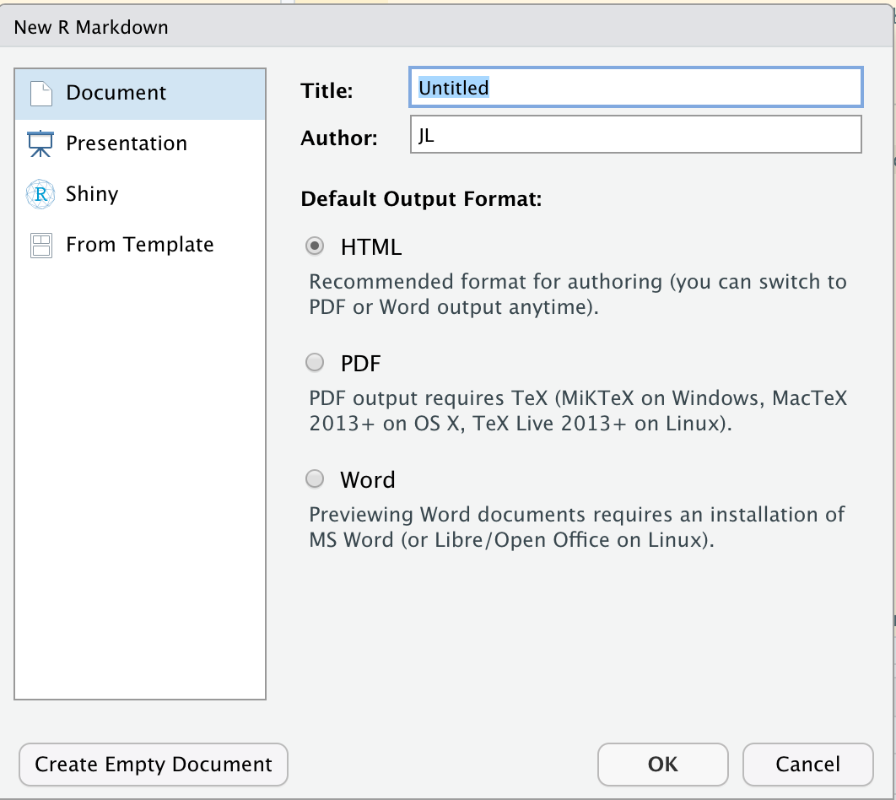
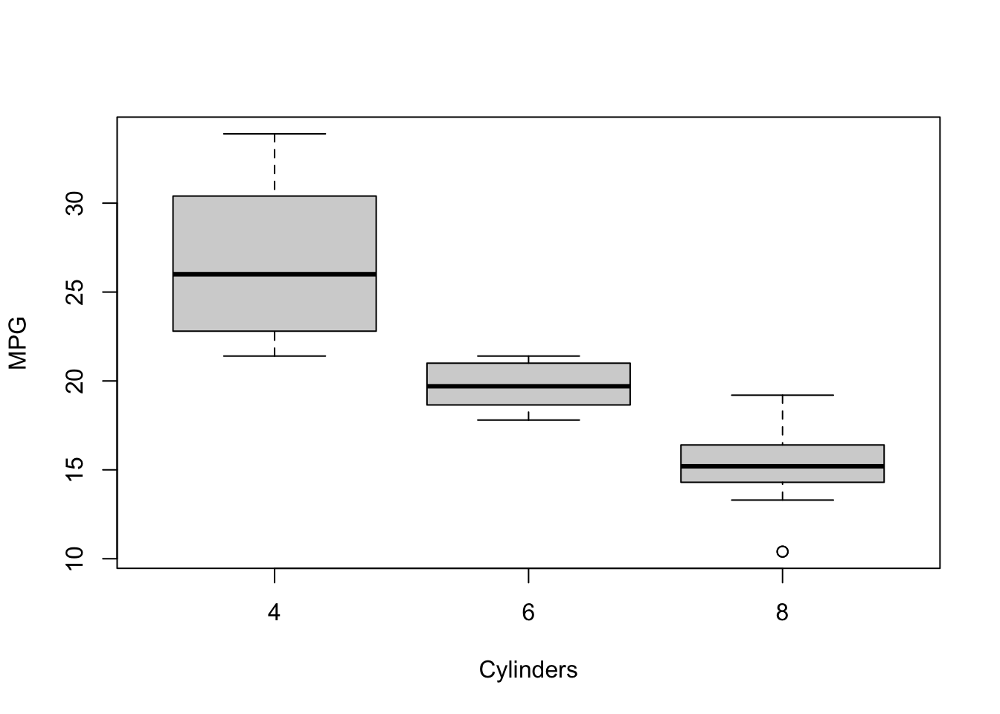
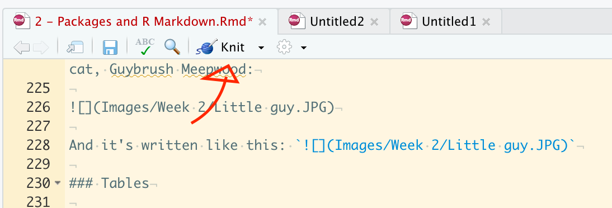
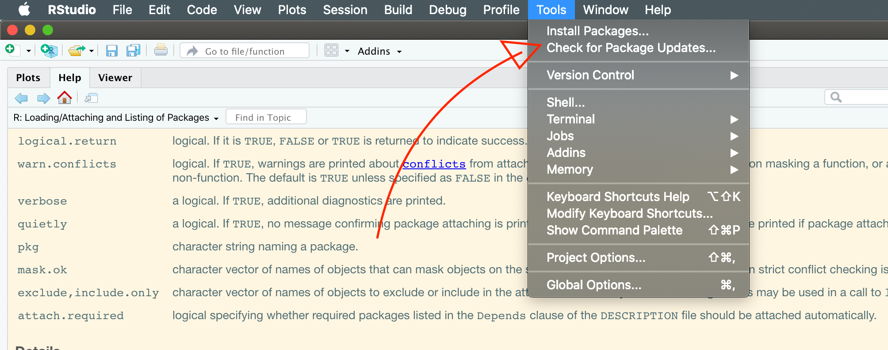

# Extending R with packages and R Markdown

Welcome to week 2 of the semester. 

This week we're going to be focusing on a couple of topics. First, we're going to go into R Markdown a little bit more--you've already encountered R Markdown, of course, in the lecture notes and assignments, but I want to give you some more experience with what it can do.

Then we're going to talk about extending R--in particular how to install, use, and uninstall packages. We're also going to review how to get help and learn more about R.

Finally, we'll spend some time getting into the guts of R with more advanced types of R objects: the matrices, data.frames, and lists that be a key part of what will make R actually do things efficiently for us as a data-analysis tool.

## All about R Markdown

First, we're going to talk about these crazy documents you've gotten used to looking at in the first couple days of class. We've already introduced the idea of R Markdown documents in this class, and [it's pretty easy to make a new one](https://rmarkdown.rstudio.com/docs/) that will act ok without messing around with default settings. But what are they actually, and why are we using them instead of text files (.txt), word documents (.doc/.docx), or even nice, quiet PDFs (actually called by the extension, .pdf, but stands for "Portable Document File").

R Markdown, to [quote the project page](https://rmarkdown.rstudio.com/docs/),

> helps you create dynamic analysis documents that combine code, rendered output (such as figures), and prose. You bring your data, code, and ideas, and R Markdown renders your content into a polished document that can be used to:
>
> -   Do data science interactively within the RStudio IDE,
>
> -   Reproduce your analyses,
>
> -   Collaborate and share code with others, and
>
> -   Communicate your results with others.
>
> R Markdown documents can be rendered to many output formats including HTML documents, PDFs, Word files, slideshows, and more, allowing you to focus on the content while R Markdown takes care of your presentation.

The idea for **R** Markdown comes from the more general idea of (Markdown)[<https://daringfireball.net/projects/markdown/>], which was introduced way back in the prehistoric year of 2004. To paraphrase the original idea, Markdown is a way to write in **plain text** (not using a word-processor like Microsoft Word) that can then be rendered into **formatted HTML** using a programming language (in this case Perl, which is a character-oriented scripting language). The name **"Markdown"** is a reference to that HTML-relationship. HTML stands for "HyperText Mark**up** Language"--so Mark**down** is the simple way to write formatted documents in HTML (and, as we'll see, way way more). The key reason for Markdown, according to the authors, is to **make easy-(-ish, in my opinion)-to-write documents that are readable as plaintext, but that can be rendered into pretty HTML documents.**

Why am I telling you these details? In general, I think that the problem with coding and programming languages (and their cousins and relatives, like R Markdown) is that they are often presented as "easy to use" things without any context, and the context itself dictates why they behave in certain ways. So it matters that R Markdown has this close relationship to HTML--it is why we will see later that it outputs by default **as HTML** files, and also why (we won't cover this as much) we can use HTML and CSS (Cascading Style Sheets) to provide granular formatting and rendering to our documents. History and context matter!

### What is an R script?

But to really understand R Markdown, we should contrast it to an R Script. Everyone should go ahead and open an R Script now, by going to `File > New File > R Script` or by pressing **cmd + shift + N** (cmd = ctrl on Windows).


One of the key differences in an R Script is that there is no such thing as narrative plain text. An R Script *is* a plain-text (unformatted) file, which is meant to have every character **literally interpreted** by the R interpreter. Every thing you write in an R Script is an instruction to R. So, to check this out, **in your R script**, try typing "This line cannot be executed". Then highlight it, and select the "Run" button in the right-hand side of the script pane. What happens?

For reference, the way to insert some plain text into your R Scripts is to use **comments**. Every programming language has a special character that tells the interpreter "ignore this line". In R it is the "\#", or hash(tag) symbol. One or more hashes will tell R to ignore everything after them.


```r
# This whole line will be ignored
# print("hello world") # This line will also be completely ignored
print("goodbye world") # Only text AFTER the hashtag is ignored.
```

```
## [1] "goodbye world"
```

**Commenting your code is a really good idea, because when you come back in 6 months you'll be able to understand what the heck you were doing!**

Meanwhile, in this R Markdown file, we can write whatever we want! R Markdown, by default, assumes that text is just text. It is *not* interpreted by default. Rather, the rendering engine for R Markdown will look for key characters that indicate that something is code (as well as other key characters for formatting that we'll learn about today) and treat those specific parts of the document as code, but otherwise just let us write narrative text. This allows us to write nice-looking reports and documents in R Markdown that still can run code--so these are perfect for writing lab reports (hint hint) as well as for doing "reproducible" research. Many of the websites and interactive textbooks I have linked to so far are written in R Markdown.

But R Markdown is useful because it goes beyond HTML to outputting into many of the more "typical" document formats that we use professionally all the time. R Markdown uses something called [pandoc](https://pandoc.org/index.html) to easily convert your easy-to-write text .Rmd file into Word documents, PDFs, even slides. We'll play with some of these options today as demos.

Why, then, do we not just use R Markdown for *everything* we do in R? Why do R scripts exist at all? The answer, which will only become more apparent as you get more comfortable using R and doing coding, is that a plain script has "low overhead"--we don't have to do code chunks and mess with a bunch of formatting to make our code work. We can just open it up, write a few lines, and hit "Run". So we like R Scripts when we are doing real data exploration or analysis. But once we have or workflow down and our problem solved, it's a good idea to turn back to R Markdown to make a shareable, reproducible, understandable version of our code.

### How do we make an R Markdown document?

The simplest way to make an R Markdown document is a lot like making a new R Script: `File > New File > R Markdown...`. This will bring up a menu with some options to select from, which should look very much like this on your computer:

 

Notice that you immediately have a lot of options. This can be a little scary, but you can change all of the options afterwards by editing the YAML Header (which we go over below). So don't feel like you have to be too careful when you're doing this. The advantage of using this interactive menu is that it will autopopulate the document header (the YAML header) for you, so you don't have to memorize options. It will *also* autopopulate some examples of R Markdown **syntax** for you into the document. This is nice when you're just learning R Markdown, but it quickly gets annoying.

Therefore, there are a couple other ways to get a blank R Markdown document. The first and easiest to remember is to select "Create Empty Document" on that same menu. But another way that I like is to create a new R Script and then to change the *type* of document in RStudio using the little menu at the bottom right of your Source pane. What this is doing is telling RStudio how to treat a particular document.


You'll notice there are a *lot* of options in here, but we're going to ignore them for now.

### Elements of R Markdown documents

Like any new tool, R Markdown offers a huge selection of options. This can be really hard for the new user, and so I recommend getting to grips with some basic tools and then learning the rest as you go. Another moment of honesty: this is how I learned (and continue to learn, in fact) R Markdown. I am not at all a master of this technology--in this class I am certain that we will encounter situations together in which my response will be "Huh! Let's figure out *why* it did *that*."

We're going to first talk about basic text formatting, which is super easy and fun in R Markdown. Then we'll cover how to include code in your document. Then we'll talk about this mysterious "YAML Header", which defines how the document will be rendered into HTML, Word, etc. Then we'll talk a little bit about inserting external stuff into the document (like links or images).

#### Text body

One of the nicest things about R Markdown is how easy it is to do basic text formatting. There are really only a few basic formatting "tags" that make text render nicely when knit, and you might even know the basics from some online tools, which increasingly use Markdown conventions for easy formatting.

##### Emphasis

*Italics* and **Bold** text are the most basic things to do in Markdown. To make italics, surround the text you want to make into italics with either stars ("\*") or underscores ("\_") **on both sides**. So, for example, "\_italic\_" = *italic* when rendered. To make something bold, use two of the same symbol, either stars or underscores (e.g., "\_\_", "\*\*").

##### Inline code

Similarly, to make something render as code (with text highlighting and monospaced characters), use the backtick "\`" symbol to surround the text. So "\`print()\`" = `print()`.

To make code actually run, you have to tell R Markdown that the code in the the backticks is actually R code, by following the opening (first) backtick with `r`. Then when the R Markdown is rendered, it will actually process the command: `sqrt(27234) =` 165.0272705.

##### Lists

To make a list in Markdown, you need a newline (enter/return), followed by exactly how you'd expect a list to look: numbers or bullets start each next line, followed by a space and then the list contents. So, for example:

-   We can use
-   Bullets

Or even

-   We can use
-   dashes
*   Mixed with
*   Bullets

Numbered lists just need a format like `<number>.` followed by a space. Note that you don't have to increment the numbers yourself. You can just have `1.` on the start of each line, and R Markdown will do the rest for you.

1.  This
2.  Is
1.  A
1.  Numbered list

To indent a list item, you only need to provide at least 1 tab character (= 4 spaces) *before* the bullet or number.

1. This is an item
    1. Followed by a subitem
    2. and another subitem
1. And now we're back!

##### Headers

To make headers (like those you use in Word), you start a line with a "\#" character. You use 1 for a Level 1 (biggest) header, 2 for a Level 2 header, and so on. Note that if you have a numbered Table of Contents (as in this document), R Markdown will automatically number it based on these headers.

###### This is an example Level 5 header, but it doesn't have any content

##### Escape character: `\`

If you look carefully at the R Markdown for this document (it will not be visible in the HTML or PDF render), you'll notice that when I give examples of the special characters in R Markdown (like "\_") it is preceded with a "\\" in the raw R Markdown. The backslash character is a common programming language ["escape character"](https://en.wikipedia.org/wiki/Backslash). It tells the interpreter that is reading the text to ignore the immediately following character, which is mostly necessary when that next character does **something** programmatic in the language. For example, if we didn't write "\\\_" then R Markdown would try to make the underscore into an italics mark, rather than printing it as a visible character. By *escaping* it using the backslash "\\", we tell it to treat it instead as the plain character version. This isn't super critical to memorize, but when you see this character in raw code you can understand what it's doing there.

#### Code chunks

OK, so you've gotten some nice formatting into your document, but so far we haven't done anything that you couldn't do as easily with Word. What's the point of this? Well, the big selling point of R Markdown is that it **integrates with your interactively processed code**. So you don't copy paste results out of R into your report--you just include the code in the right place, and the ANOVA table, plot, or what have you will pop into place. And if you change your data or need to rerun the analysis, you change only that section, and everything else will update.

**Code chunks** are the heart of this capability. We are only going to cover the basics right now, and we will add functionality as we go on. The R Markdown documentation linked in your reading for this week gives a lot more detail.

At its most basic, a code chunk in Markdown is a set of lines surrounded by triple backticks: ```` ``` ````. So this is a code chunk

```
print("code goes here")
```

But the above code chunk is a generic, multiline code chunk. It tells R Markdown to render the text within as monospace, but it doesn't actually execute the code (or give you the option to do so). In order to make this into actual, runnable R code, we have to tell R Markdown that this is an **R** code chunk, using the code chunk header brackets after the first triple backticks: ` ```{r} ` This is the equivalent of telling R that the inline code you have typed is executable, as we learned above.


```r
print("This is a code chunk that will execute")
```

```
## [1] "This is a code chunk that will execute"
```

Typing out triple backticks, then "{r}", then, another set of triple backticks is a real pain in the butt. Happily, RStudio has a keyboard shortcut for that: cmd + alt + I (use ctrl instead of cmd on Windows).

The chunk header brackets allow you to also set up options for that chunk. Options are set by naming them, and setting them to a value: for example, `echo=FALSE`. There are many, and I will not be covering them comprehensively but introducing them as I need them. However, a couple key ones are useful, especially those options that dictate whether, for a particular chunk, the code **runs**, or whether the code gives **output**, **errors**, or **messages**. Here are some examples, but I like the [detail given in R for Data Science's section on this](https://r4ds.had.co.nz/r-markdown.html#code-chunks).

Sometimes you don't want your chunk to run at all--in that case you'd tell it to not evaluate, using the `eval=FALSE` option:


```r
for(i in 1:1000) sqrt(factorial(i)) # This is a pointlessly long calculation for demonstration purposes only
```

On the other hand, sometimes you want a code chunk to execute, but you don't want to show the code itself. This might happen because you want to just store some results in memory, or more frequently because you want to show a table or plot made by the code. In that case, you can set the `echo=FALSE` option.



In these R Markdown documents I make liberal use of another option: `error=TRUE`. This tells R to keep knitting the document, even if that chunk returns an error:


```r
This is nonsense
```

```
## Error: <text>:1:6: unexpected symbol
## 1: This is
##          ^
```

What do you think would happen if I didn't use the `error=TRUE` option? Try editing your version of this document to find out.

##### Setup chunk

A particularly useful set of options is found in the **default setup chunk** that RStudio will make you if you make a new R Markdown document. It demonstrates two useful attributes: a name (`setup`) and the `include=FALSE` option. In fact, you won't be able to see the chunk in this rendered output, but open the raw .Rmd file and it will be right below this, with the header written as follows: `{r setup, include = FALSE}`.


Working backwards, the `include = FALSE` option tells R to run the chunk, but to not give any output and not to print the chunk in the rendered document. So it is useful for setup: for any packages you need to load, datasets you need to load, etc. Stuff the rest of your document will need.

Chunks can be named by following the `r` in the header with a space and the name. Any characters can go in the name, although generally we don't include spaces because they can cause errors in other places if you try to use advanced methods to refer back to the chunks. You can name chunks *anything*: doing so is useful because if you give them descriptive names, you know what they're supposed to do when you come back to the document later.

#### YAML Header

At the top of this R Markdown file is a funny bit of syntax that looks more like code than it does like plain text, but isn't R Syntax. Here it is for reference (in an unsigned code chunk!):

```
---
title: "2 - Packages and R Markdown"
author: "JL"
date: "10/11/2021"
output: 
    html_document:
        toc: true
        number_sections: true
        toc_float: true
---
```

This is called the [**YAML Header**](https://en.wikipedia.org/wiki/YAML)---"YAML" stands for "**Y**et **A**nother **M**arkup **L**anguage", although recently it has been renamed as "YAML Ain't Markup Language"--both are stupid programming jokes. More importantly, this header is a compact way of *defining how the R Markdown document will render*. I am not at all an expert on YAML, so I will use this section to give a few pointers and some tips on how to make this bit of code work for you.

YAML is very unlike R syntax in several key ways (technically it is more like Python, but that is probably not meaningful to most of us). It is a set of **key/value pairs**, which are defined as `<key>: <value>`. What this means is that, in our example above, the value of `title:` is set to `"2 - Packages and R Markdown`. This is different from how we'd set a variable called `title` in R--**can you remember how to do this?**.

You'll notice that the first few lines of the YAML header directly translate to the output of this R Markdown document---it has "JL" as the author, the title specified, etc. But the more mysterious section is the `output:` section. There are two things to observe here. First, notice the way that this is **structured by whitespaces**: sure, it looks like the output type is `html_document`, but that is **also** followed by a colon (`:`), and then several further keys that are set.  Those following "keys" are indented under the `html_document:` key, showing us that they are part of that general key-value pair set. What this tells us is that these are variables specific to the `html_document` output type. In fact, they are numbering the section headers for us automatically, creating a table of contents (`toc: true`) and making that table of contents float on the side and update nicely.

If we wanted to output this R Markdown as a PDF we'd add a `pdf_document` value to the `output:` section. If we wanted to make this into slides (yes, that's possible!), we'd add the correct call (e.g., `output: ioslides_presentation`). But these are all specific use cases, and as I said, **I am not an expert**. I find the [YAML section in this crash course](https://zsmith27.github.io/rmarkdown_crash-course/lesson-4-yaml-headers.html) super helpful to get started.

The key things to remember about YAML:

-   It uses syntax in which whitespace (spaces and new lines/returns) are meaningful, so be careful
-   Note the different capitalization
-   Options for different outputs in R Markdown are specific to the type of output, so you will have to read the help files/search the internet

#### Links, images, etc

One of the wonderful things about (R) Markdown is how easy it is to drop links and images into the document.  The syntax for web links is super simple.  To make a link you pick some text you want to make into a link, surround it by square braces(`[]`), and then follow those braces immediately with a set of parentheses (`()`) containing the link.  So, for example, [this link](https://en.wikipedia.org/wiki/Siamese_cat#/media/File:Siam_lilacpoint.jpg) goes to a picture of a Siamese cat, and is written like this: `[this link](https://en.wikipedia.org/wiki/Siamese_cat#/media/File:Siam_lilacpoint.jpg)`.  Super easy.

Even nicer, adding images works very similarly.  To insert an image, you use an exclamation point followed by square braces (`![]`), followed by parentheses again (`()`), but instead of a hyperlink those parentheses should include the **file path to your image**.  So, for example, here is a picture of my cat, Guybrush Meepwood:


And it's written like this: ``.  Anything you put in the brackets becomes the caption for the picture.  **NB:** in order to render the caption correctly, make sure to remember to add a return (newline) after the image link.  

You can also use the image linking format to link to web images, so we can add that picture of a random Siamese cat from the static hyperlink we used for a text link above:


#### Tables

Tables are also _sort of_ easy to make in R Markdown... if you're outputting them from R.  So, say you have a data table, like the famous `mtcars` dataset, included in base R.  The simple `kable()` function, found in the `knitr` package (which is actually what is making our R Markdown files, see below) renders tabular data into a nice format by default.


```r
knitr::kable(mtcars[1:10, ])
```


|                  |  mpg| cyl|  disp|  hp| drat|    wt|  qsec| vs| am| gear| carb|
|:-----------------|----:|---:|-----:|---:|----:|-----:|-----:|--:|--:|----:|----:|
|Mazda RX4         | 21.0|   6| 160.0| 110| 3.90| 2.620| 16.46|  0|  1|    4|    4|
|Mazda RX4 Wag     | 21.0|   6| 160.0| 110| 3.90| 2.875| 17.02|  0|  1|    4|    4|
|Datsun 710        | 22.8|   4| 108.0|  93| 3.85| 2.320| 18.61|  1|  1|    4|    1|
|Hornet 4 Drive    | 21.4|   6| 258.0| 110| 3.08| 3.215| 19.44|  1|  0|    3|    1|
|Hornet Sportabout | 18.7|   8| 360.0| 175| 3.15| 3.440| 17.02|  0|  0|    3|    2|
|Valiant           | 18.1|   6| 225.0| 105| 2.76| 3.460| 20.22|  1|  0|    3|    1|
|Duster 360        | 14.3|   8| 360.0| 245| 3.21| 3.570| 15.84|  0|  0|    3|    4|
|Merc 240D         | 24.4|   4| 146.7|  62| 3.69| 3.190| 20.00|  1|  0|    4|    2|
|Merc 230          | 22.8|   4| 140.8|  95| 3.92| 3.150| 22.90|  1|  0|    4|    2|
|Merc 280          | 19.2|   6| 167.6| 123| 3.92| 3.440| 18.30|  1|  0|    4|    4|

This is a huge area that I am also not super expert in, but you could be the next data-table wizard.  Maybe start [here](https://rfortherestofus.com/2019/11/how-to-make-beautiful-tables-in-r/)?

### "Knitting" R Markdown documents

The jargon for transforming a raw text file (like this one) into a rendered document through RStudio is called **"knitting"**.  This is why the `knitr` package mentioned above is named as such.  The easiest way to do so is to click the button labeled "Knit" at the top of your Source editor in RStudio:


When that button is clicked, it will knit to the type of output you specified in the YAML header (remember that?)--but you can also use the little triangle button next to the "Knit" to select other output options.  Note that if you knit to a different option than already is specified in your header, RStudio will add an output key/value to your YAML header, and so next time you knit it will compile documents in *all formats* you have ever specified.  You can of course go back and edit your YAML header to fix this if you didn't want that to happen.

#### File output of knitting

Knitting creates new files of the type you have specified.  By default, these will live in the same directory as the current Markdown file.  So when you knit, you will end up with a file with the same _name_ but the new file extension you specified (e.g., if `output: html_document` is the option you set, you will end up with a file called `<name of markdown file>.html` in the same directory).  You can change the output directory if you like to keep things clean.  

Generally, HTML documents are the fastest to knit, and PDF and Word documents (and other formats) will require more processing.  Therefore, I tend to use HTML as the default output.

#### Previewing (in RStudio version > 1.4)

You can also check to make sure your R Markdown is going to render properly by using the [RStudio Visual Markdown Editor](https://rstudio.github.io/visual-markdown-editing/#/markdown?id=line-wrapping), which turns R Markdown into something closer to a Word Processor.  To access this mode, click the little compass icon at the top of the source editor:


**Important:** this does _not_ knit your document—it gives you a preview of what it will look like, but it does not create a document that is rendered and ready for sharing.

**Also important:** this will give you a warning the first time you use it noting that it will transform your Markdown to properly formatted syntax.  This may cause some errors.  For example, I have seen the following:

* Changing unsigned code blocks (e.g., those marked by ` ``` ` without the "{r}") to completely unindented.  This would screw up, for example, the YAML example above.
* Changing spaces in file names (e.g., `.../Files/Week 2/`) to `%20`, which I believe is a version of the HTML unicode.  This is undesirable behavior and I had to fix it.

This may feel like a great way to check your work, but I don't personally like using this editor to write R Markdown--I find it obscures important details of what's going on in the base file.  I also got sick of fixing the changes it made to my code.

#### Outputting to more exotic formats (like slides, etc)

As mentioned above, R Markdown can output to all kinds of formats.  All you have to do is add the appropriate value/key pair to the YAML header.  So, for example, if we add `output: ioslides_presentation` to the top of this document, we will get an automatically formatted [ioslides presentation](https://bookdown.org/yihui/rmarkdown/ioslides-presentation.html) (an HTML slide deck).  R Markdown will make some automatic decisions on how to make slides (based on the headers we've indicated with various `#` marks).  It won't look good as it is (I have way too much text), but this shows how easily we can flip between different formats.

### Joplin - an easy way to learn basic Markdown

We are coming to the end of our crash course in R Markdown.  Learning R Markdown will be a great way for you to develop a skill that will be super useful in many future parts of your career.  But it will take practice.

To be completely honest, I have tried to learn R Markdown several times, and it wasn't until this class that I really started to learn how to use it effectively.  This is a common phenomenon: having to use something is the best way to actually learn it.  This is why at Virginia Tech we are trying to emphasize experiential learning.  

In preparation for this class, I started using a virtual notebook/labbook that is based on Markdown (not R Markdown, but as we discused they are closely related "flavors"), called [**Joplin**](https://joplinapp.org/).  It has a couple of other fantastic features that I love (it syncs across devices, lets you easily organize notes, create checklists, etc) that are cool, but I mainly like it because it's been a great way to practice Markdown.  Maybe it will be something useful for you?

## Extending R - Packages

In one of the code chunks above, I wrote something we haven't seen before: `knitr::kable(mtcars)`.  The latter half of this looks familiar--it's just a function that we are using on `mtcars`.  What's with the `::`?  It indicates that the function `kable()` is part of the `knitr` **package**--and we are using the `::` syntax to access the function without loading the package into memory (more on this in a minute).

You can see all the packages that are currently installed in your version of R by looking at the "Packages" Pane in RStudio, and you can see what packages you've loaded in this session by running `sessionInfo()`.


```r
sessionInfo()
```

```
## R version 4.2.1 (2022-06-23)
## Platform: x86_64-apple-darwin17.0 (64-bit)
## Running under: macOS Catalina 10.15.7
## 
## Matrix products: default
## BLAS:   /Library/Frameworks/R.framework/Versions/4.2/Resources/lib/libRblas.0.dylib
## LAPACK: /Library/Frameworks/R.framework/Versions/4.2/Resources/lib/libRlapack.dylib
## 
## locale:
## [1] en_US.UTF-8/en_US.UTF-8/en_US.UTF-8/C/en_US.UTF-8/en_US.UTF-8
## 
## attached base packages:
## [1] stats     graphics  grDevices utils     datasets  methods   base     
## 
## loaded via a namespace (and not attached):
##  [1] bookdown_0.27   digest_0.6.29   R6_2.5.1        jsonlite_1.8.0 
##  [5] magrittr_2.0.3  evaluate_0.15   highr_0.9       stringi_1.7.8  
##  [9] cachem_1.0.6    rlang_1.0.4     cli_3.3.0       rstudioapi_0.13
## [13] jquerylib_0.1.4 bslib_0.4.0     rmarkdown_2.14  tools_4.2.1    
## [17] stringr_1.4.0   xfun_0.31       yaml_2.3.5      fastmap_1.1.0  
## [21] compiler_4.2.1  htmltools_0.5.3 knitr_1.39      sass_0.4.2
```

In this list, the "attached" lists are the loaded packages.  The "namespace" list is a programming convention you can safely ignore for now.

### What are packages?

In R, **packages** are sets of functions and data that offer new functionality.  Because R is open source, anyone can create new R packages.  That sounds great in practice, but what's to guarantee that packages work as advertised (i.e., do the analysis that they are supposed to, or even more fundamentally don't harm your computer)?  Like many open-source projects, R relies on centralized volunteers to check R packages.  The [CRAN (Comprehensive R Archive Network)](https://cran.r-project.org/), which distributes R itself, also checks and distributes user-submitted packages.  When you install packages in R Studio, by default you are installing them from CRAN.  

There are other **repositories** that focus on different disciplinary expertise--the most significant one I know of is [Bioconductor](https://www.bioconductor.org/), which focuses on biostatistical and genomic packages.

You can also install packages directly, either by downloading them or from user-hosted repositories.  Most commonly this would be from something like github, where alpha and beta versions of software are often hosted by developers prior to CRAN submission.  Usually this requires using a different installer function (e.g., `devtools::install_github()`), and we won't cover that explicitly here.

### Installing packages

There are two main ways to install packages.  The "point-and-click" way is to use the Tools > Install Packages... command in RStudio:



The advantage to this approach is that RStudio will help you autofill package names, and it will also let you install multiple packages by just putting commas between them.  The disadvantage is that you don't learn what is actually going on.  The menu command is just a shortcut for the base R command:


```r
install.packages("tidyverse", dependencies = TRUE) # The name of the package goes in quotes here
```

Note that this code chunk has `eval=FALSE` set, because it's rude to install packages on someone else's computer without their permission. **In your console, go ahead and install the `tidyverse` package.  It will install a set of packages that are "dependencies".  We will be using these later in the course.

The menu command is fine to use, but it's good to know how to do this on your own.  It helps you understand when something doesn't work correctly.

### Using packages

Technically, once a package is installed in your version of R through the above commands, it is available to use.  So if you want to use `kable()`, you can always type `knitr::kable()`.  But that's pretty tedious!  It is much better to **attach** (load) packages when you need them, and then you can call their functions (and datasets) directly.  To do this, all you need to do is use the `library(<unquoted name of package>)` command.  So, for example, let's try using `kable()` without loading `knitr`, then see what happens once we load it properly.


```r
kable(mtcars)
```

```
## Error in kable(mtcars): could not find function "kable"
```


```r
library(knitr) # load the knitr package, note the lack of quotes around <knitr>
kable(mtcars)
```


|                    |  mpg| cyl|  disp|  hp| drat|    wt|  qsec| vs| am| gear| carb|
|:-------------------|----:|---:|-----:|---:|----:|-----:|-----:|--:|--:|----:|----:|
|Mazda RX4           | 21.0|   6| 160.0| 110| 3.90| 2.620| 16.46|  0|  1|    4|    4|
|Mazda RX4 Wag       | 21.0|   6| 160.0| 110| 3.90| 2.875| 17.02|  0|  1|    4|    4|
|Datsun 710          | 22.8|   4| 108.0|  93| 3.85| 2.320| 18.61|  1|  1|    4|    1|
|Hornet 4 Drive      | 21.4|   6| 258.0| 110| 3.08| 3.215| 19.44|  1|  0|    3|    1|
|Hornet Sportabout   | 18.7|   8| 360.0| 175| 3.15| 3.440| 17.02|  0|  0|    3|    2|
|Valiant             | 18.1|   6| 225.0| 105| 2.76| 3.460| 20.22|  1|  0|    3|    1|
|Duster 360          | 14.3|   8| 360.0| 245| 3.21| 3.570| 15.84|  0|  0|    3|    4|
|Merc 240D           | 24.4|   4| 146.7|  62| 3.69| 3.190| 20.00|  1|  0|    4|    2|
|Merc 230            | 22.8|   4| 140.8|  95| 3.92| 3.150| 22.90|  1|  0|    4|    2|
|Merc 280            | 19.2|   6| 167.6| 123| 3.92| 3.440| 18.30|  1|  0|    4|    4|
|Merc 280C           | 17.8|   6| 167.6| 123| 3.92| 3.440| 18.90|  1|  0|    4|    4|
|Merc 450SE          | 16.4|   8| 275.8| 180| 3.07| 4.070| 17.40|  0|  0|    3|    3|
|Merc 450SL          | 17.3|   8| 275.8| 180| 3.07| 3.730| 17.60|  0|  0|    3|    3|
|Merc 450SLC         | 15.2|   8| 275.8| 180| 3.07| 3.780| 18.00|  0|  0|    3|    3|
|Cadillac Fleetwood  | 10.4|   8| 472.0| 205| 2.93| 5.250| 17.98|  0|  0|    3|    4|
|Lincoln Continental | 10.4|   8| 460.0| 215| 3.00| 5.424| 17.82|  0|  0|    3|    4|
|Chrysler Imperial   | 14.7|   8| 440.0| 230| 3.23| 5.345| 17.42|  0|  0|    3|    4|
|Fiat 128            | 32.4|   4|  78.7|  66| 4.08| 2.200| 19.47|  1|  1|    4|    1|
|Honda Civic         | 30.4|   4|  75.7|  52| 4.93| 1.615| 18.52|  1|  1|    4|    2|
|Toyota Corolla      | 33.9|   4|  71.1|  65| 4.22| 1.835| 19.90|  1|  1|    4|    1|
|Toyota Corona       | 21.5|   4| 120.1|  97| 3.70| 2.465| 20.01|  1|  0|    3|    1|
|Dodge Challenger    | 15.5|   8| 318.0| 150| 2.76| 3.520| 16.87|  0|  0|    3|    2|
|AMC Javelin         | 15.2|   8| 304.0| 150| 3.15| 3.435| 17.30|  0|  0|    3|    2|
|Camaro Z28          | 13.3|   8| 350.0| 245| 3.73| 3.840| 15.41|  0|  0|    3|    4|
|Pontiac Firebird    | 19.2|   8| 400.0| 175| 3.08| 3.845| 17.05|  0|  0|    3|    2|
|Fiat X1-9           | 27.3|   4|  79.0|  66| 4.08| 1.935| 18.90|  1|  1|    4|    1|
|Porsche 914-2       | 26.0|   4| 120.3|  91| 4.43| 2.140| 16.70|  0|  1|    5|    2|
|Lotus Europa        | 30.4|   4|  95.1| 113| 3.77| 1.513| 16.90|  1|  1|    5|    2|
|Ford Pantera L      | 15.8|   8| 351.0| 264| 4.22| 3.170| 14.50|  0|  1|    5|    4|
|Ferrari Dino        | 19.7|   6| 145.0| 175| 3.62| 2.770| 15.50|  0|  1|    5|    6|
|Maserati Bora       | 15.0|   8| 301.0| 335| 3.54| 3.570| 14.60|  0|  1|    5|    8|
|Volvo 142E          | 21.4|   4| 121.0| 109| 4.11| 2.780| 18.60|  1|  1|    4|    2|

Note that you can also load packages using point-and-click, by going to the Packages Pane in RStudio and clicking on the white box next to a package name.  This is fine for working interactively, but obviously won't work if you want to send someone an R Script that needs to load some packages.  It will also be tedious if you are doing the same workflow multiple times.  Better to learn how to use the `library()` function!

### Detaching (unloading) packages

Soemtimes you want to **detach** (unload) packages.  The technically correct way to do so is to call `detach(package:<package name>)`, which is slightly more tedious to type.

You can also detach packages by unchecking the box next to their name in the RStudio Packages Pane.

### Uninstalling packages

And sometimes you want to completely remove a package from R.  The most frequent reason for wanting to do this is when you start getting persistent errors.  This can happen because you have an old version of a package, or it installed improperly (this will often be accompanied by install error messages in the console).  You might also want to reinstall a package and be certain that the old version is gone.  Generally you dont' need to manually uninstall a package, but the simple command is just the opposite of installation: `remove.packages("<package name>")`.  

You can also use the Package Pane to remove packages by clicking the "X" to the far right of the package name.  Since removing packages isn't something you do all that often, using the point-and-click shortcut is no problem.

### Getting help - a deeper drive

With more packages you're going to more frequently run into the need to look up how to do things, which means dealing with help files.  As a reminder, typing `?<search term>` will make the help documentation for whatever you've searched for appear.  But what if you don't know what to search for?

By typing `??<search term>` you will search **all** help files for the search term.  R will return a list of matching articles to you in the help pane.  This is considerably slower, since it's searching hundreds or thousands of text files.  Try typing `??install` into your console to see how this works.

You will notice that there are two types of results in the help list for install.  The help pages should be familiar.  But what are "vignettes"?  Try clicking on one to find out.

Vignettes are formatted, conversational walkthroughs that are increasingly common (and helpful!) for R packages.  Rather than explaining a single function they usually explain some aspect of a package, and how to use it.  And, even better for our purposes, they are written in R Markdown.  Click the "source" link next to the vignette name in order to see how the author wrote it in R Markdown.  This is a great way to learn new tricks.

While you can find vignettes as we just did, a better way is to use the function `browseVignettes()`.  This opens a web browser window that lists **all** vignettes installed on your computer.  You can then use cmd/ctrl + F to search using terms in the web browser and quickly find package names, function names, or topics you are looking for.

Your first major assignment in the class will be to write your own vignette for a task or functionality.  We will talk about this more in the next week.

## Complex R Objects

To summarize where we ended up last week: we went over data types for variables.  Who can list the basic data types we reviewed?

We also went over the basics of functions, which we'll come back to pretty much every week.

So far this week we've spent a lot of time on "meta" topics--tools for interacting with R and with our coding and data.  We haven't actually learned that much more about how R works than we ended up knowing last week.

Let's change that!

### Vectors: a review

Last week we mentioned vectors very briefly.  But vectors are really at the heart of what makes R useful.  A vector is an **ordered list of the same kind of variable**.  Let's take a look at two different vectors to make this idea concrete.


```r
a <- c(1, 1, 2, 1, 100)
b <- c(TRUE, FALSE, TRUE, TRUE, FALSE)
a
```

```
## [1]   1   1   2   1 100
```

```r
b
```

```
## [1]  TRUE FALSE  TRUE  TRUE FALSE
```

The `c()` function is R's shortcut for making vectors, as shown above.  In strict programming terms, both `a` and `b` are **atomic vectors** because all of their elements are of the same type (what kind of vector is a?  what kind of vector is b?).

If you don't know what kind of vector a given vector is, you can use the `typeof()` function to ask R.


```r
typeof(a)
```

```
## [1] "double"
```

```r
typeof(b)
```

```
## [1] "logical"
```

```r
typeof(a) == typeof(b)
```

```
## [1] FALSE
```

Another property vectors have is **length**.  Length is just how many elements are in the list.  For these vectors it's easy to see the length, but we will often deal with long vectors we don't want to count by hand.  We can query the length of any vector (and even of complex objects) using the `length()` command.


```r
length(a)
```

```
## [1] 5
```

```r
length(b)
```

```
## [1] 5
```

```r
length(a) == length(b)
```

```
## [1] TRUE
```

Interestingly, in R most things are vectors.  So R, behind the scenes, thinks that `100` is a `numeric` vector of `length = 1`:


```r
length(100)
```

```
## [1] 1
```

```r
typeof(100)
```

```
## [1] "double"
```

We can add elements to pre-existing vectors, or even combine two pre-existing vectors, using the same `c()` function.


```r
c(a, 101)
```

```
## [1]   1   1   2   1 100 101
```

```r
c(b, FALSE, FALSE, FALSE)
```

```
## [1]  TRUE FALSE  TRUE  TRUE FALSE FALSE FALSE FALSE
```

If we try to put things that are of different `type` in the same vector, R will either try to "coerce" them into being the same type (remember R will change `TRUE` to `1` if we try to add it, for example) or give us an error.  The fact that, usually, R will **not** give an error can sometimes be a problem, because it might change things to characters or add up logical vectors when you don't want it to!


```r
c(a, b)
```

```
##  [1]   1   1   2   1 100   1   0   1   1   0
```

```r
c(a, "ring")
```

```
## [1] "1"    "1"    "2"    "1"    "100"  "ring"
```

### Vector math

R will happily do math with vectors for you, which will save a lot of time.  But there are some pitfalls to think about.  I'm going to just give the basic intro to this topic, and I recommend [Hadley Wickham's summary of the topic](https://r4ds.had.co.nz/vectors.html) to give you an idea of some of the possible problems.  

#### Piecewise (scalar) math

A **scalar** is a 1-item vector: `1` is a scalar (as is `"dog"`, technically, but we can't do normal math with it).  The basic arithmetic we're used to is scalar mathematics.  But vector math is a more powerful, compact form, and is useful for data analysis, as we'll see.

When we take a scalar and do basic mathematical operations in R, it acts **piece-wise**: the operation is applied to each object in the vector.


```r
a + 10
```

```
## [1]  11  11  12  11 110
```

```r
a * 10
```

```
## [1]   10   10   20   10 1000
```

```r
a - 1
```

```
## [1]  0  0  1  0 99
```

```r
a / 10
```

```
## [1]  0.1  0.1  0.2  0.1 10.0
```

The reverse also applies, with an asterisk: you will always end up with a vector, never with a scalar.


```r
10 / a
```

```
## [1] 10.0 10.0  5.0 10.0  0.1
```

```r
10 * a
```

```
## [1]   10   10   20   10 1000
```

#### Vector math

This is not a linear algebra class, so I will not be going into the rules of vector (and matrix) algebra.  But you should know that all operations are not equivalent.  Here is an example to give you fair warning.


```r
x <- c(1, 2, 3)
y <- c(4, 5, 6)
x * y # scalar (pointwise) multiplication = c(1 * 4, 2 * 5, 3 * 6)
```

```
## [1]  4 10 18
```

```r
x %*% y # matrix multiplication with two column vectors = 1 * 4 + 2 * 5 + 3 * 6
```

```
##      [,1]
## [1,]   32
```

```r
x %*% t(y) # matrix multiplication with a column and a row vector
```

```
##      [,1] [,2] [,3]
## [1,]    4    5    6
## [2,]    8   10   12
## [3,]   12   15   18
```

### "Indexing": getting elements from a vector

This is a good place to (re)introduce the key programming concept of **indexing**.  Ordered lists like vectors (and actual lists, as well as matrices, arrays, and data frames below) are **indexed**.  For a vector, which is an ordered list, the index is the number of an entry.  So, if we look back at our `a` vector, we can pull out each entry by its corresponding **index**.


```r
a
```

```
## [1]   1   1   2   1 100
```

```r
a[1]
```

```
## [1] 1
```

```r
a[2]
```

```
## [1] 1
```

```r
a[3]
```

```
## [1] 2
```

```r
a[4]
```

```
## [1] 1
```

```r
a[5]
```

```
## [1] 100
```

As you might guess, the R operator to extract an item from a vector is `[]`.  If you write `a[2]`, you can read this as **the second item in `a`**.  

The `[]` operators have even more functionality.  We can use a *vector of indices* (!!!) to get just those objects from our first vector.


```r
index_vector <- c(1, 3, 5) # say we want the first, third, and fifth items
a[index_vector]
```

```
## [1]   1   2 100
```

We can also use negative indices to _drop_ objects from our vector.


```r
a[-2] # drop the second object from a
```

```
## [1]   1   2   1 100
```

```r
a[c(-1, -5)] # drop the first and fifth objects from a
```

```
## [1] 1 2 1
```

Note that you can't combine positive and negative indices for subsetting in one step.


```r
a[c(1, -5)]
```

```
## Error in a[c(1, -5)]: only 0's may be mixed with negative subscripts
```

We can also use a vector of the same length but of type `logical` to select or drop specific entries.


```r
c_logical <- c(TRUE, TRUE, FALSE, FALSE, TRUE)
a[c_logical]
```

```
## [1]   1   1 100
```

This seems a little bit useless, but in fact it will be super helpful when we start using **logical operators** in coding.  Here is an example: if we don't know what numbers are in `a`, but we know they should be small, we might want to drop any numbers that are "too large"


```r
a < 10 # R has all the classic comparison operators, "<" means "less than"
```

```
## [1]  TRUE  TRUE  TRUE  TRUE FALSE
```

```r
a[a < 10] # give us everything in a < 10
```

```
## [1] 1 1 2 1
```

**Important but advanced**: in programming terms, R is 1-indexed, meaning that `a[1]` gives the first object in `a`.  This is _not_ the case in many programming languages, including Python, which are _0_-indexed, meaning that you'd write `a[0]` to get the first item in `a`.  This is important to know if you continue on in other programming languages for research.

### Multidimensional vectors: Matrices and Arrays

Most of you have encountered a **matrix** before.  Matrices are 2-dimensional arrays (usually of numbers).  The main reason we care about matrices is that they are efficient ways of organizing and analyzing numerical results.

In R, matrices are simply vectors (long lists of numbers) with a set number of rows and columns.  Because they are really just augmented vectors, matrices (and arrays) are **atomic**: they can only have one type of data in them.


```r
c <- matrix(c(1, 2, 3, 4, 5, 6), nrow = 2)
c
```

```
##      [,1] [,2] [,3]
## [1,]    1    3    5
## [2,]    2    4    6
```

```r
dim(c)
```

```
## [1] 2 3
```

```r
str(c)
```

```
##  num [1:2, 1:3] 1 2 3 4 5 6
```

The `dim()` function means "dimensions", and tells you what the dimensions of an object are.  So here `dim(c)` tells us that `c` has 2 dimensions: 2 rows and 3 columns.  If you call `str()` on a matrix, you get both an idea of what's in it as well as the dimensions.

If you are used to matrix algebra, one of the weird things that R does is that it, by default, fills matrices _column_-wise.  In the example above, `c` is filled from top to bottom, left to right.  This is contrary to most matrix math.  It can be overridden by specifying `matrix(byrow = TRUE)`, but in practice it doesn't matter as long as you're aware of it.

The main reason to bring up matrices is to talk about indexing.  Now, rather than saying "give us the fourth item in `a`", we might want to say "give us the first item in the second row of `c`".  As you might guess, we will use the `[]` operator.  The only difference is that we will **provide an index for each dimension**.

To index in this way, you separate each dimension you are wanting to index by `,`. **If you leave a dimension blank, you will get everything back in that dimension.**


```r
c[1, 2] # get the first row, second column entry
```

```
## [1] 3
```

```r
c[1, ] # get the first row
```

```
## [1] 1 3 5
```

```r
c[, 2] # get the second column
```

```
## [1] 3 4
```

You can also use logical vectors for subsetting, as with vectors.

**Arrays** are vectors with more than 2 dimensions.  So a 3-dimensional array can be thought of as a vector of matrices.  These are also called **tensors** in the machine learning community.  They are important for programming and for a number of advanced data analyses, but we will not be working with them as much initially.


```r
d <- array(c(1, 2, 3, 4, 5, 6, 7, 8), dim = c(2, 2, 2))
dim(d) # d is a "cube" - 2 matrices, each 2 x 2
```

```
## [1] 2 2 2
```

```r
d # when you ask R to print an array, it will print it as matrix slices
```

```
## , , 1
## 
##      [,1] [,2]
## [1,]    1    3
## [2,]    2    4
## 
## , , 2
## 
##      [,1] [,2]
## [1,]    5    7
## [2,]    6    8
```

```r
str(d) # as with most R objects, str() probably gives the most concise, useful information
```

```
##  num [1:2, 1:2, 1:2] 1 2 3 4 5 6 7 8
```

We index arrays the same way we would matrices, just adding an extra `,` for each additional dimension.  But it gets harder to keep track of, and keeping good notes and experimenting to make sure you're doing what you think you're doing is key.


```r
d[1, 2, 1] # get the number in the first row of the second column in the first matrix
```

```
## [1] 3
```

```r
d[, , 1] # get the first matrix "slice"
```

```
##      [,1] [,2]
## [1,]    1    3
## [2,]    2    4
```

```r
d[1, 1, ] # get the number at the first row and first column for both matrices
```

```
## [1] 1 5
```

### Lists: non-atomic vectors

If you want to keep different things in one vector, R provides a non-atomic vector type called a `list`, which is made using the `list()` function.


```r
list(TRUE, "dog", 3L, 3.45)
```

```
## [[1]]
## [1] TRUE
## 
## [[2]]
## [1] "dog"
## 
## [[3]]
## [1] 3
## 
## [[4]]
## [1] 3.45
```

```r
list(1, 2, 3, 4)
```

```
## [[1]]
## [1] 1
## 
## [[2]]
## [1] 2
## 
## [[3]]
## [1] 3
## 
## [[4]]
## [1] 4
```

Lists do not coerce data of different type, because they store each vector in its own, distinct slot.  If we remember that R treats individual data as 1-length vectors (e.g., `"dog"` is a 1-length character vector), we can understand that **lists are "vectors of vectors"**.  Each item in the list is a vector.  


```r
list(c(1, 2, 3, 4),
     "dog",
     c(TRUE, FALSE))
```

```
## [[1]]
## [1] 1 2 3 4
## 
## [[2]]
## [1] "dog"
## 
## [[3]]
## [1]  TRUE FALSE
```

We can even make a list of lists


```r
list(list(1, 2, 3),
     list(c("dog", "cat")),
     TRUE)
```

```
## [[1]]
## [[1]][[1]]
## [1] 1
## 
## [[1]][[2]]
## [1] 2
## 
## [[1]][[3]]
## [1] 3
## 
## 
## [[2]]
## [[2]][[1]]
## [1] "dog" "cat"
## 
## 
## [[3]]
## [1] TRUE
```

This makes lists rather difficult to conceptualize, but very easy and flexible to store items in.

#### The `str()` function

Because the way that R prints lists by default is hard to understand, an important function for dealing with them is `str()`, which you can remember as meaning **structure**.  If we look at the last (slightly pathological) list I created, 


```r
l <- list(list(1, 2, 3),
          list(c("dog", "cat")),
          TRUE)
str(l)
```

```
## List of 3
##  $ :List of 3
##   ..$ : num 1
##   ..$ : num 2
##   ..$ : num 3
##  $ :List of 1
##   ..$ : chr [1:2] "dog" "cat"
##  $ : logi TRUE
```

This is much clearer!  We have a list that contains another list with 3 items, a vector of characters, and a single logical variable.

We can also use `str()` on any R object, and it is usually quite helpful in letting us understand _what_ we're looking at.

#### Naming and indexing lists

We can actually make named atomic lists, but they are not as common.  When we start working with lists, because of their structure, it is often useful to name the elements of our list.  Let's make our pathological list a little easier to understand by giving each of its elements a name.

**Important**: Names for lists (and data frames, below) don't get quoted, even though they are character strings.  This is because they are names (a type of R object that is distinct but rarely created explicitly).


```r
named_list <- list(numbers = list(1, 2, 3),
                   pets = c("dog", "cat"),
                   cats_are_best = TRUE)
str(named_list)
```

```
## List of 3
##  $ numbers      :List of 3
##   ..$ : num 1
##   ..$ : num 2
##   ..$ : num 3
##  $ pets         : chr [1:2] "dog" "cat"
##  $ cats_are_best: logi TRUE
```

Now we have an idea of what all of the sublists hold.  How can we get them back out of our list?  Through indexing, of course.

The indexing function for lists works a little differently than for atomic vectors and arrays... or rather, it works logically if you look in a certain light, and otherwise is super confusing.  

Let's say we want to get our character vector of pets.  That's the second item in our list, right?


```r
named_list[2]
```

```
## $pets
## [1] "dog" "cat"
```

```r
str(named_list[2])
```

```
## List of 1
##  $ pets: chr [1:2] "dog" "cat"
```

This is still a list!  It turns out that `[]` for lists returns the same general shape of list with a subset of the original items.  If we want to "pop out" our original vector, we need to use the `[[]]` operator, which can be read as "go down one level".


```r
named_list[[2]]
```

```
## [1] "dog" "cat"
```

```r
str(named_list[[2]])
```

```
##  chr [1:2] "dog" "cat"
```

There we go.  Honestly, this behavior is one of the hardest things about lists, and will take trial and error to get used to.

Happily, if you have a named list, you can use a syntactical shortcut provided by R to do this more easily.  The `$` operator is kind of like `[[]]`, except instead of indexing you give it a name.  So we can just ask for our vector of pets back:


```r
named_list$pets
```

```
## [1] "dog" "cat"
```

As you will see, `$` gets used a lot with data frames.

### `data.frame`: Tables of data

Finally, with that background behind us, we can talk about the special kind of list known as data frames.  Data frames are as close as (base) R gets to the familiar, tabular data from Excel.  Think of a data frame as a "rectangular list"--it's a list of columns.  Each column has to have the same number of rows.  But each column can have its own data type--so you can have a column of names (character), then a column of ages (integer), then a column of heights and a column of weights (numeric).  Like so:


```r
cats <- data.frame(names = c("Margot", "Nick", "Guybrush"),
                    ages = c(13L, 14L, 2L),
                    heights = c(2, 2, 3),
                    weights = c(10, 9, 14))
cats
```

```
##      names ages heights weights
## 1   Margot   13       2      10
## 2     Nick   14       2       9
## 3 Guybrush    2       3      14
```

Oh, did you think this was a data frame of _people_?

We've actually already seen a data frame: `mtcars`.


```r
class(mtcars)
```

```
## [1] "data.frame"
```

```r
typeof(mtcars)
```

```
## [1] "list"
```
Data frames are extremely useful for storing data.  Because they are rectangular, we can index them as we normally do with matrices:


```r
cats[2, 4] # get Nick's weight
```

```
## [1] 9
```

```r
cats[3, ] # get all of Little Guy's vital stats
```

```
##      names ages heights weights
## 3 Guybrush    2       3      14
```

But we can also use list-type `$` indexing to get our named variables


```r
cats$names # what are my cats' names?
```

```
## [1] "Margot"   "Nick"     "Guybrush"
```

An augmented class of dataframes that we are going to be learning about extensively in the next classes is the **tibble**.  This is a `tidyverse` convention for an augmented, well-behaving data frame.  We can make a tibble by just calling the `tibble::tibble()` function on an existing data frame:


```r
cat_tbl <- tibble::tibble(cats)
class(cat_tbl)
```

```
## [1] "tbl_df"     "tbl"        "data.frame"
```

```r
cat_tbl # but they print nicer
```

```
## # A tibble: 3 × 4
##   names     ages heights weights
##   <chr>    <int>   <dbl>   <dbl>
## 1 Margot      13       2      10
## 2 Nick        14       2       9
## 3 Guybrush     2       3      14
```

If you read the section of [R for Data Science](https://r4ds.had.co.nz/vectors.html) I have suggested for this class, you will see a lot of reference to tibbles.  This section here is mostly to let you know that they are close (mostly improved) cousins to the data frame.


