# Exploring your data visually


One of the major strengths of R is that it provides a very strong platform for **data visualization** or "dataviz", if you're a little bit hurried and willing to be obnoxious.  Data visualization, in the last several years, has been an increasing subject of emphasis in statistical and data science classes, a focus of businesses (e.g., the development of specific platforms like [Tableau](https://www.tableau.com/)), and a general requirement for working with data.  

As sociologist Kieran @healy2019 [writes](https://socviz.co/index.html#what-you-will-learn):

> You should look at your data. Graphs and charts let you explore and learn about the structure of the information you collect. Good data visualizations also make it easier to communicate your ideas and findings to other people. Beyond that, producing effective plots from your own data is the best way to develop a good eye for reading and understanding graphs—good and bad—made by others, whether presented in research articles, business slide decks, public policy advocacy, or media reports. 

Healy is mirroring advice from one of the main influences in modern, effective statistics and data science: John Tukey (inventor of, among many things, the **box plot**).  As historians Michael Friendly and Howard Wainer write [@friendly2021]:

> John Tukey... revolution[ized] the field of statistics with the idea that the purpose of data analysis was insight, not just numbers, and that insight--seeing the unexpected--more often came from drawing pictures than from proving theorems or deriving equations.

{#tukey}

Thus, while *dataviz* as a subject of increasing concentration is new, the discipline itself isn't.  Famous examples of effective and persuasive data visualization can be traced even farther back than Tukey (unsurprisingly).  One of the most famous, in fact, is Florence Nightingale's work with "rose charts" to document causes of death in the Crimean War in the 1850s, which were credited with causing the British army to modernize sanitation standards.  The story (which is fascinating) is described very well in an [episode of the 99% Invisible podcast](https://99percentinvisible.org/episode/florence-nightingale-data-viz-pioneer/):

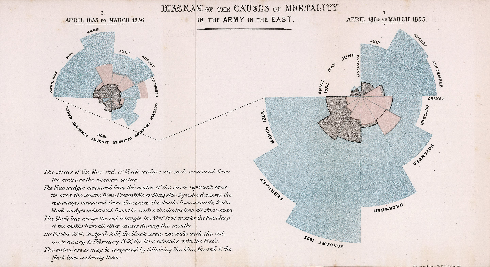{#nightingale}

We can go back even further [almost to prehistory, according to Friendly and Wainer -@friendly2021], but we'll end with just one more example: what data visualization guru Edward Tufte has called the greatest single graphic in history.  The visualization, by Charles Joseph Minard, shows Napoleon's disastrous invasion of Russia in 1812, in which he lost the majority of his army to the Russian winter.


These are classic examples of data visualization that are frequently cited in histories of the subject.  But they have survived for a number of reasons: they are clear visualizations of the underlying data, they are aesthetically engaging enough to draw in the reader, and they use the combination of *aesthetics* and *information* to make arguments.  These are what we want to do when we make data visualizations, which should ideally have these attributes.

As a note, data visualization is related to but not identical with recently popular tools for easily making "infographics"--the latter tend to combine dataviz with design elements to accomplish some of the same points, but are usually meant to be complete documents or other communicative tools on their own.  For our purposes we are going to focus on data visualization as a way to make sense of our data.

.](https://imgs.xkcd.com/comics/tall_infographics.png)


This week we're going to focus on the *how* of plotting data in R.  This means I'm not going to try to teach principles for effective dataviz *design* (a topic I am only marginally competent with), but rather how to turn your data into dataviz.

## Reasons for developing competency with data visualization

There are several key reasons we might want to develop competency with data visualization, and before we get started with the *how* I think it's worth mentioning these motivating factors. 

### To help you explore your data

As the Healey quote above implies, one of the main reasons to "look at your data" is to make sure you understand what you're doing.  Looking at your data is a great quick check to make sure that, for example, the linear model (regression or ANOVA) you're fitting is actually sensible for the data you've observed.  This is why, for example, examining QQ-plots or residuals is such common practice taught in every statistics class.

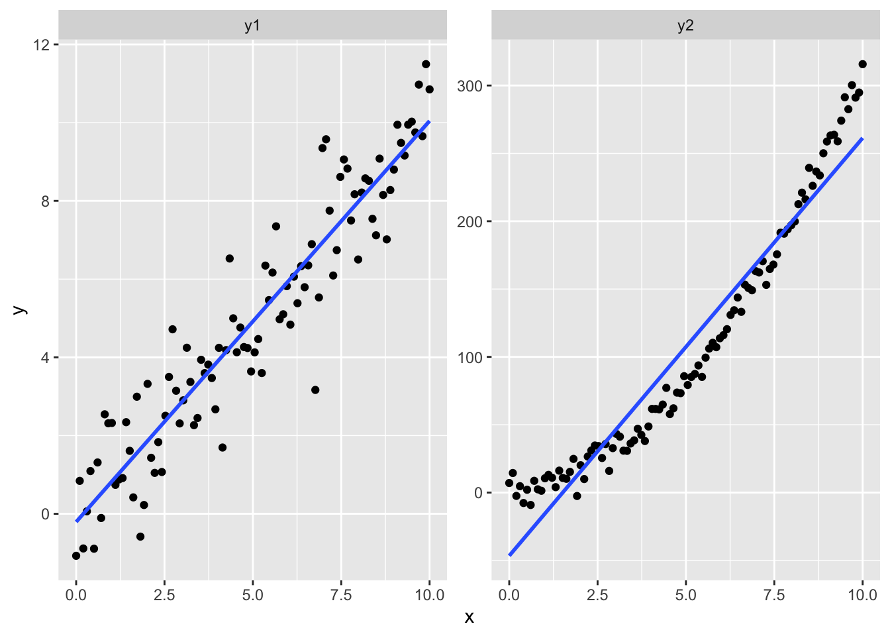

But looking at your data can be even more valuable: our ability to find patterns in visual information is much stronger than our ability to find similar patterns in written information (like tables of data).  This can be a disadvantage--we will happily find patterns in truly random data--but it is of great use to us as researchers and scientists.  Looking at data is an invaluable way for us to come up with strategies for data analysis, new hypotheses, and even new research questions.

For example, **what patterns can we see in this table of the data we just plotted (a subset, obviously)?**


|         x|         y1|         y2|
|---------:|----------:|----------:|
| 0.0000000| -1.3214703| -2.5353760|
| 0.1010101| -0.8269770| -7.5286794|
| 0.2020202|  0.4996656| -1.2341072|
| 0.3030303|  0.5917504|  5.1983819|
| 0.4040404|  0.7527332| -2.2728104|
| 0.5050505| -0.1505266|  8.3169781|
| 0.6060606|  1.1242934|  5.6965722|
| 0.7070707| -1.9397261|  7.8641251|
| 0.8080808|  0.4597118|  9.6065223|
| 0.9090909|  0.9153580|  0.9753971|

When visualizing data *for yourself*, the goal is to quickly and accurately be able to make plots that you want to see, so that you're not fiddling with options or struggling to actually see the data.  You aren't looking for "publication quality" visualization--you want to be able to look at your data clearly and quickly.

### For communication to stakeholders {#stakeholders}

This is the main reason we mostly think about doing dataviz: we want to create plots for use in presentations or publications, so that stakeholders--your committee, reveiwers at a journal, peers at a scientific conference--can understand your data quickly and clearly.  Below, we can quickly clean up the fake data I made to demonstrate dataviz for yourself to be something we'd be somewhat happier putting into a journal.

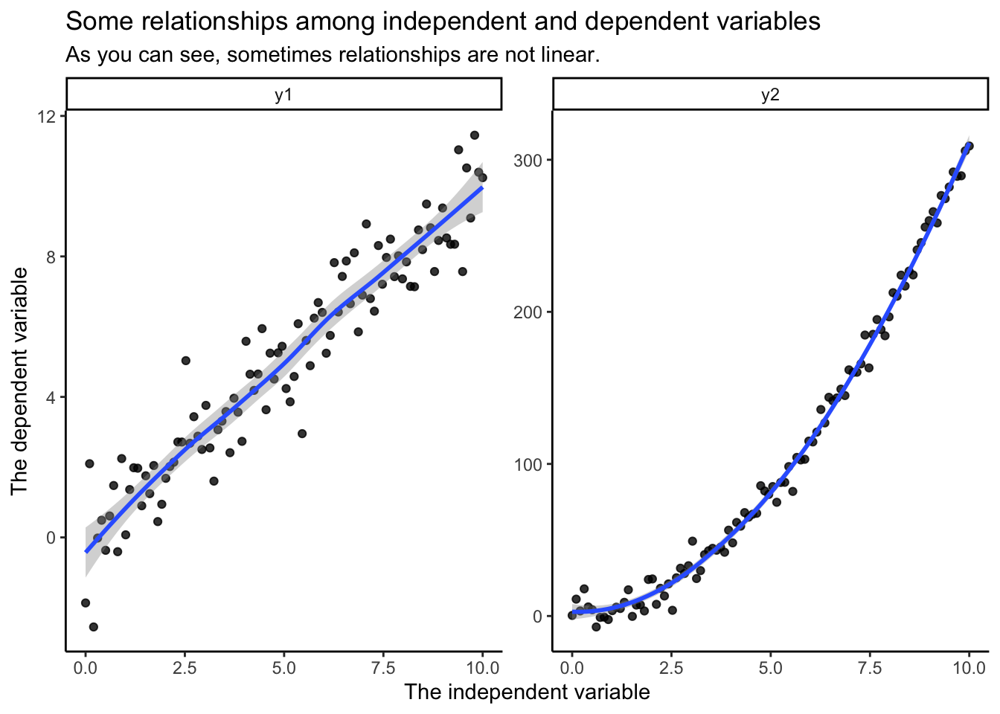

In this case, you care a lot more about the aesthetics.  You only get a limited number of plots shown to the audience's eyes, so you want to be both impactful and attractive.  While your readings [in particular @healy2019] give some advice on this, developing expertise in what is the most effective is a matter of craft--you will see examples as you read papers, and learn what works and doesn't.

### For argumentation

This might more accurately be a subcategory of [communicating to stakeholders](#stakeholders), but often you will want to use your data visualization to effectively make a point.  This is where things get a little tricky, and we will be tackling questions of data literacy and ethics a little later in the class, although if you're interested at all in this topic it may be worth investigating some of the readings in *Calling Bullshit* [@bergstrom2021] and *Data Feminism* [@dignazio2020].

Briefly, we want to make visualizations that, like [Florence Nightingale's](#nightingale), make our argument effectively--we want the interpretation that others to take away from them to be the interpretation we ourselves have made.  But we have to be cautious to not be fooling ourselves and others with bad, misleading, or even unethical choices about how we select our data and visualize it in order to advance our agenda.  There are several examples of this given in the references above, as well as a number in [Kieran Healy's work](https://socviz.co/lookatdata.html#problems-of-honesty-and-good-judgment).  

## Plotting in base R

With all that in mind, let's get into **how to plot data in R**.  To explore this, we're going to use some data from Dr. Sihui Ma's dissertation research, in which she quantified the amino acid composition of a number of different varieties of apples in Virginia.  The abstract for the paper in which these data were published [@ma2018a] is given here:

> Amino acids and ammonium ions constitute the yeast assimilable nitrogen naturally present in apple juice, with free amino acids being the major constituent. Little information is available on the extent to which free amino acid composition in apple (Malus × domestica Borkh.) juice varies among juices used for fermentation. Twenty amino acids were quantified by UPLC-PDA in juices from 13 apple cultivars grown in Virginia with potential use in cider making. The relative amino acid profile was significantly different among the apple juices evaluated. The total amino acid concentration ranged from 18 mg/L in Blacktwig juice to 57 mg/L in Enterprise juice. l-Asparagine, l-aspartic acid and l-glutamine are the principal amino acids observed in most apple juices. Our results indicate that the relative concentration of amino acids in apples is different from that found in Vitis vinifera wine grapes, which are rich in l-proline and l-arginine. The impact of these differences on fermentation of apple juice by wine yeast strains warrants further research, as the amino acid composition of grape juice impacts wine quality both directly and indirectly via yeast metabolism. These results will inform future research on yeast metabolism and nitrogen management during cider fermentation.

And here is a sample of what the data look like (without cleaning or wrangling):


```r
apples <- read_csv("Files/Week 5/apple varieties.csv")
head(apples) %>% knitr::kable()
```


|Variety          |Rep   |  His|   Asn|  Ser|  Gln|  Arg|  Gly|  Asp|  Glu|  Thr|  Ala| GABA|  Pro|  Cys|  Lys|  Tyr|  Met|  Val|  Ile|  Leu|   Phe|
|:----------------|:-----|----:|-----:|----:|----:|----:|----:|----:|----:|----:|----:|----:|----:|----:|----:|----:|----:|----:|----:|----:|-----:|
|Arkansas Black   |Rep_1 | 0.62| 10.42| 0.68| 1.60| 0.36| 0.09| 2.92| 2.37| 0.20| 0.72| 0.35| 0.26| 0.22| 0.43| 0.67| 0.98| 0.55| 1.59| 1.24|  3.25|
|Blacktwig        |Rep_1 | 0.77|  2.32| 0.54| 0.00| 0.24| 0.00| 1.96| 1.03| 0.18| 0.47| 0.15| 0.27| 0.28| 0.52| 0.83| 1.15| 0.62| 1.64| 1.51|  3.70|
|Empire           |Rep_1 | 0.46| 21.20| 0.43| 1.01| 0.27| 0.09| 5.88| 1.49| 0.28| 1.92| 0.51| 0.67| 0.21| 0.44| 0.65| 1.74| 0.52| 1.50| 1.13|  3.20|
|Enterprise       |Rep_1 | 0.52| 34.75| 0.90| 2.78| 0.24| 0.08| 5.18| 2.49| 0.33| 1.71| 0.29| 0.37| 0.22| 0.41| 0.66| 0.84| 0.63| 1.39| 1.18|  2.66|
|Field Red        |Rep_1 | 0.85|  4.02| 0.29| 0.00| 0.41| 0.00| 1.87| 1.29| 0.19| 0.33| 0.15| 0.00| 0.40| 0.55| 1.03| 1.09| 1.72| 1.82| 1.67| 13.37|
|Golden Delicious |Rep_1 | 0.56|  1.01| 0.00| 0.00| 0.34| 0.00| 1.76| 0.98| 0.32| 0.26| 0.00| 0.00| 0.33| 0.49| 0.76| 0.92| 1.50| 1.59| 1.44| 11.83|

For reference, the numerical data represent concentrations of amino acids measured as mg/L.

We are going to start with "one-line" plotting commands: simple, base R commands that produce commonly needed data visualizations.  We're going to speed through these in base R and move on to the much more powerful, flexible, and easier (although initially **bewildering**) `ggplot2`.

### Histograms with `hist()`{#histograms}

One of the most common types of data visualizations is a **histogram**.  Histograms, briefly, are a common type of data visualization that show the *approximate distribution of the data*.  In plain English, histograms in general try to show how many times a particular range of values are observed in your data.  The recipe for making a histogram is as follows:

1. Pick the value you want to visualize, call it $x$
2. Define "bins" of (usually) equal width to count data "in": for example, if your total range of values that $x$ can take is $[1,100]$, you might define 10 bins as $1-10, 11-20, ..., 91-100$.  Note that this step is something we will almost always let software do for us--we'll just pick the *number* of bins we want.
3. Count the number of times that $x$ is in each bin, and draw a bar graph with that count, with your bins on the x-axis and your counts on the y-axis.

Histograms are common because they are a good way to see how our data is distributed.  We might be interested to know, for example, whether the data is *skewed* (whether it is mostly to one or the other side of the histogram) and what counts are most common.

To draw histograms in R, we can use the `hist()` function.  By default, `hist()` just requires a single **vector** of your data ($x$ in the example above).  So, if we are interested in the distribution of alanine concentrations across all of our apple species, we can write the following command:


```r
apples %>% # start with our data
  .$Ala %>% # get the alanine concentrations
  hist(x = .) # plot the histogram; note that I don't have to write "x = ." 
```


We can see immediately that most apples have very little or no alanine, with a few varieties expressing quite a bit more.  

Note that we didn't define our bins--R picked those for us automatically.  But we might prefer to set them differently.  In this case, we can use the `breaks = ` argument in the `hist()` function.  Go ahead and use `?hist` to see what options there are for this.  You'll see there are a few ways to do this, but the easiest is just to give it a single number for the number of breaks we want, and let R figure out the bins.


```r
apples %>% # start with our data
  .$Ala %>% # get the alanine concentrations
  hist(x = ., breaks = 4) # here we're reducing the number of breaks, which is probably bad
```

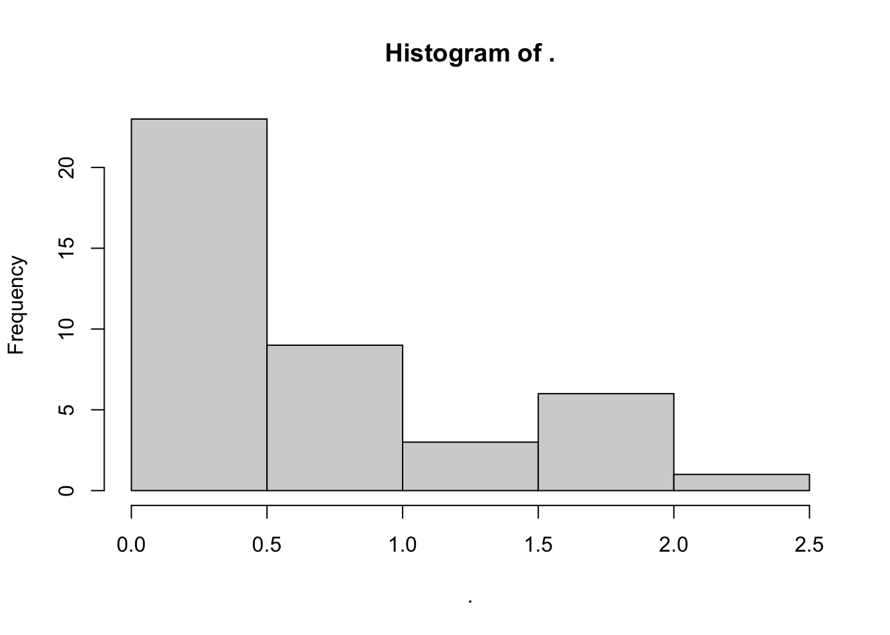

Now, it might be nice to see the distribution of concentrations of *all* amino acids across apples.  We will be returning to the subject of [**tidy data**](#tidy) later today, but for now here's an easy example:


```r
tidy_apples <- apples %>%
  pivot_longer(names_to = "amino_acid", values_to = "concentration", -c(Variety, Rep)) # This makes a single row for each combination of apple, rep, and AA

head(tidy_apples, 10) %>% # head() returns just the first n rows of a data frame so as not to overwhelm the console
  knitr::kable()
```


|Variety        |Rep   |amino_acid | concentration|
|:--------------|:-----|:----------|-------------:|
|Arkansas Black |Rep_1 |His        |          0.62|
|Arkansas Black |Rep_1 |Asn        |         10.42|
|Arkansas Black |Rep_1 |Ser        |          0.68|
|Arkansas Black |Rep_1 |Gln        |          1.60|
|Arkansas Black |Rep_1 |Arg        |          0.36|
|Arkansas Black |Rep_1 |Gly        |          0.09|
|Arkansas Black |Rep_1 |Asp        |          2.92|
|Arkansas Black |Rep_1 |Glu        |          2.37|
|Arkansas Black |Rep_1 |Thr        |          0.20|
|Arkansas Black |Rep_1 |Ala        |          0.72|

```r
tidy_apples %>% 
  .$concentration %>% # here we select the new "concentration" variable we made
  hist(breaks = 15)
```

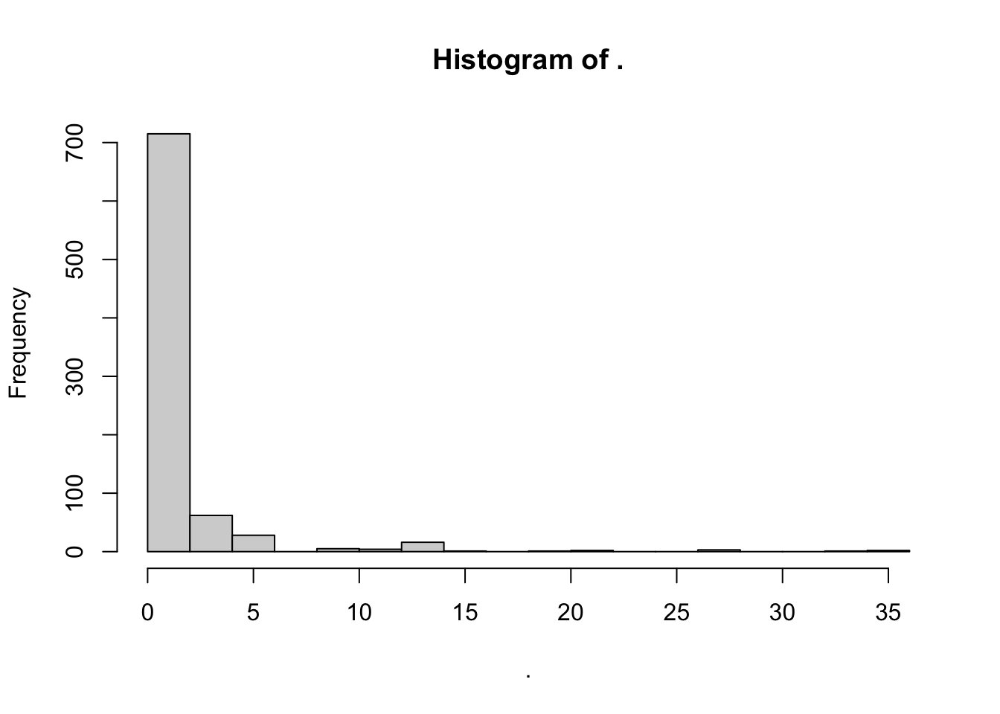

Finally, note that the title of our plot is pretty wonky: "Histogram of .".  THis is because the pipe--`%>%`--doesn't pass the column name in a way that works for `hist()`, just the data.  For purpose #1 of dataviz, this is fine--we know what we just did.  But if we wanted to share this with someone, we might want to give it a better title.  We can do that with the `main = ` argument in `hist()`.


```r
tidy_apples %>%
  .$concentration %>%
  hist(breaks = 15, main = "Histogram of amino acids (mg/L) in 13 apple varieties")
```

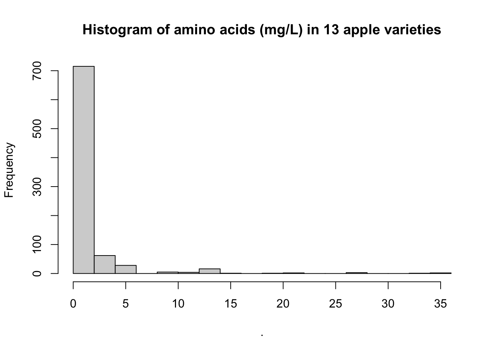

### Boxplots with `boxplot()`

Often, though, we want to know more about our variables than simply the frequency with which they take on certain values.  One of the simplest but most effective tools for this task is the **boxplot**, invented by none other than [John Tukey](#tukey).  Boxplots concisely communicate much (although not all) of the same information as histograms, but can much more easily accommodate displaying multiple variables at once.  It will be helpful to look at some boxplots first while we talk about what they're displaying:


```r
tidy_apples %>%
  boxplot(concentration ~ amino_acid, data = .) # Note that here we have to explicitly write data = ., because data is NOT the first argument
```


Boxplots display a few different statistics (points of information) about the data they describe:

1. The median, represented by a center line.
2. The 25th and 75th *percentiles* of the data, represented by the upper and lower boxes.
3. The lower and upper "plausible" bounds of the data, represented by the upper and lower "whiskers" (the lines outside the boxes).  In base R, these are defined as $1.5 \cdot IQR$ above or below the upper and lower bounds (respectively), where the **I**nter**q**uartile **R**ange is defined as the difference between the 25th and 75th percentiles, as above.  
4. Outliers, which are defined as points with values outside the whiskers.

Thus, boxplots give a quick picture of how the data are distributed, including information about skewness (the data are skewed if one or the other box and or whisker are much larger).  Boxplots also have the advantage that they allow easy comparison: in the figure above we show boxplots for all amino acids measured in the study, *across* all apple varieties--that is, if we look at alanine, the values being included in the boxplot include all 13 varieties of apple (and their replicates).

We can see from this kind of side-by-side comparison that it appears apples have relatively large amounts of asparagine and phenylalanine, as well as aspartate (unsurprisingly), but lower levels of all other amino acids.  We do still see a fair amount of variation, however. 

#### Formulas!

You might have noticed that we introduced some new notation into our plot: `concentration ~ amino_acid`.  This is an example of an R `formula` object.  You can learn more by reading the help page at `?formula`, but it's honestly kind of abstruse.  Essentially, we can read `~` in R as meaning "depends on" or "is related to".  Formulas are **always directional**--we talk about the left-hand side (LHS) and right-hand side (RHS).  Formulas get used a lot in R statistical modeling, and we'll also see them pop up all over the place, such as in the function `xtable()` (for plotting contingency tables).  Right now, you just need to read them as specified above: `concentration ~ amino_acid` is saying that the `concentration` (LHS) is dependent on the specific `amino_acid` (RHS), wich is a categorical variable telling us which amino acid is which.

This also implies we might use boxplots to explore (slice?) the data in different ways.  For example, we could ask *"Is there apparent variation in total amino acid content by apple variety?"*


```r
tidy_apples %>%
  boxplot(concentration ~ Variety, data = .) # note the new formula: concentration ~ Variety
```


While there are a large number of outliers here, it seems like on a first glance that the total amino acid content per apple isn't all that different.  We might still want to investigate specific amino acid distributions for each type of apple:


```r
tidy_apples %>%
  filter(amino_acid %in% c("Asp", "Asn", "Phe")) %>% # let's look at the most abundant AAs
  boxplot(concentration ~ Variety, data = .)
```


This starts to look like we might be seeing more variation.  But boxplots may not be the best tool to drill deeply into this.

As a closing note, we can always set options for title, axis labels, etc just as we did with `hist()`:


```r
tidy_apples %>%
  filter(amino_acid %in% c("Gln", "Gly", "Pro")) %>%
  boxplot(concentration ~ Variety, 
          data = ., 
          main = "Concentration of glycine, glutamine, and proline in 13 apple varieties",
          xlab = "Apple variety",
          ylab = "Concentration (mg/L) of glycine, glutamine, or proline")
```


### Generic `plot()`

Both `hist()` and `boxplot()` are functional shortcuts for the generic R `plot()` method.  In a very general sense, `plot()` initializes a graphical output and then accepts new objects to put into it.  `hist()`, for example, has a bunch of default options designed to draw columns, set the range on the x- and y-axes correctly, etc.

We can use `plot()` directly in two ways.  The most common is that you'll call it directly on the results of some other function or analysis.  For example, if we might run an ANOVA on our apple data in order to ask if, for phenylalanine, concentrations are dependent on apple variety:


```r
tidy_apples %>%
  filter(amino_acid == "Phe") %>%
  aov(concentration ~ Variety, data = .) %>%
  anova() %>%
  plot()
```


...this doesn't get us what we want, *at all*, but it does get us a plot!  In fact, what it's trying to do here is to plot every variable against every other variable in what is known commonly as "pair-plot".  But you can see that here we just let R decide on the plot it wants to make with the object we give it.

While this may occasionally be what you want to do, generally we will use `plot()` to systematically build up a plot. 

For example, let's say we want to see if there's some kind of relationship between aspartate and asparagine:


```r
plot(x = apples$Asn, y = apples$Asp) # Note that here we can't use the %>% easily, because we need "x = " AND "y = ".
```

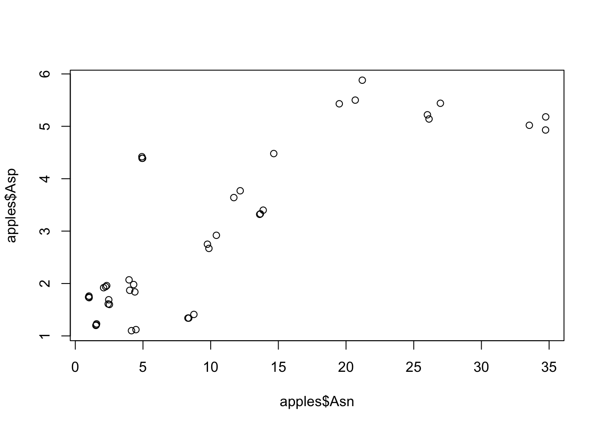

This is pretty bare bones, but it looks like there is a relationship.  Maybe we think it would be prettier if we added lines connecting each (x, y) pair to the next one in order to see if there's a trend:


```r
plot(x = apples$Asn, y = apples$Asp, type = "b") # "b" = BOTH a line and the points
```

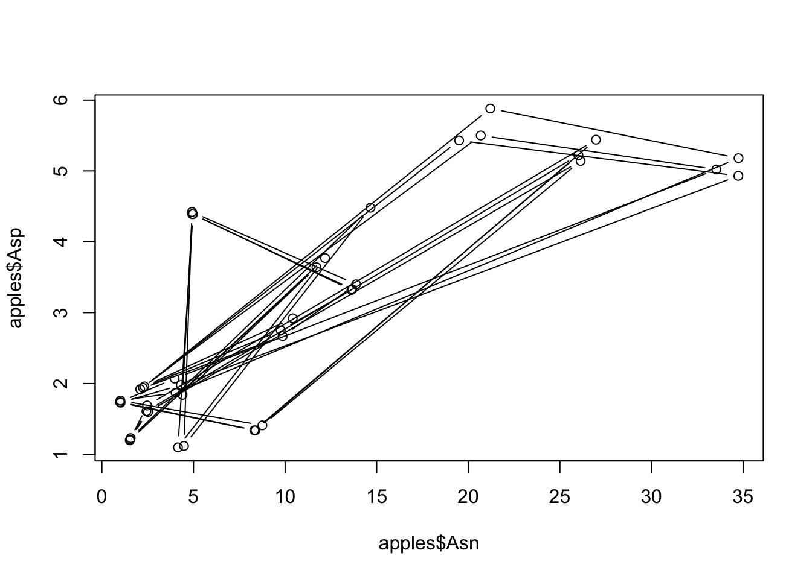

Yikes!  That looks terrible!  Unfortunately, that's kind of common for any kind of computer program, because our first rule here applies: this is powerful and fast, but also does exactly what we ask, *not what we want*.  In this particular case, that's because our pairs aren't ordered:


```r
apples %>%
  select(Variety, Asn, Asp) %>%
  head(10) %>%
  knitr::kable()
```


|Variety          |   Asn|  Asp|
|:----------------|-----:|----:|
|Arkansas Black   | 10.42| 2.92|
|Blacktwig        |  2.32| 1.96|
|Empire           | 21.20| 5.88|
|Enterprise       | 34.75| 5.18|
|Field Red        |  4.02| 1.87|
|Golden Delicious |  1.01| 1.76|
|Granny Smith     |  8.76| 1.41|
|Newtown Pippin   | 26.13| 5.14|
|Northern Spy     |  2.52| 1.60|
|Rome             |  1.57| 1.23|

If we really want that kind of plot (perhaps our lines are meant to show the trend clearly?) we need to order our points into the order we expect them to show up on the plot:


```r
apples %>%
  select(Variety, Asn, Asp) %>%
  arrange(Asn, Asp) %>% # we can sort our data by Asn, then by Asp
  with(., plot(x = Asn, y = Asp, type = "b")) # the with() function creates a new environment and lets us use %>% here
```

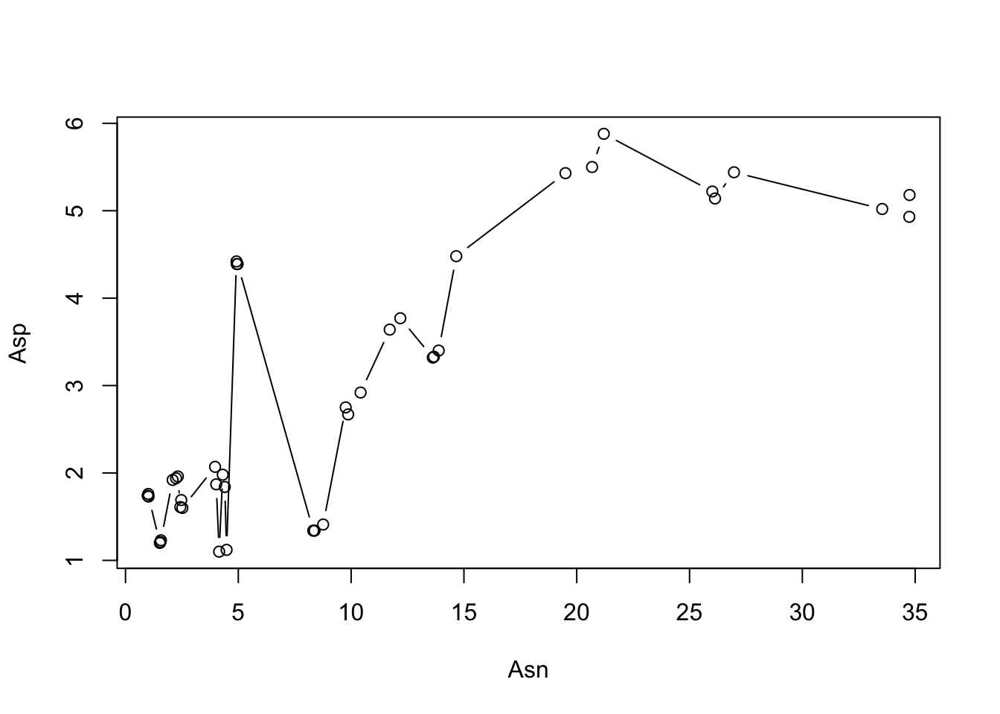

Just as with `hist()` and `boxplot()`, we can also easily change titles and axis labels for clarity:


```r
plot(x = apples$Asn, y = apples$Asp, 
     main = "Relationship of Asn and Asp in 13 apple varieties",
     xlab = "Asparagine (mg/L)",
     ylab = "Aspartate (mg/L)")
```

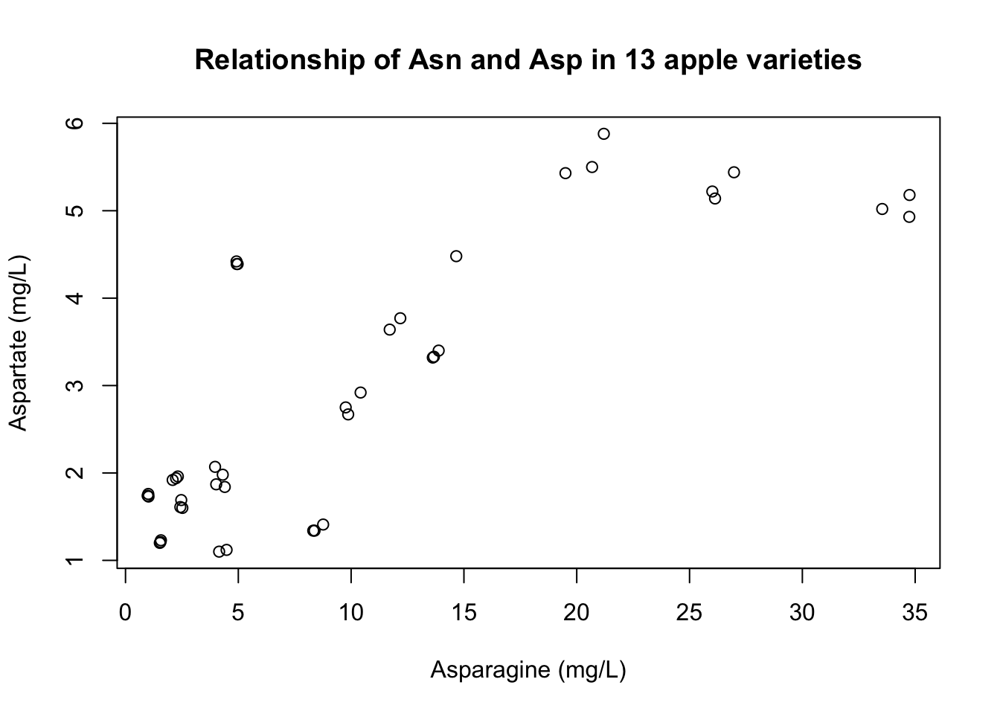

#### Adding `points()`

But beyond just changing labels, we can do a lot of construction on our generic visualizations from `plot()`.  R uses an **additive** approach to plotting.  Once we have a plot, we have the option of adding the `add = TRUE` argument to any plotting functions to (attempt to) plot our new elements right onto the previous plot.  We might want to do this to:

* Add some new data to the plot (like points we hadn't plotted before)
* Add a fitted model (like a curve representing a regression) to the plot
* Add some annotations to the plot

We will go over the first two use cases here, but because we're going to be emphasizing tidy plotting using `ggplot2` for most of the class, we won't be concentrating on every possible way to implement plot options in base R--there are just too many!  But know that you can do many things that are very powerful in R plotting, even without learning `ggplot2` (which is easier, anyway).

Now, imagine we wanted to plot the relationship between asparagine and aspartate **and** phenylalanine.  The `plot()` function only accepts one `x = ` and one `y = ` argument, so how can you plot both?  Assuming we want to use asparagine as our x variable, and plot it against aspartate and against phenylalanine, we might take an approach like the following


```r
plot(x = apples$Asn, y = apples$Asp, xlab = "Asparagine (mg/L)", ylab = "Concentration (mg/L)") # make our previous plot
points(x = apples$Asn, y = apples$Phe, col = "red") # add points with y-values from the phenylalanine concentrations
legend(x = "bottomright", legend = c("aspartate", "phenylalanine"), col = c("black", "red"), pch = 1)
```

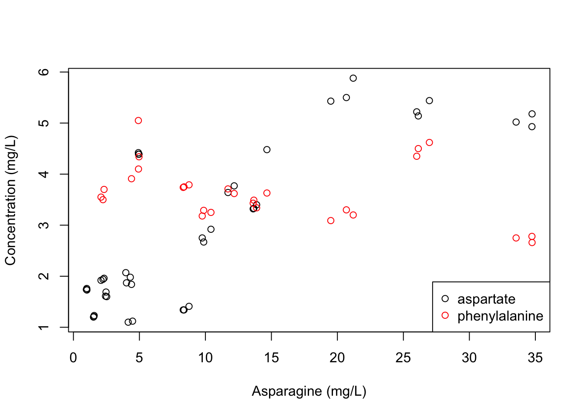

Now, I will be the first to agree that this isn't a particularly pretty or useful plot, but it *did* do what we asked.  We can see that the relationship between phenylalanine concetration and asparagine concentration seems much weaker than between asparagine and aspartate (which makes sense).  

You might also be noting the `legend()` function here--this is one base R way of adding annotation to a plot.  While the syntax is pretty arcane, I think it will illustrate some of the ways that R thinks if I describe what's happening:

* `x` is a placeholder for a text string to say where to put the legend
* The `legend = ` argument asks what *entries* you want in the legend
* `col = ` lets you set the color of each legend entry, in the same order they are in `legend = `
* `pch = ` lets you set the shape of your legend entries, in the same order they are in `legend = `.  Because we didn't make different shapes in this plot, both are shape "1", which is equivalent to the open circle.

You can learn more about the shapes and colors (and other attributes, like size) that you can set for points in R by looking at `?points`.

#### Adding lines with `abline()`

Let's continue with this example.  We want to know whether there is a relationship between asparagine concentration and both aspartate and phenylalanine.  It appears there is some kind of relationship between asparagine and aspartate: higher values of asparagine concentration generally are associated with higher values of aspartate.  The same does not appear to be true for phenylalanine.

As you know from stats class, this is a classic linear regression question.  We'll learn more about this in later classes, but the way we run linear regression in R is using the `lm()` function.  We are going to ask for simple linear regressions describing our research question, and then plot the resulting regression lines onto our plot--we are going to **add lines to this plot**.


```r
asp_model <- lm(Asp ~ Asn, data = apples) # we will save our model.  Note the formula syntax again!
phe_model <- lm(Phe ~ Asn, data = apples) # What is different about this line?
asp_model
```

```
## 
## Call:
## lm(formula = Asp ~ Asn, data = apples)
## 
## Coefficients:
## (Intercept)          Asn  
##      1.6214       0.1289
```

```r
phe_model
```

```
## 
## Call:
## lm(formula = Phe ~ Asn, data = apples)
## 
## Coefficients:
## (Intercept)          Asn  
##      9.3494      -0.2581
```

These models are complex R objects (what happens if you use `typeof()`, `str()`, and `class()` on `asp_model`?), but their default print value is to give you the coefficients of the regression model you've fitted.  For example, the linear model fit is $\hat{Asp} = 0.1288706 \cdot Asn + 1.6213577$.  We can directly access these using the `coefficients()` function, if we want to, and also get some more info using the `summary()` function.

But we are most interested in plotting!  The `abline()` function adds a line to any plot in the $y = a + b \cdot x$ format common to algebra, and because R is built around statistics it turns out that `abline()` can directly plot linear models.


```r
# First we will recreate our previous plot
plot(x = apples$Asn, y = apples$Asp, xlab = "Asparagine (mg/L)", ylab = "Concentration (mg/L)") # make our previous plot
points(x = apples$Asn, y = apples$Phe, col = "red") # add points with y-values from the phenylalanine concentrations
legend(x = "bottomright", legend = c("aspartate", "phenylalanine"), col = c("black", "red"), pch = 1)

# And now we can use abline() to add our two model fits
abline(asp_model, col = "black") # make sure the color matches the points!
abline(phe_model, col = "red")
```

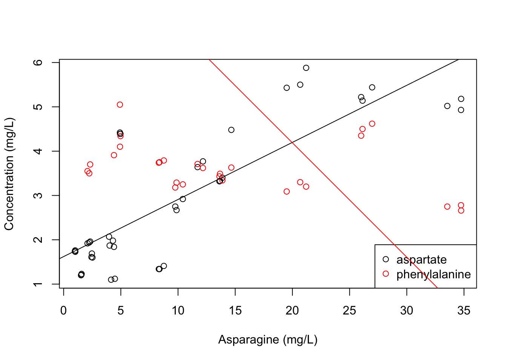

Oh no!  That looks terrible for two reasons.

1. The phenylalanine fit goes over the legend.  This tells us something about *how* R is building these plots: it puts each layer on top of the previous ones.  So, we can reorganize the order in which we add elements by calling `legend()` *last* in order to fix this.
2. The phenylalanine fit doesn't look like it fits our plot very well, does it?  But in fact, it does!  This is a lesson, once again, in **how R does what you _ask_, not what you want**.

What happened?  Well, the we never actually looked at just a plot of `phenylalanine ~ asparagine` (in R formula syntax):


```r
with(apples, plot(x = Asn, y = Phe, col = "red")) # I am using the with() syntax as a demonstration again
```

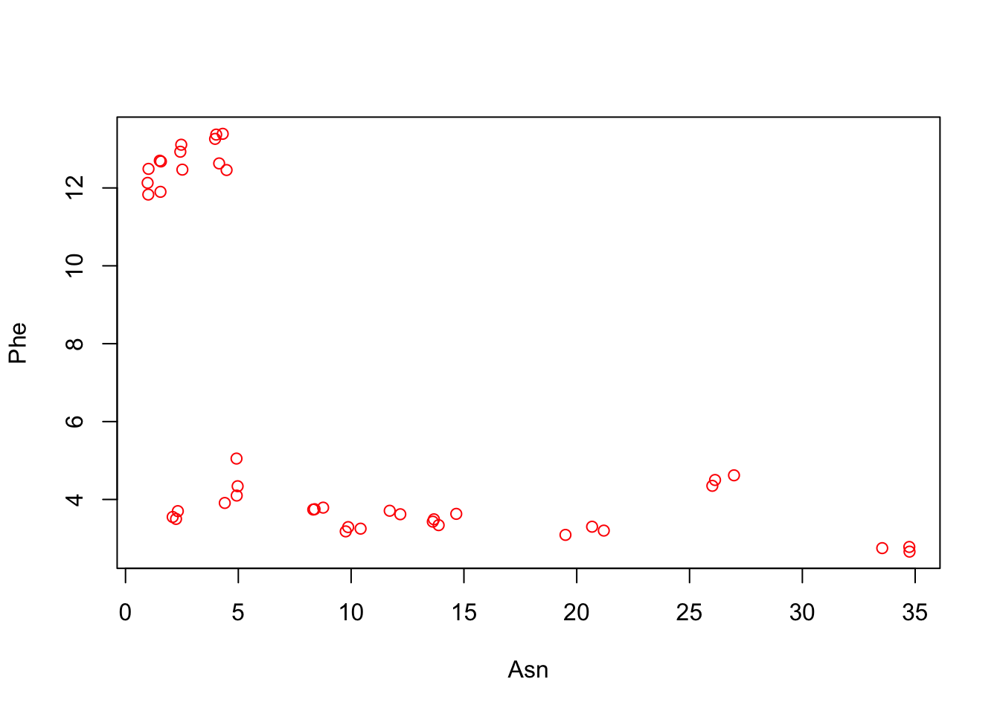

When we look at *this* plot it is clear that a cluster of points was *outside of the range* of our original plot.  This is because, in base R, `plot()` draws a "canvas" or "area" based on the original data--all subsequent additions are fit into (or chopped out of) this plot.  So R happily made us a plot of `aspartate ~ asparagine` and then, when we asked to add phenylalanine, it just didn't put in the points outside that area!  Here's what happens if we reverse the whole sequence:


```r
plot(x = apples$Asn, y = apples$Phe, col = "red", xlab = "Asparagine (mg/L)", ylab = "Concentration (mg/L)")
points(x = apples$Asn, y = apples$Asp, col = "black")
abline(asp_model, col = "black")
abline(phe_model, col = "red")
legend(x = "bottomright", legend = c("aspartate", "phenylalanine"), col = c("black", "red"), pch = 1, lty = 1)
```

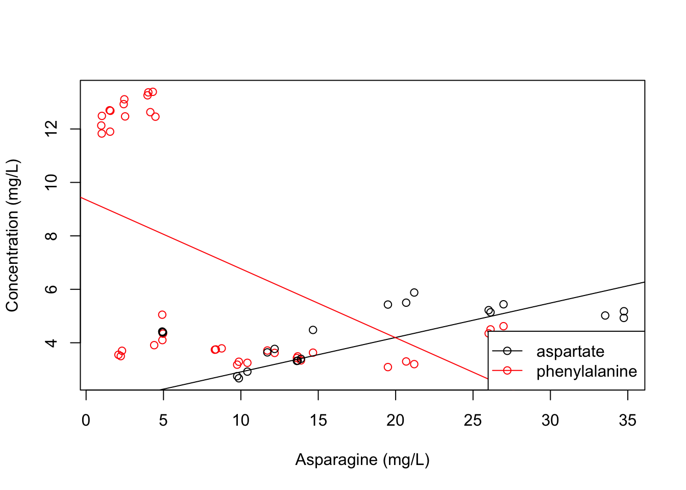

Now we see the whole story.  Of course, part of that story is that a linear fit is probably not sensible for this particular model, but now we at least can see why these fits are being produced.

In many ways this workflow is a good demonstration of the use of dataviz in order to explore your own data.  Step by step we encountered unexpected things and used our tools in R to understand where they came from.  Of course, at the same time we learned about how to render plots in R.

### Saving plots to file

Once you have a plot in R you might want to know how to save it.  Of course, in R Markdown the plot gets rendered into your knitted file, but how can you save the file to disk, perhaps to use in a presentation or a paper?

One way that **you should NOT do this** is by using the RStudio Export menu in the Plot pane:


For whatever reason, this is one of the weakest utilities built into RStudio.  It rarely outputs in high enough resolution for modern usage, and gives you very little control over size and aspect ratio.  **Don't use it.**

Instead, unfortunately, you will have to use R's somewhat arcane (to non-programmers) **graphic device interface**.  By default, RStudio outputs to the Plot Pane as the "graphic device".  Instead, if you want to write an image to disk, you need to tell it to use a new graphic device by telling R to do so explicitly, using one of the device commands: `jpeg()`, `png()`, and less commonly `tiff()` or `bmp()`.  Generally you will want to use the PNG format for modern software.

To do so, you follow the following recipe:

1. Create a new graphic device by calling one of the functions (like `jpeg()`) with the appropriate options.  This makes an *empty* image file on your disk.
2. Run the plotting functions you normally want to run.
3. Use the function `dev.off()` to close the graphic device, stop editing the image file, and revert to plotting in R.

So, for example, the following code will write our plot to a PNG with the name "asn_vs_asp_and_phe.png".


```r
# Open a new graphic device
png(filename = "asn_vs_asp_and_phe.png", width = 8, height = 6, units = "in", res = 300)

# All of this code is just our plot from before
plot(x = apples$Asn, y = apples$Phe, col = "red", xlab = "Asparagine (mg/L)", ylab = "Concentration (mg/L)")
points(x = apples$Asn, y = apples$Asp, col = "black")
abline(asp_model, col = "black")
abline(phe_model, col = "red")
legend(x = "bottomright", legend = c("aspartate", "phenylalanine"), col = c("black", "red"), pch = 1, lty = 1)

# And this code turns off that connection and returns us to the RStudio Plot Pane
dev.off()
```

```
## quartz_off_screen 
##                 2
```

You'll see that, unlike our previous code chunks, this one doesn't print anything in the Markdown.  That's because it has instead redirected the plotting output to the file we specified.  If we forgot to run `dev.off()`, we'd end up continuing to send out plotting output to that same file--definitely not something we want to do!

While that seems like a lot of work, in general once you understand the steps it becomes somewhat natural.  All of the arguments for `png()` have to do with the size and resolution of the plot--you can learn about them by reading `?png`.

## The 'grammar of graphics': `ggplot2`

We've now learned a bit about how base R treats plotting, although we've really only scratched the surface.  By using `plot()` on many different outputs from different R modeling functions (like `lm()`, etc), you will be able to automatically make many default plots.  But as you can see the default, while very customizable, is also somewhat arcane and difficult to use.  it also doesn't have great default settings--you'll notice that our plots, while clear, are not particularly compelling looking.

This is where `ggplot2` comes in.  The name for this package, which is part of the `tidyverse`, comes from the "**G**rammar of **G**raphics", a conceptual framework for theorizing the elements of a visualization.  These are explained in some detail in [Chapter 3](https://r4ds.had.co.nz/data-visualisation.html) and [Chapter 24](https://r4ds.had.co.nz/graphics-for-communication.html) of *R for Data Science* [@wickham2017], and [Kieran Healy's book](https://socviz.co/) [@healy2019], while not going into the theory, gives a detailed explanation.

In my typical, vague and hand-wave-y fashion, here is my summary of the innovation that `ggplot2` encodes and makes accessible to the average R user:

1. We can break down the elements of a data visualization systematically.
    1. *Mappings*, which connect data to visual elements, like coordinates on a graph, colors, or other *aesthetic* elements of a plot
    2. *Geoms*, which dictate how to take the mapped elements and render them into visual elements, such as a boxplot, points, or lines
    3. Visual aspects of the plot which are unrelated to data, such as the overall theme, background color, font choice, etc
2. Treating data visualizations as cousins to data frames or tibbles lets us easily manipulate them without having to restart them from scratch when we make mistakes or discover new ways we want to treat the plot or data.
3. Breaking apart these elements allows us to swap parts in and out without redoing all our previous work, for example we could change the x-axis scale without changing anything else, or change the color of our points or our title.

### Anatomy of a `ggplot()`

To use `ggplot2`, you'll have to load the package, which you have already done if you ran `library(tidyverse)` at the start of this R Markdown.

The basic command structure looks more complicated than the `plot()` functions we've been using so far:


```r
# The ggplot() function creates your plotting environment.  We usually save it to a variable in R so that we can use the plug-n-play functionality of ggplot without retyping a bunch of nonsense
p <- ggplot(mapping = aes(x = <a variable>, y = <another variable>, ...),
            data = <your data>)

# Then, you can add various ways of plotting data to make different visualizations.
p + 
  geom_<your chosen way of plotting>(...) +
  theme_<your chosen theme> +
  ...
```

In graphical form, the following diagram ([from VT Professor JP Gannon](https://vt-hydroinformatics.github.io/Plotting.html#our-first-ggplot)) gives an intuition of what is happening:


To use `ggplot()`, your `data` will usually have to be in "tidy" format: that is, long rather than wide.  We've already talked about Wickham's [-@wickham2017] [definition](https://r4ds.had.co.nz/tidy-data.html), and Kieran Healy [-@healy2019] takes [another crack at it here](https://socviz.co/makeplot.html#tidy-data).

In our example, the original `apples` data frame is not tidy:


```r
head(apples) %>%
  knitr::kable()
```


|Variety          |Rep   |  His|   Asn|  Ser|  Gln|  Arg|  Gly|  Asp|  Glu|  Thr|  Ala| GABA|  Pro|  Cys|  Lys|  Tyr|  Met|  Val|  Ile|  Leu|   Phe|
|:----------------|:-----|----:|-----:|----:|----:|----:|----:|----:|----:|----:|----:|----:|----:|----:|----:|----:|----:|----:|----:|----:|-----:|
|Arkansas Black   |Rep_1 | 0.62| 10.42| 0.68| 1.60| 0.36| 0.09| 2.92| 2.37| 0.20| 0.72| 0.35| 0.26| 0.22| 0.43| 0.67| 0.98| 0.55| 1.59| 1.24|  3.25|
|Blacktwig        |Rep_1 | 0.77|  2.32| 0.54| 0.00| 0.24| 0.00| 1.96| 1.03| 0.18| 0.47| 0.15| 0.27| 0.28| 0.52| 0.83| 1.15| 0.62| 1.64| 1.51|  3.70|
|Empire           |Rep_1 | 0.46| 21.20| 0.43| 1.01| 0.27| 0.09| 5.88| 1.49| 0.28| 1.92| 0.51| 0.67| 0.21| 0.44| 0.65| 1.74| 0.52| 1.50| 1.13|  3.20|
|Enterprise       |Rep_1 | 0.52| 34.75| 0.90| 2.78| 0.24| 0.08| 5.18| 2.49| 0.33| 1.71| 0.29| 0.37| 0.22| 0.41| 0.66| 0.84| 0.63| 1.39| 1.18|  2.66|
|Field Red        |Rep_1 | 0.85|  4.02| 0.29| 0.00| 0.41| 0.00| 1.87| 1.29| 0.19| 0.33| 0.15| 0.00| 0.40| 0.55| 1.03| 1.09| 1.72| 1.82| 1.67| 13.37|
|Golden Delicious |Rep_1 | 0.56|  1.01| 0.00| 0.00| 0.34| 0.00| 1.76| 0.98| 0.32| 0.26| 0.00| 0.00| 0.33| 0.49| 0.76| 0.92| 1.50| 1.59| 1.44| 11.83|

Each row contains data about 1 apple variety in 1 analytical rep, but there are multiple amino acid observations in each row--we can say that the columns are an unrecorded variable--`amino_acid`--which is spread "wide" across those columns.  In contrast, our `tidy_apples` dataset has only one observation per row:


```r
head(tidy_apples) %>%
  knitr::kable()
```


|Variety        |Rep   |amino_acid | concentration|
|:--------------|:-----|:----------|-------------:|
|Arkansas Black |Rep_1 |His        |          0.62|
|Arkansas Black |Rep_1 |Asn        |         10.42|
|Arkansas Black |Rep_1 |Ser        |          0.68|
|Arkansas Black |Rep_1 |Gln        |          1.60|
|Arkansas Black |Rep_1 |Arg        |          0.36|
|Arkansas Black |Rep_1 |Gly        |          0.09|

For example, in row 3 of this dataset, we have a single observation: the concentration of `amino_acid = Ser` for `Rep = 1` of `Variety = Arkansas Black` is 0.68 mg/L.  This kind of data is easier to do operations like filtering, selecting, and otherwise manipulating, and, as we'll see, it is easier to plot, especially ing `ggplot2`.   However, this doesn't mean wide data is "bad" or "wrong"--it is often much more convenient for humans to read and for a number of multivariate analyses.  We'll [see below](#tidy) how we can easily go between wide/long data using `pivot_*()` functions, which will let us get data easily into the formats we want.

To return to our example, let's take a look at recreating our [histogram of all apple varieties and all amino acids](#histograms).


```r
# First we can create a ggplot() object that stores what variable we want to plot through the "mapping" of an aesthetic function
p <- tidy_apples %>%
  ggplot(data = ., # the "data = ." argument is written out for clarity
         mapping = aes(x = concentration)) 

# If we try to plot p, we will see only the blank canvas because we haven't defined any geoms
plot(p)
```


```r
# Then we add elements to the plot
p2 <- p + 
  geom_histogram(color = "black", fill = "grey") +
  theme_classic() + # This changes the theme to a nicer, "R style" plot
  labs(x = "Amino acid concentration (mg/L)") # This relabels the x-axis with a more descriptive label

# We can actually plot ggplots by just calling them directly
p2
```


While that doesn't seem so impressive compared to the ease of a one-stop function like `hist()`, you should be able to start to see how we can add and subtract elements to change our plots around, as well as being able to save them and print them again and again at will.  This lets us do several things:

1. We can build up plots step-by-step in order to make sure we've got everything right, avoiding mistakes like our scale problem in our scatterplot above.
2. We can do complex things like, for example, breaking out our plots by some kind of grouping variable ("faceting"):


```r
p2 + 
  facet_wrap(~amino_acid)
```


Now *that's* pretty cool.  It also points to the importance of tidy data for this kind of plotting--we are able to essentially tell `ggplot()` "pull out all the data that is tagged with distinct values of `amino_acid` in that column and plot them individually."

#### WHAT THE HECK IS `+` doing ???

Ok, let's start unpicking this.  The first thing you have probably noticed about `ggplot()` is the way that you build the plots: by using `+` to *literally* add new elements or themes or other things to the plot.  This is contrary to both everything in base R (there we just ran plotting functions sequentially) and `tidyverse` conventions (which generally use the `%>%` to do something similar).

The short story is that, in fact, it would be better if `ggplot2` used `%>%`, and someday it will.  But it is older than the rest of the tidyverse, and so was programmed using both different syntax and slightly different underlying functional programming, so it doesn't work with `%>%`.  

I personally think it's easiest to think of `+` in `ggplot2` as literal.  When you see it, read it as "and then add `<this element>`...", rather than "pass what's on the left hand side to the right hand side".  So it works a lot like the pipe, but is not interchangeable.

#### The `aes()` function/argument

The `ggplot()` function takes two arguments that are essential, as well as some others you'll rarely use.  The first, `data = `, is straightforward, and you'll usually be passing data to the function at the end of some pipeline using `%>%`

The second, `mapping = `, is less clear.  This argument requires the `aes()` function, which can be read as the "aesthetic" function.  The way that this function works is quite complex, and really not worth digging into here, but I understand it in my head as **telling `ggplot()` what part of my data is going to connect to what part of the plot**.  So, if we write `aes(x = concentration)`, we can read this in our heads as "the values of x will be mapped from the 'concentration' column". 

This sentence tells us the other important thing about `ggplot()` and the `aes()` mappings: **mapped variables each have to be in their own column**.  This is another reason that `ggplot()` requires tidy data.  Let's look again at the original apples data:


```r
apples %>%
  head(10) %>%
  knitr::kable()
```


|Variety          |Rep   |  His|   Asn|  Ser|  Gln|  Arg|  Gly|  Asp|  Glu|  Thr|  Ala| GABA|  Pro|  Cys|  Lys|  Tyr|  Met|  Val|  Ile|  Leu|   Phe|
|:----------------|:-----|----:|-----:|----:|----:|----:|----:|----:|----:|----:|----:|----:|----:|----:|----:|----:|----:|----:|----:|----:|-----:|
|Arkansas Black   |Rep_1 | 0.62| 10.42| 0.68| 1.60| 0.36| 0.09| 2.92| 2.37| 0.20| 0.72| 0.35| 0.26| 0.22| 0.43| 0.67| 0.98| 0.55| 1.59| 1.24|  3.25|
|Blacktwig        |Rep_1 | 0.77|  2.32| 0.54| 0.00| 0.24| 0.00| 1.96| 1.03| 0.18| 0.47| 0.15| 0.27| 0.28| 0.52| 0.83| 1.15| 0.62| 1.64| 1.51|  3.70|
|Empire           |Rep_1 | 0.46| 21.20| 0.43| 1.01| 0.27| 0.09| 5.88| 1.49| 0.28| 1.92| 0.51| 0.67| 0.21| 0.44| 0.65| 1.74| 0.52| 1.50| 1.13|  3.20|
|Enterprise       |Rep_1 | 0.52| 34.75| 0.90| 2.78| 0.24| 0.08| 5.18| 2.49| 0.33| 1.71| 0.29| 0.37| 0.22| 0.41| 0.66| 0.84| 0.63| 1.39| 1.18|  2.66|
|Field Red        |Rep_1 | 0.85|  4.02| 0.29| 0.00| 0.41| 0.00| 1.87| 1.29| 0.19| 0.33| 0.15| 0.00| 0.40| 0.55| 1.03| 1.09| 1.72| 1.82| 1.67| 13.37|
|Golden Delicious |Rep_1 | 0.56|  1.01| 0.00| 0.00| 0.34| 0.00| 1.76| 0.98| 0.32| 0.26| 0.00| 0.00| 0.33| 0.49| 0.76| 0.92| 1.50| 1.59| 1.44| 11.83|
|Granny Smith     |Rep_1 | 0.61|  8.76| 0.34| 0.00| 0.31| 0.10| 1.41| 0.58| 0.38| 0.42| 0.00| 0.23| 0.37| 0.56| 1.49| 1.28| 1.66| 2.00| 1.62|  3.79|
|Newtown Pippin   |Rep_1 | 0.33| 26.13| 1.01| 1.36| 0.67| 0.13| 5.14| 3.23| 0.57| 1.03| 0.54| 0.28| 0.36| 0.60| 0.94| 1.38| 0.85| 2.12| 1.39|  4.50|
|Northern Spy     |Rep_1 | 0.51|  2.52| 0.17| 0.00| 0.23| 0.00| 1.60| 1.05| 0.35| 0.34| 0.00| 0.00| 0.35| 0.53| 1.24| 1.34| 1.52| 2.04| 1.25| 12.47|
|Rome             |Rep_1 | 0.36|  1.57| 0.20| 0.00| 0.43| 0.08| 1.23| 0.91| 0.34| 0.23| 0.00| 0.00| 0.33| 0.54| 0.80| 1.02| 1.63| 1.92| 1.46| 12.68|

Here we have a data frame that is cleaned and well organized, but it is **wide**.  The variable that is used for **faceting** above to make the previous plot--the name of the amino acid being measured in each column--is spread out over the column names, and so `ggplot()` can't easily find it in order to make this nice kind of faceted plot.  It *is* possible to do this kind of faceting in base R (with or without tidy data) using control-flow and the `par()` function--I leave it to you as an exercise to try it, as a way to develop programming skills.

In our example, we used `aes()` to map the `x = concentration` in the original call to `ggplot()`, and then added elements to that original, blank canvas.  You'll note, in particular, that we *didn't* tell `geom_histogram()` that the x-values it was counting were coming from conentration.  This is one of the key rules of `ggplot()`: **each additional element of a plot _inherits_ the mappings of the plot from the base function**.


```r
p3 <- p + 
  geom_histogram(aes(fill = Variety), color = "black", lwd = 0.1) +
  theme_classic()
p3
```

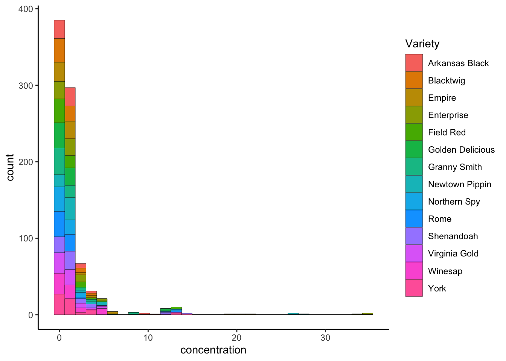

So, in this plot, we've colored each column in the same histogram as before with the number of counts that come from different types of apples.  This isn't super useful as a visualization, but it does demonstrate the principle: `geom_histogram()` inherited the aesthetic mapping of `x = concentration` from the previous statement (`ggplot()`).  We *didn't have to set it*.

It *also* demonstrates a second principle: each subsequent addition to a plot can add new aesthetics.  In our case, *within* `geom_histogram()` we set `mapping = aes(fill = Variety)`, which told `ggplot()` to (automatically) assign a different color to each unique value of `Variety` (why is it "`fill`" and not "`color`"?).  You'll also note that `ggplot()` then *automatically* made a legend for us in the plot, showing us the choices it had made.  

#### Settings outside of `aes()`

You may also have noticed in the previous plot that we *did* also set a `color = ` argument in the `geom_histogram()` function--but *outside* the whole `mapping = aes(<stuff>)` argument.  This is what we might call a "set" variable, as opposed to a "mapped" variable (which are all *within* `aes()`).  We wrote `color = "black"`, which tells `ggplot()` and specifically the `geom_histogram()` part of `ggplot()` to **not** look for a variable to map to color, but just to set it to `"black"`.  This is a shortcut to one of the colors that R knows about--you can get a full list of these by running `colors()`.

In general, in `ggplot()` if we want the data visualization to programmatically assign some aesthetic aspect of the plot from a variable in our data, we will want to **map** that aesthetic using the `mapping = aes()` argument construction, either in `ggplot()` or in one of the subsequent layer functions.  If we want to set an aesthetic aspect to be constant, we **set** it in the function argument outside of `aes()` to be a constant.

Based on this principle, what is going wrong in this plot?  This is one of the most common problems in `ggplot()`.


```r
tidy_apples %>%
  ggplot(aes(x = concentration, fill = "blue")) +
  geom_histogram(color = "black", lwd = 0.1) +
  theme_classic()
```

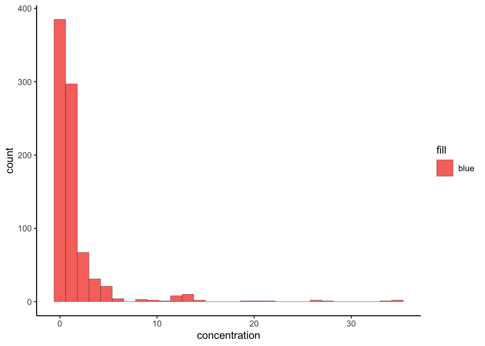

#### Themes with `theme_*()`

I've ended all of my plots using `ggplot()` with the addition of `theme_classic()`.  In `ggplot()`, **themes** encompass everything about the plot that doesn't depend on data at all.  Things like the way the legend is printed, whether or not there is a coordinate grid displayed on the plot, the background color, etc--these are all related to themes.  `ggplot2` comes with a bunch of shortcut themes that you can apply, like `theme_classic()`, `theme_minimal()`, `theme_bw()`, etc.


```r
p2 + 
  theme_dark()
```


If you need to manipulate individual aspects of a plot, you may need to use the general `theme()` function.  This allows you to very precisely manipulate aspects of the theme, but it is not very user friendly.  This is one of the points where a developed sense of "how do I search Stack Exchange for this?" will be your friend!


```r
p2 + 
  theme(axis.title.x = element_text(face = "italic"),
        axis.title.y = element_blank())
```


#### All these damn `scale_*()` functions

Finally, say we didn't like the default color set for the filled bars in our histogram.  How can we manipulate the colors that are plotted?  The **way in which** mapped, aesthetic variables are assigned to visual elements is controlled by the `scale_*()` functions.  In my experience, the most frequently encountered scales are those for color: either `scale_fill_*()` for solid objects (like the bars in a histogram) or `scale_color_*()` for lines and points (like the outlines of the histogram bars).  

Scale functions work by telling `ggplot()` *how* to map aesthetic variables to visual elements.  So, in the case of our histogram, we have mapped different values of `Variety` to different fill colors, but we haven't actually told `ggplot()` *which* colors we want.  We can do this with `scale_fill_*()`.


```r
p3 + 
  scale_fill_viridis_d() # this is just one option - use tab-completion to see some others
```


`ggplot2` has a broad range of built-in options for scales, but there are many others available in add-on packages that build on top of it.  You can also build your own scales using the `scale_*_manual()` functions, in which you give a vector of the same length as your mapped aesthetic variable in order to set up the visual assignment.  That sounds jargon-y, so here is an example:


```r
# We'll pick 14 random colors from the colors R knows about
random_colors <- print(colors()[sample(x = 1:length(colors()), size = 14)])
```

```
##  [1] "palegoldenrod" "deepskyblue2"  "purple1"       "goldenrod1"   
##  [5] "orchid1"       "chocolate"     "seagreen2"     "mediumpurple" 
##  [9] "sienna"        "orchid2"       "mediumorchid1" "steelblue3"   
## [13] "olivedrab2"    "lightsalmon3"
```

```r
p3 + 
  scale_fill_manual(values = random_colors)
```

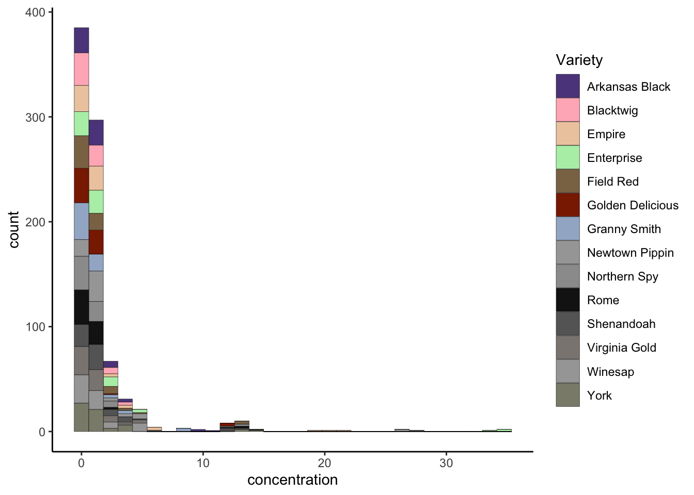

Obviously this doesn't produce *good* results, but it illustrates how you can use this function to set colors the way you'd like.

#### Faceting (making multiple plots)

The final bit of recipe we've seen so far is the `facet_wrap()` function, which--still almost magically, to me--splits our plot into multiple **facets** according to the specified variable(s).  The classic interface for this uses R expressions--the `~` notation--but there are now other options, which are detailed if we inspect the `?facet_wrap` documentation.


```r
p3 +
  facet_wrap(~Rep)
```

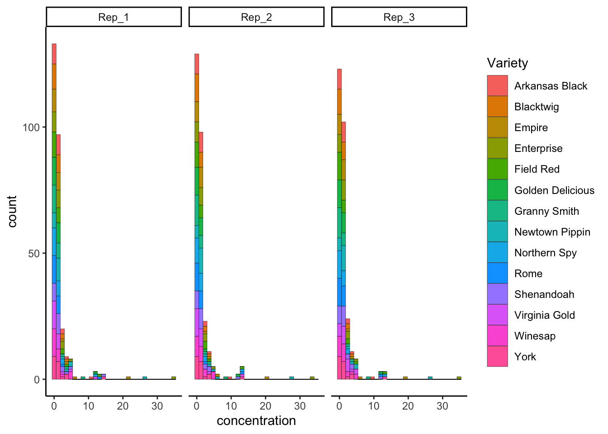

The only difference is that we must write a "one-sided" function: leave the left-hand side (LHS) of the expression empty.

We can actually facet by multiple variables.  Remember that every combination of variables will make one facet in the array of plots, so you want to be cautious or all of your plots will be illegible.  That's why I am going to filter our data and show this off with just a few apple varieties:


```r
tidy_apples %>%
  filter(Variety %in% c("Arkansas Black", "Granny Smith", "Northern Spy")) %>%
  ggplot(mapping = aes(x = concentration)) +
  geom_histogram(aes(fill = Variety), color = "black", lwd = 0.2) + 
  facet_wrap(~Variety + Rep) + 
  theme_classic()
```


We can also set up the arrangement of the grid by manipulating the `nrow = ` and `ncol = ` arguments, just like when we make a `matrix()`.

There is a companion function for `facet_wrap()` named `facet_grid()`.  Test out your ability to read help files to figure out what the difference between the two are.

### Common recipes for basic tasks

Now that we have the start of a grasp on how `ggplot2` works, let's look at a few of the common visualizations that you'd want to use for your own data exploration or for publication--the main tasks of dataviz.

#### Histograms with `geom_histogram()`/`geom_density()`

We've already thoroughly explored how to make histograms from our apple data with `geom_histogram()`.  A related option that gives a little more information, especially for large, continuous dataset is called a *density plot*.  These visualize an *empirical probability density* based on your dataset.  For our apples, let's look at the density plot instead of the histogram:


```r
p + 
  geom_density() + 
  theme_classic()
```

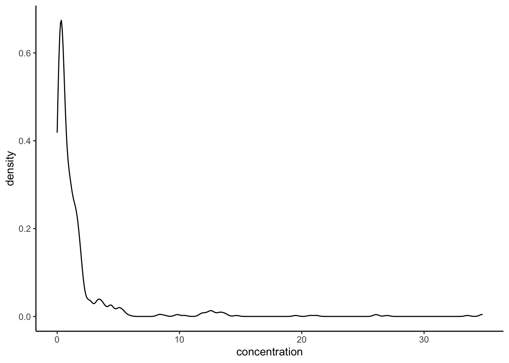

If you squint, you can see the plotted line describes a similar shape to our histogram.  We can use `ggplot()`s layering ability to just put them both on the same plot:


```r
p + 
  geom_histogram(aes(y = after_stat(count / sum(count))), fill = "white", color = "black") +
  geom_density(color = "red", lwd = 1) + 
  theme_classic()
```

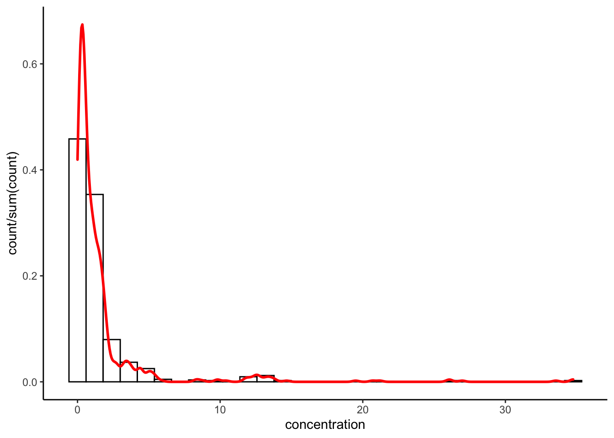

FYI, a similar approach can be achieved with `geom_freqpoly()`, which literally draws a line between the peak of each bar in a histogram:


```r
p + 
  geom_histogram(fill = "white", color = "black") + 
  geom_freqpoly(color = "red", lwd = 1) +
  theme_classic()
```

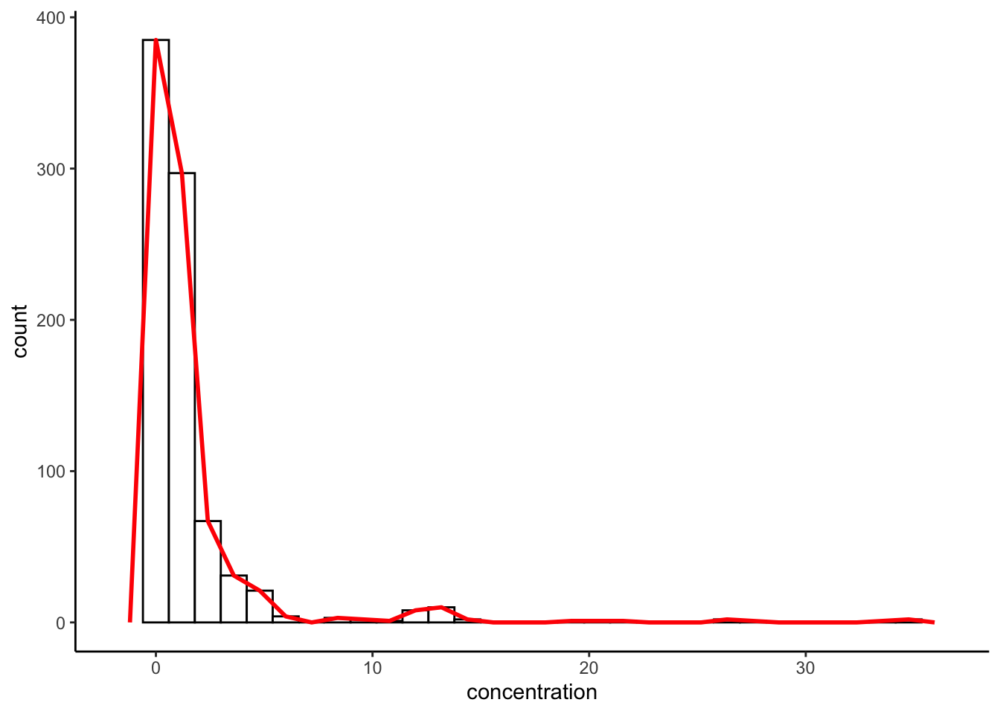

These are not exact duplicates because *density* is based on a smoothed estimate, whereas both *histogram* and *freqpoly* are just empirical counts.

#### Boxplots with `geom_boxplot()` / `geom_violin()`

I agree with John Tukey that boxplots are some of the best visualizations for quickly understanding the distribution of different categorical variables.  `ggplot()` does a great job with boxplots, especially when combined with facets.  As you might imagine, `geom_boxplot()` will give you boxplots.


```r
tidy_apples %>%
  ggplot(mapping = aes(x = amino_acid, y = concentration)) +
  geom_boxplot() + 
  theme_classic()
```


Notice that, unlike in our examples with histogram, in `ggplot()` we now need to map *both* `x` and `y` aesthetic variables.  In English, you might say "we are interested in the values of concentration (y) at each type of amino acid (x)."

A related visualization is the "violin" plot--instead of a straight box, violin plots show the distribution of observations around the IQR:


```r
tidy_apples %>%
  ggplot(mapping = aes(x = Rep, y = concentration)) + 
  geom_violin() + 
  theme_classic()
```


Because our data doesn't have a lot of variation in most of the categories of `amino_acid`, I demonstrated this plot using the `Rep` variable, which unsurprisingly (and reassuringly) doesn't look much different across the 3 reps.

#### Scatterplots with `geom_point()`

We haven't really talked about types of data explicitly in this class from a **measurement theory** perspective.  Who can tell me the definition of these four types of data:

1. Nominal
2. Ordinal
3. Interval
4. Ratio

For our purposes in R, we can largely think about these two categories instead:

1. Categorical
2. Continuous

How do these relate?

So far, in all of our `ggplot()` examples, we've been plotting either a single continuous variable (`concentration`), or one continuous variable against a categorical variable (e.g., `concentration ~ Variety`).  But in our base plotting we were using the most common kind of continuous vs. continuous plot: a **scatterplot**.  

Scatterplots are the visualizations that we're all most comfortable with: basic Cartesian (x, y) plots.  In `ggplot2`, we use `geom_point()` to make scatter plots.  Let's recreate our base R scatterplot:


```r
# Note that here I am using apples instead of tidy_apples - why?
apples %>%
  ggplot(aes(x = Asn, y = Asp)) + 
  geom_point(shape = 1) + 
  theme_classic()
```


One advantage of `ggplot()` visualization is that it takes care of scaling for us.  If we want to add the phenylalanine points, `ggplot()` is smart enough to resize the plot to include the cluster of points we previously missed.


```r
apples %>%
  ggplot(aes(x = Asn, y = Asp)) + 
  geom_point(shape = 1) +  
  geom_point(aes(y = Phe), color = "red", shape = 1) + # note that this still INHERITS the x = Asn mapping
  theme_classic()
```


However, note that `ggplot()` isn't magic.  Confusingly, our y-axis is now labeled "Asp", even though it is really plotting "Concentration" of both Asp (black) and Phe (red).


```r
apples %>%
  ggplot(aes(x = Asn, y = Asp)) + 
  geom_point(shape = 1, color = "black") +  
  geom_point(aes(y = Phe), color = "red", shape = 1) +
  theme_classic() +
  labs(x = "Asparagine (mg/L)", y = "Concentration (mg/L)")
```

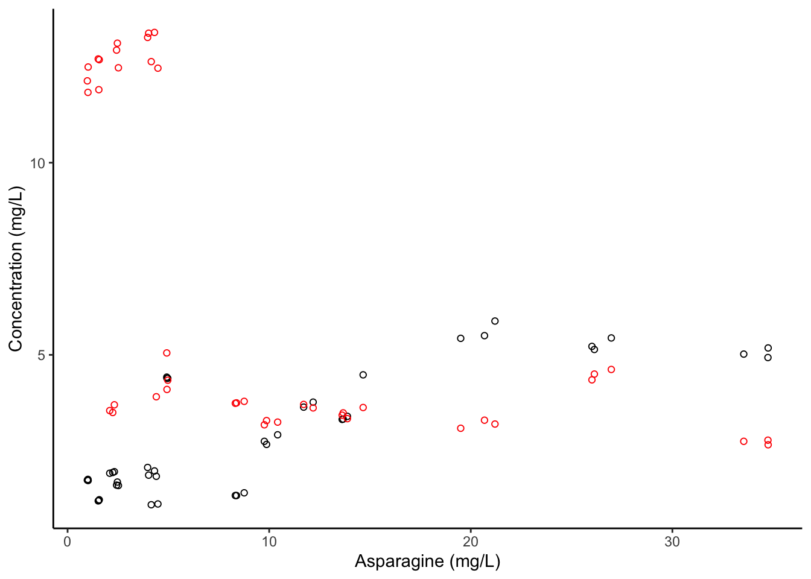

But you'll notice there still isn't a legend.  It turns out that is because we're using `ggplot()` in a nonstandard way.  As homework, I will be asking you to find a way to create a similar kind of plot but to do it using tidy data, which will produce a legend properly.

##### Correlation fit plots with `geom_smooth()`

To continue recreating our previous example, we might want to add linear fits to these two sets of points.  The function that fits a model to points in `ggplot2` is called `geom_smooth()`--it adds a "smoothed" model fit.


```r
apples %>%
  ggplot(aes(x = Asn, y = Asp)) + 
  geom_point(shape = 1, color = "black") +  
  geom_point(aes(y = Phe), color = "red", shape = 1) +
  geom_smooth(color = "black", method = "lm") + 
  geom_smooth(aes(y = Phe), color = "red", fill = "red", method = "lm") +
  theme_classic() +
  labs(x = "Asparagine (mg/L)", y = "Concentration (mg/L)")
```


Notice that we had to add two calls to `geom_smooth()`--one that inherited our initial mapping of `y = Asp`, and one that overrides that to be `y = Phe`, just as we do for the `geom_point()` calls.  The `method = "lm"` argument tells `geom_smooth()` to use the `lm()` function, just like we did with our base R `abline()` call.  This is not the default for `geom_smooth()`--it has built in math to try to choose the best model.  Let's see what it does if we let it choose it's own fit:


```r
apples %>%
  ggplot(aes(x = Asn, y = Asp)) + 
  geom_point(shape = 1, color = "black") +  
  geom_point(aes(y = Phe), color = "red", shape = 1) +
  geom_smooth(color = "black") + 
  geom_smooth(aes(y = Phe), color = "red", fill = "red") +
  theme_classic() +
  labs(x = "Asparagine (mg/L)", y = "Concentration (mg/L)")
```


Based on its internal tests, `geom_smooth()` chooses what's called a "spline" model--this is a way of fitting a wiggly curve to a set of points.  It is a better way of describing the points we see, but may make worse predictions for points outside our x (Asn) value range.

## Return to data wrangling - long vs wide {#tidy}

Finally, we're going to briefly return to the idea of tidy data.  We've talked about this today and in previous classes, but hopefully experimenting with `ggplot2` has given some motivation to why we might want to use tidy data in many cases.  We also showed some basic examples of moving from wide to narrow data by "tidying" our `apples` data frame into `tidy_apples`.  

### Making data tidy

In that operation we did the following:

1. Figure out what variable is spread across the columns: the **amino acid names**.
2. Check to make sure the data in all of those columns is the same: Yes!  It is all "**concentration** of amino acid X" data.
3. Create two new columns to reorganize our data into:
 1. `amino_acids`. which has the name of the amino acid being measured, coming from the column names
 2. `concentration`, which has the concentration of the named amino acid, coming from the former column entries
 
We did all this using the function `pivot_longer()`, which takes wide data and makes it long (and tidy).  The anatomy of `pivot_wider()` is as follows:

* `names_to = "<where the former column names will go>"`: in our case, we wrote `names_to = "amino_acid"`.
* `values_to = "<where the former column entries will go>"`: in our case, we wrote `values_to = "concentration"`
* `-c(<excluded columns>)`: a vector of the columns that we don't want to make longer, but instead want to keep track of.  We wrote `-c(Variety, Rep)`.

So the overall recipe was


```r
apples %>%
  pivot_longer(names_to = "amino_acid", values_to = "concentration", -c(Variety, Rep))
```

```
## # A tibble: 840 × 4
##    Variety        Rep   amino_acid concentration
##    <chr>          <chr> <chr>              <dbl>
##  1 Arkansas Black Rep_1 His                 0.62
##  2 Arkansas Black Rep_1 Asn                10.4 
##  3 Arkansas Black Rep_1 Ser                 0.68
##  4 Arkansas Black Rep_1 Gln                 1.6 
##  5 Arkansas Black Rep_1 Arg                 0.36
##  6 Arkansas Black Rep_1 Gly                 0.09
##  7 Arkansas Black Rep_1 Asp                 2.92
##  8 Arkansas Black Rep_1 Glu                 2.37
##  9 Arkansas Black Rep_1 Thr                 0.2 
## 10 Arkansas Black Rep_1 Ala                 0.72
## # … with 830 more rows
## # ℹ Use `print(n = ...)` to see more rows
```

### Making data wide

We can also reverse the process, by using the `pivot_wider()` function.  This literally reverses the operation.  We need to specify two main arguments: 

1. `names_from = "<current column>"`: where the names for the new, wide columns will come from.
2. `values_from = "<current column>"`: where the values that will go into the cells in the new columns will come from

So to get back to `apples`, we can write:


```r
tidy_apples %>%
  pivot_wider(names_from = "amino_acid", values_from = "concentration")
```

```
## # A tibble: 42 × 22
##    Variety     Rep     His   Asn   Ser   Gln   Arg   Gly   Asp   Glu   Thr   Ala
##    <chr>       <chr> <dbl> <dbl> <dbl> <dbl> <dbl> <dbl> <dbl> <dbl> <dbl> <dbl>
##  1 Arkansas B… Rep_1  0.62 10.4   0.68  1.6   0.36  0.09  2.92  2.37  0.2   0.72
##  2 Blacktwig   Rep_1  0.77  2.32  0.54  0     0.24  0     1.96  1.03  0.18  0.47
##  3 Empire      Rep_1  0.46 21.2   0.43  1.01  0.27  0.09  5.88  1.49  0.28  1.92
##  4 Enterprise  Rep_1  0.52 34.8   0.9   2.78  0.24  0.08  5.18  2.49  0.33  1.71
##  5 Field Red   Rep_1  0.85  4.02  0.29  0     0.41  0     1.87  1.29  0.19  0.33
##  6 Golden Del… Rep_1  0.56  1.01  0     0     0.34  0     1.76  0.98  0.32  0.26
##  7 Granny Smi… Rep_1  0.61  8.76  0.34  0     0.31  0.1   1.41  0.58  0.38  0.42
##  8 Newtown Pi… Rep_1  0.33 26.1   1.01  1.36  0.67  0.13  5.14  3.23  0.57  1.03
##  9 Northern S… Rep_1  0.51  2.52  0.17  0     0.23  0     1.6   1.05  0.35  0.34
## 10 Rome        Rep_1  0.36  1.57  0.2   0     0.43  0.08  1.23  0.91  0.34  0.23
## # … with 32 more rows, and 10 more variables: GABA <dbl>, Pro <dbl>, Cys <dbl>,
## #   Lys <dbl>, Tyr <dbl>, Met <dbl>, Val <dbl>, Ile <dbl>, Leu <dbl>, Phe <dbl>
## # ℹ Use `print(n = ...)` to see more rows, and `colnames()` to see all variable names
```

Note that, if your remaining variables (in this case, `Variety` and `Rep`) do not have unique combinations for each new column, `pivot_wider()` will give you a warning telling you that you're trying to assign multiple variables to a single cell.  This is a common error when you're starting out:


```r
tidy_apples %>%
  select(-Rep) %>% # we get rid of Rep to make row IDs non-unique
    pivot_wider(names_from = "amino_acid", values_from = "concentration")
```

```
## Warning: Values from `concentration` are not uniquely identified; output will contain list-cols.
## * Use `values_fn = list` to suppress this warning.
## * Use `values_fn = {summary_fun}` to summarise duplicates.
## * Use the following dplyr code to identify duplicates.
##   {data} %>%
##     dplyr::group_by(Variety, amino_acid) %>%
##     dplyr::summarise(n = dplyr::n(), .groups = "drop") %>%
##     dplyr::filter(n > 1L)
```

```
## # A tibble: 14 × 21
##    Variety     His   Asn   Ser   Gln   Arg   Gly   Asp   Glu   Thr   Ala   GABA 
##    <chr>       <lis> <lis> <lis> <lis> <lis> <lis> <lis> <lis> <lis> <lis> <lis>
##  1 Arkansas B… <dbl> <dbl> <dbl> <dbl> <dbl> <dbl> <dbl> <dbl> <dbl> <dbl> <dbl>
##  2 Blacktwig   <dbl> <dbl> <dbl> <dbl> <dbl> <dbl> <dbl> <dbl> <dbl> <dbl> <dbl>
##  3 Empire      <dbl> <dbl> <dbl> <dbl> <dbl> <dbl> <dbl> <dbl> <dbl> <dbl> <dbl>
##  4 Enterprise  <dbl> <dbl> <dbl> <dbl> <dbl> <dbl> <dbl> <dbl> <dbl> <dbl> <dbl>
##  5 Field Red   <dbl> <dbl> <dbl> <dbl> <dbl> <dbl> <dbl> <dbl> <dbl> <dbl> <dbl>
##  6 Golden Del… <dbl> <dbl> <dbl> <dbl> <dbl> <dbl> <dbl> <dbl> <dbl> <dbl> <dbl>
##  7 Granny Smi… <dbl> <dbl> <dbl> <dbl> <dbl> <dbl> <dbl> <dbl> <dbl> <dbl> <dbl>
##  8 Newtown Pi… <dbl> <dbl> <dbl> <dbl> <dbl> <dbl> <dbl> <dbl> <dbl> <dbl> <dbl>
##  9 Northern S… <dbl> <dbl> <dbl> <dbl> <dbl> <dbl> <dbl> <dbl> <dbl> <dbl> <dbl>
## 10 Rome        <dbl> <dbl> <dbl> <dbl> <dbl> <dbl> <dbl> <dbl> <dbl> <dbl> <dbl>
## 11 Shenandoah  <dbl> <dbl> <dbl> <dbl> <dbl> <dbl> <dbl> <dbl> <dbl> <dbl> <dbl>
## 12 Virginia G… <dbl> <dbl> <dbl> <dbl> <dbl> <dbl> <dbl> <dbl> <dbl> <dbl> <dbl>
## 13 Winesap     <dbl> <dbl> <dbl> <dbl> <dbl> <dbl> <dbl> <dbl> <dbl> <dbl> <dbl>
## 14 York        <dbl> <dbl> <dbl> <dbl> <dbl> <dbl> <dbl> <dbl> <dbl> <dbl> <dbl>
## # … with 9 more variables: Pro <list>, Cys <list>, Lys <list>, Tyr <list>,
## #   Met <list>, Val <list>, Ile <list>, Leu <list>, Phe <list>
## # ℹ Use `colnames()` to see all variable names
```

This can either tell you you've incorrectly set up your pivot table or that you haven't properly understood your data.  The warning message produced has useful suggestions to figure out which of these might be the case.

## References {-}
